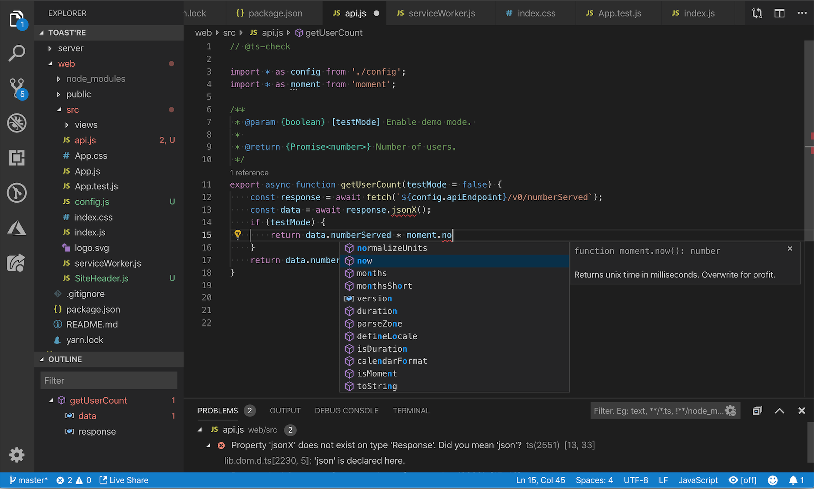
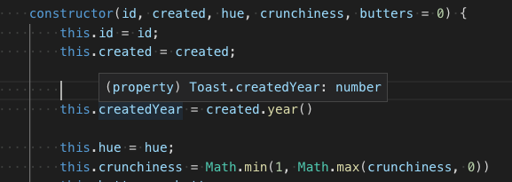
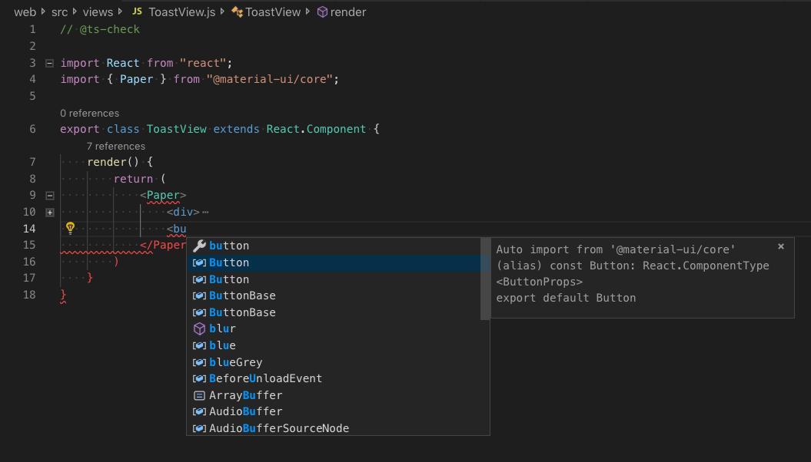
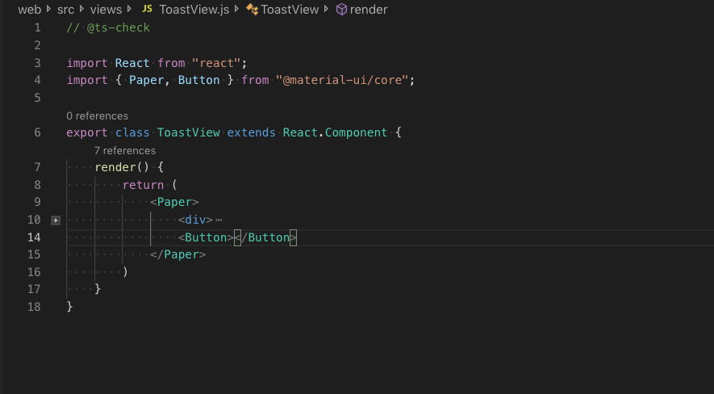
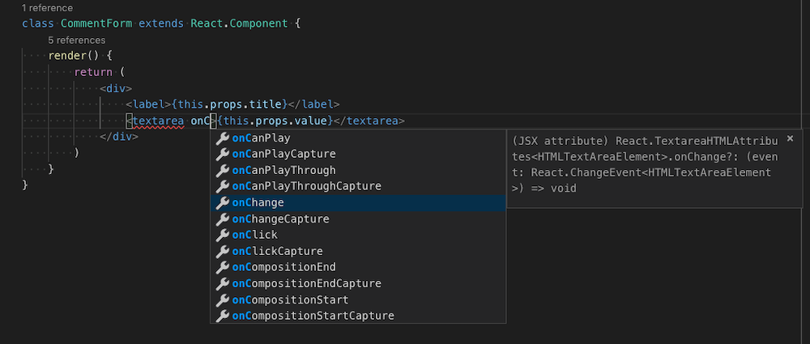
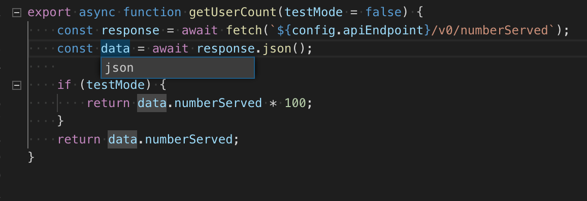
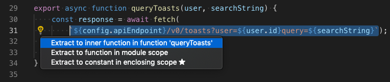
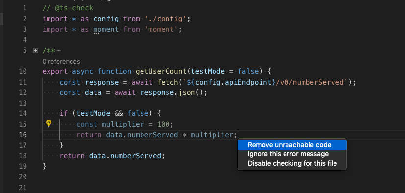
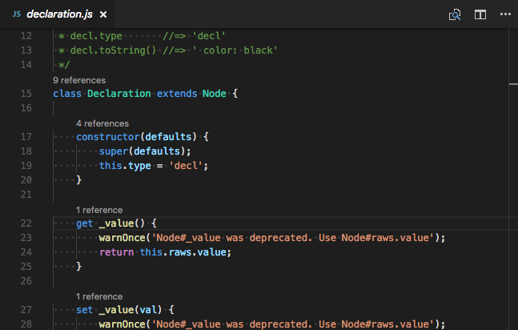
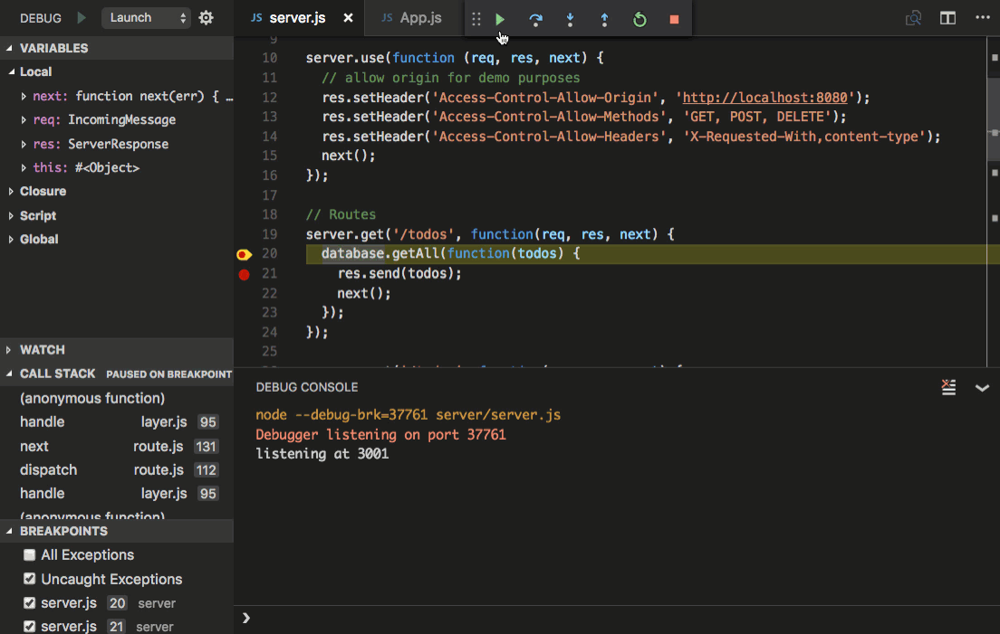

# JavaScript in Visual Studio Code

Visual Studio Code includes built-in JavaScript IntelliSense, debugging, formatting, code navigation, refactorings, and many other advanced language features.



Most of these features just work out of the box, while some may require basic configuration to get the best experience. This page summarizes the JavaScript features that VS Code ships with. Extensions from the [VS Code Marketplace](https://marketplace.visualstudio.com) can augment or change most of these built-in features. For a more in-depth guide on how these features work and can be configured, see [Working with JavaScript](/docs/nodejs/working-with-javascript.md).

## IntelliSense

IntelliSense shows you intelligent code completion, hover information, and signature information so that you can write code more quickly and correctly.

<video src="images/javascript/intellisense.mp4" placeholder="images/javascript/intellisense-placeholder.png" autoplay loop controls muted>
    Sorry, your browser doesn't support HTML 5 video.
</video>

VS Code provides IntelliSense within your JavaScript projects; for many npm libraries such as `React`, `lodash`, and `express`; and for other platforms such as `node`, serverless, or IoT.

See [Working with JavaScript](/docs/nodejs/working-with-javascript.md) for information about VS Code's JavaScript IntelliSense, how to configure it, and help troubleshooting common IntelliSense problems.

## JavaScript projects (jsconfig.json)

A [jsconfig.json](/docs/languages/jsconfig.md) file defines a JavaScript project in VS Code. While `jsconfig.json` files are not required, you will want to create one in cases such as:

* If not all JavaScript files in your workspace should be considered part of a single JavaScript project. `jsconfig.json` files let you exclude some files from showing up in IntelliSense.
* To ensure that a subset of JavaScript files in your workspace is treated as a single project. This is useful if you are working with legacy code that uses implicit globals dependencies instead of `imports` for dependencies.
* If your workspace contains more than one project context, such as front-end and back-end JavaScript code. For multi-project workspaces, create a `jsconfig.json` at the root folder of each project.
* You are using the TypeScript compiler to down-level compile JavaScript source code.

To define a basic JavaScript project, add a `jsconfig.json` at the root of your workspace:

```json
{
    "compilerOptions": {
        "module": "CommonJS",
        "target": "ES6"
    },
    "exclude": [
        "node_modules"
    ]
}
```

See [Working with JavaScript](/docs/nodejs/working-with-javascript.md) for more advanced `jsconfig.json` configuration.

> **Tip:** To check if a JavaScript file is part of JavaScript project, just open the file in VS Code  and run the **JavaScript: Go to Project Configuration** command. This command opens the `jsconfig.json` that references the JavaScript file. A notification is shown if the file is not part of any `jsconfig.json` project.

## Snippets

VS Code includes basic JavaScript [snippets](/docs/editor/userdefinedsnippets.md) that are suggested as you type;

<video src="images/javascript/snippets.mp4" placeholder="images/javascript/snippets-placeholder.png" autoplay loop controls muted>
    Sorry, your browser doesn't support HTML 5 video.
</video>

There are many extensions that provide additional snippets, including snippets for popular frameworks such as Redux or Angular. You can even [define your own snippets](/docs/editor/userdefinedsnippets.md).

> **Tip**: To disable snippets suggestions, set `editor.snippetSuggestions` to `"none"` in your [settings](/docs/getstarted/settings.md) file. The `editor.snippetSuggestions` setting also lets you change where snippets appear in the suggestions: at the top (`"top"`), at the bottom (`"bottom"`), or inlined ordered alphabetically (`"inline"`). The default is `"inline"`.

## JSDoc support

VS Code understands many standard [JSDoc](https://jsdoc.app) annotations, and uses these annotations to provide rich [IntelliSense](#intellisense). You can optionally even use the type information from JSDoc comments to [type check your JavaScript](#type-checking).

<video src="images/javascript/jsdoc-autofill.mp4" placeholder="images/javascript/jsdoc-autofill-placeholder.png" autoplay loop controls muted>
    Sorry, your browser doesn't support HTML 5 video.
</video>

Quickly create JSDoc comments for functions by typing `/**` before the function declaration, and select the **JSDoc comment** snippet suggestion:

<video src="images/javascript/jsdoc-autofill.mp4" placeholder="images/javascript/jsdoc-autofill-placeholder.png" autoplay loop controls muted>
    Sorry, your browser doesn't support HTML 5 video.
</video>

To disable JSDoc comment suggestions, set `"javascript.suggest.completeJSDocs": false`.

## Hover Information

Hover over a JavaScript symbol to quickly see its type information and relevant documentation.



The `kb(editor.action.showHover)` keyboard shortcut shows this hover information at the current cursor position.

## Signature Help

As you write JavaScript function calls, VS Code shows information about the function signature and highlights the parameter that you are currently completing:


Signature help is shown automatically when you type a `(` or `,` within a function call. Press `kb(editor.action.triggerParameterHints)`  to manually trigger signature help.

## Auto imports

Automatic imports speed up coding by suggesting available variables throughout your project and its dependencies. When you select one of these suggestions, VS Code automatically adds an import for it to the top of the file.

Just start typing to see [suggestions](#intellisense) for all available JavaScript symbols in your current project. Auto import suggestions show where they will be imported from:



If you choose one of these auto import suggestions, VS Code adds an import for it.

In this example, VS Code adds an import for `Button` from [material-ui](https://material-ui.com) to the top of the file:



To disable auto imports, set `"javascript.suggest.autoImports"` to `false`.

> **Tip:** VS Code tries to infer the best import style to use. You can explicitly configure the preferred quote style and path style for imports added to your code with the `javascript.preferences.quoteStyle` and `javascript.preferences.importModuleSpecifier` settings.

## Formatting

VS Code's built-in JavaScript formatter provides basic code formatting with reasonable defaults.

The `javascript.format.*` [settings](/docs/getstarted/settings.md) configure the built-in formatter. Or, if the built-in formatter is getting in the way, set `"javascript.format.enable"` to `false` to disable it.

For more specialized code formatting styles, try installing one of the JavaScript formatting extensions from the [Marketplace](https://marketplace.visualstudio.com/vscode).

## JSX and auto closing tags

All of VS Code's JavaScript features also work with [JSX](https://reactjs.org/docs/introducing-jsx.html):



You can use JSX syntax in both normal `*.js` files and in `*.jsx` files.

VS Code also includes JSX-specific features such as autoclosing of JSX tags:

<video src="images/javascript/tag-complete.mp4" placeholder="images/javascript/tag-complete-placeholder.png" autoplay loop controls muted>
    Sorry, your browser doesn't support HTML 5 video.
</video>

Set `"javascript.autoClosingTags"` to `false` to disable JSX tag closing.

## Code navigation

Code navigation lets you quickly navigate JavaScript projects.

* **Go to Definition** `kb(editor.action.revealDefinition)` - Go to the source code of a symbol definition.
* **Peek Definition** `kb(editor.action.peekDefinition)` - Bring up a Peek window that shows the definition of a symbol.
* **Go to References** `kb(editor.action.goToReferences)` - Show all references to a symbol.
* **Go to Type Definition** - Go to the type that defines a symbol. For an instance of a class, this will reveal the class itself instead of where the instance is defined.

You can navigate via symbol search using the **Go to Symbol** commands from the **Command Palette** (`kb(workbench.action.showCommands)`).

* **Go to Symbol in File** `kb(workbench.action.gotoSymbol)`
* **Go to Symbol in Workspace** `kb(workbench.action.showAllSymbols)`

## Rename

Press `kb(editor.action.rename)` to rename the symbol under the cursor across your JavaScript project:



## Refactoring

VS Code includes some handy refactorings for JavaScript such as **Extract function** and **Extract constant**. Just select the source code you'd like to extract and then click on the lightbulb in the gutter or press (`kb(editor.action.quickFix)`) to see available refactorings.



Available refactorings include:

* Extract to method or function.
* Extract to constant.
* Convert between named imports and namespace imports.
* Move to new file.

See [Refactorings](/docs/editor/refactoring.md) for more information about refactorings and how you can configure keyboard shortcuts for individual refactorings.

Additionally, **Code Action Widget: Include Nearby Quick Fixes** (`editor.codeActionWidget.includeNearbyQuickFixes`) is a setting that is enabled on default, which will activate the nearest Quick Fix in a line from `kb(editor.action.quickFix)` (command ID `editor.action.quickFix`), no matter where your cursor is in that line.

The command highlights the source code that will be refactored or fixed with Quick Fixes. Normal Code Actions and non-fix refactorings can still be activated at the cursor location.

## Unused variables and unreachable code

Unused JavaScript code, such the else block of an `if` statement that is always true or an unreferenced import, is faded out in the editor:



You can quickly remove this unused code by placing the cursor on it and triggering the Quick Fix command (`kb(editor.action.quickFix)`) or clicking on the lightbulb.

To disable fading out of unused code, set `"editor.showUnused"` to `false`. You can also disable fading of unused code only in JavaScript by setting:

```json
"[javascript]": {
    "editor.showUnused":  false
},
"[javascriptreact]": {
    "editor.showUnused":  false
},
```

## Organize Imports

The **Organize Imports** Source Action sorts the imports in a JavaScript file and removes any unused imports:

<!-- TODO: replace with js specific example -->
<video src="images/javascript/organize-imports.mp4" placeholder="images/javascript/organize-imports-placeholder.png" autoplay loop controls muted>
    Sorry, your browser doesn't support HTML 5 video.
</video>

You can run **Organize Imports** from the **Source Action** context menu or with the `kb(editor.action.organizeImports)` keyboard shortcut.

Organize imports can also be done automatically when you save a JavaScript file by setting:

```json
"editor.codeActionsOnSave": {
    "source.organizeImports": "explicit"
}
```

## Code Actions on Save

The `editor.codeActionsOnSave` setting lets you configure a set of Code Actions that are run when a file is saved. For example, you can enable organize imports on save by setting:

```json
// On explicit save, run fixAll source action. On auto save (window or focus change), run organizeImports source action.
"editor.codeActionsOnSave": {
    "source.fixAll": "explicit",
    "source.organizeImports": "always",
}
```

As of today, the following enums are supported:
* `explicit` (default): Triggers Code Actions when explicitly saved. Same as `true`.
* `always`: Triggers Code Actions when explicitly saved and on Auto Saves from window or focus changes.
* `never`: Never triggers Code Actions on save. Same as `false`.

You can also set `editor.codeActionsOnSave` to an array of Code Actions to execute in order.

Here are some source actions:

* `"organizeImports"` -  Enables organize imports on save.
* `"fixAll"` - Auto Fix on Save computes all possible fixes in one round (for all providers including ESLint).
* `"fixAll.eslint"` -  Auto Fix only for ESLint.
* `"addMissingImports"` - Adds all missing imports on save.

See [Node.js/JavaScript](/docs/nodejs/working-with-javascript) for more information.

## Code suggestions

VS Code automatically suggests some common code simplifications such as converting a chain of `.then` calls on a promise to use `async` and `await`

<video src="images/javascript/code-suggestions-convert-async.mp4" placeholder="images/javascript/code-suggestions-convert-async-placeholder.png" autoplay loop controls muted>
    Sorry, your browser doesn't support HTML 5 video.
</video>

Set `"javascript.suggestionActions.enabled"` to `false` to disable suggestions.

## Enhance completions with AI

[GitHub Copilot](https://copilot.github.com/) is an AI-powered code completion tool that helps you write code faster and smarter. You can use the [GitHub Copilot extension](https://marketplace.visualstudio.com/items?itemName=GitHub.copilot) in VS Code to generate code, or to learn from the code it generates.

[](https://marketplace.visualstudio.com/items?itemName=GitHub.copilot)

GitHub Copilot provides suggestions for numerous languages and a wide variety of frameworks, and it works especially well for Python, JavaScript, TypeScript, Ruby, Go, C# and C++.

You can learn more about how to get started with Copilot in the [Copilot documentation](/docs/editor/github-copilot.md).

Once you have the Copilot extension installed and enabled, you can test it our for your JavaScript projects.

Create a new file - you can use the **File: New File** command in the Command Palette (`kbstyle(F1)`).

In the JavaScript file, type the following function header:

```js
function calculateDaysBetweenDates(begin, end) {
```

Copilot will provide a suggestion like the following - use `kbstyle(Tab)` to accept the suggestion:


## Inlay hints

Inlay hints add additional inline information to source code to help you understand what the code does.

**Parameter name inlay hints** show the names of parameters in function calls:


This can help you understand the meaning of each argument at a glance, which is especially helpful for functions that take Boolean flags or have parameters that are easy to mix up.

To enable parameter name hints, set `javascript.inlayHints.parameterNames`. There are three possible values:

* `none` — Disable parameter inlay hints.
* `literals` — Only show inlay hints for literals (string, number, Boolean).
* `all` — Show inlay hints for all arguments.

**Variable type inlay hints** show the types of variables that don't have explicit type annotations.

Setting: `javascript.inlayHints.variableTypes.enabled`


**Property type inlay hints** show the type of class properties that don't have an explicit type annotation.

Setting: `javascript.inlayHints.propertyDeclarationTypes.enabled`


**Parameter type hints**  show the types of implicitly typed parameters.

Setting: `javascript.inlayHints.parameterTypes.enabled`


**Return type inlay hints** show the return types of functions that don't have an explicit type annotation.

Setting: `javascript.inlayHints.functionLikeReturnTypes.enabled`


## References CodeLens

The JavaScript references CodeLens displays an inline count of reference for classes, methods, properties, and exported objects:



To enable the references CodeLens, set `"javascript.referencesCodeLens.enabled"` to `true`.

Click on the reference count to quickly browse a list of references:


## Update imports on file move

When you move or rename a file that is imported by other files in your JavaScript project, VS Code can automatically update all import paths that reference the moved file:

<video src="images/javascript/update-imports.mp4" placeholder="images/javascript/update-imports-placeholder.png" autoplay loop controls muted>
    Sorry, your browser doesn't support HTML 5 video.
</video>

The `javascript.updateImportsOnFileMove.enabled` setting controls this behavior. Valid settings values are:

* `"prompt"` - The default. Asks if paths should be updated for each file move.
* `"always"` - Always automatically update paths.
* `"never"` - Do not update paths automatically and do not prompt.

## Linters

[Linters](https://en.wikipedia.org/wiki/Lint_%28software%29) provides warnings for suspicious looking code. While VS Code does not include a built-in JavaScript linter, many JavaScript linter [extensions](/docs/editor/extension-marketplace.md) available in the marketplace.

<div class="marketplace-extensions-javascript-linters-curated"></div>

> **Tip:** This list is dynamically queried from the [VS Code Marketplace](https://marketplace.visualstudio.com). Read the description and reviews to decide if the extension is right for you.

## Type checking

You can leverage some of TypeScript's advanced type checking and error reporting functionality in regular JavaScript files too. This is a great way to catch common programming mistakes. These type checks also enable some exciting Quick Fixes for JavaScript, including **Add missing import** and **Add missing property**.


TypeScript tried to infer types in `.js` files the same way it does in `.ts` files. When types cannot be inferred, they can be specified explicitly with JSDoc comments. You can read more about how TypeScript uses JSDoc for JavaScript type checking in [Working with JavaScript](/docs/nodejs/working-with-javascript.md).

Type checking of JavaScript is optional and opt-in. Existing JavaScript validation tools such as ESLint can be used alongside built-in type checking functionality.

## Debugging

VS Code comes with great debugging support for JavaScript. Set breakpoints, inspect objects, navigate the call stack, and execute code in the Debug Console. See the [Debugging topic](/docs/editor/debugging.md) to learn more.

### Debug client side

You can debug your client-side code using a browser debugger such as our built-in debugger for Edge and Chrome, or the [Debugger for Firefox](https://marketplace.visualstudio.com/items?itemName=hbenl.vscode-firefox-debug).

### Debug server side

Debug Node.js in VS Code using the built-in debugger. Setup is easy and there is a [Node.js debugging tutorial](/docs/nodejs/nodejs-tutorial.md#debug-your-express-app) to help you.



## Popular extensions

VS Code ships with excellent support for JavaScript but you can additionally install debuggers, snippets, linters, and other JavaScript tools through [extensions](/docs/editor/extension-marketplace.md).

<div class="marketplace-extensions-javascript-curated"></div>

> **Tip:** The extensions shown above are dynamically queried. Click on an extension tile above to read the description and reviews to decide which extension is best for you. See more in the [Marketplace](https://marketplace.visualstudio.com).

## Next steps

Read on to find out about:

* [Working with JavaScript](/docs/nodejs/working-with-javascript.md) - More detailed information about VS Code's JavaScript support and how to troubleshoot common issues.
* [jsconfig.json](/docs/languages/jsconfig.md) - Detailed description of the `jsconfig.json` project file.
* [IntelliSense](/docs/editor/intellisense.md) - Learn more about IntelliSense and how to use it effectively for your language.
* [Debugging](/docs/editor/debugging.md) - Learn how to set up debugging for your application.
* [Node.js](/docs/nodejs/nodejs-tutorial.md) - A walkthrough to create an Express Node.js application.
* [TypeScript](/docs/languages/typescript.md) - VS Code has great support for TypeScript, which brings structure and strong typing to your JavaScript code.

## Common questions

### Does VS Code support JSX and React Native?

VS Code supports **JSX** and **React Native**. You will get IntelliSense for **React/JSX** and **React Native** from automatically downloaded type declaration (typings) files from the [npmjs](https://www.npmjs.com) type declaration file repository. Additionally, you can install the popular [React Native extension](https://marketplace.visualstudio.com/items?itemName=vsmobile.vscode-react-native) from  the Marketplace.

To enable ES6 import statements for **React Native**, you need to set the `allowSyntheticDefaultImports` compiler option to `true`. This tells the compiler to create synthetic default members and you get IntelliSense. **React Native** uses **Babel** behind the scenes to create the proper run-time code with default members. If you also want to do debugging of **React Native** code, you can install the [React Native Extension](https://marketplace.visualstudio.com/items?itemName=vsmobile.vscode-react-native).

### Does VS Code support the Dart programming language and the Flutter framework?

Yes, there are VS Code extensions for both [Dart](https://marketplace.visualstudio.com/items?itemName=Dart-Code.dart-code) and [Flutter](https://marketplace.visualstudio.com/items?itemName=Dart-Code.flutter) development. You can learn more at the [Flutter.dev](https://flutter.dev/docs/development/tools/vs-code) documentation.

### IntelliSense is not working for external libraries

`Automatic Type Acquisition` works for dependencies downloaded by npm (specified in `package.json`), Bower (specified in `bower.json`), and for many of the most common libraries listed in your folder structure (for example `jquery-3.1.1.min.js`).

**ES6 Style imports are not working.**

When you want to use ES6 style imports but some type declaration (typings) files do not yet use ES6 style exports, then set the [TypeScript compiler option](https://www.typescriptlang.org/docs/handbook/compiler-options.html) `allowSyntheticDefaultImports` to true.

```json
{
    "compilerOptions": {
        "module": "CommonJS",
        "target": "ES6",
        // This is the line you want to add
        "allowSyntheticDefaultImports": true
    },
    "exclude": [
        "node_modules",
        "**/node_modules/*"
    ]
}
```

### Can I debug minified/uglified JavaScript?

Yes, you can. You can see this working using JavaScript source maps in the [Node.js Debugging](/docs/nodejs/nodejs-debugging.md) topic.

### How do I disable Syntax Validation when using non-ES6 constructs?

Some users want to use syntax constructs like the proposed pipeline (`|>`) operator. However, these are currently not supported by VS Code's JavaScript language service and are flagged as errors. For users who still want to use these future features, we provide the `javascript.validate.enable` [setting](/docs/getstarted/settings.md).

With `javascript.validate.enable: false`, you disable all built-in syntax checking. If you do this, we recommend that you use a linter like [ESLint](https://eslint.org) to validate your source code.

### Can I use other JavaScript tools like Flow?

Yes, but some of [Flow's](https://flow.org) language features such as type and error checking may interfere with VS Code's built-in JavaScript support. To learn how to disable VS Code's built-in JavaScript support, see [Disable JavaScript support](/docs/nodejs/working-with-javascript.md#disable-javascript-support).
