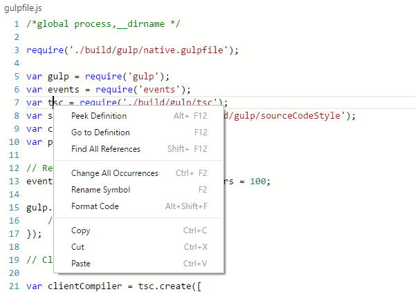

# JavaScript

## Rich Editing Support

Visual Studio Code uses the TypeScript language service to make authoring JavaScript easy. In addition to syntactical features like format, format on type and outlining, you also get language service features such as
 Peek, Go to Definition, Find all References, and Rename Symbol just by right clicking in any JavaScript file.



## JavaScript Projects (jsconfig.json)

You can create a JavaScript project by dropping in a `jsconfig.json` file. It's a subset of [tsconfig.json](https://github.com/Microsoft/TypeScript/wiki/tsconfig.json). The presence of a `jsconfig.json` file in a directory indicates that the directory is the root of a JavaScript project. The file itself lists the files belonging to the project as well as compiler options.

>**Tip:** Just as in `tsconfig.json`, if no "files" property is present, we default to including all files in the containing directory and subdirectories. When a "files" property is specified, only those files are included.

```json
{
    "compilerOptions": {
        "target": "ES6",
        "module": "commonjs"
    },
    "files": [
        "app.js",
        "model.js"
    ]
}
```

>**Tip:** You can exclude folders from the JavaScript project using the `exclude` property. By default, VS Code excludes `.git`, `node_modules`, `bower_components`, `jspm_packages`, `tmp`, and `temp` folders.

```json
{
    "compilerOptions": {
        "target": "ES6",
        "module": "commonjs"
    },
    "exclude": [
        "excluded folder"
    ]
}
```

>**Tip:** If the application's JavaScript source code is contained inside an `app` or `src` folder, then define the `jsconfig.json` inside the corresponding folder and not at the top-level of the workspace.

>**Tip:** If your workspace contains folders with JavaScript files that belong to separate applications, e.g, a `client` and a `server`, then consider adding a separate `jsconfig.json` into the corresponding folders.

### /// References for .d.ts

With the introduction of `jsconfig.json`, you no longer need to use `///` references in each file (these were required in the initial versions of VS Code). As the file set is defined in `jsconfig.json`, VS Code knows what files and symbols are part of your project.

As an example, you can just drop a new type definition `.d.ts` file into your project folder and VS Code will pick it up automatically.

### Defining Global Variables Outside .d.ts

VS Code also supports the global directive `/*global varName*/` to declare variables. In comparison to `.d.ts` files, it’s a faster but less powerful way to define variables to be used inside source files.


## IntelliSense Support

VS Code provides IntelliSense for built-in symbols of browsers, Node.js, and virtually all other environments through the use of type definition `.d.ts` files. [DefinitelyTyped](https://github.com/DefinitelyTyped/DefinitelyTyped) is a repository of typings files for all major JavaScript libraries and environments. The typings are easily managed using [Typings](https://github.com/typings/typings), the TypeScript Definition manager. IntelliSense is automatically provided for CommonJS and AMD modules inside your project folders.

## Snippets for JavaScript

VS Code has several built-in snippets that will come up as you type or you can press `kb(editor.action.triggerSuggest)` (Trigger Suggest) and you will see a context specific list of suggestions.


Selecting the snippet with `tab` results in:


>**Tip:** You can add in your own User Defined Snippets for JavaScript.  See [User Defined Snippets](/docs/customization/userdefinedsnippets.md) to find out how.

## ES6 Support

VS Code supports ES6 (ECMAScript 6, the latest update of JavaScript) and understands the new ES6 syntax elements and their semantics. By default, you get suggestions for ES6 types, like `Promise`, `Set`, `Map`, `String.startsWith`. A good overview of the new ES6 features can be found [here](https://github.com/lukehoban/es6features).

We have a sample on GitHub that shows off some of the ES6 love in VS Code:

```
git clone https://github.com/jrieken/es6-vscode-sample
cd es6-vscode-sample
npm install
```

### Run Babel inside VS Code

The Babel transpiler turns ES6 files into readable ES5 JavaScript with Source Maps.  You can easily integrate Babel into your workflow by adding this code to your `tasks.json` file. The `isBuildCommand` switch makes this task the `Task: Run Build Task` gesture.  `isWatching` tells VS Code not to wait for this task to finish. To learn more go to [Tasks](/docs/editor/tasks.md).

```json
{
    "version": "0.1.0",
    "command": "${workspaceRoot}/node_modules/.bin/babel",
    "isShellCommand": true,
    "tasks": [
        {
            "args": ["src", "--out-dir", "lib", "-w", "--source-maps"],
            "taskName": "watch",
            "suppressTaskName": true,
            "isBuildCommand": true,
            "isWatching": true
        }
    ]
}
```

Once you have added this, you can start Babel with the `kb(workbench.action.tasks.build)` (Run Build Task) gesture and it will compile all files from the `src` directory into the `lib` directory.

## JavaScript Linters (ESLint, JSHint)

VS Code provides support for [ESLint](http://eslint.org/) and [JSHint](http://jshint.com/) via extensions. If enabled, the JavaScript code is validated as you type and
reported problems can be navigated to and fixed inside VS Code.

To enable one of the linters, do the following:

* Install the corresponding linter globally or inside the workspace folder that contains the JavaScript code to be validated.
  For example, using `npm install eslint` or `npm install jshint`, respectively.
* Install the [ESLint](https://marketplace.visualstudio.com/items/dbaeumer.vscode-eslint) or [JSHint](https://marketplace.visualstudio.com/items/dbaeumer.jshint) extension. After restarting the editor, enable ESLint or JSHint via the corresponding settings `"eslint.enable": true` or `"jshint.enable": true`, respectively.
* Use the .eslintrc or .jshintrc file to configure the linter.

## Next Steps

Read on to find out about:

* [TypeScript](typescript) - VS Code has great support for TypeScript which brings structure and strong typing to your JavaScript code, without compromising the good parts

## Common Questions

**Q: Can I debug minified/uglified JavaScript?**

**A:** Yes, you can.
