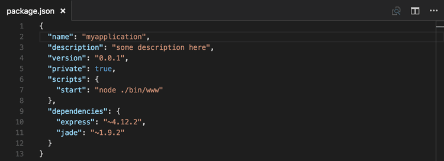

# Editing JSON with Visual Studio Code

JSON is a data format that is common in configuration files like `package.json` or `project.json`. We also use it extensively in Visual Studio Code for our configuration files. When opening a file that ends with `.json`, VS Code provides features to make it simpler to write or modify the file's content.



## IntelliSense and validation

For properties and values, both for JSON data with or without a schema, we offer up suggestions as you type with IntelliSense. You can also manually see suggestions with the **Trigger Suggestions** command (`kb(editor.action.triggerSuggest)`).

We also perform structural and value verification based on an associated JSON schema giving you red squiggles. To disable validation, use the `json.validate.enable` [setting](/docs/getstarted/settings.md).


### Package and project dependencies

We also offer IntelliSense for specific value sets such as package and project dependencies in `package.json`, `project.json`, and `bower.json`.

## Quick navigation

JSON files can get large and we support quick navigation to properties using the **Go to Symbol** command (`kb(workbench.action.gotoSymbol)`).


## Hovers

When you hover over properties and values for JSON data with or without schema, we will provide additional context.


## Formatting

You can format your JSON document using `kb(editor.action.formatDocument)` or **Format Document** from the context menu.

## Folding

You can fold regions of source code using the folding icons on the gutter between line numbers and line start. Folding regions are available for all object and array elements.

## JSON with Comments

In addition to the default JSON mode following the [JSON specification](https://www.json.org/), VS Code also has a **JSON with Comments** (jsonc) mode. This mode is used for the VS Code configuration files such as `settings.json`, `tasks.json`, or `launch.json`. When in the **JSON with Comments** mode, you can use single line (`//`) as well as block comments (`/* */`) as used in JavaScript. The mode also accepts trailing commas, but they are discouraged and the editor will display a warning.

The current editor mode is indicated in the editor's Status Bar. Select the mode indicator to change the mode and to configure how file extensions are associated to modes. You can also directly modify the `files.associations` [setting](/docs/languages/overview.md#add-a-file-extension-to-a-language) to associate file names or file name patterns to `jsonc`.

## JSON schemas and settings

To understand the structure of JSON files, we use [JSON schemas](https://json-schema.org/). JSON schemas describe the shape of the JSON file, as well as value sets, default values, and descriptions. The JSON support shipped with VS Code supports all draft versions from Draft 4 to JSON Schema Draft 2020-12.

Servers like [JSON Schema Store](https://www.schemastore.org) provide schemas for most of the common JSON-based configuration files. However, schemas can also be defined in a file in the VS Code workspace, as well as the VS Code settings files.

The association of a JSON file to a schema can be done either in the JSON file itself using the `$schema` attribute, or in the User or Workspace [settings](/docs/getstarted/settings.md) (**File** > **Preferences** > **Settings**) under the property `json.schemas`.

VS Code extensions can also define schemas and schema mapping. That's why VS Code already knows about the schema of some well-known JSON files such as `package.json`, `bower.json`, and `tsconfig.json`.

### Mapping in the JSON

In the following example, the JSON file specifies that its contents follow the [CoffeeLint](https://coffeelint.github.io/) schema.

```json
{
   "$schema": "https://json.schemastore.org/coffeelint",
   "line_endings": "unix"
}
```

Note that this syntax is VS Code-specific and not part of the [JSON Schema specification](https://json-schema.org/latest/json-schema-core.html#rfc.section.7). Adding the `$schema` key changes the JSON itself, which systems consuming the JSON might not expect, for example, schema validation might fail. If this is the case, you can use one of the other mapping methods.

### Mapping in the User Settings

The following excerpt from User [Settings](/docs/getstarted/settings.md) shows how `.babelrc` files are mapped to the [babelrc](https://babeljs.io/docs/usage/babelrc) schema located on [https://json.schemastore.org/babelrc](https://json.schemastore.org/babelrc).

```json
"json.schemas": [
    {
        "fileMatch": [
            "/.babelrc"
        ],
        "url": "https://json.schemastore.org/babelrc"
    }
]
```

>**Tip:** In addition to defining a schema for `.babelrc`, also make sure that `.babelrc` is associated to the JSON language mode. This is also done in the settings using the `files.association` array setting.

### Mapping to a schema in the workspace

To map a schema that is located in the workspace, use a relative path. In this example, a file in the workspace root called `myschema.json` will be used as the schema for all files ending with `.foo.json`.

```json
"json.schemas": [
    {
        "fileMatch": [
            "/*.foo.json"
        ],
        "url": "./myschema.json"
    }
]
```

### Mapping to a schema defined in settings

To map a schema that is defined in the User or Workspace settings, use the `schema` property. In this example, a schema is defined that will be used for all files named `.myconfig`.

```json
"json.schemas": [
    {
        "fileMatch": [
            "/.myconfig"
        ],
        "schema": {
            "type": "object",
            "properties": {
                "name" : {
                    "type": "string",
                    "description": "The name of the entry"
                }
            }
        }
    }
]
```

### Mapping a schema in an extension

Schemas and schema associations can also be defined by an extension. Check out the [jsonValidation contribution point](/api/references/contribution-points.md#contributes.jsonValidation).

### File match syntax

The file match syntax supports the '*' wildcard. Also, you can define exclusion patterns, starting with '!'. For an association to match, at least one pattern needs to match and the last matching pattern must not be an exclusion pattern.

```json
  "json.schemas": [
    {
      "fileMatch": [
        "/receipts/*.json",
        "!/receipts/*.excluded.json"
      ],
      "url": "./receipts.schema.json"
    }
  ]
```

### Define snippets in JSON schemas

JSON schemas describe the shape of the JSON file, as well as value sets and default values, which are used by the JSON language support to provide completion proposals. If you are a schema author and want to provide even more customized completion proposals, you can also specify snippets in the schema.

The following example shows a schema for a key binding settings file defining a snippet:

```json
{
    "type": "array",
    "title": "Keybindings configuration",
    "items": {
        "type": "object",
        "required": ["key"],
        "defaultSnippets": [
            {
                "label": "New keybinding",
                "description": "Binds a key to a command for a given state",
                "body": { "key": "$1", "command": "$2", "when": "$3" }
            }
        ],
        "properties": {
            "key": {
                "type": "string"
            }
            ...
        }
    }
}
```

This is an example in a JSON schema:


Use the property `defaultSnippets` to specify any number of snippets for the given JSON object.

- `label` and `description` will be shown in the completion selection dialog. If no label is provided, a stringified object representation of the snippet will be shown as label instead.
- `body` is the JSON object that is stringified and inserted when the completion is selected by the user. [Snippet syntax](/docs/editor/userdefinedsnippets.md#snippet-syntax) can be used inside strings literals to define tabstops, placeholders, and variables. If a string starts with `^`, the string content will be inserted as-is, not stringified. You can use this to specify snippets for numbers and booleans.

Note that `defaultSnippets` is not part of the JSON schema specification but a VS Code-specific schema extension.

### Use rich formatting in hovers

VS Code will use the standard `description` field from the [JSON Schema specification](https://json-schema.org/latest/json-schema-core.html#rfc.section.7) in order to provide information about properties on hover and during autocomplete.

If you want your descriptions to support formatting like links, you can opt in by using [Markdown](/docs/languages/markdown.md) in your formatting with the `markdownDescription` property.

```json
{
   "$schema": "http://json-schema.org/schema",
   "type": "object",
   "properties": {
       "name" : {
           "type": "string",
           "description": "The name of the entry",
           "markdownDescription": "The name of the entry. [See the documentation](https://example.com)"
       }
   }
}
```

Note that `markdownDescription` is not part of the JSON schema specification but a VS Code-specific schema extension.

### Offline mode

`json.schemaDownload.enable` controls whether the JSON extension fetches JSON schemas from `http` and `https`.

A warning triangle will show in the status bar when the current editor would like to use schemas that cannot be downloaded.
