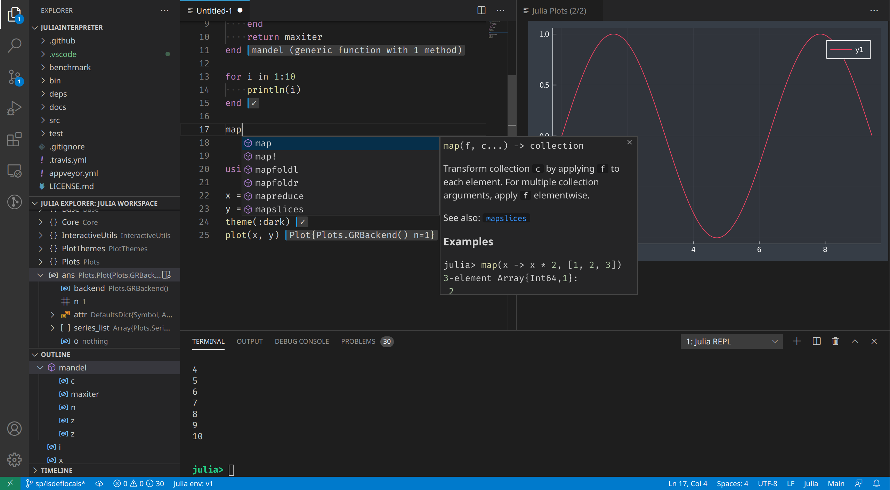
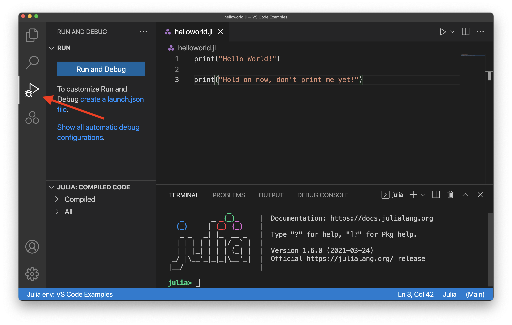
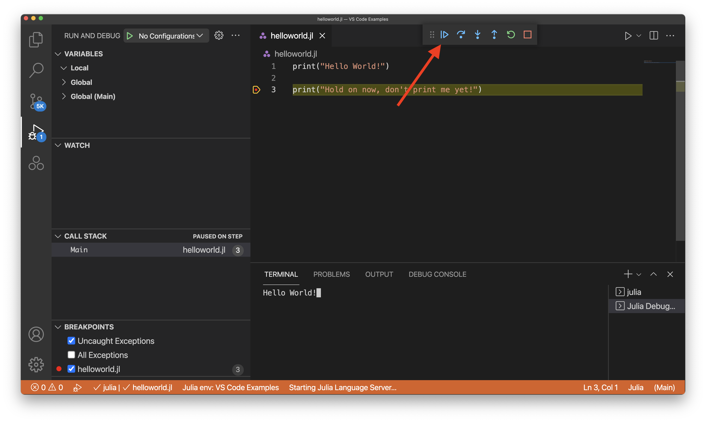
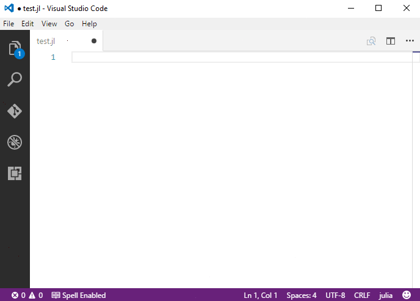

# Julia in Visual Studio Code

The Visual Studio Code extension for Julia includes built-in dynamic autocompletion, inline results, plot pane, integrated REPL, variable view, code navigation, and many other advanced language features.

Most of these features just work out of the box, while some may require basic configuration to get the best experience. This page summarizes the Julia features that the Julia VS Code extension ships with. For a more in-depth guide on how these features work and can be configured, see [The Julia VS Code Docs](https://www.julia-vscode.org/docs/stable/).

## Getting started with the VS Code Julia extension

1. Install Julia for your platform: https://julialang.org/downloads/
2. Install VS Code for your platform: https://code.visualstudio.com/download
    At the end of this step you should be able to start VS Code.
3. Open the [VS Code Marketplace](https://marketplace.visualstudio.com/items?itemName=julialang.language-julia) and press "Install"; or manually install by doing the following:
    1. Start VS Code.
    2. Inside VS Code, go to the extensions view by
        clicking `View` on the top tool bar and then selecting `Extensions`.
    3. In the extensions view, simply search for the term ``julia`` in the marketplace
        search box, then select the extension named ``Julia`` (as shown below) and click the install button.
        You should restart VS Code after this step. Note that if you run into any issues installing the Julia VS Code Extension, check out the [docs on installing an extension](https://code.visualstudio.com/docs/editor/extension-marketplace) which should help clarify any issues.
        
    

## Running Code

There are a variety of different ways to run Julia code through the VS Code IDE. You have the option to run a Julia file (via `(Ctrl+F5)`, which will run whatever Julia file you have open and active), execute Julia commands via the REPL, or even just execute a specific block of code from a file you have open. To learn more about these options, head to the [The Julia VS Code Docs section on running code](https://www.julia-vscode.org/docs/stable/userguide/runningcode/).

## Debugging 

You can start debugging by opening the Julia file which you would like to debug. Then, click the debug icon on the left (as shown below):

  

Next, you can add a breakpoint by clicking to the left of the line number:

  

Note that the red dot will not show up until after you have clicked next to the line number. 

After you have a breakpoint added (or any other kind of debug configuration), click the "Run and Debug" button on the left. It may take a few seconds for the initial run to begin. You should then see the output of running the code with the debug configuration. In this example, since we added a breakpoint, you will see the following: 

  

Notice that the second print command has yet to execute given we cannot see the text from that proint command in the terminal yet. You can finish the execution of the program by clicking the "Countinue" button:

  

To find out more about debugging Julia code with VS Code, head to [The Julia VS Code Docs section on Debugging](https://www.julia-vscode.org/docs/stable/userguide/debugging/). 

## Code completion (IntelliSense)

The Julia VS Code extension comes with Code completion thanks to IntelliSense. This feature works out of the box and is extremely useful for experienced and beginner Julia developers alike.

You can read more in the [VS Code Docs section on IntelliSense](https://code.visualstudio.com/docs/editor/intellisense).

## Next steps

This has been a brief overview showing the Julia extension features within VS Code. For more information, see the details provided in the Julia extension [README](https://github.com/julia-vscode/julia-vscode#julia).

To stay up to date on the latest features/bug fixes for the Julia extension, see the [CHANGELOG](https://github.com/julia-vscode/julia-vscode/blob/master/CHANGELOG.md).

If you have any issues or feature requests, feel free to log them in the Julia extension [GitHub repo](https://github.com/julia-vscode/julia-vscode/issues).

If you'd like to learn more about VS Code, try these topics:

* [Basic Editing](/docs/editor/codebasics.md) - A quick introduction to the basics of the VS Code editor.
* [Install an Extension](/docs/editor/extension-marketplace.md) - Learn about other extensions are available in the [Marketplace](https://marketplace.visualstudio.com/vscode).
* [Code Navigation](/docs/editor/editingevolved.md) - Move quickly through your source code.

