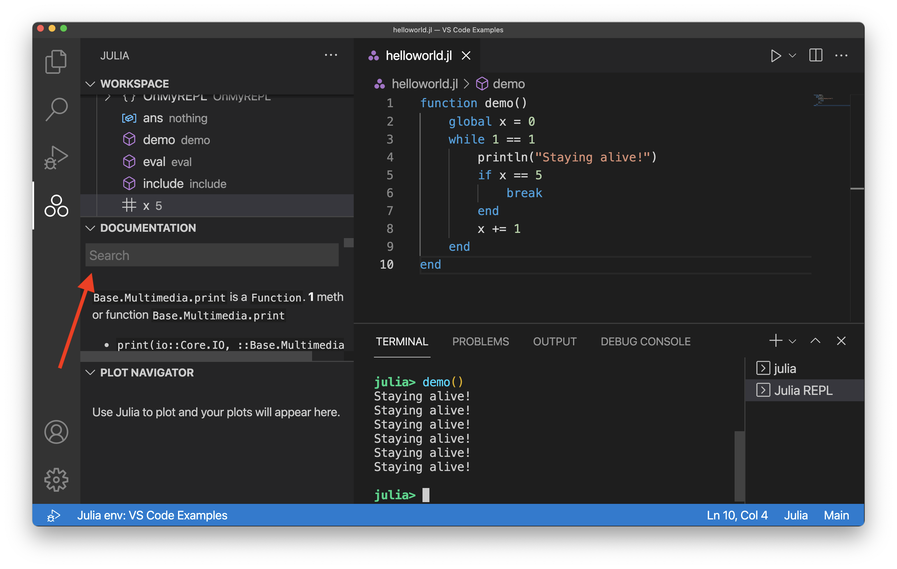

# Julia in Visual Studio Code

The [Julia Programming language](https://julialang.org) is a high level and dynamic langauge built for speed and simplicity. Julia is commonly used in areas such as data science, machine learning, scientific computing, but is still a general purpose language which can handle most programming use cases.

The [Julia extension](https://marketplace.visualstudio.com/items?itemName=julialang.language-julia) for Visual Studio Code includes built-in dynamic autocompletion, inline results, plot pane, integrated REPL, variable view, code navigation, and many other advanced language features.

Most of these features just work out of the box, while some may require basic configuration to get the best experience. This page summarizes the Julia features that the Julia VS Code extension ships with. For a more in-depth guide on how these features work and can be configured, see [The Julia VS Code Docs](https://www.julia-vscode.org/docs/stable/).

## Getting started

1. Install Julia for your platform: https://julialang.org/downloads/
2. Install VS Code for your platform: https://code.visualstudio.com/download
    At the end of this step you should be able to start VS Code.
3. Open the [VS Code Marketplace](https://marketplace.visualstudio.com/items?itemName=julialang.language-julia) and press "Install"; or manually install by doing the following:
    1. Start VS Code.
    2. Inside VS Code, go to the extensions view by
        clicking `View` on the top tool bar and then selecting `Extensions`.
    3. In the extensions view, simply search for the term ``julia`` in the marketplace
        search box, then select the extension named ``Julia`` (as shown below) and click the install button.
        You should restart VS Code after this step. Note that if you run into any issues installing the Julia VS Code Extension, check out the [installing an extension](/docs/editor/extension-marketplace.md) section which should help clarify any issues.
        
    

## Running Code

There are a variety of different ways to run Julia code within VS Code. You have the option to run a Julia file (via `(Ctrl+F5)`, which will run whatever Julia file you have open and active), execute Julia commands via the REPL, or even just execute a specific block of code from a file you have open. To learn more about these options, head to the [The Julia VS Code Docs section on running code](https://www.julia-vscode.org/docs/stable/userguide/runningcode/).

## Debugging 

You can start debugging by opening the Julia file which you would like to debug. Then, click the debug icon on the left (as shown below):

  

Next, you can add a breakpoint by clicking to the left of the line number:

  

Note that the red dot will not show up until after you have selected the area next to a line number.

After you have a breakpoint added (or any other kind of debug configuration), select the **Run and Debug** button on the left. It may take a few seconds for the initial run to begin. You should then see the output of running the code with the debug configuration. In this example, since we added a breakpoint, you will see the following: 

  

Notice that the second print command has yet to execute given we cannot see the text from that proint command in the terminal yet. You can finish the execution of the program by selecting the **Countinue** button:

  

To find out more about debugging Julia code with VS Code, head to [The Julia VS Code Docs section on Debugging](https://www.julia-vscode.org/docs/stable/userguide/debugging/). 

## Code completion (IntelliSense)

The Julia VS Code extension comes with Code completion thanks to IntelliSense. This feature works out of the box and is extremely useful for experienced and beginner Julia developers alike.

You can read more in the [VS Code Docs section on IntelliSense](https://code.visualstudio.com/docs/editor/intellisense).

## Julia Tab

By default, on the left side of the window, you will see the Julia three dots logo as shown below:

If you select the three dots logo, the Julia tab will open which displays your Workspace, Documentation, and the Plot Navigator. The workspace is a collection of code that is loaded into you active Julia session. Note that by default, it will be blank since you have not run any code yet, but after you run something, you will be able to see the state of the workspace.

The built-in Documnetation section can be quite helpful and enables you to avoid having to open up multiple browser windows in addition to your editor, in search of details on how to use specific Julia functions. You can search the documentation of any Julia package you have loaded into your active session (by doing `using some_package`), but by default, the search bar will only display results from the core Julia documentation.

There is also a built in Plot Navigator which can be very helpful when you are working on projects with visulization components. You can set the plots to render by default in VS Code and then conveniently navigate back and forth through them.

## Next steps

This has been a brief overview showing the Julia extension features within VS Code. For more information, see the details provided in the Julia extension [README](https://github.com/julia-vscode/julia-vscode#julia).

To stay up to date on the latest features/bug fixes for the Julia extension, see the [CHANGELOG](https://github.com/julia-vscode/julia-vscode/blob/master/CHANGELOG.md).

If you have any issues or feature requests, feel free to log them in the Julia extension [GitHub repo](https://github.com/julia-vscode/julia-vscode/issues).

If you'd like to learn more about VS Code, try these topics:

* [Basic Editing](/docs/editor/codebasics.md) - A quick introduction to the basics of the VS Code editor.
* [Install an Extension](/docs/editor/extension-marketplace.md) - Learn about other extensions are available in the [Marketplace](https://marketplace.visualstudio.com/vscode).
* [Code Navigation](/docs/editor/editingevolved.md) - Move quickly through your source code.

