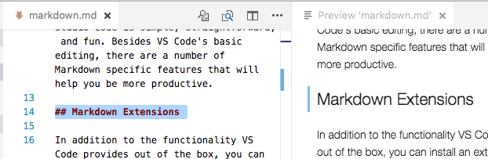
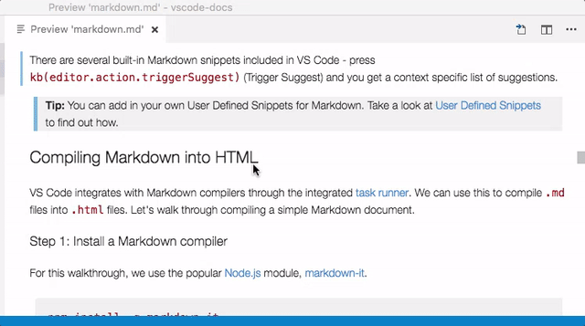

# Markdown and VS Code

Working with Markdown files in Visual Studio Code is simple, straightforward, and fun. Besides VS Code's basic editing, there are a number of Markdown specific features that will help you be more productive.

## Markdown Extensions

In addition to the functionality VS Code provides out of the box, you can install an extension for greater functionality.

<div class="marketplace-extensions-markdown-curated"></div>

> Tip: Click on an extension tile above to read the description and reviews to decide which extension is best for you. See more in the [Marketplace](https://marketplace.visualstudio.com).

## Markdown Preview

VS Code supports Markdown files out of the box. You just start writing Markdown text, save the file with the .md extension and then you can toggle the visualization of the editor between the code and the preview of the Markdown file; obviously, you can also open an existing Markdown file and start working with it. To switch between views, press `kb(markdown.showPreview)` in the editor. You can view the preview side-by-side (`kb(markdown.showPreviewToSide)`) with the file you are editing and see changes reflected in real-time as you edit.

Here is an example with a very simple file.


>**Tip:** You can also right-click on the editor Tab and select **Open Preview** or use the **Command Palette** (`kb(workbench.action.showCommands)`) **Markdown: Open Preview** and **Markdown: Open Preview to the Side** commands.

### Editor and Preview Synchronization

When working with a Markdown preview to the side of your editor, VS Code can synchronize the view of the editor and the preview. By default, the Markdown preview will automatically scroll to reveal the element at the selected line in the editor.


This behavior can be disabled using the `markdown.preview.scrollPreviewWithEditorSelection` [setting](/docs/getstarted/settings.md).

The currently selected line is indicated in the Markdown preview by a light gray bar in the left margin:



Also, when the Markdown preview is scrolled, the editor will scroll along with it:


This can be disabled using the `markdown.preview.scrollEditorWithPreview` [setting](/docs/getstarted/settings.md).

Additionally, double clicking an element in the Markdown preview will automatically open the editor for the file and scroll to the line nearest the clicked element.



## Using your own CSS

By default, we use a CSS style for the preview that matches the style of VS Code. If you want to use your own CSS for the Markdown preview, update the `"markdown.styles": []` [setting](/docs/getstarted/settings.md) with the comma-separated list of URL(s) for your style sheet(s).

For instance, in the screen shot above we used a custom CSS that changes the default font for the page and changes the color for the H1 title.

Here is the relevant CSS:

```css
body {
    font-family: 'Segoe UI', Tahoma, Geneva, Verdana, sans-serif;
}

h1 {
    color: cornflowerblue;
}
```

Use **File** > **Preferences** > **Settings** to bring up the workspace `settings.json` file and make this update:

```json
// Place your settings in this file to overwrite default and user settings.
{
    "markdown.styles": [
        "Style.css"
    ]
}
```

## Markdown preview security

For security reasons, VS Code restricts the content displayed in the Markdown preview. This includes disabling script execution and only allowing resources to be loaded over `https`.

When the Markdown preview blocks content on a page, an alert popup is shown in the top right corner of the preview window:


You can change what content is allowed in the Markdown preview by clicking on this popup or running the **Markdown: Change preview security settings** command in any Markdown file:


The Markdown preview security settings apply to all files in the workspace.

Here are the details about each of these security levels:

### Strict

This is the default setting. Only loads trusted content and disables script execution. Blocks `http` images and all SVG images not from one of our [trusted badge providers](/docs/extensionAPI/extension-manifest.md#approved-badges).

It is strongly recommended that you keep `Strict` security enabled unless you have a very good reason to change it AND you trust all markdown files in the workspace.

### Allow insecure content

Keeps scripts disabled but allows content to be loaded over `http`. Also enables SVG images.

### Disable

Disables additional security in the preview window. This allows script execution and also allows content to be loaded over `http`.

## Snippets for Markdown

There are several built-in Markdown snippets included in VS Code - press `kb(editor.action.triggerSuggest)` (Trigger Suggest) and you get a context specific list of suggestions.

>**Tip:** You can add in your own User Defined Snippets for Markdown.  Take a look at [User Defined Snippets](/docs/editor/userdefinedsnippets.md) to find out how.

## Compiling Markdown into HTML

VS Code integrates with Markdown compilers through the integrated [task runner](/docs/editor/tasks.md).  We can use this to compile `.md` files into `.html` files.  Let's walk through compiling a simple Markdown document.

### Step 1: Install a Markdown compiler

For this walkthrough, we use the popular [Node.js](https://nodejs.org) module, [markdown-it](https://github.com/markdown-it/markdown-it).

```
npm install -g markdown-it
```

> **Note:** There are many Markdown compilers to choose from beyond **markdown-it**.  Pick the one that best suits your needs and environment.

### Step 2: Create a simple MD file

Open VS Code on an empty folder and create a `sample.md` file.

> **Note:** You can open a folder with VS Code by either selecting the folder with **File** > **Open Folder...** or navigating to the folder and typing 'code .' at the command line.

Place the following source code in that file:

```markdown
# Hello Markdown in VS Code!

This is a simple introduction to compiling Markdown in VS Code.

Things you'll need:

* [node](https://nodejs.org)
* [markdown-it](https://www.npmjs.com/package/markdown-it)
* [tasks.json](/docs/editor/tasks.md)

## Section Title

> This block quote is here for your information.
```

### Step 3: Create tasks.json

The next step is to set up the task configuration file `tasks.json`.  To do this, run **Tasks** > **Configure Tasks** and click **Create tasks.json file from templates**. VS Code then presents a list of possible `tasks.json` templates to choose from. Select **Others** since we want to run an external command.

This generates a `tasks.json` file in your workspace `.vscode` folder with the following content:

```json
{
    // See https://go.microsoft.com/fwlink/?LinkId=733558
    // for the documentation about the tasks.json format
    "version": "2.0.0",
    "tasks": [
        {
            "label": "echo",
            "type": "shell",
            "command": "echo Hello"
        }
    ]
}
```

To use **markdown-it** to compile the Markdown file, change the contents as follows:

```json
{
    // See https://go.microsoft.com/fwlink/?LinkId=733558
    // for the documentation about the tasks.json format
    "version": "2.0.0",
    "tasks": [
        {
            "label": "Compile Markdown",
            "type": "shell",
            "command": "markdown-it sample.md -o sample.html",
            "group": "build"
        }
    ]
}
```

> **Tip:** While the sample is there to help with common configuration settings, IntelliSense is available for the `tasks.json` file as well to help you along.  Use `kb(editor.action.triggerSuggest)` to see the available settings.

### Step 4: Run the Build Task

Since in more complex environments there can be more than one build task we prompt you to pick the task to execute after pressing `kb(workbench.action.tasks.build)` (**Run Build Task**). In addition we allow you to scan the output for compile problems. Since we only want to convert the Markdown file to HTML select **Never scan the build output** from the presented list.

At this point, you should see an additional file show up in the file list `sample.html`.

If you want to make the **Compile Markdown** task the default build task to run execute **Configure Default Build Task** from the global **Tasks** menu and select **Compile Markdown** from the presented list. The final `tasks.json` file will then look like this:

```json
{
    // See https://go.microsoft.com/fwlink/?LinkId=733558
    // for the documentation about the tasks.json format
    "version": "2.0.0",
    "tasks": [
        {
            "label": "Compile Markdown",
            "type": "shell",
            "command": "markdown-it sample.md -o sample.html",
            "problemMatcher": [],
            "group": {
                "kind": "build",
                "isDefault": true
            }
        }
    ]
}
```

## Automating Markdown compilation

Let's take things a little further and automate Markdown compilation with VS Code.  We can do so with the same task runner integration as before, but with a few modifications.

### Step 1: Install Gulp and some plug-ins

We use [Gulp](http://gulpjs.com/) to create a task that automates Markdown compilation. We also use the [gulp-markdown](https://www.npmjs.com/package/gulp-markdown) plug-in to make things a little easier.

We need to install gulp both globally (`-g` switch) and locally:

```
npm install -g gulp
npm install gulp gulp-markdown-it
```

> **Note:** gulp-markdown-it is a Gulp plug-in for the **markdown-it** module we were using before.  There are many other Gulp Markdown plug-ins you can use, as well as plug-ins for Grunt.

You can test that your gulp installation was successful but typing `gulp -v`. You should see a version displayed for both the global (CLI) and local installations.

### Step 2: Create a simple Gulp task

Open VS Code on the same folder from before (contains `sample.md` and `tasks.json` under the `.vscode` folder), and create `gulpfile.js` at the root.

Place the following source code in that file:

```javascript
var gulp = require('gulp');
var markdown = require('gulp-markdown-it');

gulp.task('markdown', function() {
    return gulp.src('**/*.md')
        .pipe(markdown())
        .pipe(gulp.dest(function(f) {
            return f.base;
        }));
});

gulp.task('default', ['markdown'], function() {
    gulp.watch('**/*.md', ['markdown']);
});
```

What is happening here?

1. We are watching for changes to any Markdown file in our workspace, i.e. the current folder open in VS Code.
2. We take the set of Markdown files that have changed, and run them through our Markdown compiler, i.e. `gulp-markdown-it`.
3. We now have a set of HTML files, each named respectively after their original Markdown file.  We then put these files in the same directory.

### Step 3: Run the gulp default Task

To complete the tasks integration with VS Code, we will need to modify the task configuration from before to run the default Gulp task we just created. You can either delete the `tasks.json` file or empty it only keeping the `"version": "2.0.0"` property. Now execute **Run Task** from the global **Tasks** menu. Observe that you are presented with a picker listing the tasks defined in the gulp file. Select **gulp: default** to start the task. We allow you to scan the output for compile problems. Since we only want to convert the Markdown file to HTML select **Never scan the build output** from the presented list. At this point, if you create and/or modify other Markdown files, you see the respective HTML files generated and/or changes reflected on save. You can also enable [Auto Save](/docs/editor/codebasics.md#saveauto-save) to make things even more streamlined.

If you want to make the **gulp: default** task the default build task executed when pressing `kb(workbench.action.tasks.build)` run **Configure Default Build Task** from the global **Tasks** menu and select **gulp: default** from the presented list. The final `tasks.json` file will then look like this:

```json
{
    // See https://go.microsoft.com/fwlink/?LinkId=733558
    // for the documentation about the tasks.json format
    "version": "2.0.0",
    "tasks": [
        {
            "type": "gulp",
            "task": "default",
            "problemMatcher": [],
            "group": {
                "kind": "build",
                "isDefault": true
            }
        }
    ]
}
```

### Step 4: Terminate the gulp default Task

The **gulp: default** task runs in the background and watches for file changes to Markdown files. If you want to stop the task, you can use the **Terminate Running Task** from the global **Tasks** menu.

## Next Steps

Read on to find out about:

* [CSS, Less and Sass](/docs/languages/css.md) - Want to edit your CSS? VS Code has great support for CSS, Less and Sass editing.

## Common Questions

**Q: Is there spell checking?**

**A:** Not installed with VS Code but there are spell checking extensions. Check the [VS Code Marketplace](https://marketplace.visualstudio.com/vscode) to look for useful extensions to help with your workflow.

**Q: Does VS Code support [GitHub Flavored Markdown](https://help.github.com/articles/github-flavored-markdown/)?**

**A:** No, VS Code targets the [CommonMark](http://commonmark.org) Markdown specification using the [markdown-it](https://github.com/markdown-it/markdown-it) library. GitHub is moving toward the CommonMark specification which you can read about in this [update](https://githubengineering.com/a-formal-spec-for-github-markdown).

**Q: In the walkthrough above, I didn't find the Configure Task Runner command in the Command Palette?**

**A:** You may have opened a file in VS Code rather than a folder.  You can open a folder by either selecting the folder with **File** > **Open Folder...** or navigating to the folder and typing 'code .' at the command line.
