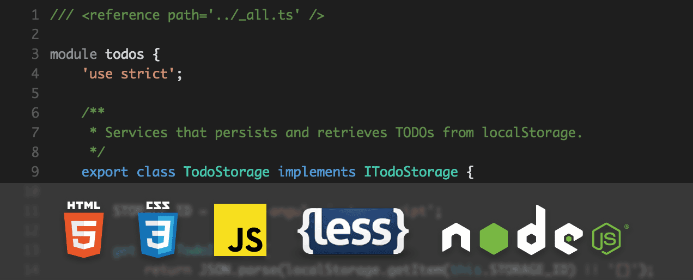
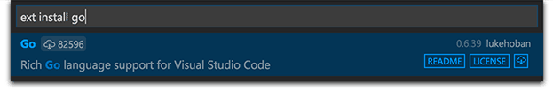

# Languages

## What Languages are Supported

In Visual Studio Code, we have support for many languages out of the box and more through language extensions available on the [VS Code Marketplace](https://marketplace.visualstudio.com/vscode/Languages).

>**Tip:** You can also add support for your favorite language through TextMate colorizers.  See [Colorizers](/docs/customization/colorizer.md) to learn how to integrate TextMate .tmLanguage syntax files into VS Code.



The richness of support varies across the different languages. The table below provides a brief description of Visual Studio Code's various languages features.  Click on any linked item to get an overview of how to use VS Code in the context of that language.

Features|Languages
--------|-------------------------
Syntax coloring, bracket matching |Batch, Clojure, Coffee Script, [Dockerfile](/docs/languages/dockerfile.md), F#, Go, Jade, Java, HandleBars, Ini, Lua, Makefile, Objective-C, Perl, PowerShell, Python, R, Razor, Ruby, Rust, SQL, Visual Basic, XML
+ Snippets| Groovy, [Markdown](/docs/languages/markdown.md), Swift
+ IntelliSense, linting, outline|[C++](/docs/languages/cpp.md), [CSS](/docs/languages/css.md), [HTML](/docs/languages/html.md), [JavaScript](/docs/languages/javascript.md), [JSON](/docs/languages/json.md), [Less](/docs/languages/css.md), [PHP](/docs/languages/php.md), [Sass](/docs/languages/css.md)
+ Refactoring, find all references|[TypeScript](/docs/languages/typescript.md), [C&#35;](/docs/languages/csharp.md)

## Language Extensions

The community is providing VS Code language support for nearly any modern programming language.  To see if there are extensions for the language you're interested in, simply bring up the extension Marketplace and filter on the language name.  Type `kb(workbench.action.showCommands)`, `'ext inst '` to bring up the extension Marketplace dropdown and then type the language name to filter the results.



You can also browse the VS Code Marketplace directly to look for [supported languages](https://marketplace.visualstudio.com/vscode/Languages).

## Changing the Language for the Selected File

In VS Code, we default the language support for a file based on its filename extension.  However at times you may wish to change language modes, to do this click on the language indicator - which is located on the right hand of the status bar.  This will bring up the Command Palette for Select Language Mode.


>**Tip:** You can persist file associations with the `files.associations` [setting](/docs/customization/userandworkspace.md).

For example, the setting below adds the `.myphp` file extension to the `php` language:

```json
    "files.associations": {
        "*.myphp": "php"
    }
```

## Next Steps

Now you know that VS Code has support for the languages you care about. Read on...

* [Editing Evolved](/docs/editor/editingevolved.md) - Lint, IntelliSense, Lightbulbs, Peek and Goto Definition and more
* [Debugging](/docs/editor/debugging.md) - This is where VS Code really shines
* [Customization](/docs/customization/overview.md) - themes, settings and keyboard bindings

## Common Questions

**Q: Can I contribute my own language service?**

**A:** Yes you can! Check out the [example language server](/docs/extensions/example-language-server.md) in the [Extending Visual Studio Code](/docs/extensions/overview.md) documentation. 

**Q: Can I map additional file extensions to a language?**

**A:** Yes, with the `files.associations` [setting](/docs/customization/userandworkspace.md) you can map file extensions to an existing language either globally or per workspace.

Here is an example that will associate more file extensions to the PHP language:

```json
"files.associations": {
    "*.php4": "php",
    "*.php5": "php"
}
```

You can also configure full file paths to languages if needed. The following example associates all files in a folder `somefolder` to PHP:

```json
"files.associations": {
    "**/somefolder/*.*": "php"
}
```

Note that the pattern is a [glob pattern](https://en.wikipedia.org/wiki/Glob_%28programming%29) that will match on the full path of the file if it contains a `/` and will match on the file name otherwise.

