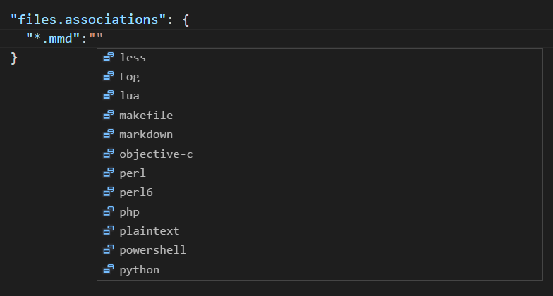

# Programming Languages

## Hundreds of programming languages supported

In Visual Studio Code, we have support for almost every major programming language. Several ship in the box, for example, JavaScript, TypeScript, CSS, and HTML but more rich language extensions can be found in the [VS Code Marketplace](https://marketplace.visualstudio.com/vscode/Languages).

Here are eight of the most popular language extensions:

<div class="marketplace-extensions-languages-curated"></div>

Go to the [Marketplace](https://marketplace.visualstudio.com/vscode) or use our [integrated extension manager](/docs/editor/extension-gallery) and search for your desired programming language to find snippets, code completion/IntelliSense providers, linters, debuggers and more.

>**Note**: If you want to change the display language of VS Code (for example, to Chinese), see the [Display Language](/docs/getstarted/locales.md) topic.

## Language specific documentation

On this website, we have a number of topics outlining several of the common languages supported by VS Code. These include: [C++](/docs/languages/cpp.md) - [C&#35;](/docs/languages/csharp.md) - [CSS](/docs/languages/css.md) - [Dockerfile](/docs/languages/dockerfile.md) - [Go](/docs/languages/go.md) - [HTML](/docs/languages/html.md) - [Java](/docs/languages/java.md) - [JavaScript](/docs/languages/javascript.md) - [JSON](/docs/languages/json.md) - [Less](/docs/languages/css.md) -
[Markdown](/docs/languages/markdown.md) - [PHP](/docs/languages/php.md) - [Python](/docs/languages/python.md) - [Sass](/docs/languages/css.md) - [T-SQL](/docs/languages/tsql.md) - [TypeScript](/docs/languages/typescript.md).

Click on any linked item to get an overview of how to use VS Code in the context of that language.  Most language extensions also contain a summary of their core features in their README.

## Language features in VS Code

The richness of support varies across the different languages and their extensions:

* Syntax highlighting and bracket matching
* Smart completions (IntelliSense)
* Linting and corrections
* Code navigation (Go to Definition, Find All References)
* Debugging
* Refactoring

## Changing the language for the selected file

In VS Code, we default the language support for a file based on its filename extension.  However, at times you may wish to change language modes, to do this click on the language indicator - which is located on the right hand of the Status Bar.  This will bring up the **Select Language Mode** drop-down where you can select another language for the current file.


**Tip**: You can get the same drop-down by running the **Change Language Mode** command (`kb(workbench.action.editor.changeLanguageMode)`).

## Language Id

VS Code associates a language mode with a specific language identifier so that various VS Code features can be enabled based on the current language mode.

A language identifier is often (but not always) the lowercased programming language name. Note that casing matters for exact identifier matching ('Markdown' != 'markdown'). Unknown language files have the language identifier `plaintext`.

You can see the list of currently installed languages and their identifiers in the **Change Language Mode** (`kb(workbench.action.editor.changeLanguageMode)`) drop-down.


You can find a list of known identifiers in the [language identifier reference](/docs/languages/identifiers.md).

## Adding a file extension to a language

You can add new file extensions to an existing language with the `files.associations` [setting](/docs/getstarted/settings.md).

For example, the setting below adds the `.myphp` file extension to the `php` language identifier:

```json
    "files.associations": {
        "*.myphp": "php"
    }
```

IntelliSense (`kb(editor.action.triggerSuggest)`) will show you the available language identifiers.



## Next Steps

Now you know that VS Code has support for the languages you care about. Read on...

* [Code Navigation](/docs/editor/editingevolved.md) - Peek and Go to Definition and more
* [Debugging](/docs/editor/debugging.md) - This is where VS Code really shines

## Common Questions

**Q: Can I contribute my own language service?**

**A:** Yes you can! Check out the [example language server](/docs/extensions/example-language-server.md) in the [VS Code Extension Authoring](/docs/extensions/overview.md) documentation.

**Q: What if I don't want to create a full language service, can I reuse existing TextMate bundles?**

**A:** Yes, you can also add support for your favorite language through TextMate colorizers. See [Themes, Snippets, and Colorizers](/docs/extensions/themes-snippets-colorizers.md) topic in the Extension Authoring section to learn how to integrate TextMate `.tmLanguage` syntax files into VS Code.

**Q: Can I map additional file extensions to a language?**

**A:** Yes, with the `files.associations` [setting](/docs/getstarted/settings.md) you can map file extensions to an existing language either globally or per workspace.

Here is an example that will associate more file extensions to the PHP language:

```json
"files.associations": {
    "*.php4": "php",
    "*.php5": "php"
}
```

You can also configure full file paths to languages if needed. The following example associates all files in a folder `somefolder` to PHP:

```json
"files.associations": {
    "**/somefolder/*.*": "php"
}
```

Note that the pattern is a [glob pattern](https://en.wikipedia.org/wiki/Glob_%28programming%29) that will match on the full path of the file if it contains a `/` and will match on the file name otherwise.
