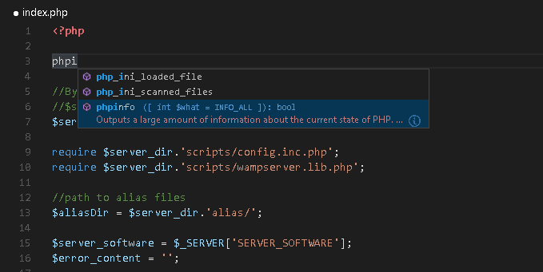
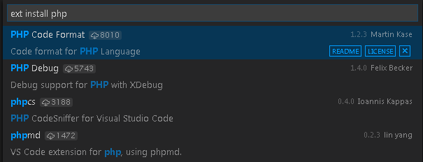

# PHP Programming in VS Code

Visual Studio Code is a great editor for PHP development. You get features like syntax highlighting and bracket matching, IntelliSense, and snippets out of the box and you can add more functionality through community created VS Code [extensions](/docs/editor/extension-gallery.md).



## Snippets

Visual Studio Code includes a set of common snippets for PHP.  To access these, hit `kb(editor.action.triggerSuggest)` to get a context specific list.


## Linting

VS Code uses the official PHP linter (`php -l`) for PHP language diagnostics. This allows VS Code to stay current with PHP linter improvements.

There are three [settings](/docs/customization/userandworkspace.md) to control the PHP linter:

* `php.validate.enable`: controls whether to enable PHP linting at all. Enabled by default.
* `php.validate.executablePath`: points to the PHP executable on disk. Set this if the PHP executable is not on the system path.
* `php.validate.run`: controls whether the validation is triggered on save (value: `"onSave"`) or on type (value: `"onType"`). Default is on save.


To set the PHP executable path, open your **User or Workspace Settings** and add the `php.validate.executablePath`:

```json
{
    "php.validate.executablePath": "c:/php/php.exe"
}
```

## Extensions

There are many PHP language extensions available on the [VS Code Marketplace](https://marketplace.visualstudio.com/VSCode) and more are being created.  You can search for PHP extensions from within VS Code by running the **Extensions: Install Extension** command (`kb(workbench.action.showCommands)` and type `ext install`) then filter the extensions drop down list by typing `php`.



## Debugging

PHP debugging with **XDebug** is supported through a [PHP Debug extension](https://marketplace.visualstudio.com/items?itemName=felixfbecker.php-debug).  Follow the extension's instructions for configuring **XDebug** to work with VS Code.

## Next Steps

Read on to find out about:

* [Extension Marketplace](/docs/editor/extension-gallery.md) - Browse the extensions others have shared
* [Debugging](/docs/editor/debugging.md) - Learn more about VS Code debugging


