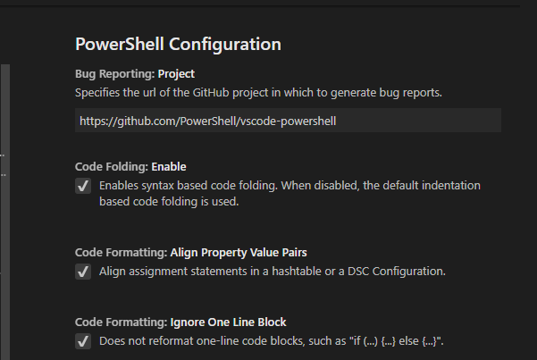

# Editing PowerShell in Visual Studio Code

PowerShell is a task-based command line shell and scripting language built on .NET .

PowerShell provides a powerful toolset for administrators on any platform.

[The PowerShell Extension](https://github.com/PowerShell/vscode-powershell) provides rich language Support and IDE capabilities such as completions, definition tracking and linting analysis for Windows PowerShell versions 3, 4, 5 and 5.1 as well as all versions of PowerShell Core.

## Install the PowerShell Extension on Visual Studio Code

The official PowerShell Extension can be installed by following the steps in the
[Visual Studio Code Docs](https://code.visualstudio.com/docs/editor/extension-gallery)
or by going directly to the Marketplace and clicking the [Install Button](vscode:extension/ms-vscode.PowerShell)

You can also install the PowerShell Extension from within Visual Studio Code by
browsing the Extension Marketplace under the Marketplace view in the Activity Bar for extensions.
You can access this with the shortcut <kbd>ctrl</kbd>-<kbd>Shift</kbd>-<kbd>x</kbd> or by clicking on the

 Marketplace Icon:


Search the Marketplace View for "PowerShell" and select the PowerShell Extension,
Which is denoted by this Icon:


 ## Search from the Command line

 Alternatively, the PowerShell Extension can be installed from any command line (including PowerShell, CMD, bash) on all platforms with the following command
 
 ```code --install-extension ms-vscode.powershell```

 If you are running VSCode Insiders, you will need this command instead:

 ``` code-insiders --install-extension ms-vscode.powershell```

## Example Scripts

Example scripts are included with the extension and can be found at the following Path.

    C:\Users\<yourusername>\.vscode\extensions\ms-vscode.PowerShell-<version>\examples

To open or view the examples in Visual Studio Code run the following from your PowerShell command prompt

```code (Get-ChildItem $Home\.vscode\extensions\ms-vscode.PowerShell-*\examples)[-1]```

If using the Insiders edition

```code-insiders (Get-ChildItem $Home\.vscode\extensions\ms-vscode.PowerShell-*\examples)[-1]```

You can also open them with <kbd>ctrl</kbd>-<kbd>shift</kbd>-<kbd>p</kbd> (<kbd>cmd</kbd>-<kbd>shift</kbd>-<kbd>p</kbd>) for Macs and typing __PowerShell: Open Examples Folder__.


## The PowerShell Extension includes the following major features

* Syntax Highlighting
* Code Snippets
* Intellisense for cmdlets and more
* Rule-Based analysis provided by PowerShell Script Analyzer
* Go to definition of cmdlets and variables
* Find references of cmdlets and variables
* Document and Workspace symbol discovery
* Run selected selection of PowerShell code using F8
* Launch online help for the symbol under the cursor using ctrl+F1
* Local script debugging and basic interactive console support

## Plaster

 Plaster is a template-based file and project generator written in PowerShell. It's Purpose is to streamline the creation of PowerShell module projects, Pester tests, DSC configurations and more.
 See the [Github Plaster repo](https://github.com/PowerShell/Plaster) for more information.

 [Cmdlet Documentation](https://github.com/PowerShell/Plaster/blob/master/docs/en-US/Plaster.md)

## Debugging


For more information on debugging check out the Hey, Scripting Guy two-part blog post series Written by [@keithHill](https://twitter.com/r_keith_hill) on debugging with the PowerShell Extension:

[Debugging PowerShell script in Visual Studio Code – Part 1](https://blogs.technet.microsoft.com/heyscriptingguy/2017/02/06/debugging-powershell-script-in-visual-studio-code-part-1/)

[Debugging PowerShell script in Visual Studio Code – Part 2](https://blogs.technet.microsoft.com/heyscriptingguy/2017/02/13/debugging-powershell-script-in-visual-studio-code-part-2/)

## Settings Reference

You can customize VSCode settings from the file menu by selecting preferences then clicking settings.

You can also click the gear Icon
located in the lower left corner of the activity bar.


You can also use the shortcut <kbd>ctrl</kbd>-<kbd>,</kbd> (<kbd>cmd</kbd>-<kbd>,</kbd>) for Mac for a quick search

This will launch the settings.json file, in VSCode versions prior to 1.27.1. , where the VSCode team has introduced a settings GUI, which will be the new default interface for customizing settings.

You can still launch the JSON settings file by using the command __Open Settings (JSON)__ or by changing the default settings editor with the ```"workbench.settings.editor"```

### VSCode Settings GUI


### PowerShell Extension Settings



## PowerShell Extension multi-version support

You can configure the PowerShell Extensions to use any version of PowerShell installed on your machine by following [these instructions](https://docs.microsoft.com/en-us/powershell/scripting/core-powershell/vscode/using-vscode?view=powershell-6#using-a-specific-installed-version-of-powershell)

## Pester

[Pester](https://github.com/pester/Pester/wiki/Pester)
 is a Behavior-Driven Development (BDD) based unit test runner for PowerShell.
Pester provides a framework for running unit tests to execute and validate PowerShell commands. Pester follows a file naming convention for naming tests to be discovered by pester at test time and a simple set of functions that expose a testing DSL for isolating, running, evaluating and reporting the results of PowerShell commands.

Pester 3.40 comes installed with Windows 10 and Server 2016, to update to the latest version follow these instructions from the Pester Github Readme [Pester updated installation instructions](https://github.com/pester/Pester#installation)

## PSScriptAnalyzer

[PSScriptAnalyzer](https://github.com/PowerShell/PSScriptAnalyzer#introduction) is a static code checker for Windows PowerShell modules and scripts. PSScriptAnalyzer checks the quality of Windows PowerShell code by running a set of rules. The rules are based on PowerShell best practices identified by the PowerShell Team and the community. Pester generates diagnostic results (errors and warnings) to inform users about potential code defects and suggests possible solutions for improvements.

PSScriptAnalyzer is shipped with a collection of built-in rules that checks various aspects of PowerShell code such as presence of uninitialized variables, usage of PSCredential Type, usage of Invoke-Expression etc. additional functionalities such as exclude/include specific rules are also supported.

## CodeLens
CodeLens

## [Extension FAQ Page](https://github.com/PowerShell/vscode-powershell/wiki/FAQ)

Here are answers to some of the commonly asked questions about the PowerShell Extension for Visual Studio Code: