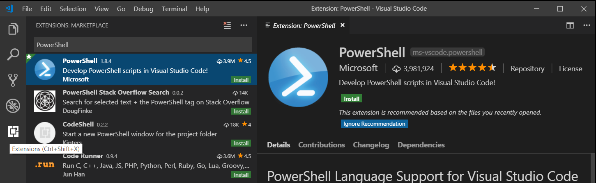
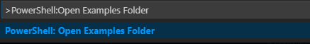
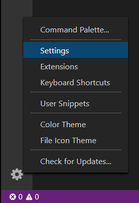
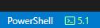
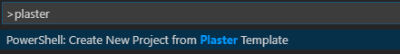
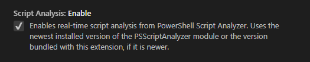
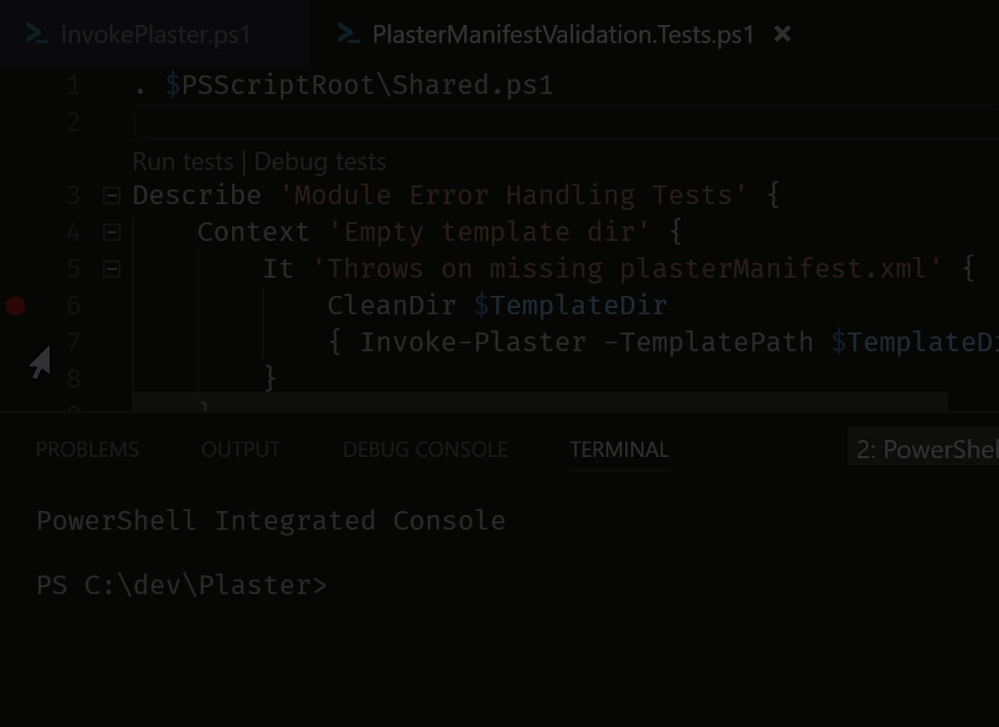
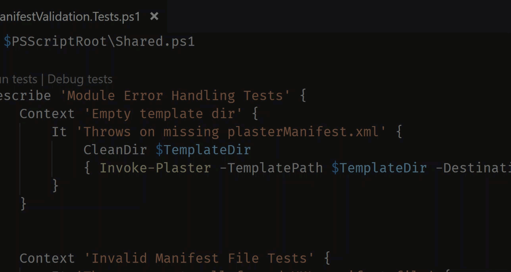
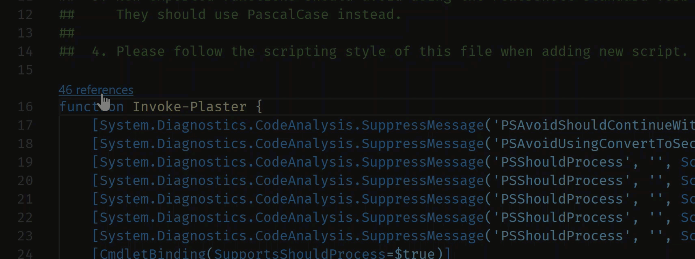

# PowerShell in Visual Studio Code

[PowerShell](https://docs.microsoft.com/powershell/) is a task-based command-line shell and scripting language built on [.NET](https://docs.microsoft.com/dotnet), which provides a powerful toolset for administrators on any platform.

The Microsoft [PowerShell](https://marketplace.visualstudio.com/items?itemName=ms-vscode.PowerShell) extension for Visual Studio Code provides rich language support and capabilities such as completions, definition tracking, and linting analysis for PowerShell versions 3, 4, 5, and 5.1 as well as all versions of [PowerShell Core](https://docs.microsoft.com/powershell/scripting/whats-new/what-s-new-in-powershell-core-60).

## Install the PowerShell extension

The official PowerShell extension can be installed by following the steps described in the
[Visual Studio Code User Guide](/docs/editor/extension-gallery.md) or by going directly to the Visual Studio Code Marketplace and clicking the [Install Button](vscode:extension/ms-vscode.PowerShell).

You can also install the PowerShell extension from within Visual Studio Code by opening the Extensions view with keyboard shortcut `kb(workbench.view.extensions)` and typing "PowerShell" and select the PowerShell extension:



## Install from the command line

Alternatively, the PowerShell extension can be installed from any command line (including PowerShell, Cmd, bash) on all platforms with the following command

```bash
code --install-extension ms-vscode.powershell
```

If you are running VS Code [Insiders](/insiders), you will need this command instead:

```bash
code-insiders --install-extension ms-vscode.powershell
```

## Example scripts

Example scripts are included with the extension and can be found at the following path.

    C:\Users\<yourusername>\.vscode\extensions\ms-vscode.PowerShell-<version>\examples

To open or view the examples in Visual Studio Code, run the following from your PowerShell command prompt:

```bash
code (Get-ChildItem $Home\.vscode\extensions\ms-vscode.PowerShell-*\examples)[-1]
```

If using the [Insiders](/insiders) edition:

```bash
code-insiders (Get-ChildItem $Home\.vscode\extensions\ms-vscode.PowerShell-*\examples)[-1]
```

You can also open the examples from the Command Palette (`kb(workbench.action.showCommands)`) with the **PowerShell: Open Examples Folder** command.



## Major features

* Syntax highlighting
* Code snippets
* IntelliSense for cmdlets and more
* Rule-Based analysis provided by PowerShell Script Analyzer
* "Go to definition" of cmdlets and variables
* Find references of cmdlets and variables
* Document and Workspace symbol discovery
* Run selected section of PowerShell code using `kbstyle(F8)`
* Launch online help for the symbol under the cursor using `kbstyle(Ctrl + F1)`
* Local script debugging and basic interactive console support

## Debugging

The PowerShell extension uses the built-in debugging interface of VS Code to allow for debugging of PowerShell scripts and modules. You can learn more about [VS Code debugging](/docs/editor/debugging.md) here.

### Hey, Scripting Guy! blog


For more information on debugging, check out the "Hey, Scripting Guy!" two-part blog post series written by [@keithHill](https://twitter.com/r_keith_hill) on debugging with the PowerShell extension:

[Debugging PowerShell script in Visual Studio Code – Part 1](https://blogs.technet.microsoft.com/heyscriptingguy/2017/02/06/debugging-powershell-script-in-visual-studio-code-part-1/)

[Debugging PowerShell script in Visual Studio Code – Part 2](https://blogs.technet.microsoft.com/heyscriptingguy/2017/02/13/debugging-powershell-script-in-visual-studio-code-part-2/)

## PowerShell extension settings

You can customize VS Code [settings](/docs/getstarted/settings.md) from the **File** > **Preferences** > **Settings** menu item (**Code** > **Preferences** > **Settings** on macOS).

You can also click the gear icon located in the lower left corner of the Activity Bar.



You can also use the keyboard shortcut `kb(workbench.action.openSettings)` to open your settings. The VS Code team has introduced a settings GUI in the latest version 1.27.1 as the new default interface for customizing settings. In VS Code versions prior to 1.27.1, this will open your `settings.json` file.

You can still open the `settings.json` file by using **Preferences: Open Settings (JSON)** command from the Command Palette (`kb(workbench.action.showCommands)`) or by changing the default settings editor with the `"workbench.settings.editor"` setting.

Go to [User and Workspace settings](/docs/getstarted/settings.md) for more information on configuring VS Code settings.

## Multi-version support

You can configure the PowerShell extension to use any version of PowerShell installed on your machine by following [these instructions](https://docs.microsoft.com/powershell/scripting/core-powershell/vscode/using-vscode?view=powershell-6#using-a-specific-installed-version-of-powershell).

You can also change the version by clicking on the version number in the lower right corner:



Or run the **PowerShell: Show Session Menu** command from the Command Palette (`kb(workbench.action.showCommands)`).

## Pester

[Pester](https://github.com/pester/Pester/wiki/Pester) is a [Behavior-driven Development](https://en.wikipedia.org/wiki/Behavior-driven_development) (BDD) based unit test runner for PowerShell. Pester provides a framework for running unit tests to execute and validate PowerShell commands. Pester follows a file naming convention for naming tests to be discovered by Pester at test time and a simple set of functions that expose a testing [domain-specific language](https://en.wikipedia.org/wiki/Domain-specific_language) (DSL) for isolating, running, evaluating and reporting the results of PowerShell commands.

Windows 10 and Server 2016 comes with Pester 3.40 pre-installed. To update Pester or to install the latest version on other platforms follow the [Pester installation instructions](https://github.com/pester/Pester#installation).


## Plaster

 Plaster is a template-based file and project generator written in PowerShell. Its purpose is to streamline the creation of PowerShell module projects, Pester tests, DSC configurations and more. See the [GitHub Plaster repository](https://github.com/PowerShell/Plaster) for more information, for documentation on Plaster's cmdlets see [Cmdlet Documentation](https://github.com/PowerShell/Plaster/blob/master/docs/en-US/Plaster.md).

The PowerShell extension allows the creation of new Plaster projects by running the **PowerShell: Create New Project from Plaster Template** command from the Command Palette (`kb(workbench.action.showCommands)`).



## PSScriptAnalyzer

[PSScriptAnalyzer](https://github.com/PowerShell/PSScriptAnalyzer#introduction) is a static source code checker for PowerShell modules and scripts. PSScriptAnalyzer checks the quality of PowerShell code by running a set of rules. The rules are based on PowerShell best practices identified by the PowerShell Team and the community. Pester generates diagnostic records (errors and warnings) to inform users about potential code defects and suggests possible solutions for improvements.

The PowerShell extension includes PSScriptAnalyzer by default, and automatically performs analysis on PowerShell script files being edited in VS Code.

### PSScriptAnalyzer Settings

PSScriptAnalyzer is shipped with a collection of built-in rules that checks various aspects of PowerShell source code such as presence of uninitialized variables, usage of PSCredential Type, usage of Invoke-Expression, etc. Additional functionality such as exclude/include specific rules is also supported.

To disable PSScriptAnalyzer, open your settings, browse Extensions, select the PowerShell extension and deselect the checkbox for PSScriptAnalyzer.



Format document command is provided by the PSScriptAnalyzer module.

### Document Formatting

Automatic document formatting can be invoked using the **Format Document** command or the (`kb(editor.action.formatDocument)`) keyboard shortcut.

## CodeLens

CodeLenses are a VS Code feature to provide actionable, contextual information that is displayed within the source code.

CodeLens support was added in version 1.3.0 of the PowerShell extension, read the [PowerShell extension changelog](https://marketplace.visualstudio.com/items/ms-vscode.PowerShell/changelog) for more information.

### Pester CodeLens support

Pester supports CodeLens integration for **Run tests** and **Debug tests**.

### CodeLens Pester debug support



### CodeLens Pester symbol support



### Function reference CodeLens support

CodeLens function reference support shows the number of times a function is referenced within your code and allows you to jump to specific references.



## Extension FAQ page

Check out the FAQ page on the [PowerShell extensions Wiki](https://github.com/PowerShell/vscode-powershell/wiki/FAQ)

## Types.ps1xml and Format.ps1xml files

`ps1xml` files are PowerShell's way to extend the type system and define output formatting. For more information on these files, please refer to the official PowerShell documentation on [`Types.ps1xml`](https://docs.microsoft.com/powershell/module/microsoft.powershell.core/about/about_types.ps1xml?view=powershell-6) and [`Format.ps1xml`](https://docs.microsoft.com/powershell/module/microsoft.powershell.core/about/about_format.ps1xml?view=powershell-6).
You can get IntelliSense features when authoring `ps1xml` files by installing the [XML extension by Red Hat](https://marketplace.visualstudio.com/items?itemName=redhat.vscode-xml).
After installing, add this configuration to your user settings:

```json
"xml.fileAssociations": [
  {
    "systemId": "https://raw.githubusercontent.com/PowerShell/PowerShell/master/src/Schemas/Format.xsd",
    "pattern": "**/*.Format.ps1xml"
  },
  {
    "systemId": "https://raw.githubusercontent.com/PowerShell/PowerShell/master/src/Schemas/Types.xsd",
    "pattern": "**/*.Types.ps1xml"
  }
]
```

This tells the XML extension to use the official XML schemas from the PowerShell repository for all `.ps1xml` files.
This enables the following features in `ps1xml` files:

- Syntax error reporting
- Schema validation
- Tag and attribute completion
- Auto-close tags
- Symbol highlighting
- Document folding
- Document symbols and outline
- Renaming support
- Document Formatting
