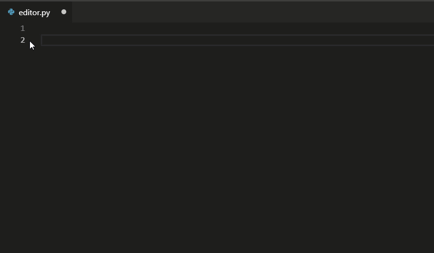
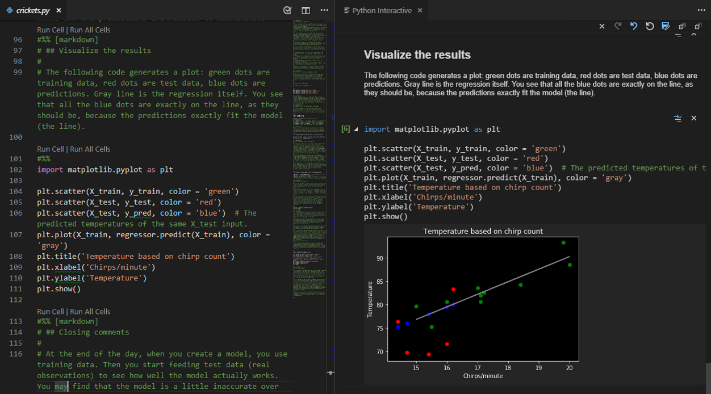

# Python in Visual Studio Code

Working with Python in Visual Studio Code, using the [Microsoft Python extension](https://marketplace.visualstudio.com/items?itemName=ms-python.python), is simple, fun, and productive. The extension makes VS Code an excellent Python editor, and works on any operating system with a variety of Python interpreters. It leverages all of VS Code's power to provide auto complete and IntelliSense, linting, debugging, and unit testing, along with the ability to easily switch between Python environments, including virtual and conda environments.

This article provides only an overview of the different capabilities of the Python extension for VS Code. For a walkthrough of editing, running, and debugging code, use the button below.

<a class="next-topic-btn" href="/docs/python/python-tutorial">Python Hello World Tutorial</a>

## Install Python and the Python extension

The [tutorial](/docs/python/python-tutorial.md) guides you through installing Python and using the extension. You must install a Python interpreter yourself separately from the extension. For a quick install, use [Python from python.org](https://www.python.org/downloads/) and [install the extension from the VS Code Marketplace](https://marketplace.visualstudio.com/items?itemName=ms-python.python).

Once you have a version of Python installed, select it using the **Python: Select Interpreter** command. If VS Code doesn't automatically locate the interpreter you're looking for, refer to [Environments - Manually specify an interpreter](/docs/python/environments.md#manually-specify-an-interpreter).

You can configure the Python extension through settings. Learn more in the [Python Settings reference](/docs/python/settings-reference.md).

>**Windows Subsystem for Linux**: If you are on Windows, WSL is a great way to do Python development. You can run Linux distributions on Windows and Python is often already installed. When coupled with the [WSL](https://marketplace.visualstudio.com/items?itemName=ms-vscode-remote.remote-wsl) extension, you get full VS Code editing and debugging support while running in the context of WSL. To learn more, go to [Developing in WSL](/docs/remote/wsl.md) or try the [Working in WSL](/docs/remote/wsl-tutorial.md) tutorial.

## Run Python code

To experience Python, create a file (using the [File Explorer](/docs/getstarted/userinterface.md#explorer)) named `hello.py` and paste in the following code:

```python
print("Hello World")
```

The Python extension then provides shortcuts to run Python code using the currently selected interpreter (**Python: Select Interpreter** in the Command Palette). To run the active Python file, click the **Run Python File in Terminal** play button in the top-right side of the editor.


You can also run individual lines or a selection of code with the **Python: Run Selection/Line in Python Terminal** command (`kbstyle(Shift+Enter)`). If there isn't a selection, the line with your cursor will be run in the Python Terminal. An identical **Run Selection/Line in Python Terminal** command is available on the context menu for a selection in the editor. The same terminal will be used every time you run a selection or a line in the terminal/REPL, until that terminal is closed.

The Python extension automatically removes indents based on the first non-empty line of the selection, shifting all other lines left as needed.

The command opens the Python Terminal if necessary; you can also open the interactive REPL environment directly using the **Python: Start REPL** command that activates a terminal with the currently selected interpreter and then runs the Python REPL.

For a more specific walkthrough and other ways of running code, see the [run code tutorial](/docs/python/python-tutorial.md#run-hello-world).

## Autocomplete and IntelliSense

The Python extension supports code completion and IntelliSense using the currently selected interpreter. [IntelliSense](/docs/editor/intellisense.md) is a general term for a number of features, including intelligent code completion (in-context method and variable suggestions) across all your files and for built-in and third-party modules.

IntelliSense quickly shows methods, class members, and documentation as you type. You can also trigger completions at any time with `kb(editor.action.triggerSuggest)`. Hovering over identifiers will show more information about them.



## Enhance completions with AI

[GitHub Copilot](https://copilot.github.com/) is an AI-powered code completion tool that helps you write code faster and smarter. You can use the [GitHub Copilot extension](https://marketplace.visualstudio.com/items?itemName=GitHub.copilot) in VS Code to generate code, or to learn from the code it generates.


GitHub Copilot provides suggestions for languages beyond Python and a wide variety of frameworks, including JavaScript, TypeScript, Ruby, Go, C# and C++.

You can learn more about how to get started with Copilot in the [Copilot documentation](/docs/editor/artificial-intelligence.md).

## Linting

Linting analyzes your Python code for potential errors, making it easy to navigate to and correct different problems.

The Python extension can apply a number of different linters including Pylint, pycodestyle, Flake8, mypy, pydocstyle, prospector, and pylama. See [Linting](/docs/python/linting.md).

<video autoplay loop muted playsinline controls title="Python linting video">
  <source src="/docs/languages/python/python-linting.mp4" type="video/mp4">
</video>

## Debugging

No more `print` statement debugging! VS Code comes with great debugging support for Python, allowing you to set breakpoints, inspect variables, and use the debug console for an in-depth look at how your program is executing step by step. Debug a number of different types of Python applications, including multi-threaded, web, and remote applications.

For more specific information on debugging in Python, such as configuring your `launch.json` settings and implementing remote debugging, see [Debugging](/docs/python/debugging.md). General VS Code debugging information is found in the [debugging document](/docs/editor/debugging.md).

Additionally, the [Django](/docs/python/tutorial-django.md) and [Flask](/docs/python/tutorial-flask.md) tutorials provide examples of how to implement debugging in the context of web applications, including debugging Django templates.

<video autoplay loop muted playsinline controls title="Python debugging video">
  <source src="/docs/languages/python/python-debugging.mp4" type="video/mp4">
</video>

## Environments

The Python extension automatically detects Python interpreters that are installed in standard locations. It also detects conda environments as well as virtual environments in the workspace folder. See [Configuring Python environments](/docs/python/environments.md).

The current environment is shown on the right side of the VS Code Status Bar:


The Status Bar also indicates if no interpreter is selected:


The selected environment is used for IntelliSense, auto-completions, linting, formatting, and any other language-related feature. It is also activated when you run or debug Python in a terminal, or when you create a new terminal with the **Terminal: Create New Terminal** command.

To change the current interpreter, which includes switching to conda or virtual environments, select the interpreter name on the Status Bar or use the **Python: Select Interpreter** command.


VS Code prompts you with a list of detected environments as well as any you've added manually to your user settings (see [Configuring Python environments](/docs/python/environments.md)).

## Jupyter notebooks

To enable Python support for [Jupyter notebook](https://jupyter.org/) files (`.ipynb`) in VS Code, you can install the [Jupyter extension](https://marketplace.visualstudio.com/items?itemName=ms-toolsai.jupyter). The Python and Jupyter extensions work together to give you a great Notebook experience in VS Code, providing you the ability to directly view and modify code cells with IntelliSense support, as well as run and debug them.


You can also convert and open the notebook as a Python code file through the **Jupyter: Export to Python Script** command. The notebook's cells are delimited in the Python file with `#%%` comments, and the Jupyter extension shows **Run Cell** or **Run Below** CodeLens. Selecting either CodeLens starts the Jupyter server and runs the cell(s) in the Python interactive window:



You can also connect to a remote Jupyter server to run your notebooks. For more information, see [Jupyter support](/docs/datascience/jupyter-notebooks.md).

## Testing

The Python extension supports [testing](/docs/python/testing.md) with Python's built-in unittest framework and pytest.

In order to run tests, you must enable one of the supported testing frameworks in the settings of your project. Each framework has its own specific settings, such as arguments for identifying the paths and patterns for test discovery.

Once the tests have been discovered, VS Code provides a variety of commands (on the Status Bar, the Command Palette, and elsewhere) to run and debug tests. These commands also allow you to run individual test files and methods


## Configuration

The Python extension provides a wide variety of settings for its various features. These are described on their relevant topics, such as [Editing code](/docs/python/editing.md), [Linting](/docs/python/linting.md), [Debugging](/docs/python/debugging.md), and [Testing](/docs/python/testing.md). The complete list is found in the [Settings reference](/docs/python/settings-reference.md).

## Other popular Python extensions

The [Microsoft Python extension](https://marketplace.visualstudio.com/items?itemName=ms-python.python) provides all of the features described previously in this article. Additional Python language support can be added to VS Code by installing other popular Python extensions.

1. Open the **Extensions** view (`kb(workbench.view.extensions)`).
1. Filter the extension list by typing 'python'.

<div class="marketplace-extensions-python"></div>

The extensions shown above are dynamically queried. Click on an extension tile above to read the description and reviews to decide which extension is best for you. See more in the [Marketplace](https://marketplace.visualstudio.com/vscode).

## Next steps

- [Python Hello World tutorial](/docs/python/python-tutorial.md) - Get started with Python in VS Code.
- [Editing Python](/docs/python/editing.md) - Learn about auto-completion, formatting, and refactoring for Python.
- [Basic Editing](/docs/editor/codebasics.md) - Learn about the powerful VS Code editor.
- [Code Navigation](/docs/editor/editingevolved.md) - Move quickly through your source code.
- [Django tutorial](/docs/python/tutorial-django.md)
- [Flask tutorial](/docs/python/tutorial-flask.md)
