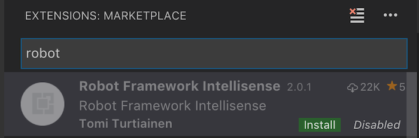
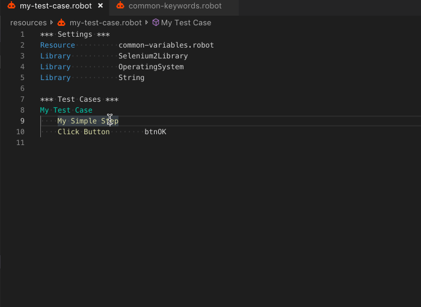
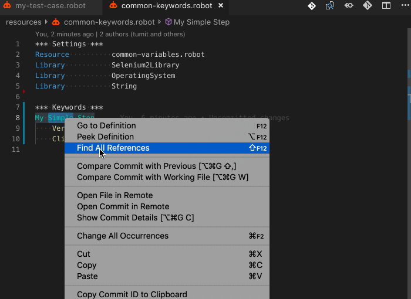
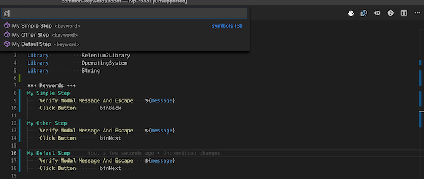
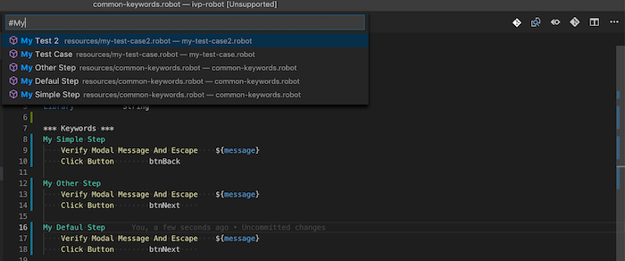
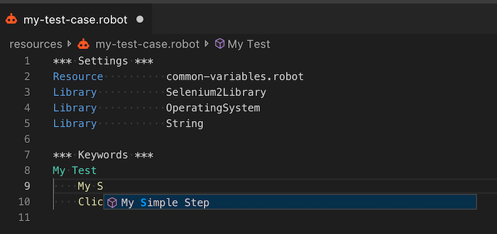
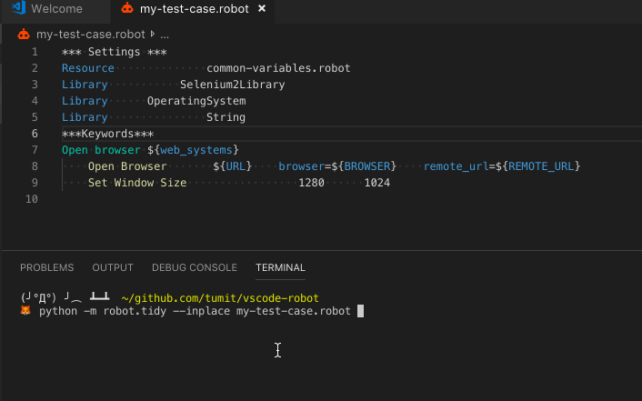

# Robot Framework in Visual Studio Code

Robot Framework is a generic test automation framework for acceptance testing and acceptance test-driven development (ATDD). It has easy-to-use tabular test data syntax and it utilizes the keyword-driven testing approach. Its testing capabilities can be extended by test libraries implemented either with Python or Java, and users can create new higher-level keywords from existing ones using the same syntax that is used for creating test cases.

## Install Robot Framework Extensions
VS Code is a lightweight tool to edit your Robot Framework files. Add Robot Framework support to VS Code by installing [Robot Framework Intellisense](https://marketplace.visualstudio.com/items?itemName=TomiTurtiainen.rf-intellisense) the most popular extension for Robot Framework.



You can search for more Robot Framework extensions easily within VS Code:

1. Go to the **Extensions** view (`kb(workbench.view.extensions)`).
2. Filter the extensions list by typing "robot".

This document describes some of the key features included in those Robot Framework extensions.

## Syntax highlighting
* Supports `.robot` files
* Can be added for `.txt` files using the `files.associations` setting:
```json
"files.associations": {
    "*.txt": "robot"
}
```

## Goto definition
* For user variables and keywords
* `F12` on Mac, Linux and Windows
* `⌘` + Left click



## Find all references
* For user keywords
* `⇧F12` on Mac, `Shift+F12` on Linux and Windows



## List file symbols
* Shows variables, keywords and test cases
* `⇧⌘O` on Mac, `Ctrl+Shift+O` on Linux and Windows



## List workspace symbols
* Shows variables, keywords and test cases
* `⌘T` on Mac, `Ctrl+T` on Linux and Windows



## Highlight All Occurrences of a Symbol in a Document
* Highlights all occurrences of a variable, keyword or setting
* Move the cursor to a variable, keyword or setting

## Show Code Completion Proposals
* Suggests user keywords and variables


## Commenting
* `⌘Space` on Mac, `Ctrl+Space` on Linux and Windows

## Support for python keywords
* Keywords defined in `.py` files are also included
* Requires that the `.py` files are included with `rfLanguageServer.includePaths` setting. E.g.
```json
"rfLanguageServer.includePaths": [
  "**/*.robot",
  "**/*.py"
]
```

## Formating
Tidy is Robot Framework's built-in a tool for cleaning up and changing the format of Robot Framework files.

In the terminal:

```sh
python -m robot.tidy --inplace my-test-case.robot
```



To learn more, see [Test data clean-up tool (Tidy)](https://github.com/robotframework/robotframework/blob/master/doc/userguide/src/SupportingTools/Tidy.rst).


## Next steps
- [Robot Framework User Guide](http://robotframework.org/robotframework/latest/RobotFrameworkUserGuide.html)
- [How to write good test cases using Robot Framework](https://github.com/robotframework/HowToWriteGoodTestCases/blob/master/HowToWriteGoodTestCases.rst)
- [Robot Framework Tutorial](https://blog.codecentric.de/en/2012/03/robot-framework-tutorial-overview/)
