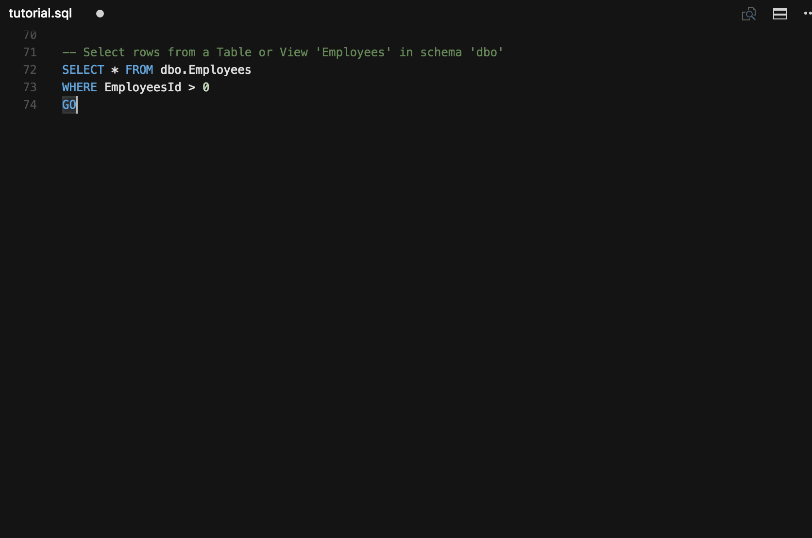
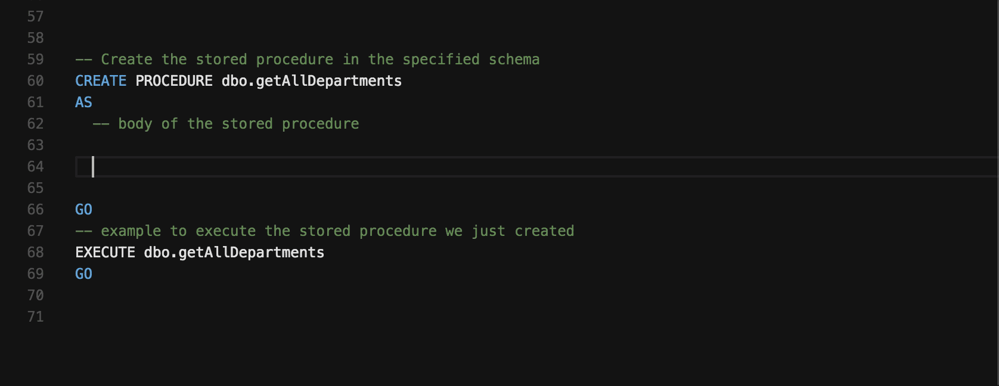

# Transact-SQL programming with VS Code

Turn Visual Studio Code into a powerful editor for [Transact-SQL]  (T-SQL) development with the [mssql] extension available in the VS Code marketplace. The [mssql] extension is optimized to work with SQL Server running on-premises, in any cloud, Azure SQL Database, and Azure SQL Data Warehouse.

Connect to SQL databases, type T-SQL code, execute T-SQL code, view results, and save results as JSON or CSV files. While typing T-SQL code, you get rich T-SQL language features like T-SQL IntelliSense (code completion), syntax highlighting, linting, code navigation and code snippets.

> [Download VS Code] - If you haven't downloaded VS Code yet, quickly install for your platform (Linux, Mac or Windows).

## Install T-SQL support

Add T-SQL language support to VS Code by installing the [mssql] extension from the VS Code marketplace as follows:

1. Open the *Extensions* pane from VS Code side bar.
2. Type *mssql* in the search bar, click *Install*, and reload VS Code when prompted.

    

## Connect and Execute T-SQL

Easily connect to SQL Server running on-premises, in any cloud, Azure SQL Database, and Azure SQL Data Warehouse. Then, execute your T-SQL statements and batches to view results and messages - all within VS Code. Your recent connections are saved across sessions so you can quickly connect to your databases again.

## View and Save Results

View results and messages when you execute your T-SQL code. Save results as a JSON or CSV file to use the data in your applications with just a few clicks.

## T-SQL IntelliSense

As you type T-SQL code in the editor, VS Code provides intelligent code completion for T-SQL keywords, suggestions for schema object names (tables, columns, views), and parameter help for functions and procedures when connected to a database.

## Linting

Linting is the analysis of your T-SQL code for potential syntax errors. Use Visual Studio Code to quickly navigate to the errors and warnings in your T-SQL code as you type.

## Peek Definition/Go to Definition

Use **Peek Definition** and **Go to Definition** to quickly browse the definition of schema objects in your database such as tables, functions, and procedures while typing T-SQL code.

## Snippets

T-SQL snippets provide code templates for commonly used T-SQL statements. Type 'sql' to get the list of T-SQL snippets.

## Next Steps

* Download the free [SQL Server 2016 Developer Edition]
* Install the [mssql] extension from the Visual Studio Code marketplace.
* [Build an app] using SQL Server - Get started with SQL Server on macOS, Linux, and Windows using your favorite programming language.
* Contribute to the *mssql* extension on [GitHub]. Submit a bug report or a feature suggestion on our [GitHub Issue Tracker].

## Further Reading

* [SQL Server documentation]
* [SQL Server on Linux documentation]
* [SQL Server Blog]
* [SQL Server Videos] on Channel9

[Transact-SQL]: https://msdn.microsoft.com/en-us/library/bb510741.aspx
[mssql]: http://aka.ms/mssql-marketplace
[Download VS Code]: https://code.visualstudio.com/download
[SQL Server 2016 Developer Edition]: https://www.microsoft.com/en-us/sql-server/sql-server-downloads
[Build an app]: https://aka.ms/sqldev
[SQL Server documentation]: https://msdn.microsoft.com/en-us/library/mt590198(v=sql.1).aspx
[SQL Server on Linux documentation]: https://docs.microsoft.com/en-us/sql/linux/
[SQL Server Blog]: https://blogs.technet.microsoft.com/dataplatforminsider/
[SQL Server Videos]: https://channel9.msdn.com/Tags/sql+server
[GitHub]: https://github.com/Microsoft/vscode-mssql
[GitHub Issue Tracker]: https://github.com/Microsoft/vscode-mssql/issues
