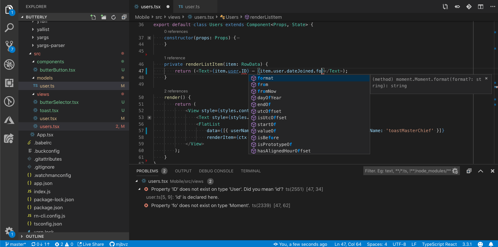
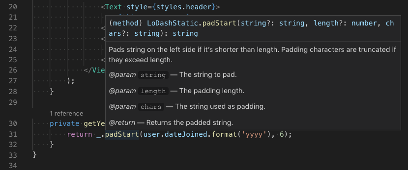
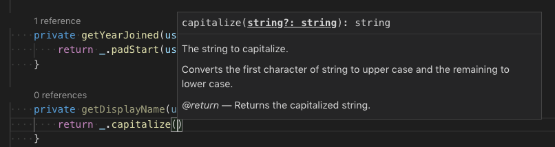
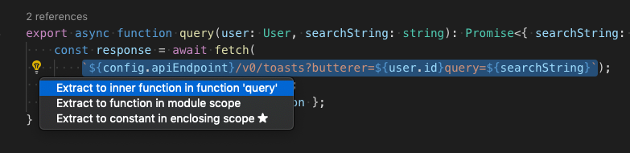
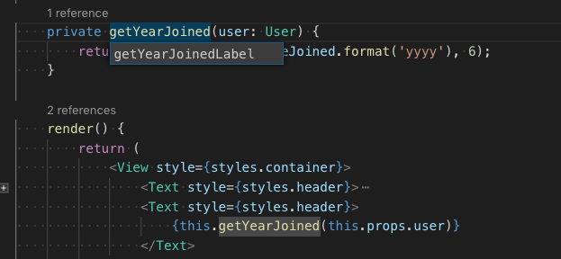

# TypeScript in Visual Studio Code

[TypeScript](https://www.typescriptlang.org) is a typed superset of JavaScript that compiles to plain JavaScript. It offers classes, modules, and interfaces to help you build robust components.



## Installing the TypeScript compiler

Visual Studio Code includes TypeScript language support but does not include the TypeScript compiler, `tsc`. You will need to install the TypeScript compiler either globally or in your workspace to transpile TypeScript source code to JavaScript (`tsc HelloWorld.ts`).

The easiest way to install TypeScript is through npm, the [Node.js Package Manager](https://www.npmjs.com/). If you have npm installed, you can install TypeScript globally (`-g`) on your computer by:

```bash
npm install -g typescript
```

You can test your install by checking the version.

```bash
tsc --version
```

Another option is to install the TypeScript compiler locally in your project (`npm install --save-dev typescript`) and has the benefit of avoiding possible interactions with other TypeScript projects you may have.

## Hello World

Let's start with a simple Hello World Node.js example. Create a new folder `HelloWorld` and launch VS Code.

```bash
mkdir HelloWorld
cd HelloWorld
code .
```

From the File Explorer, create a new file called `helloworld.ts`.


Now add the following TypeScript code. You'll notice the TypeScript keyword `let` and the `string` type declaration.

```typescript
let message : string = "Hello World";
console.log(message);
```

To compile your TypeScript code, you can open the [Integrated Terminal](/docs/terminal/basics.md) (`kb(workbench.action.terminal.toggleTerminal)`) and type `tsc helloworld.ts`. This will compile and create a new `helloworld.js` JavaScript file.


If you have Node.js installed, you can run `node helloworld.js`.


If you open `helloworld.js`, you'll see that it doesn't look very different from `helloworld.ts`. The type information has been removed and `let` is now `var`.

```javascript
var message = "Hello World";
console.log(message);
```

## IntelliSense

IntelliSense shows you intelligent code completion, hover information, and signature help so that you can write code more quickly and correctly.


VS Code provides IntelliSense for individual TypeScript files as well as TypeScript `tsconfig.json` projects.

### Hover information

Hover over a TypeScript symbol to quickly see its type information and relevant documentation:



You can also show the hover information at the current cursor position with the `kb(editor.action.showHover)` keyboard shortcut.

### Signature help

As you write a TypeScript function call, VS Code shows information about the function signature and highlights the parameter that you are currently completing:



Signature help is shown automatically when you type a `(` or `,` within a function call. Use `kb(editor.action.triggerParameterHints)`  to manually trigger signature help.

## Snippets

In addition to smart code completions, VS Code also includes basic TypeScript [snippets](/docs/editor/userdefinedsnippets.md) that are suggested as you type.


You can install extensions to get additional snippets or define your own snippets for TypeScript. See [User Defined Snippets](/docs/editor/userdefinedsnippets.md) for more information.

> **Tip**: You can disable snippets by setting `editor.snippetSuggestions` to `"none"` in your [settings](/docs/getstarted/settings.md) file. If you'd like to see snippets, you can specify the order relative to suggestions; at the top (`"top"`), at the bottom (`"bottom"`), or inlined ordered alphabetically (`"inline"`). The default is `"inline"`.

## Errors and warnings

The TypeScript language service will analyze your program for coding problems and report errors and warnings:

* In the Status bar, there is a summary of all errors and warnings counts.
* You can click on the summary or press `kb(workbench.actions.view.problems)` to display the **PROBLEMS** panel with a list of all current errors.
* If you open a file that has errors or warnings, they will be rendered inline with the text and in the overview ruler.


To loop through errors or warnings in the current file, you can press `kb(editor.action.marker.nextInFiles)` or `kb(editor.action.marker.prevInFiles)` which will show an inline zone detailing the problem and possible Code Actions (if available):


## Code navigation

Code navigation lets you quickly navigate TypeScript projects.

* **Go to Definition** `kb(editor.action.revealDefinition)` - Go to the source code of a symbol definition.
* **Peek Definition** `kb(editor.action.peekDefinition)` - Bring up a Peek window that shows the definition of a symbol.
* **Go to References** `kb(editor.action.goToReferences)` - Show all references to a symbol.
* **Go to Type Definition** - Go to the type that defines a symbol. For an instance of a class, this will reveal the class itself instead of where the instance is defined.
* **Go to Implementation** `kb(editor.action.goToImplementation)` - Go to the implementations of an interface or abstract method.

You can navigate via symbol search using the **Go to Symbol** commands from the **Command Palette** (`kb(workbench.action.showCommands)`).

* **Go to Symbol in File** `kb(workbench.action.gotoSymbol)`
* **Go to Symbol in Workspace** `kb(workbench.action.showAllSymbols)`

## Formatting

VS Code includes a TypeScript formatter that provides basic code formatting with reasonable defaults.

Use the `typescript.format.*` [settings](/docs/getstarted/settings.md) to configure the built-in formatter, such as making braces appear on their own line. Or, if the built-in formatter is getting in the way, set `"typescript.format.enable"` to `false` to disable it.

For more specialized code formatting styles, try installing one of the formatting extensions from the VS Code Marketplace.

## Refactoring

VS Code includes some handy refactorings for TypeScript such as **Extract function** and **Extract constant**. Just select the source code you'd like to extract and then click on the light bulb in the gutter or press (`kb(editor.action.quickFix)`) to see available refactorings.



See [Refactoring TypeScript](/docs/typescript/typescript-refactoring.md) for more information about refactorings and how you can configure keyboard shortcuts for individual refactorings.

### Rename

One of the simplest refactorings is to rename a method or variable. Press `kb(editor.action.rename)` to rename the symbol under the cursor across your TypeScript project:



## Debugging

VS Code comes with great debugging support for TypeScript, including support for sourcemaps. Set breakpoints, inspect objects, navigate the call stack, and execute code in the Debug Console. See [Debugging TypeScript](/docs/typescript/typescript-debugging.md) and the overall [Debugging topic](/docs/editor/debugging.md) to learn more.

### Debug client side

You can debug your client-side code using a browser debugger such as the [built-in Edge and Chrome debugger](/docs/nodejs/browser-debugging.md), or the [Debugger for Firefox](https://marketplace.visualstudio.com/items?itemName=hbenl.vscode-firefox-debug).

### Debug server side

Debug Node.js in VS Code using the built-in debugger. Setup is easy and there is a [Node.js debugging tutorial](/docs/nodejs/nodejs-tutorial.md#debug-your-express-app) to help you.


## Linters

[Linters](https://en.wikipedia.org/wiki/Lint_%28software%29) provides warnings for suspicious looking code. While VS Code does not include a built-in TypeScript linter, TypeScript linter [extensions](/docs/editor/extension-marketplace.md) available in the Marketplace.

[ESLint](https://eslint.org) is a popular linter, which also supports TypeScript. The [ESLint extension](https://marketplace.visualstudio.com/items?itemName=dbaeumer.vscode-eslint) integrates ESLint into VS Code so you can see linting errors right in the editor and even quickly fix many of them with [Quick Fixes](/docs/typescript/typescript-refactoring.md#quick-fixes). The [ESLint plugin guide](https://github.com/typescript-eslint/typescript-eslint/tree/main/packages/eslint-plugin#readme) details how to configure ESLint for your TypeScript projects.

## TypeScript extensions

VS Code provides many features for TypeScript out of the box. In addition to what comes built-in, you can install an extension for greater functionality.

<div class="marketplace-extensions-typescript-curated"></div>

> Tip: Click on an extension tile above to read the description and reviews to decide which extension is best for you. See more in the [Marketplace](https://marketplace.visualstudio.com).

## Next steps

To learn more, see:

* [TypeScript tutorial](/docs/typescript/typescript-tutorial.md) - Create a simple Hello World TypeScript in VS Code.
* [Editing TypeScript](/docs/typescript/typescript-editing.md) - Specific editing features for TypeScript.
* [Refactoring TypeScript](/docs/typescript/typescript-refactoring.md) - Useful refactorings from the TypeScript language service.
* [Compiling TypeScript](/docs/typescript/typescript-compiling.md) - Compile TypeScript to a JavaScript target version.
* [Debugging TypeScript](/docs/typescript/typescript-debugging.md) - Learn about debugging TypeScript both server and client-side with VS Code.

## Common questions

### Can I use the version of TypeScript that ships with VS 2022?

No, the TypeScript language service that ships with Visual Studio 2019 and 2022 isn't compatible with VS Code. You will need to install a separate version of TypeScript from [npm](https://www.npmjs.com/package/typescript).

### How can I use the latest TypeScript beta with VS Code?

The simplest way to try out the latest TypeScript features in VS Code is to install the [JavaScript and TypeScript Nightly extension](https://marketplace.visualstudio.com/items?itemName=ms-vscode.vscode-typescript-next).

You can also [configure VS Code to use a specific TypeScript version](/docs/typescript/typescript-compiling.md#using-newer-typescript-versions).
