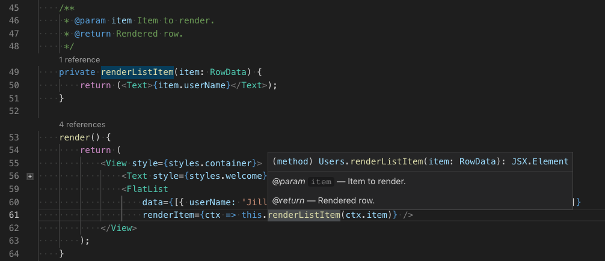
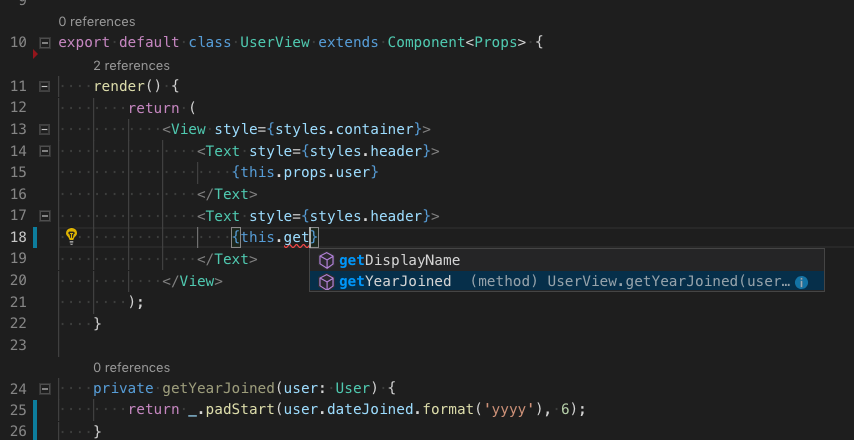
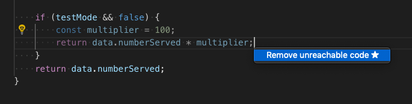
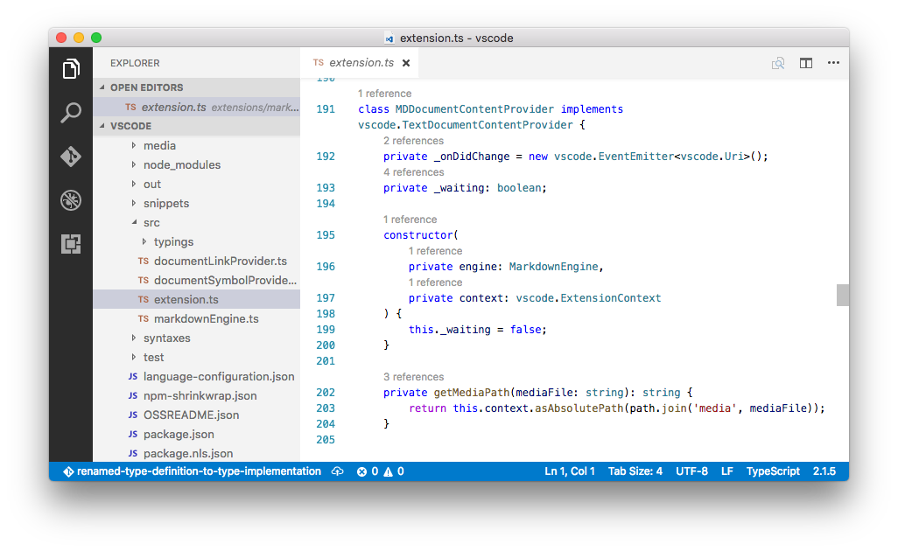

# TypeScript in Visual Studio Code

[TypeScript](https://www.typescriptlang.org) is a typed superset of JavaScript that compiles to plain JavaScript. It offers classes, modules, and interfaces to help you build robust components. The [TypeScript language specification](https://github.com/microsoft/TypeScript/tree/master/doc) has full details about the language.


## Installing the TypeScript compiler

Visual Studio Code includes TypeScript language support but does not include the TypeScript compiler, `tsc`. You will need to install the TypeScript compiler either globally or in your workspace to transpile TypeScript source code to JavaScript (`tsc HelloWorld.ts`).

The easiest way to install TypeScript is through npm, the [Node.js Package Manager](https://www.npmjs.com/). If you have npm installed, you can install TypeScript globally (`-g`) on your computer by:

```bash
npm install -g typescript
```

You can test your install by checking the version.

```bash
tsc --version
```

Another option is to install the TypeScript compiler locally in your project (`npm install --save-dev typescript`) and has the benefit of avoiding possible interactions with other TypeScript projects you may have.

## Syntax highlighting and semantic highlighting

In addition to syntax highlighting, TypeScript and JavaScript also provide semantic highlighting.

Syntax highlighting colors the text based on lexical rules. Semantic highlighting enriches the syntax coloring based on resolved symbol information from the language service.

Whether semantic highlighting is visible depends on the current color theme. Each theme can [configure](/docs/getstarted/themes.md#semantic-highlighting) whether to display semantic highlighting and how it styles the semantic tokens.

If semantic highlighting is enabled and the color theme has a corresponding styling rule defined, different colors and styles can be seen.

Semantic highlighting can change colors based on:

* The resolved type of a symbol: namespace, variable, property, variable, property, class, interface, typeParameter.
* Whether the variable/property is read-only (const) or modifiable.
* Whether the variable/property type is callable (a function type) or not.

## IntelliSense

IntelliSense shows you intelligent code completion, hover info, and signature information so that you can write code more quickly and correctly.

<video src="/docs/languages/typescript/intellisense.mp4" placeholder="images/typescript/intellisense-placeholder.png" autoplay loop controls muted>
    Sorry, your browser doesn't support HTML 5 video.
</video>

VS Code provides IntelliSense for individual TypeScript files as well as TypeScript `tsconfig.json` projects.

## Snippets

VS Code includes basic TypeScript [snippets](/docs/editor/userdefinedsnippets.md) that are suggested as you type;

<video src="/docs/languages/javascript/snippets.mp4" placeholder="images/javascript/snippets-placeholder.png" autoplay loop controls muted>
    Sorry, your browser doesn't support HTML 5 video.
</video>

You can install extensions to get additional snippets or define your own snippets for TypeScript. See [User Defined Snippets](/docs/editor/userdefinedsnippets.md) for more information.

> **Tip**: You can disable snippets by setting `editor.snippetSuggestions` to `"none"` in your [settings](/docs/getstarted/settings.md) file. If you'd like to see snippets, you can specify the order relative to suggestions; at the top (`"top"`), at the bottom (`"bottom"`), or inlined ordered alphabetically (`"inline"`). The default is `"inline"`.

## JSDoc support

VS Code's TypeScript IntelliSense understands many standard [JSDoc](https://jsdoc.app) annotations, and uses them to show typing information and documentation in [suggestions](#intellisense), [hover info](#hover-information), and [signature help](#signature-help).



Keep in mind that when using JSDoc for TypeScript code, you should not include type annotations. The TypeScript compiler only uses TypeScript type annotations and ignores those from JSDoc.

<video src="/docs/languages/typescript/jsdoc-autofill.mp4" placeholder="images/typescript/jsdoc-autofill-placeholder.png" autoplay loop controls muted>
    Sorry, your browser doesn't support HTML 5 video.
</video>

To disable JSDoc comment suggestions in TypeScript, set `"typescript.suggest.completeJSDocs": false`.

## Hover information

Hover over a TypeScript symbol to quickly see its type information and relevant documentation:


You can also show the hover info at the current cursor position with the `kb(editor.action.showHover)` keyboard shortcut.

## Signature help

As you write a TypeScript function call, VS Code shows information about the function signature and highlights the parameter that you are currently completing:


Signature help is shown automatically when you type a `(` or `,` within a function call. Use `kb(editor.action.triggerParameterHints)`  to manually trigger signature help.

## Auto imports

Automatic imports speed up coding by helping you find available symbols and automatically adding imports for them.

Just start typing to see [suggestions](#intellisense) for all available TypeScript symbols in your current project.


If you choose one of the suggestions from another file or module, VS Code will automatically add an import for it. In this example, VS Code adds an import for `Hercules` to the top of the file:


You can disable auto imports by setting `"typescript.autoImportSuggestions.enabled": false`.

## Formatting

VS Code includes a TypeScript formatter that providers basic code formatting with reasonable defaults.

Use the `typescript.format.*` [settings](/docs/getstarted/settings.md) to configure the built-in formatter, such as making braces appear on their own line. Or, if the built-in formatter is getting in the way, set `"typescript.format.enable"` to `false` to disable it.

For more specialized code formatting styles, try installing one of the formatting extensions from the VS Code marketplace.

## JSX and auto closing tags

VS Code's TypeScript features also work with [JSX](https://reactjs.org/docs/introducing-jsx.html). To use JSX in your TypeScript, use the `*.tsx` file extension instead of the normal `*.ts`:



VS Code also includes JSX-specific features such as autoclosing of JSX tags in TypeScript:

<video src="/docs/languages/typescript/jsx-tag-complete.mp4" placeholder="images/typescript/jsx-tag-complete-placeholder.png" autoplay loop controls muted>
    Sorry, your browser doesn't support HTML 5 video.
</video>

Set `"typescript.autoClosingTags"` to `false` to disable JSX tag closing.

## Code navigation

Code navigation lets you quickly navigate TypeScript projects.

* **Go to Definition** `kb(editor.action.revealDefinition)` - Go to the source code of a symbol definition.
* **Peek Definition** `kb(editor.action.peekDefinition)` - Bring up a Peek window that shows the definition of a symbol.
* **Go to References** `kb(editor.action.goToReferences)` - Show all references to a symbol.
* **Go to Type Definition** `kb(editor.action.goToTypeDefinition)` - Go to the type that defines a symbol. For an instance of a class, this will reveal the class itself instead of where the instance is defined.
* **Go to Implementation** `kb(editor.action.goToImplementation)` - Go to the implementations of an interface or abstract method.

You can navigate via symbol search using the **Go to Symbol** commands from the **Command Palette** (`kb(workbench.action.showCommands)`).

* **Go to Symbol in File** `kb(workbench.action.gotoSymbol)`
* **Go to Symbol in Workspace** `kb(workbench.action.showAllSymbols)`

## Rename

Press `kb(editor.action.rename)` to rename the symbol under the cursor across your TypeScript project:


## Refactoring

VS Code includes some handy refactorings for TypeScript such as **Extract function** and **Extract constant**. Just select the source code you'd like to extract and then click on the lightbulb in the gutter or press (`kb(editor.action.quickFix)`) to see available refactorings.


See [Refactorings](/docs/editor/refactoring.md) for more information about refactorings and how you can configure keyboard shortcuts for individual refactorings.

Available TypeScript refactorings include:

* **Extract to method or function** - Extract the selected statements or expressions to either a new method or a new function in the file.

   

   After selecting the **Extract to method** or **Extract to function** refactoring, enter the name of the extracted method/function.

* **Extract to constant** - Extract the selected expression to a new constant in the file.

   

* **Extract type to interface or type alias** - Extract the selected complex type to either an interface or a type alias.

   

* **Move to new file** - Move one or more classes, functions, constants, or interfaces in the top-level scope of the file to a new file. The new file's name is inferred from the selected symbol's name.

   

* **Convert between named imports and namespace imports** - Convert between named imports (`import { Name } from './foo'`) and namespace imports (`import * as foo from './foo'`).

   

* **Convert between default export and named export** - Convert from using a `export default` and having a named export (`export const Foo = ...`).

* **Generate get and set accessors** - Encapsulate a selected class property by generating a getter and setter for it.

   

* **Convert parameters to destructured object** - Rewrite a function that takes a long list of arguments to take a single arguments object.

## Quick Fixes

Quick Fixes are suggested edits that address simple coding errors. Example Quick Fixes include:

* Adding a missing `this` to a member access.
* Fixing a misspelled property name.
* Removing unreachable code or unused imports
* Declaring

When you move your cursor on to a TypeScript error, VS Code shows a lightbulb that indicates that Quick Fixes are available. Click the lightbulb or press `kb(editor.action.quickFix)` to show a list of available Quick Fixes and [refactorings](#refactoring).

## Unused variables and unreachable code

Unused TypeScript code, such as the `else` block of an `if` statement that is always true or an unreferenced import, is faded out in the editor:



You can quickly remove this unused code by placing the cursor on it and triggering the Quick Fix command (`kb(editor.action.quickFix)`) or clicking on the lightbulb.

To disable fading out of unused code, set `"editor.showUnused"` to `false`. You can also disable fading of unused code only in TypeScriptScript by setting:

```json
"[typescript]": {
    "editor.showUnused":  false
},
"[typescriptreact]": {
    "editor.showUnused":  false
},
```

## Organize Imports

The **Organize Imports** source code action sorts the imports in a TypeScript file and removes unused imports:

<video src="/docs/languages/typescript/organize-imports.mp4" placeholder="images/typescript/organize-imports-placeholder.png" autoplay loop controls muted>
    Sorry, your browser doesn't support HTML 5 video.
</video>

You can run **Organize Imports** from the **Source Action** context menu or with the `kb(editor.action.organizeImports)` keyboard shortcut.

Organize imports can also be done automatically when you save a TypeScript file by setting:

```json
"editor.codeActionsOnSave": {
    "source.organizeImports": true
}
```

## Code Actions on Save

The `editor.codeActionsOnSave` setting lets you configure a set of Code Actions that are run when a file is saved. For example, you can enable organize imports on save by setting:

```json
// On save, run both fixAll and organizeImports source actions
"editor.codeActionsOnSave": {
    "source.fixAll": true,
    "source.organizeImports": true,
}
```

You can also set `editor.codeActionsOnSave` to an array of Code Actions to execute in order.

Here are some source actions:

* `"organizeImports"` -  Enables organize imports on save.
* `"fixAll"` - Auto Fix on Save computes all possible fixes in one round (for all providers including ESLint).
* `"fixAll.eslint"` -  Auto Fix only for ESLint.
* `"addMissingImports"` - Adds all missing imports on save.

See [TypeScript](/docs/typescript/typescript-tutorial) for more information.

## Code suggestions

VS Code automatically suggests some common code simplifications such as converting a chain of `.then` calls on a promise to use `async` and `await`

<video src="/docs/languages/typescript/code-suggestions-convert-async.mp4" placeholder="images/typescript/code-suggestions-convert-async-placeholder.png" autoplay loop controls muted>
    Sorry, your browser doesn't support HTML 5 video.
</video>

Set `"typescript.suggestionActions.enabled"` to `false` to disable suggestions.

## References CodeLens

The TypeScript references CodeLens displays an inline count of reference for classes, interfaces, methods, properties, and exported objects:



You can enable this by setting `"typescript.referencesCodeLens.enabled": true` in the User Settings file.

Click on the reference count to quickly browse a list of references:


## Implementations CodeLens

The TypeScript implementations CodeLens displays the number of implementors of an interface:


You can enable this by setting `"typescript.implementationsCodeLens.enabled": true`.

As with the references CodeLens, you can click on the implementation count to quickly browse a list of all implementations.

## Update imports on file move

When you move or rename a file that is imported by other files in your TypeScript project, VS Code can automatically update all import paths that reference the moved file.

The `typescript.updateImportsOnFileMove.enabled` setting controls this behavior. Valid settings values are:

* `"prompt"` - The default. Asks if paths should be updated for each file move.
* `"always"` - Always automatically update paths.
* `"never"` - Do not update paths automatically and do not prompt.

## Debugging

VS Code comes with great debugging support for TypeScript, including support for sourcemaps. Set breakpoints, inspect objects, navigate the call stack, and execute code in the Debug Console. See the [Debugging topic](/docs/editor/debugging.md) to learn more.

### Debug client side

You can debug your client-side code using a browser debugger such as [Debugger for Chrome](https://marketplace.visualstudio.com/items?itemName=msjsdiag.debugger-for-chrome), [Debugger for Edge](https://marketplace.visualstudio.com/items?itemName=msjsdiag.debugger-for-edge) or [Debugger for Firefox](https://marketplace.visualstudio.com/items?itemName=hbenl.vscode-firefox-debug).

### Debug server side

Debug Node.js in VS Code using the built-in debugger. Setup is easy and there is a [Node.js debugging tutorial](/docs/nodejs/nodejs-tutorial.md#debugging-your-express-application) to help you.


## Linters

[Linters](https://en.wikipedia.org/wiki/Lint_%28software%29) provides warnings for suspicious looking code. While VS Code does not include a built-in TypeScript linter, TypeScript linter [extensions](/docs/editor/extension-marketplace.md) available in the marketplace.

[ESLint](https://eslint.org) is a popular linter, which also supports TypeScript. The [ESLint extension](https://marketplace.visualstudio.com/items?itemName=dbaeumer.vscode-eslint) integrates ESLint into VS Code so you can see linting errors right in the editor and even quickly many of fix them with [Quick Fixes](#quick-fixes). [The ESLint plugin guide](https://github.com/typescript-eslint/typescript-eslint/blob/master/packages/eslint-plugin/README.md) details how to configure ESLint for your TypeScript projects.

## TypeScript extensions

VS Code provides many features for TypeScript out of the box. In addition to what comes built-in, you can install an extension for greater functionality.

<div class="marketplace-extensions-typescript-curated"></div>

> Tip: Click on an extension tile above to read the description and reviews to decide which extension is best for you. See more in the [Marketplace](https://marketplace.visualstudio.com).

## Next steps

To learn more, see:

* [TypeScript tutorial](/docs/typescript/typescript-tutorial.md) - Create a simple Hello World TypeScript in VS Code.
* [Compiling TypeScript](/docs/typescript/typescript-compiling.md) - Compile TypeScript to a JavaScript target version.
* [Debugging TypeScript](/docs/typescript/typescript-debugging.md) - Learn about debugging TypeScript both server and client-side with VS Code.

## Common questions

### Can I use the version of TypeScript that ships with VS 2015?

No, the TypeScript language service that ships with Visual Studio 2015 and 2017 isn't compatible with VS Code. You will need to install a separate version of TypeScript from [npm](https://www.npmjs.com/package/typescript).

### How can I use the latest TypeScript beta with VS Code?

The simplest way to try out the latest TypeScript features in VS Code is to install the [JavaScript and TypeScript Nightly extension](https://marketplace.visualstudio.com/items?itemName=ms-vscode.vscode-typescript-next).

You can also [configure VS Code to use a specific TypeScript version](/docs/typescript/typescript-compiling.md#using-newer-typescript-versions).