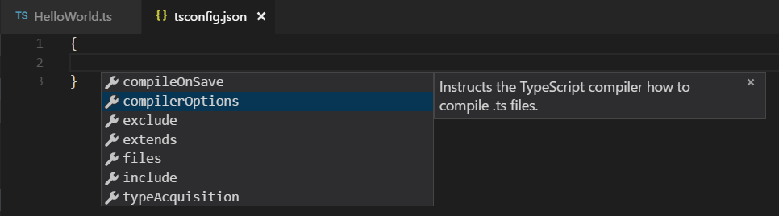
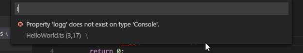
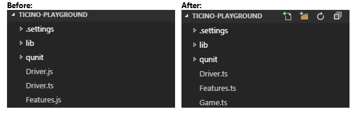

# Editing TypeScript

TypeScript is a typed superset of JavaScript that compiles to plain JavaScript.
It offers classes, modules, and interfaces to help you build robust components. A language specification can be found [here](https://github.com/Microsoft/TypeScript/tree/master/doc).

VS Code's TypeScript support can operate in two different modes:

* **File Scope**: in this mode TypeScript files opened in Visual Studio Code are treated as independent units. As long as a file `a.ts` doesn't reference a file `b.ts` explicitly (either using /// references or external modules) there is no common project context between the two files.

* **Explicit Project**: a TypeScript project is defined via a `tsconfig.json` file. The presence of such a file in a directory indicates that the directory is the root of a TypeScript project. The file itself lists the files belonging to the project as well as compiler options. Details about the `tsconfig.json` file can be found [here](https://github.com/Microsoft/TypeScript/wiki/tsconfig.json).

>**Tip:** We recommend that you use explicit projects over file scope projects. Since explicit projects list the files belonging to a project language, features like `Find All References` `kb(editor.action.referenceSearch.trigger)` consider the project scope and not the file scope only.

## tsconfig.json
Typically the first step in any new TypeScript project is to add in a `tsconfig.json` file.  This defines the TypeScript project settings such as the compiler options and the files that should be includes.  To do this open up the folder where you want to store your source and add in a new file named `tsconfig.json`.  Once in this file IntelliSense will help you along the way.



A simple `tsconfig.json` looks like this for ES5, AMD modules and source maps:

```json
{
	"compilerOptions": {
		"target": "ES5",
		"module": "amd",
		"sourceMap": true
	}
}
```

Now when you create a `.ts` file as part of the project we will offer up rich editing experiences and syntax validation.


## Transpiling TypeScript into JavaScript
VS Code integrates with `tsc` through our integrated [task runner](/docs/editor/tasks).  We can use this to transpile `.ts` files into `.js` files.  Lets walk through transpiling a simple TypeScript Hello World program.


### Step 1: Create a simple TS file
Open VS Code on an empty folder and create a `HelloWorld.ts` file, place the following code in that file...

``` typescript
class Startup {
    public static main(): number {
        console.log('Hello World');
        return 0;
    }
}
```

### Step 2: Create tasks.json
The next step is to set up the task configuration.  To do this open the Command Palette with `kb(workbench.action.showCommands)` and type in `Configure Task Runner`, press `kbstyle(Enter)` to select it.

This will create a sample `tasks.json` file in the `.vscode` folder.  The initial file has a large number of examples within it.

> **Tip:** While the sample is there to help with common configuration settings, IntelliSense is available for the `tasks.json` file as well to help you along.  Use `kb(editor.action.triggerSuggest)` to see the available settings.

The first TypeScript example uses `tsc` (the TypeScript compiler) as the command to be executed.  The task we are working with looks something like this:

```json
{
	"version": "0.1.0",
	"command": "tsc",
	"isShellCommand": true,
	"showOutput": "silent",
	"args": ["HelloWorld.ts"],
	"problemMatcher": "$tsc"
}
```

Under the covers we interpret `tsc` as an external task runner exposing exactly one task: the compiling of TypeScript files into JavaScript files. The command we run is `tsc HelloWorld.ts`.

>**Tip:** If you don't have the TypeScript compiler installed, you can [get it here](http://www.typescriptlang.org/).


### Step 3: Run the Build Task
As this is the only task in the file you can execute it by simply pressing `kb(workbench.action.tasks.build)` (run Build Task).  At this point you will see an additional file show up in the file list `HelloWorld.js`.

The example TypeScript file did not have any compile problems, so by running the task all that happened was a corresponding `HelloWorld.js` file was created.


### Step 4: Reviewing Build Issues
Unfortunately, most builds don't go that smoothly and the result is often some additional information.  For instance, if there was a simple error in our TypeScript file we may get the following output form `tsc`:

    HelloWorld.ts(3,17): error TS2339: Property 'logg' does not exist on type 'Console'.

This would show up in the output window (which can be opened using
`kb(workbench.action.output.showOutput)`) and selecting Tasks in the output view dropdown.  We parse this output for you and highlight detected problems in the status bar.


You can click on that icon to get a list of the problems and navigate to them.



You can also use the keyboard to open the list `kb(workbench.action.showErrorsWarnings)`.

>**Tip:** Tasks offer rich support for many actions. Check the [Tasks](/docs/editor/tasks) section for more information on how to configure them.


## Goto Symbol & Show All Symbols
`kb(workbench.action.gotoSymbol)`: lists all defined symbols of the current open TypeScript and lets you navigate in it.

`kb(workbench.action.showAllSymbols)`: let's you search all symbols defined in the current project or file scope. You need to have a TypeScript file open in the active editor.


## Format Code
`kb(editor.action.format)`: formats the currently selected code, or the whole document if no code is selected.


## JSDoc Support
VS Code offers JSDoc support for TypeScript. Besides syntax coloring, we help you enter JSDoc comments. Simply type `/**` and it will auto insert the closing `*/`. Pressing `Enter` inside a JSDoc block will indent the next line and auto insert a `*`.


## JavaScript Sourcemap Support
TypeScript debugging supports JavaScript source maps. Enable this by setting the `sourceMaps` attribute to `true` in the project's launch configuration file `launch.json`. In addition, you can specify a TypeScript file with the `program` attribute.

To generate source maps for your TypeScript files, compile with the `--sourcemap` option.

In-lined source maps (a source map where the content is stored as a data URL instead of a separate file) are also supported, although in-lined source is not yet supported.


## Setting a different outDir for generated files
If generated (transpiled) JavaScript files do not live next to their source, you can help the VS Code debugger locate them by specifying the outDir directory in the launch configuration. Whenever you set a breakpoint in the original source, VS Code tries to find the generated source, and the associated source map, in the outDir directory.


## Hiding Derived JavaScript Files
When you are working with TypeScript you often don’t want to see the files in the explorer or include them in search results. VS Code offers filtering capabilities to help, you can easily set an expression to hide those derived files:

`"**/*.js": { "when": "$(basename).ts"}`

This pattern will match on any JavaScript file (`**/*.js`) but only if a sibling TypeScript file with the same name is present. The result being that the file explorer will no longer show derived resources for JavaScript if they are compiled to the same location. All you have to do is configure this in the `files.exclude` setting.




## Next Steps
OK, read on to find out about:

* [JavaScript](javascript) - we have several JavaScript specific features in VS Code
* [Tasks](/docs/editor/tasks) - we used tasks to transpile your TS file. Read more to find out what else tasks can do
* [Editing Evolved](/docs/editor/editingevolved) - dig into multi-cursor, snippets and more
* [Debugging](/docs/editor/debugging) - we support debugging TypeScript Node.js apps

## Common Questions

**Q: How do I resolve a TypeScript "Cannot compile external module" error?**

**A**: If you get that error, resolve it by creating a `tsconfig.json` file in the root folder of your project. The tsconfig.json file lets you control how Visual Studio Code compiles your TypeScript code. For more information, see the [typescript.json overview](https://github.com/Microsoft/TypeScript/wiki/tsconfig.json).

Due to a current limitation, you must restart VS Code after adding the `tsconfig.json` file.
