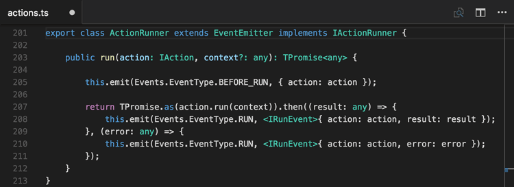

# TypeScript in Visual Studio Code

[TypeScript](https://www.typescriptlang.org) is a typed superset of JavaScript that compiles to plain JavaScript. It offers classes, modules, and interfaces to help you build robust components. The TypeScript language specification can be found [here](https://github.com/Microsoft/TypeScript/tree/master/doc).



## Installing the TypeScript compiler

Visual Studio Code includes TypeScript language support but does not include the TypeScript compiler, `tsc`. You will need to install the TypeScript compiler either globally or in your workspace to transpile TypeScript source code to JavaScript (`tsc HelloWorld.ts`).

The easiest way to install TypeScript is through npm, the [Node.js Package Manager](https://www.npmjs.com/). If you have npm installed, you can install TypeScript globally (`-g`) on your computer by:

```bash
npm install -g typescript
```

You can test your install by checking the version.

```bash
tsc --version
```

Another option is to install the TypeScript compiler locally in your project (`npm install --save-dev typescript`) and has the benefit of avoiding possible interactions with other TypeScript projects you may have.

## IntelliSense

<!-- TODO mjbvz -->

## JSDoc support

<!-- TODO mjbvz -->

Keep in mind that when using JS Docs with TypeScript code, you should not include type annotations. The TypeScript compiler only uses TypeScript type annotations and ignores those from JS Docs.

## Hover information

Hover over a TypescriptScript symbol to quickly see its type information and relevant documentation:


You can also shows quick info at the current cursor position with the `kb(editor.action.showHover)` keyboard shortcut.

## Signature help

As you write a TypeScript function call, VS Code shows information about the function signature and highlights the parameter that you are currently completing:


Signature help is shown automatically when you type a `(` or `,` within a function call. Use `kb(editor.action.triggerParameterHints)`  to manually trigger signature help.

## Auto imports

Automatic imports speed up coding by helping you find available symbols and automatically adding imports for them.

Just start typing to see [suggestions](#intellisense) for all available TypeScript symbols in your current project.


If you choose one of the suggestion from another file or module, VS Code will automatically add an import for it. In this example, VS Code adds an import for `Hercules` to the top of the file:


Auto imports requires TypeScript 2.6+ and are enabled by default. You can disable auto imports by setting `"typescript.autoImportSuggestions.enabled": false`.

## Formating

VS Code includes a TypeScript formatter that providers basic code formatting with reasonable defaults.

Use the `typescript.format.*` [settings](/docs/getstarted/settings.md) to configure the built-in formatter, such as making braces appear on their own line. Or, if the built-in formatter is getting in the way, set `"typescript.format.enable"` to `false` to disable it.

For more specialized code formatting styles, try installing one of the formatting extensions from the VS Code marketplace.

## JSX and auto closing tags

VS Code's TypeScript features also work with [JSX](https://reactjs.org/docs/introducing-jsx.html). To use JSX in your TypeScript, use the `*.tsx` file extension instead of the normal `*.ts`:


VS Code also includes JSX-specific features such as autoclosing of JSX tags in TypeScript:


Set `"typescript.autoClosingTags"` to `false` to disable JSX tag closing.

## Code navigation

Code navigation lets you quickly navigate TypeScript projects.

- **Go To Definition** `kb(editor.action.revealDefinition)` - Go to the source code of a symbol definition.
- **Peek Definition** `kb(editor.action.peekDefinition)` - Bring up a Peek window that shows the definition of a symbol.
- **Peek References** `kb(editor.action.referenceSearch.trigger)` - Show all references to a symbol.
- **Go to Type Definition** `kb(editor.action.goToTypeDefinition)` - Go to the type that defines a symbol. For an instance of a class, this will reveal the class itself instead of where the instance is defined.
- **Go to Implementation** `kb(editor.action.goToImplementation)` - Go to the implementations of an interface or abstract method.

You can navigate via symbol search using the **Go to Symbol** commands from the **Command Palette** (`kb(workbench.action.showCommands)`).

- **Go to Symbol in File** `kb(workbench.action.gotoSymbol)`
- **Go to Symbol in Workspace** `kb(workbench.action.showAllSymbols)`

## Rename

<!-- TODO mjbvz -->

## Refactoring

<!-- TODO mjbvz -->

## Quick fixes

<!-- TODO mjbvz -->

## Unused variables and unreachable code

<!-- TODO mjbvz -->

## Organize Imports

<!-- TODO mjbvz -->

## Code suggestions

<!-- TODO mjbvz -->

## Update imports on file move

<!-- TODO mjbvz -->

## References CodeLens

The TypeScript references CodeLens displays an inline count of reference for classes, interfaces, methods, properties, and exported objects:


You can enable this by setting `"typescript.referencesCodeLens.enabled": true` in the User Settings file.

Click on the reference count to quickly browse a list of references:


## Implementations CodeLens

The TypeScript implementations CodeLens displays the number of implementors of an interface:


You can enable this by setting `"typescript.implementationsCodeLens.enabled": true`.

As with the references CodeLens, you can click on the implementation count to quickly browse a list of all implementations.

## Debugging

<!-- TODO mjbvz -->

## Linters

[Linters](https://en.wikipedia.org/wiki/Lint_%28software%29) provides warnings for suspicious looking code. While VS Code does not include a built-in TypeScript linter, TypeScript linter [extensions](/docs/editor/extension-gallery.md) available in the marketplace.

[TS Lint](https://github.com/palantir/tslint) is a popular TypeScript linter. The [TS Lint extension](https://marketplace.visualstudio.com/items?itemName=ms-vscode.vscode-typescript-tslint-plugin) integrates TS Lint into VS Code so you can see linting errors right in the editor and even quickly many of fix them with [quick fixes](#quick-fixes).

## TypeScript extensions

VS Code provides many features for TypeScript out of the box. In addition to what comes built-in, you can install an extension for greater functionality.

<div class="marketplace-extensions-typescript-curated"></div>

> Tip: Click on an extension tile above to read the description and reviews to decide which extension is best for you. See more in the [Marketplace](https://marketplace.visualstudio.com).

## Next steps

Read on to find out about:

* [JavaScript](/docs/languages/javascript.md) - we have several JavaScript specific features in VS Code

## Common questions

### Can I use the version of TypeScript that ships with VS 2015?

No, the TypeScript language service which ships with Visual Studio 2015 and 2017 isn't compatible with VS Code. You will need to install a separate version of TypeScript from [npm](https://www.npmjs.com/package/typescript).
