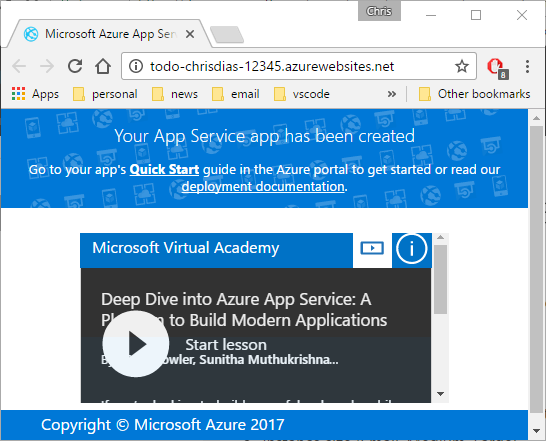
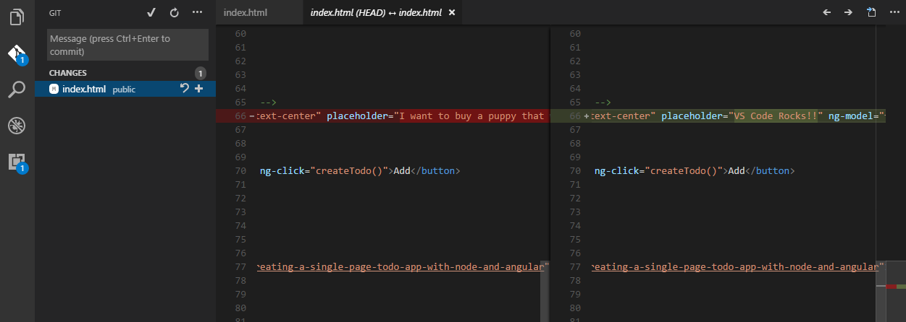
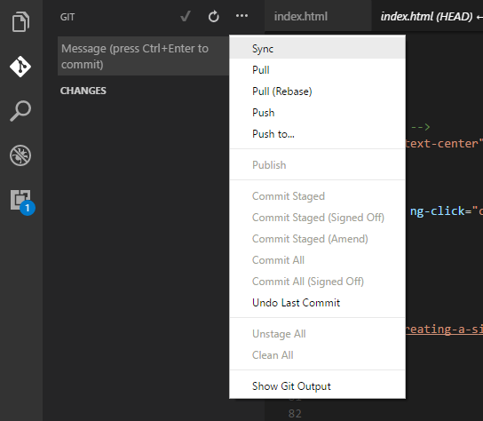
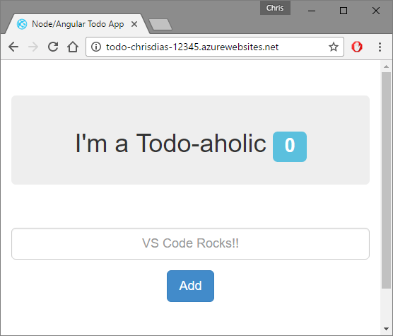

# Deploying your Node.js Application

There are many ways and many places to deploy your Node.js applications, from local servers to cloud hosted VMs to "Platform as a Service" solutions such as Heroku or [Azure App Service](https://azure.microsoft.com/en-us/services/app-service/). In this walkthrough, you will learn how to deploy a Node.js web app to Azure, using Azure App Service to host the site. While it is possible to deploy directly to an Azure App Service site, we will set up a continuous deployment pipeline through a public Github repository, which lets you use version control to roll back changes, configure different branches to deploy to different development "slots" (e.g. development or test), and more. 

We will use Azure DocumentDB to host the application's NoSQL MongoDB database. DocumentDB is a fast and flexible NoSQL database service for all applications that need consistent, globally distributed, single-digit millisecond latency at any scale. It is a fully managed cloud database, it supports both document and key-value store models, and best of all it can be configured to have a fully compatible MongoDB API, meaning you don't need to change your code to take advantage of the service's capabilities.

## What You'll Need

**An Azure Account:** You will need an Azure account to provision resources to host your website and database. If you don't have an Azure subscription, [sign up today](https://azure.microsoft.com/en-us/free/). It is **free** for 30 days and comes with **$200** in Azure Credits to try out any combination of Azure services.

**A GitHub Account:** We will set up a continuous deployment "pipeline" from a Github repository to the Azure App Service site, which is a preferred practice rather than deploying directly to the site. We'll assume a public repository for simplicity, but you can use a private repository too. You'll simply need to provide an access token so the service can pull the source code whenever you push changes.

-------------------------------------

## Prerequisites

### **Code** 

In this walkthrough we'll use a simple ["ToDo" application](https://github.com/chrisdias/node-todo.git) to demonstrate the basic workflow. Simply fork the repository into your own Github account:


### **Azure CLI**

We will use the new Azure Command Line Interface (CLI) to create the Website, the database, and to set up a continuous deployment pipeline. If you already have the CLI installed, we recommend updating to the latest version:

``` bash
az component update
```

Otherwise, [install the Azure CLI](https://docs.microsoft.com/en-us/cli/azure/install-azure-cli), open your favorite terminal, and then log into your Azure account (we will use the `bash` shell on MacOS for this walkthrough).

* Login, copy the 9 character code, and browse to https://aka.ms/devicelogin to complete the login process.

``` bash
az login
```

> Note: If you have multiple Azure subscriptions, please note that the Azure CLI works on the concept of a default or active subscription. You can list all of the subscriptions you have access to and set which is the default for the subsequent commands.

``` bash
az account list -o table
az account set --subscripition [Name or ID of subscripition]
``` 

---

## Create the Website in Azure App Service

With the prerequisites out of the way, now we will create a site in Azure App Service to host our app. Once we have that, we'll configure the site to pull and deploy from the Git repository every time we push changes. 

* Create an [Azure Resource Group](https://docs.microsoft.com/en-us/azure/azure-resource-manager/resource-group-overview#resource-groups) which is essentially a named container for all of your application's resources. `-l` indicates the Azure Data Center location where the Resource Group will be created.

``` bash
az group create -n todoResourceGroup -l westus
```
* Create an [Azure App Service Plan](https://docs.microsoft.com/en-us/azure/app-service/azure-web-sites-web-hosting-plans-in-depth-overview) which is essentially the machine on which your application will be hosted. In this walkthrough, we will use a FREE plan which will host your app on a machine with other websites.

``` bash
az appservice plan create -n todoAppPlan -g todoResourceGroup -l westus --sku FREE
```

* Now create the website on the machine (the plan) and give it a **unique name** as it will be referenced as `http://`**`unique-name`**`.azurewebsites.net`. In this example, we are creating a website named `todo-chrisdias-12345.azurewebsites.net`.

``` bash
az appservice web create -n todo-chrisdias-12345 -g todoResourceGroup -p todoAppPlan
```

* Test that our site is up and running. It will be a temporary site as we have not deployed any code here yet.

``` bash
az appservice web browse -n todo-chrisdias-12345 -g todoResourceGroup
``` 



* Last, configure the site for continuous deployment through your GitHub repository. Remember to **change the URL** to point to the Github repository where you forked the repository!

``` bash
az appservice web source-control config --repo-url https://github.com/**yourgithubaccount**/node-todo -n todo-chrisdias-12345 -g todoResourceGroup
```


> Note if you use a private repository, you need to use the `--git-token` argument to pass the Git access token.

Refresh the site and you should see your Express application hosted in the cloud on Azure! 


## Create the NoSQL Database using Azure DocumentDB

Notice when you ran the application you have a spinning circle of dots in the middle of the page. This is becasue the application is trying to connnect to a MongoDB database, but we don't have one yet. Let's do that next.

* Create the DocumentDB account. You will need to specify a **unique name** for the database account as it will be referenced as `https://`**`todo-unique-database-name`**`.documents.azure.com:443`.

``` bash
az documentdb create -n todo-unique-database-name --kind MongoDB -g todoResourceGroup
``` 

### MongoDB Connection String

With the database created, we now need a connection string to the database. To get the password, run the following command which uses a [JMESPath](http://jmespath.org/tutorial.html) query to retrieve just the `connectionString` which is the read-write password to the database:

``` bash
az documentdb list-connection-strings -n todo-chrisdias-documentdb -g todoResourceGroup --query "[connectionStrings[].connectionString]"
```

Last, let's pass the connection string into the application through the `MONGO_URL` environment variable:

``` bash
az appservice web config appsettings update -n todo-chrisdias-12345 -g todoResourceGroup --settings MONGO_URL=**the really long MongoDB connection string**
```

Refresh the page and now the application is connect to the database, waiting for new ToDo items to be entered!


---

## Continuous Deployment  

To test continuous deployment we will clone the repository locally, make some changes, and push those changes back to Github. When Azure App Service sees a commit to the repository it will automatically redeploy the site with those changes.

* If you have not done so already, clone your forked version of the application: 

``` bash
git clone https://github.com/**youraccountname**/node-todo.git
cd node-todo
code .
``` 

* Make a readily visible edit to `public/js/index.html` and commit the change locally.



* Use the overflow menu to **Sync** the change with the GitHub repository. 



* After a minute or so, the site will recognize a change has been pushed and the content will automatically be redeployed. 

 

## Clean Up

Now that you've learned how to create and deploy a Website backed by a NoSQL database to Azure, you may want to clean up all the resources you created. Remember that Resource Group we created in step 1? We can simply delete the group and all of the artifacts we've created - the database, the service plan, the resource group, and the site will all be deleted with one single command.

This is a pretty powerful so be careful, the `--yes` argument tells the CLI to not prompt for confirmation!

``` bash
az group delete -n todoResourceGroup --no-wait --yes
```
