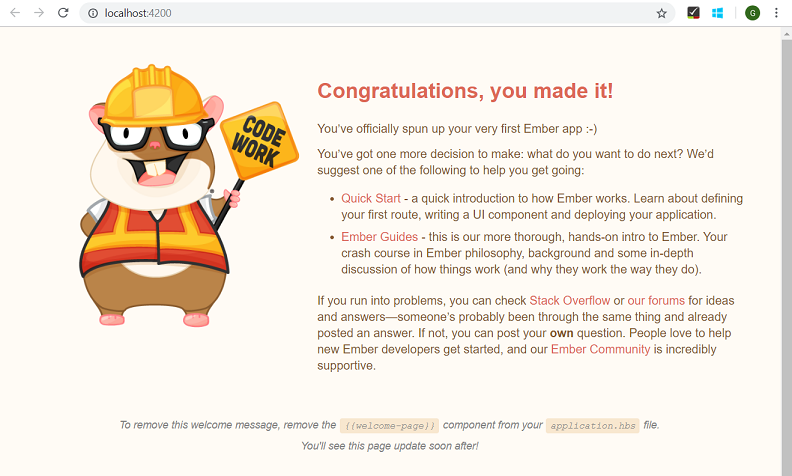
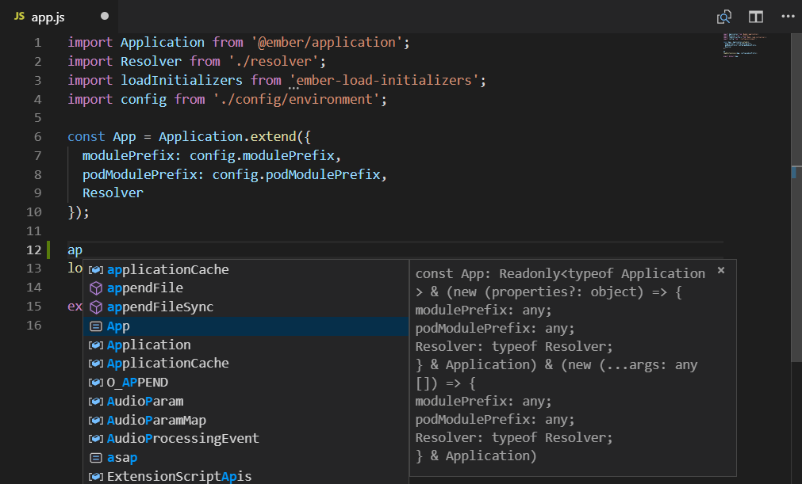
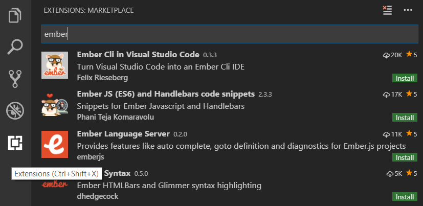

# Using Ember in Visual Studio Code

[Ember](https://emberjs.com/) is a popular JavaScript framework for building web application user interfaces. The Visual Studio Code editor supports Ember.js IntelliSense and code navigation out of the box.


## Welcome to Ember

We'll be using the [Ember CLI](https://ember-cli.com/) for this tutorial. To install and use the command line interface as well as run the Ember.js application server, you'll need the [Node.js](https://nodejs.org/) JavaScript runtime and [npm](https://www.npmjs.com/) (the Node.js package manager) installed. npm is included with Node.js which you can install from [Node.js downloads](https://nodejs.org/en/download/).

>**Tip**: To test that you have Node.js and npm correctly installed on your machine, you can type `node --version` and `npm --version`.

To install Ember CLI, in a terminal or command prompt type:

```bash
npm install -g ember-cli
```

This may take a few minutes to install. You can now create a new Ember.js application by typing:

```bash
ember new my-app
```

`my-app` is the name of the folder for your application. This may take a few minutes to create the Ember application in [JavaScript](/docs/languages/javascript.md) and install its dependencies.

Let's quickly run our Ember application by navigating to the new folder and typing `ember serve` to start the web server and open the application in a browser:

```bash
cd my-app
ember serve
```

Once you see the **Build successful** message, you can open your browser to [http://localhost:4200](http://localhost:4200) and you  should see "Congratulations, you made it!". You can press `kbstyle(Ctrl+C)` to stop the Ember server.



To open your Ember application in VS Code, open another terminal (or command prompt) and navigate to the `my-app` folder and type `code .`:

```bash
cd my-app
code .
```

### Syntax highlighting and bracket matching

Now expand the `app` folder and select the `app.js` file. You'll notice that VS Code has syntax highlighting for the various source code elements and, if you put the cursor on a parentheses, the matching bracket is also selected.


## IntelliSense

As you start typing in `app.js`, you'll see smart suggestions or completions.



After you select a suggestion and type `.`, you see the types and methods on the object through [IntelliSense](/docs/editor/intellisense.md).


VS Code uses the TypeScript language service for its JavaScript code intelligence and it has a feature called [Automatic Type Acquisition](/docs/nodejs/working-with-javascript.md#typings-and-automatic-type-acquisition) (ATA). ATA pulls down the npm Type Declaration files (`*.d.ts`) for the npm modules referenced in the `package.json`.

If you select a method, you'll also get parameter help:


### Go to Definition, Peek definition

Through the TypeScript language service, VS Code can also provide type definition information in the editor through **Go to Definition** (`kb(editor.action.revealDefinition)`) or **Peek Definition** (`kb(editor.action.peekDefinition)`). Put the cursor over `Application`, right click and select **Peek Definition**. A [Peek window](/docs/editor/editingevolved.md#peek) will open showing the `Application` definition from `ember_application` Type Declaration file.


Press `kbstyle(Escape)` to close the Peek window.

## Extensions

The VS Code Marketplace has many community created extensions for Ember.js development which add features like code snippets and advanced code suggestions. You can search in the Extensions view (`kb(workbench.view.extensions)`) by typing 'ember'.



## Common questions

### Can I debug Ember client side code with VS Code?

You can use the [Debugger for Chrome](https://marketplace.visualstudio.com/items?itemName=msjsdiag.debugger-for-chrome) extension for client side debugging. Unfortunately it is difficult to get the configuration correct due to the sourcemaps created by the Ember CLI default transpiler. See [issue #193](https://github.com/microsoft/vscode-chrome-debug/issues/193) for an explanation and partial workaround.