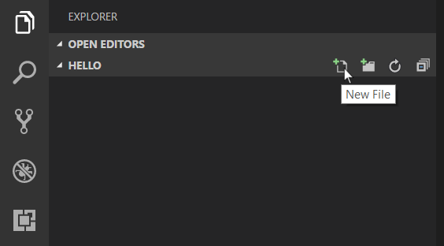

# Node.js Tutorial in VS Code

[Node.js](https://nodejs.org/) is a platform for building fast and scalable server applications using JavaScript. Node.js is the runtime and [NPM](https://www.npmjs.com/) is the Package Manager for Node.js modules.

Visual Studio Code has support for the JavaScript and TypeScript languages out-of-the-box as well as Node.js debugging. However, to run a Node.js application, you will need to install the Node.js runtime on your machine.

To get started in this walkthrough, [install Node.js for your platform](https://nodejs.org/en/download/). The Node Package Manager is included in the Node.js distribution. You'll need to open a new terminal (command prompt) for the `node` and `npm` command line tools to be on your PATH.

>**Linux**: There are specific Node.js packages available for the various flavors of Linux. See [Installing Node.js via package manager](https://nodejs.org/en/download/package-manager) to find the Node.js package and installation instructions tailored to your version of Linux.

>**Tip:** To test that you've got Node.js correctly installed on your computer, open a new terminal and type `node --help` and you should see the usage documentation.

## Hello World

Let's get started by creating the simplest Node.js application, "Hello World".

Create an empty folder called "hello", navigate into and open VS Code:

```bash
mkdir hello
cd hello
code .
```

>**Tip:** You can open files or folders directly from the command line.  The period '.' refers to the current folder, therefore VS Code will start and open the `Hello` folder.

From the File Explorer tool bar, press the New File button:



and name the file `app.js`:


By using the `.js` file extension, VS Code interprets this file as JavaScript and will evaluate the contents with the JavaScript language service.

Create a simple string variable in `app.js` and send the contents of the string to the console:

```javascript
var msg = 'Hello World';
console.log(msg);
```

Note that when you typed `console.` [IntelliSense](/docs/editor/intellisense.md) on the `console` object was automatically presented to you. When editing JavaScript files, VS Code will automatically provide you with IntelliSense for the DOM.


Also notice that VS Code knows that `msg` is a string based on the initialization to `'Hello World'`.  If you type `msg.` you'll see IntelliSense showing all of the string functions available on `msg`.


After experimenting with IntelliSense, revert any extra changes from the source code example above and save the file (`kb(workbench.action.files.save)`).

### Running Hello World

It's simple to run `app.js` with Node.js. From a terminal, just type:

```bash
node app.js
```

You should see "Hello World" output to the terminal and then Node.js returns.

### Integrated Terminal

VS Code has an [integrated terminal](/docs/editor/integrated-terminal.md) which you can use to run shell commands. You can run Node.js directly from there and avoid switching out of VS Code while running command line tools.

**View** > **Integrated Terminal** (`kb(workbench.action.terminal.toggleTerminal)` with the backtick character) will open the integrated terminal and you can run `node app.js` there:


For this walkthrough, you can use either an external terminal or the VS Code integrated terminal for running the command line tools.

### Debugging Hello World

As mentioned in the introduction, VS Code ships with a debugger for Node.js applications. Let's try debugging our simple Hello World application.

To set a breakpoint in `app.js`, put the editor cursor on the first line and press `kb(editor.debug.action.toggleBreakpoint)` or click in the editor left gutter next to the line numbers. A red circle will appear in the gutter.


To start debugging, select the Debug View in the Activity Bar:


You can now click Debug tool bar green arrow or press `kb(workbench.action.debug.start)` to launch and debug "Hello World". Your breakpoint will be hit and you can view and step through the simple application.  Notice that VS Code displays an orange Status Bar to indicate it is in Debug mode and the DEBUG CONSOLE is displayed.


Now that you've seen VS Code in action with "Hello World", the next section shows using VS Code with a full-stack Node.js web app.

>**Note:** We're done with the "Hello World" example so navigate out of that folder before you create an Express app. You can delete the "Hello" folder if you wish as it is not required for the rest of the walkthrough.

## Express Tutorial

[Express](https://expressjs.com/) is a very popular application framework for building and running Node.js applications. You can scaffold (create) a new Express application using the Express Generator tool. The Express Generator is shipped as an NPM module and installed by using the NPM command line tool `npm`.

>**Tip:** To test that you've got `npm` correctly installed on your computer, type `npm --help` from a terminal and you should see the usage documentation.

Install the Express Generator by running the following from a terminal:

```bash
npm install -g express-generator
```

The `-g` switch installs the Express Generator globally on your machine so you can run it from anywhere.

We can now scaffold a new Express application called `myExpressApp` by running:

```bash
express myExpressApp
```

This creates a new folder called `myExpressApp` with the contents of your application.  To install all of the application's dependencies (again shipped as NPM modules), go to the new folder and execute `npm install`:

```bash
cd myExpressApp
npm install
```

At this point, we should test that our application runs. The generated Express application has a `package.json` file which includes a `start` script to run `node ./bin/www`.  This will start the Node.js application running.

From a terminal in the Express application folder, run:

```bash
npm start
```

The Node.js web server will start and you can browse to `http://localhost:3000` to see the running application.


## Great Code Editing Experiences

Close the browser and from a terminal in the `myExpressApp` folder, stop the Node.js server by pressing `kbstyle(CTRL+C)`.

Now launch VS Code:

```bash
code .
```

>**Note:** If you've been using the VS Code integrated terminal to install the Express generator and scaffold the app, you can open the `myExpressApp` folder from your running VS Code instance with the **File** > **Open Folder...** command.

The [Node.js](https://nodejs.org/api/) and [Express](https://expressjs.com/api.html) documentation does a great job explaining how to build rich applications using the platform and framework. Visual Studio Code will make you more productive developing these types of applications by providing great code editing and navigation experiences.

Open the file `app.js` and hover over the Node.js global object `__dirname`. Notice how VS Code understands that `__dirname` is a string. Even more interesting, you can get full IntelliSense against the Node.js framework. For example, you can require `http` and get full IntelliSense against the `http` class as you type in Visual Studio Code.


VS Code uses TypeScript type declaration (typings) files (for example `node.d.ts`) to provide metadata to VS Code about the JavaScript based frameworks you are consuming in your application. Type declaration files are written in TypeScript so they can express the data types of parameters and functions, allowing VS Code to provide a rich IntelliSense experience. Thanks to a feature called `Automatic Type Acquisition`, you do not have to worry about downloading these type declaration files, VS Code will install them automatically for you.

You can also write code that references modules in other files. For example, in `app.js` we require the `./routes/index` module, which exports an `Express.Router` class. If you bring up IntelliSense on `index`, you can see the shape of the `Router` class.


## Debugging your Express Application

You will need to create a debugger configuration file `launch.json` for your Express application. Click on the Debug icon in the **Activity Bar** and then the Configure gear icon at the top of the Debug view to create a default `launch.json` file.  Select the **Node.js** environment by ensuring that the `type` property in `configurations` is set to `"node"`.  When the file is first created, VS Code will look in `package.json` for a `start` script and will use that value as the `program` (which in this case is `"${workspaceFolder}\\bin\\www`) for the **Launch Program** configuration.

```json
{
    "version": "0.2.0",
    "configurations": [
        {
            "type": "node",
            "request": "launch",
            "name": "Launch Program",
            "program": "${workspaceFolder}\\bin\\www"
        }
    ]
}
```

Save the new file and make sure **Launch Program** is selected in the configuration dropdown at the top of the Debug view. Open `app.js` and set a breakpoint near the top of the file where the Express app object is created by clicking in the gutter to the left of the line number. Press `kb(workbench.action.debug.start)` to start debugging the application. VS Code will start the server in a new terminal and hit the breakpoint we set. From there you can inspect variables, create watches, and step through your code.


## Deploying your Application

If you'd like to learn how to deploy your web application, check out the [Deploy a Node.js Application to Azure](/docs/nodejs/nodejs-deployment) tutorial where we show how to run your website in Azure.

---

## Next Steps

There is much more to explore with Visual Studio Code, please try the following topics:

* [Settings](/docs/getstarted/settings.md) - Learn how to customize VS Code for how you like to work.
* [Debugging](/docs/editor/debugging.md) - This is where VS Code really shines
* [Basic Editing](/docs/editor/codebasics.md) - Learn about the powerful VS Code editor.
* [Code Navigation](/docs/editor/editingevolved.md) - Move quickly through your source code.
* [Tasks](/docs/editor/tasks.md) - Running tasks with Gulp, Grunt and Jake.  Showing Errors and Warnings
