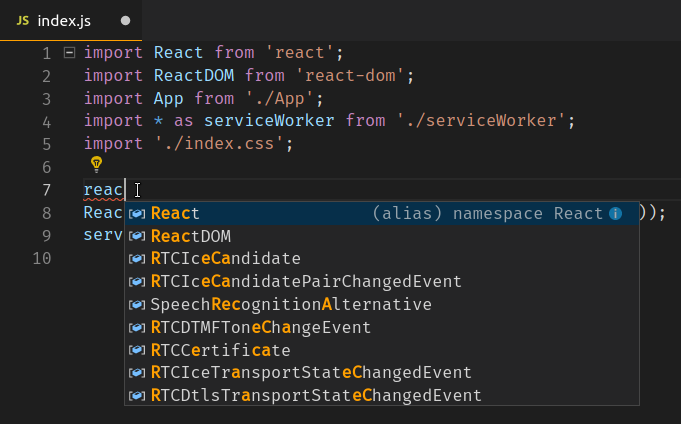
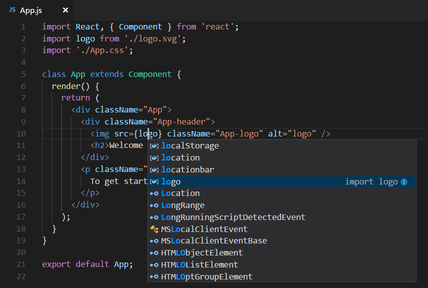

# Using React in Visual Studio Code

[React](https://facebook.github.io/react/) is a popular JavaScript library developed by Facebook for building web application user interfaces. The Visual Studio Code editor supports React.js IntelliSense and code navigation out of the box.


## Welcome to React

We'll be using the `create-react-app` [generator](https://reactjs.org/docs/create-a-new-react-app.html#create-react-app) for this tutorial. To use the generator as well as run the React application server, you'll need [Node.js](https://nodejs.org/) JavaScript runtime and [npm](https://www.npmjs.com/) (Node.js package manager) installed. npm is included with Node.js which you can download and install from [Node.js downloads](https://nodejs.org/en/download/).

>**Tip**: To test that you have Node.js and npm correctly installed on your machine, you can type `node --version` and `npm --version` in a terminal or command prompt.

You can now create a new React application by typing:

```bash
npx create-react-app my-app
```

where `my-app` is the name of the folder for your application. This may take a few minutes to create the React application and install its dependencies.

>**Note**: If you've previously installed `create-react-app` globally via `npm install -g create-react-app`, we recommend you uninstall the package using `npm uninstall -g create-react-app` to ensure that npx always uses the latest version.

Let's quickly run our React application by navigating to the new folder and typing `npm start` to start the web server and open the application in a browser:

```bash
cd my-app
npm start
```

<!-- TBD mention yarn and link -->

You should see the React logo and a link to "Learn React" on [http://localhost:3000](http://localhost:3000) in your browser. We'll leave the web server running while we look at the application with VS Code.

To open your React application in VS Code, open another terminal or command prompt window, navigate to the `my-app` folder and type `code .`:

```bash
cd my-app
code .
```

### Markdown preview

In the File Explorer, one file you'll see is the application `README.md` Markdown file. This has lots of great information about the application and React in general. A nice way to review the README is by using the VS Code [Markdown Preview](/docs/languages/markdown.md#markdown-preview). You can open the preview in either the current editor group (**Markdown: Open Preview** `kb(markdown.showPreview)`) or in a new editor group to the side (**Markdown: Open Preview to the Side** `kb(markdown.showPreviewToSide)`). You'll get nice formatting, hyperlink navigation to headers, and syntax highlighting in code blocks.


### Syntax highlighting and bracket matching

Now expand the `src` folder and select the `index.js` file. You'll notice that VS Code has syntax highlighting for the various source code elements and, if you put the cursor on a parenthesis, the matching bracket is also selected.


### IntelliSense

As you start typing in `index.js`, you'll see smart suggestions or completions.



After you select a suggestion and type `.`, you see the types and methods on the object through [IntelliSense](/docs/editor/intellisense.md).


VS Code uses the TypeScript language service for its JavaScript code intelligence and it has a feature called [Automatic Type Acquisition](/docs/nodejs/working-with-javascript.md#typings-and-automatic-type-acquisition) (ATA). ATA pulls down the npm Type Declaration files (`*.d.ts`) for the npm modules referenced in the `package.json`.

If you select a method, you'll also get parameter help:


### Go to Definition, Peek definition

Through the TypeScript language service, VS Code can also provide type definition information in the editor through **Go to Definition** (`kb(editor.action.revealDefinition)`) or **Peek Definition** (`kb(editor.action.peekDefinition)`). Put the cursor over the `App`, right click and select **Peek Definition**. A [Peek window](/docs/editor/editingevolved.md#peek) will open showing the `App` definition from `App.js`.


Press `kbstyle(Escape)` to close the Peek window.

## Hello World!

Let's update the sample application to "Hello World!". Create a new H1 header with "Hello, world!" and replace the `<App />` tag in `ReactDOM.render` with `element`.

```js
import React from 'react';
import ReactDOM from 'react-dom';
import './index.css';
import App from './App';
import reportWebVitals from './reportWebVitals';

var element = React.createElement('h1', { className: 'greeting' }, 'Hello, world!');
ReactDOM.render(element, document.getElementById('root'));

reportWebVitals();
```

Once you save the `index.js` file, the running instance of the server will update the web page and you'll see "Hello World!" when you refresh your browser.

>**Tip**: VS Code supports Auto Save, which by default saves your files after a delay. Check the **Auto Save** option in the **File** menu to turn on Auto Save or directly configure the `files.autoSave` user [setting](/docs/getstarted/settings.md).


## Debugging React

To debug the client side React code, we'll need to install the [Debugger for Chrome](https://marketplace.visualstudio.com/items?itemName=msjsdiag.debugger-for-chrome) extension.

>Note: This tutorial assumes you have the Chrome browser installed. There are also debugger extensions for the [Edge](https://marketplace.visualstudio.com/items?itemName=msjsdiag.debugger-for-edge) and [Firefox](https://marketplace.visualstudio.com/items?itemName=hbenl.vscode-firefox-debug) browsers.

Open the Extensions view (`kb(workbench.view.extensions)`) and type 'chrome' in the search box. You'll see several extensions which reference Chrome.


Press the **Install** button for **Debugger for Chrome**.

### Set a breakpoint

To set a breakpoint in `index.js`, click on the gutter to the left of the line numbers. This will set a breakpoint which will be visible as a red circle.


### Configure the Chrome debugger

We need to initially configure the [debugger](/docs/editor/debugging.md). To do so, go to the Run view (`kb(workbench.view.debug)`) and click **create a launch.json file** to customize Run and Debug. Choose **Chrome** from the **Select Environment** dropdown list. This will create a `launch.json` file in a new `.vscode` folder in your project which includes a configuration to launch the website.

We need to make one change for our example: change the port of the `url` from `8080` to `3000`. Your `launch.json` should look like this:

```json
{
    "version": "0.2.0",
    "configurations": [
        {
            "type": "chrome",
            "request": "launch",
            "name": "Launch Chrome against localhost",
            "url": "http://localhost:3000",
            "webRoot": "${workspaceFolder}"
        }
    ]
}
```

Ensure that your development server is running (`npm start`). Then press `kb(workbench.action.debug.start)` or the green arrow to launch the debugger and open a new browser instance. The source code where the breakpoint is set runs on startup before the debugger was attached, so we won't hit the breakpoint until we refresh the web page. Refresh the page and you should hit your breakpoint.


You can step through your source code (`kb(workbench.action.debug.stepOver)`), inspect variables such as `element`, and see the call stack of the client side React application.


The **Debugger for Chrome** extension README has lots of information on other configurations, working with sourcemaps, and troubleshooting. You can review it directly within VS Code from the **Extensions** view by clicking on the extension item and opening the **Details** view.


### Live editing and debugging

If you are using [webpack](https://webpack.js.org/) together with your React app, you can have a more efficient workflow by taking advantage of webpack's HMR mechanism which enables you to have live editing and debugging directly from VS Code. You can learn more in this [Live edit and debug your React apps directly from VS Code](https://medium.com/@auchenberg/live-edit-and-debug-your-react-apps-directly-from-vs-code-without-leaving-the-editor-3da489ed905f) blog post and the [webpack Hot Module Replacement documentation](https://webpack.js.org/concepts/hot-module-replacement/).

## Linting

Linters analyze your source code and can warn you about potential problems before you run your application. The JavaScript language services included with VS Code has syntax error checking support by default, which you can see in action in the **Problems** panel (**View** > **Problems** `kb(workbench.actions.view.problems)`).

Try making a small error in your React source code and you'll see a red squiggle and an error in the **Problems** panel.


Linters can provide more sophisticated analysis, enforcing coding conventions and detecting anti-patterns. A popular JavaScript linter is [ESLint](https://eslint.org/). ESLint, when combined with the ESLint VS Code [extension](https://marketplace.visualstudio.com/items/dbaeumer.vscode-eslint), provides a great in-product linting experience.

First, install the ESLint command-line tool:

```bash
npm install -g eslint
```

Then install the ESLint extension by going to the **Extensions** view and typing 'eslint'.


Once the ESLint extension is installed and VS Code reloaded, you'll want to create an ESLint configuration file, `.eslintrc.js`. You can create one using the extension's **ESLint: Create ESLint configuration** command from the **Command Palette** (`kb(workbench.action.showCommands)`).


The command will prompt you to answer a series of questions in the **Terminal** panel. Take the defaults, and it will create a `.eslintrc.js` file in your project root that looks something like this:

```js
module.exports = {
    "env": {
        "browser": true,
        "es2020": true
    },
    "extends": [
        "eslint:recommended",
        "plugin:react/recommended"
    ],
    "parserOptions": {
        "ecmaFeatures": {
            "jsx": true
        },
        "ecmaVersion": 11,
        "sourceType": "module"
    },
    "plugins": [
        "react"
    ],
    "rules": {
    }
};
```

ESLint will now analyze open files and shows a warning in `index.js` about 'App' being defined but never used.


You can modify the ESLint [rules](https://eslint.org/docs/rules/) in the `.eslintrc.js` file.

Let's add an error rule for extra semi-colons:

```js
 "rules": {
        "no-extra-semi":"error"
    }
```

Now when you mistakenly have multiple semicolons on a line, you'll see an error (red squiggle) in the editor and error entry in the **Problems** panel.


## Popular Starter Kits

In this tutorial, we used the `create-react-app` generator to create a simple React application. There are lots of great samples and starter kits available to help build your first React application.

### VS Code React Sample

This is a [sample](https://github.com/microsoft/vscode-react-sample) React application used for a [demo](https://channel9.msdn.com/Events/Build/2016/B887) at the 2016 //Build conference. The sample creates a simple TODO application and includes the source code for a Node.js [Express](https://expressjs.com/) server. It also shows how to use the [Babel](https://babeljs.io) ES6 transpiler and then use [webpack](https://webpack.js.org/) to bundle the site assets.

### TypeScript React

If you're curious about TypeScript and React, you can also create a TypeScript version of the `create-react-app` application by specifying that you want to use the TypeScript template:

```bash
npx create-react-app my-app --template typescript
```

See the details at [Adding TypeScript](https://create-react-app.dev/docs/adding-typescript) on the [Create React App site](https://create-react-app.dev).

### Angular

[Angular](https://angular.io/) is another popular web framework. If you'd like to see an example of Angular working with VS Code, check out the [Chrome Debugging with Angular CLI](https://github.com/microsoft/vscode-recipes/tree/main/Angular-CLI) recipe. It will walk you through creating an Angular application and configuring the `launch.json` file for the [Debugger for Chrome](https://marketplace.visualstudio.com/items?itemName=msjsdiag.debugger-for-chrome) extension.

## Common questions

### Can I get IntelliSense within declarative JSX?

Yes. For example, if you open the `create-react-app` project's `App.js` file, you can see IntelliSense within the React JSX in the `render()` method.


