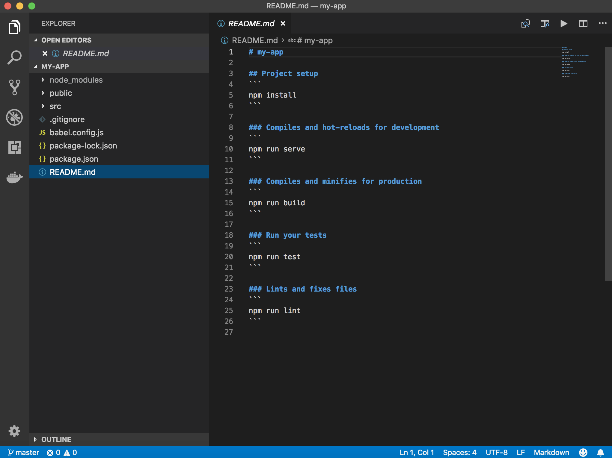
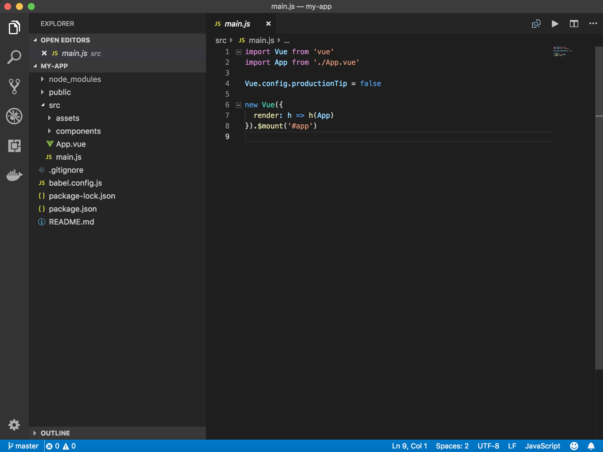
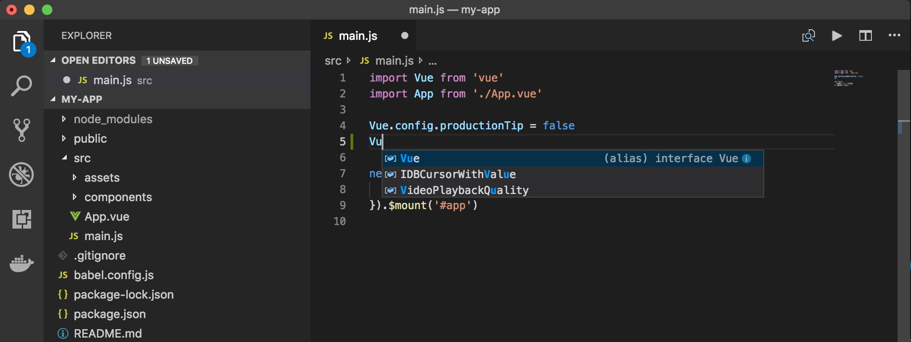
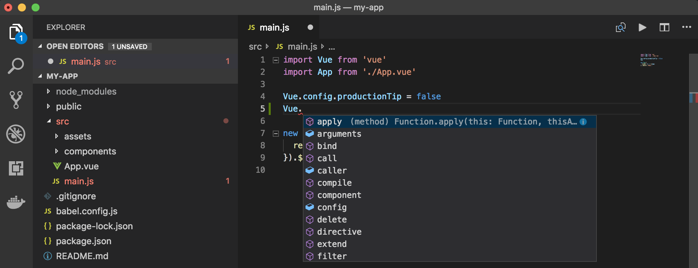
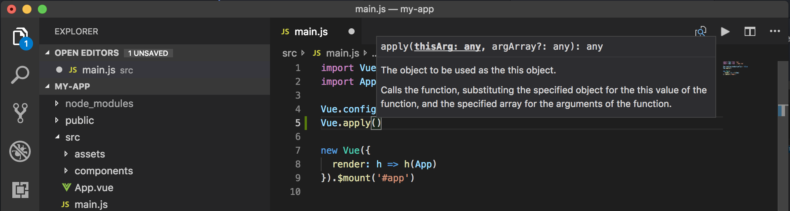
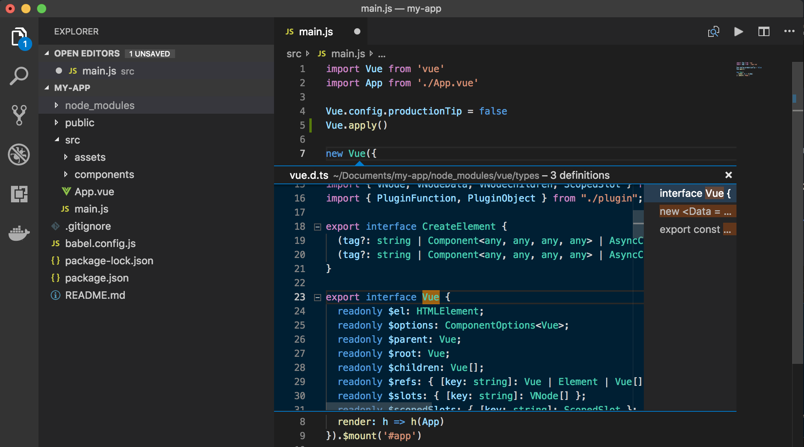
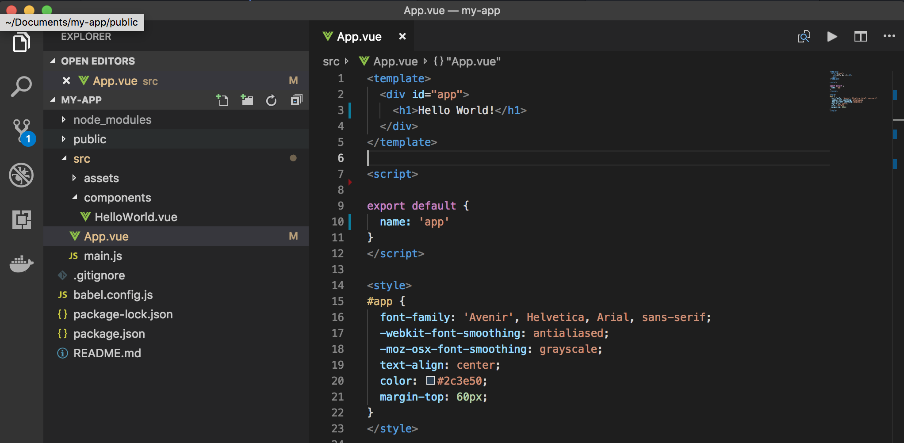
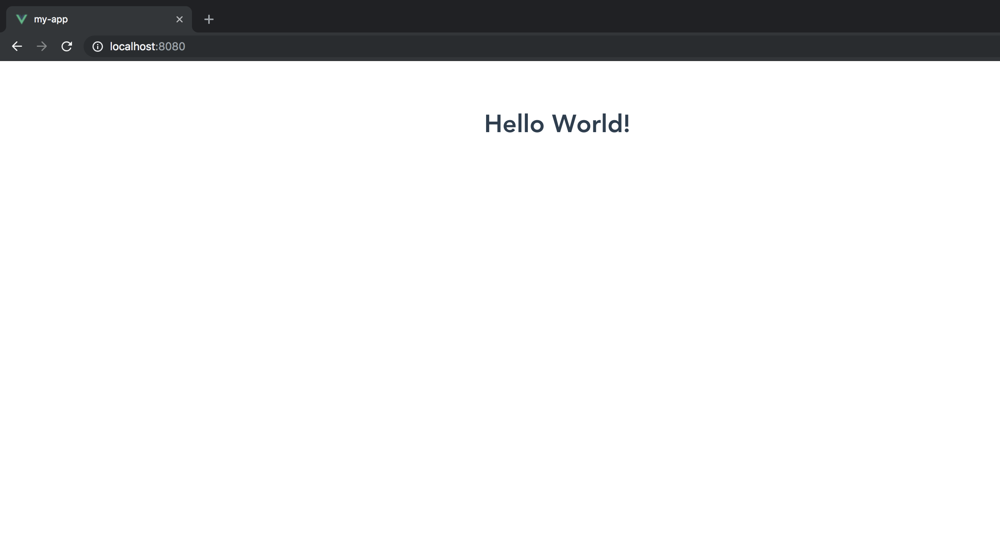

# Using Vue in Visual Studio Code

[Vue]() (pronounced /vjuː/, like view) is a progressive framework for building user interfaces. Unlike other monolithic frameworks, Vue is designed from the ground up to be incrementally adoptable. The core library is focused on the view layer only, and is easy to pick up and integrate with other libraries or existing projects. On the other hand, Vue is also perfectly capable of powering sophisticated Single-Page Applications when used in combination with [modern tooling]() and [supporting libraries]().


## Welcome to Vue

We'll be using the `vue create` [generator](https://cli.vuejs.org/guide/creating-a-project.html#vue-create) for this tutorial. To install and use the generator as well as run the Vue application server, you'll need the [Node.js](https://nodejs.org/) JavaScript runtime, [npm](https://www.npmjs.com/) (the Node.js package manager) and [Vue CLI](https://cli.vuejs.org/guide/installation.html) installed. npm is included with Node.js which you can install from [here](https://nodejs.org/en/download/).

>**Tip**: To test that you have Node.js, npm and vue correctly installed on your machine, you can type `node --version`, `npm --version` and `vue --version`.

You can now create a new Vue application by typing:

```bash
vue create my-app
```

#### WARNING
> If you are on Windows using Git Bash with minTTY, the interactive prompts will not work. You must launch the command as winpty vue.cmd create hello-world.

You will be prompted to pick a preset. You can either choose the default preset which comes with a basic **Babel + ESLint** setup, or select "Manually select features" to pick the features you need.


The default setup is great for quickly prototyping a new project, while the manual setup provides more options that are likely needed for more production-oriented projects.


If you chose to manually select features, at the end of the prompts you also have the option to save your selections as a preset so that you can reuse it in the future. We will discuss presets and plugins in the next section.

Let's quickly run our Vue application by navigating to the new folder and typing `npm run serve` to start the web server and open the application in a browser:

```bash
$ cd my-app
$ npm run serve

DONE  Compiled successfully                                                                                                              
 App running at:
 - Local:   http://localhost:8080/
 - Network: http://172.29.65.168:8080/

 Note that the development build is not optimized.
 To create a production build, run npm run build.
```

You should see "Welcome to Your Vue.js App" on `http://localhost:8080` in your browser. We'll leave the web server running while we look at the application with VS Code.


To open your Vue application in VS Code, open another terminal (or command prompt) and navigate to the `my-app` folder and type `code .`:

```bash
cd my-app
code .
```

### Markdown preview

In the File Explorer, one file you'll see is the application `README.md` Markdown file. This has lots of great information about the application and Vue in general. A nice way to review the README is by using the VS Code [Markdown Preview](/docs/languages/markdown.md#markdown-preview). You can open the preview in either the current editor group (**Markdown: Open Preview** `kb(markdown.showPreview)`) or in a new editor group to the side (**Markdown: Open Preview to the Side** `kb(markdown.showPreviewToSide)`). You'll get nice formatting, hyperlink navigation to headers, and syntax highlighting in code blocks.



### Syntax highlighting and bracket matching

Now expand the `src` folder and select the `main.js` file. You'll notice that VS Code has syntax highlighting for the various source code elements and, if you put the cursor on a parentheses, the matching bracket is also selected.



### IntelliSense

As you start typing in `main.js`, you'll see smart suggestions or completions.



After you select a suggestion and type `.`, you see the types and methods on the object through [IntelliSense](/docs/vue/intellisense.md).



VS Code uses the TypeScript language service for its JavaScript code intelligence and it has a feature called [Automatic Type Acquisition](/docs/languages/javascript.md#automatic-type-acquisition) (ATA). ATA pulls down the npm Type Declaration files (`*.d.ts`) for the npm modules referenced in the `package.json`.

If you select a method, you'll also get parameter help:



### Go to Definition, Peek definition

Through the TypeScript language service, VS Code can also provide type definition information in the editor through **Go to Definition** (`kb(editor.action.gotodeclaration)`) or **Peek Definition** (`kb(editor.action.peekImplementation)`). Put the cursor over the `App`, right click and select **Peek Definition**. A [Peek window](/docs/editor/editingevolved.md#peek) will open showing the `App` definition from `App.js`.



Press `kbstyle(Escape)` to close the Peek window.

## Hello World!

Let's update the sample application to "Hello World!". Select the App.vue file. Add the link to declare a new H1 header and replace the `<HelloWorld />` with `h1`.

```js
<template>
  <div id="app">
    <h1>Hello World!</h1>
  </div>
</template>

<script>

export default {
  name: 'app',
}
</script>
```


Once you save the `App.vue` file, the running instance of the server will update the web page and you'll see "Hello World!".

>**Tip**: VS Code supports Auto Save, which by default saves your files after a delay. Check the **Auto Save** option in the **File** menu to turn on Auto Save or directly configure the `files.autoSave` user [setting](/docs/getstarted/settings.md).



## Popular Starter Kits

In this tutorial, we used the `create` generator to create a simple Vue application. There are lots of great samples and starter kits available to help build your first Vue application.

### Angular

[Angular](https://angular.io/) is another popular web framework. If you'd like to see an example of Angular working with VS Code, check out the [Chrome Debugging with Angular CLI](https://github.com/Microsoft/vscode-recipes/tree/master/Angular-CLI) recipe. It will walk you through creating an Angular application and configuring the `launch.json` file for the [Debugger for Chrome](https://marketplace.visualstudio.com/items?itemName=msjsdiag.debugger-for-chrome) extension.
