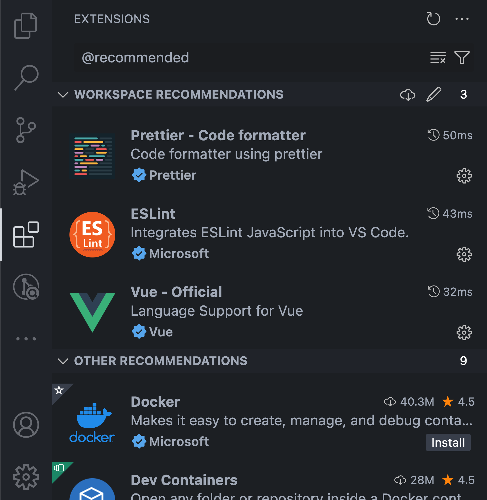

# Using Vue in Visual Studio Code

[Vue.js](https://vuejs.org/) is a popular JavaScript library for building web application user interfaces and Visual Studio Code has built-in support for the Vue.js building blocks of [HTML](/docs/languages/html.md), [CSS](/docs/languages/css.md), and [JavaScript](/docs/languages/javascript.md). For a richer Vue.js development environment, you can install the [Volar](https://marketplace.visualstudio.com/items?itemName=Vue.volar) and [Volar for TypeScript](https://marketplace.visualstudio.com/items?itemName=Vue.vscode-typescript-vue-plugin) extensions that support Vue.js IntelliSense, code snippets, formatting, and more.

>**Note**: [Vue 2 support will end on December 31st, 2023](https://v2.vuejs.org/lts/) so the use of the [Vetur](https://marketplace.visualstudio.com/items?itemName=octref.vetur) extension is [not recommended](https://github.com/vuejs/vetur/discussions/3378). You will need to [disable Vetur](https://vuejs.org/guide/typescript/overview.html#ide-support) to use Volar.

---


---

## Welcome to Vue

We'll be using the [Vite](https://vitejs.dev/) tooling for this tutorial. If you are new to the Vue.js framework, you can find great documentation and tutorials on the [vuejs.org](https://vuejs.org) website.

To install and use Vite and Vue.js, you'll need the [Node.js](https://nodejs.org/) JavaScript runtime and [npm](https://www.npmjs.com/) (the Node.js package manager) installed. npm is included with Node.js, which you can install from [Node.js downloads](https://nodejs.org/en/download/).

>**Tip**: To test that you have Node.js and npm correctly installed on your machine, you can type `node --version` and `npm --version`.

To get started, make sure you are in the parent directory where you intend to create a project. Then open your terminal or command prompt and type:

```bash
npm create vue@latest
```

You will be prompted to install `create-vue`.


This may take a few minutes to install and execute [create-vue](https://github.com/vuejs/create-vue), which helps you to scaffold your Vue project. Follow the prompts for optional features. You can choose "No" if you are unsure about an option.


Once the project is created, navigate into it and install dependencies. It may take a few minutes to install its dependencies.

```bash
cd <your-project-name>
npm install
```

Let's quickly run our Vue application by typing `npm run dev` to start the web server and open the application in a browser:

```bash
npm run dev
```

You should see "Welcome to your Vue.js App" on [http://localhost:5173](http://localhost:5173) in your browser. You can press `kbstyle(Ctrl+C)` to stop the `vue-cli-service` server.

To open your Vue application in VS Code, from a terminal (or command prompt), navigate to the `vue-project` folder and type `code .`:

```bash
cd vue-project
code .
```

VS Code will launch and display your Vue application in the File Explorer.

## Volar extension

Now expand the `src` folder and select the `App.vue` file. You'll notice that VS Code doesn't show any syntax highlighting and it treats the file as **Plain Text** as you can see in the lower right Status Bar. You'll also see a notification recommending the [Volar](https://marketplace.visualstudio.com/items?itemName=Vue.volar) extension for the `.vue` file type.


The Volar extension supplies Vue.js language features (syntax highlighting, IntelliSense, snippets, formatting) to VS Code.


From the notification, press **Install** to download and install the Volar extension. You should see the Volar extension **Installing** in the Extensions view. Once the installation is complete (may take several minutes), the **Install** button changes to the **Manage** gear button.

You should now see that `.vue` is a recognized file type for the Vue.js language and you have language features such as syntax highlighting, bracket matching, and hover descriptions.


## IntelliSense

As you start typing in `App.vue`, you'll see smart suggestions or completions both for HTML and CSS but also for Vue.js specific items like declarations (`v-bind`, `v-for`) in the Vue `template` section:


and Vue properties such as `computed` in the `scripts` section:


### Go to Definition, Peek definition

VS Code through the Volar extension Vue.js language service can also provide type definition information in the editor through **Go to Definition** (`kb(editor.action.revealDefinition)`) or **Peek Definition** (`kb(editor.action.peekDefinition)`). Put the cursor over the `App`, right-click and select **Peek Definition**. A [Peek window](/docs/editor/editingevolved.md#peek) opens showing the `App` definition from `App.js`.


Press `kbstyle(Escape)` to close the Peek window.

## Hello World

Let's update the sample application to "Hello World!". In `App.vue` replace the HelloWorld component `msg` custom attribute text with "Hello World!".

```html
<template>
  <header>
    

    <div class="wrapper">
      <HelloWorld msg="Hello World!" />
    </div>
  </header>

  <main>
    <TheWelcome />
  </main>
</template>
```

Once you save the `App.vue` file (`kb(workbench.action.files.save)`), restart the server with `npm run dev` and you'll see "Hello World!". Leave the server running while we go on to learn about Vue.js client side debugging.

>**Tip**: VS Code supports Auto Save, which by default saves your files after a delay. Check the **Auto Save** option in the **File** menu to turn on Auto Save or directly configure the `files.autoSave` user [setting](/docs/getstarted/settings.md).

---


---

## Linting

Linters analyze your source code and can warn you about potential problems before you run your application. The Vue ESLint plugin ([eslint-plugin-vue](https://www.npmjs.com/package/eslint-plugin-vue)) checks for Vue.js specific syntax errors, which are shown in the editor as red squiggles and are also displayed in the **Problems** panel (**View** > **Problems** `kb(workbench.actions.view.problems)`).

Below you can see an error when the Vue linter detects more than one root element in a template:


## Debugging

You can debug client side Vue.js code with the built-in JavaScript debugger. Follow this [conversation](https://github.com/vitejs/vite/discussions/4065#discussioncomment-1359932) to use Vite/Vue.js 3 project with VS Code using Microsoft Edge.

For Vue CLI, which is [now in maintenance mode](https://vuejs.org/guide/scaling-up/tooling#vue-cli), check out [Vue.js debugging in VS Code](https://github.com/microsoft/vscode-recipes/tree/main/vuejs-cli) recipe on the VS Code debugging [recipes](https://github.com/microsoft/vscode-recipes) site to learn more.

Another popular tool for debugging Vue.js is the [vue-devtools](https://github.com/vuejs/vue-devtools) plug-in, which can be used regardless of the environment.

## Other extensions

Volar is only one of many Vue.js extensions available for VS Code. Another recommended extension is [Volar for TypeScript](https://marketplace.visualstudio.com/items?itemName=Vue.vscode-typescript-vue-plugin).



You can search in the Extensions view (`kb(workbench.view.extensions)`) by typing 'vue'.


Extension like [Vue VS Code Snippets](https://marketplace.visualstudio.com/items?itemName=sdras.vue-vscode-snippets) can be handy for Vue snippets.


There are also Extension Packs, which bundle extensions that other people have found useful for Vue.js development.


