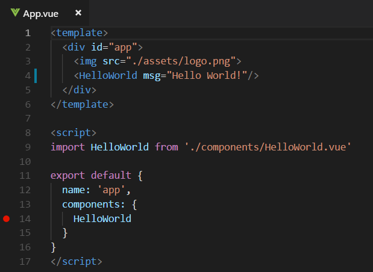

# Using Vue in VS Code

[Vue](https://vuejs.org/) is a popular JavaScript library for building web application user interfaces. The Visual Studio Code editor is a powerful tool for writing Vue.js through the Vetur extension which supports Vue.js IntelliSense, snippets, and more. TBD


## Welcome to Vue

We'll be using the [Vue CLI](https://cli.vuejs.org/) for this tutorial. To install and use the Vue CLI as well as run the Vue application server, you'll need the [Node.js](https://nodejs.org/) JavaScript runtime and [npm](https://www.npmjs.com/) (the Node.js package manager) installed. npm is included with Node.js which you can install from [here](https://nodejs.org/en/download/).

>**Tip**: To test that you have Node.js and npm correctly installed on your machine, you can type `node --version` and `npm --version`.

To install the `vue/cli` , in a terminal or command prompt type:

```bash
npm install -g @vue/cli
```

This may take a few minutes to install. You can now create a new Vue.js application by typing:

```bash
vue create my-app
```

TBD better to user vue init webpack? needs a second install

where `my-app` is the name of the folder for your application. You will be prompted to select a preset and you can keep the default `(babel, eslint)`. It may take a few minutes to create the Vue application and install its dependencies.

Let's quickly run our Vue application by navigating to the new folder and typing `npm run serve` to start the web server and open the application in a browser:

```bash
cd my-app
npm run serve
```

You should see "Welcome to your Vue.js App" on `http://localhost:8080` in your browser. You can press `kbstyle(Ctrl+C)` to stop the `vue-cli-service` server.

To open your Vue application in VS Code, from a terminal (or command prompt), navigate to the `my-app` folder and type `code .`:

```bash
cd my-app
code .
```

VS Code will launch and display your Vue application in the File Explorer.

### Vetur extension

Now expand the `src` folder and select the `App.vue` file. You'll notice that VS Code doesn't show any syntax highlighting and it treats the file as **Plain Text** as you can see in the lower right Status Bar. You'll also see a notification recommending the [Vetur](https://marketplace.visualstudio.com/items?itemName=octref.vetur) extension for the `.vue` file type.


The Vetur extension supplies Vue.js language features (syntax highlighting, snippets, formatting) to VS Code.


Install the Vetur extension (TBD add more to this flow) and reload VS Code when you see the **Reload** button on the extension tile in the Extensions view.

TBD Vetur extension taking a long time to install??

Now you should see advanced language features such as syntax highlighting, bracket matching, hover descriptions and more.


### IntelliSense

As you start typing in `App.vue`, you'll see smart suggestions or completions.


After you select a suggestion and type `.`, you see the types and methods on the object through [IntelliSense](/docs/editor/intellisense.md).


Vue.js directives v-bind
Vue.js properties computed, methods, props, etc

VS Code uses the TypeScript language service for its JavaScript code intelligence and it has a feature called [Automatic Type Acquisition](/docs/languages/javascript.md#automatic-type-acquisition) (ATA). ATA pulls down the npm Type Declaration files (`*.d.ts`) for the npm modules referenced in the `package.json`.

If you select a method, you'll also get parameter help:


### Go to Definition, Peek definition

Through the TypeScript language service, VS Code can also provide type definition information in the editor through **Go to Definition** (`kb(editor.action.gotodeclaration)`) or **Peek Definition** (`kb(editor.action.peekImplementation)`). Put the cursor over the `App`, right click and select **Peek Definition**. A [Peek window](/docs/editor/editingevolved.md#peek) will open showing the `App` definition from `App.js`.

 TBD

Show Go to Definition for Vue object TBD

Press `kbstyle(Escape)` to close the Peek window.

## Hello World!

Let's update the sample application to "Hello World!". In `App.vue` replace the HelloWorld component `msg` custom attribute text with "Hello World!".

```html
<template>
  <div id="app">
    
    <HelloWorld msg="Hello World!"/>
  </div>
</template>
```

Once you save the `App.vue` file, restart the server with `npm run serve` and you'll see "Hello World!". Leave the server running while we go on to learn about Vue.js client side debugging.

>**Tip**: VS Code supports Auto Save, which by default saves your files after a delay. Check the **Auto Save** option in the **File** menu to turn on Auto Save or directly configure the `files.autoSave` user [setting](/docs/getstarted/settings.md).


## Debugging Vue

To debug the client side Vue code, we'll need to install the [Debugger for Chrome](https://marketplace.visualstudio.com/items?itemName=msjsdiag.debugger-for-chrome) extension.

>Note: This tutorial assumes you have the Chrome browser installed. Microsoft also publishes a version of this extension for their [Edge](https://marketplace.visualstudio.com/items?itemName=msjsdiag.debugger-for-edge) browser.

Open the Extensions view (`kb(workbench.view.extensions)`) and type 'chrome` in the search box. You'll see several extensions which reference Chrome.


Press the **Install** button for **Debugger for Chrome**. The button will change to **Installing** then, after completing the installation, it will change to **Reload**. Press **Reload** to restart VS Code and activate the extension.

### Set a breakpoint

To set a breakpoint in `App.vue`, click on the gutter to the left of the line numbers. This will set a breakpoint which will be visible as a red circle.



### Configure the Chrome debugger

We need to initially configure the [debugger](/docs/editor/debugging.md). To do so, go to the Debug view (`kb(workbench.view.debug)`) and click on gear button to create a `launch.json` debugger configuration file. Choose **Chrome** from the **Select Environment** dropdown. This will create a `launch.json` file in a new `.vscode` folder in your project which includes a configuration to launch the website.

We need to make one change for our example: change your `webroot` to `${workspaceFolder}/src`. Your `launch.json` should look like this:

```json
{
    "version": "0.2.0",
    "configurations": [
        {
            "type": "chrome",
            "request": "launch",
            "name": "Launch Chrome against localhost",
            "url": "http://localhost:8080",
            "webRoot": "${workspaceFolder}/src"
        }
    ]
}
```

Ensure that your development server is running ("npm run serve"). Then press `kb(workbench.action.debug.start)` or the green arrow to launch the debugger and open a new browser instance. The source code where the breakpoint is set runs on startup before the debugger was attached so we won't hit the breakpoint until we refresh the web page. Refresh the page and you should hit your breakpoint.

 TBD

You can step through your source code (`kb(workbench.action.debug.stepOver)`), inspect variables such as `element`, and see the call stack of the client side React application.

 TBD

The **Debugger for Chrome** extension README has lots of information on other configurations, working with sourcemaps, and troubleshooting. You can review it directly within VS Code from the **Extensions** view by clicking on the extension item and opening the **Details** view.


## Linting

Linters analyze your source code and can warn you about potential problems before you run your application. The vue-cli-service language service has syntax error checking support by default which you can see in action in the **Problems** panel (**View** > **Problems** `kb(workbench.actions.view.problems)`).

TBD you'll get Vue specific Linting with the Vue ESLint plug-in `eslint-plugin-vue` for example more that one element in a Vue component template.

TBD show image - make sure current with Hello World above

You'll also get JavaScript errors and warnings as well.

Try making a small error in your Vue source code and you'll see a red squiggle and an error in the **Problems** panel.


## Popular Starter Kits

In this tutorial, we used the Vue CLI to create a simple Vue.js application. There are lots of great samples and starter kits available to help build your first Vue application.

### VuePack

### Veturpack

https://vuejs.github.io/vetur/

### Other Vue.js extensions

Vetur is only one of many Vue.js extensions available for VS Code. TBD
