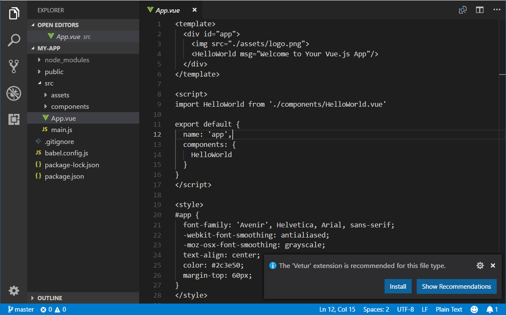
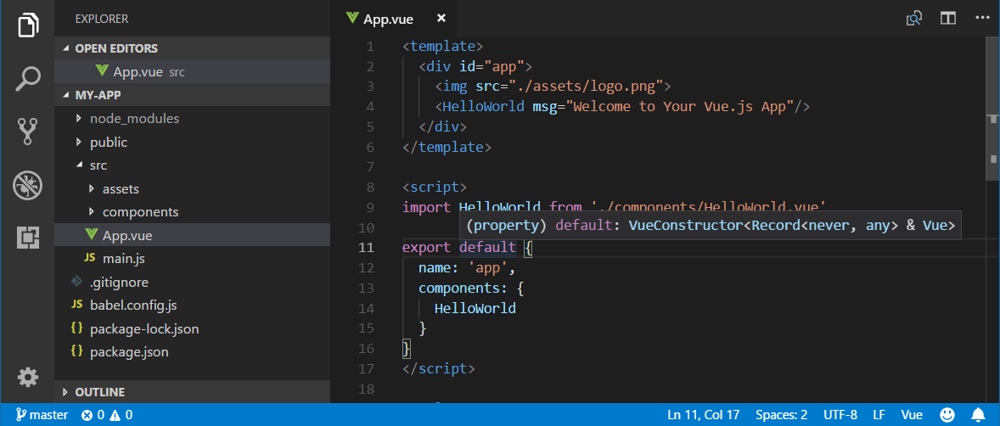
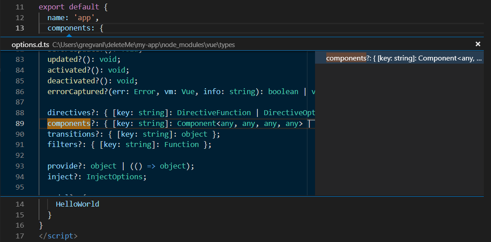
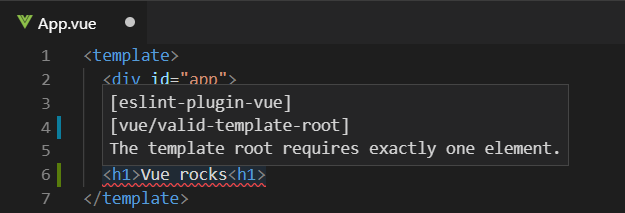
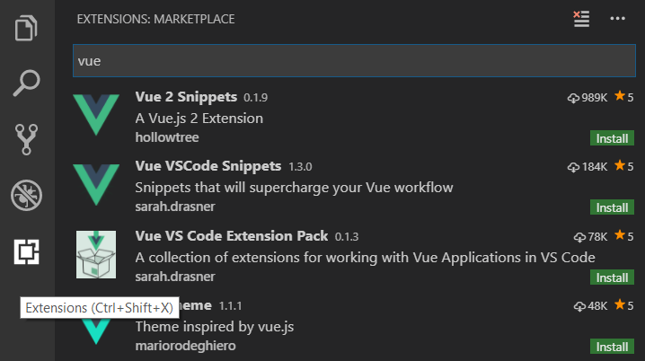

# Using Vue in Visual Studio Code

[Vue.js](https://vuejs.org/) is a popular JavaScript library for building web application user interfaces and  Visual Studio Code has built-in support for the Vue.js building blocks of [HTML](/docs/languages/html.md), [CSS](/docs/languages/css.md), and [JavaScript](/docs/languages/javascript.md). For a richer Vue.js development environment, you can install the [Vetur](https://marketplace.visualstudio.com/items?itemName=octref.vetur) extension which supports Vue.js IntelliSense, code snippets, formatting, and more.

---


---

## Welcome to Vue

We'll be using the [Vue CLI](https://cli.vuejs.org/) for this tutorial. If you are new to the Vue.js framework, you can find great documentation and tutorials on the [vuejs.org](https://vuejs.org) website.

To install and use the Vue CLI as well as run the Vue application server, you'll need the [Node.js](https://nodejs.org/) JavaScript runtime and [npm](https://www.npmjs.com/) (the Node.js package manager) installed. npm is included with Node.js which you can install from [Node.js downloads](https://nodejs.org/en/download/).

>**Tip**: To test that you have Node.js and npm correctly installed on your machine, you can type `node --version` and `npm --version`.

To install the `vue/cli` , in a terminal or command prompt type:

```bash
npm install -g @vue/cli
```

This may take a few minutes to install. You can now create a new Vue.js application by typing:

```bash
vue create my-app
```

where `my-app` is the name of the folder for your application. You will be prompted to select a preset and you can keep the default `(babel, eslint)`, which will use [Babel](https://babeljs.io) to transpile the JavaScript to browser compatible ES5 and install the [ESLint](https://eslint.org/) linter to detect coding errors. It may take a few minutes to create the Vue application and install its dependencies.

Let's quickly run our Vue application by navigating to the new folder and typing `npm run serve` to start the web server and open the application in a browser:

```bash
cd my-app
npm run serve
```

You should see "Welcome to your Vue.js App" on [http://localhost:8080](http://localhost:8080) in your browser. You can press `kbstyle(Ctrl+C)` to stop the `vue-cli-service` server.

To open your Vue application in VS Code, from a terminal (or command prompt), navigate to the `my-app` folder and type `code .`:

```bash
cd my-app
code .
```

VS Code will launch and display your Vue application in the File Explorer.

## Vetur extension

Now expand the `src` folder and select the `App.vue` file. You'll notice that VS Code doesn't show any syntax highlighting and it treats the file as **Plain Text** as you can see in the lower right Status Bar. You'll also see a notification recommending the [Vetur](https://marketplace.visualstudio.com/items?itemName=octref.vetur) extension for the `.vue` file type.



The Vetur extension supplies Vue.js language features (syntax highlighting, IntelliSense, snippets, formatting) to VS Code.


From the notification, press **Install** to download and install the Vetur extension. You should see the Vetur extension **Installing** in the Extensions view. Once the installation is complete (may take several minutes), the **Install** button will change to the **Manage** gear button.

Now you should see that `.vue` is a recognized file type for the Vue language and you have language features such as syntax highlighting, bracket matching, and hover descriptions.



## IntelliSense

As you start typing in `App.vue`, you'll see smart suggestions or completions both for HTML and CSS but also for Vue.js specific items like declarations (`v-bind`, `v-for`) in the Vue `template` section:


and Vue properties (`methods`, `computed`) in the `scripts` section:


### Go to Definition, Peek definition

VS Code through the Vue extension language service can also provide type definition information in the editor through **Go to Definition** (`kb(editor.action.revealDefinition)`) or **Peek Definition** (`kb(editor.action.peekDefinition)`). Put the cursor over the `App`, right click and select **Peek Definition**. A [Peek window](/docs/editor/editingevolved.md#peek) will open showing the `App` definition from `App.js`.



Press `kbstyle(Escape)` to close the Peek window.

## Hello World

Let's update the sample application to "Hello World!". In `App.vue` replace the HelloWorld component `msg` custom attribute text with "Hello World!".

```html
<template>
  <div id="app">
    
    <HelloWorld msg="Hello World!"/>
  </div>
</template>
```

Once you save the `App.vue` file (`kb(workbench.action.files.save)`), restart the server with `npm run serve` and you'll see "Hello World!". Leave the server running while we go on to learn about Vue.js client side debugging.

>**Tip**: VS Code supports Auto Save, which by default saves your files after a delay. Check the **Auto Save** option in the **File** menu to turn on Auto Save or directly configure the `files.autoSave` user [setting](/docs/getstarted/settings.md).

---


---

## Linting

Linters analyze your source code and can warn you about potential problems before you run your application. The Vue ESLint plugin ([eslint-plugin-vue](https://www.npmjs.com/package/eslint-plugin-vue)) checks for Vue.js specific syntax errors which are shown in the editor as red squigglies and are also displayed in the **Problems** panel (**View** > **Problems** `kb(workbench.actions.view.problems)`).

Below you can see an error when the Vue linter detects more than one root element in a template:



## Debugging

You can debug client side Vue.js code with the built-in JavaScript debugger. You can learn more from the [Vue.js debugging in VS Code](https://github.com/microsoft/vscode-recipes/tree/main/vuejs-cli) recipe on the VS Code debugging [recipes](https://github.com/microsoft/vscode-recipes) site.

>Note: There are currently issues with the sourcemaps generated by vue-cli, which cause issues with the debugging experience in VS Code. See [https://github.com/vuejs/vue-loader/issues/1163](https://github.com/vuejs/vue-loader/issues/1163).

Another popular tool for debugging Vue.js is the [vue-devtools](https://github.com/vuejs/vue-devtools) plug-in.

## Other extensions

Vetur is only one of many Vue.js extensions available for VS Code. You can search in the Extensions view (`kb(workbench.view.extensions)`) by typing 'vue'.



There are also Extension Packs which bundle extensions that other people have found useful for Vue.js development.


