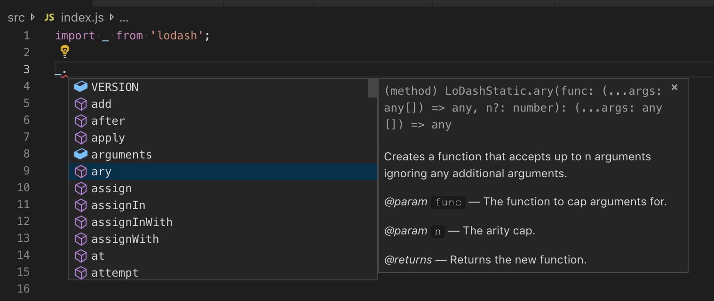
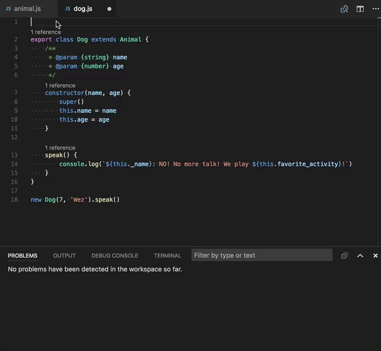
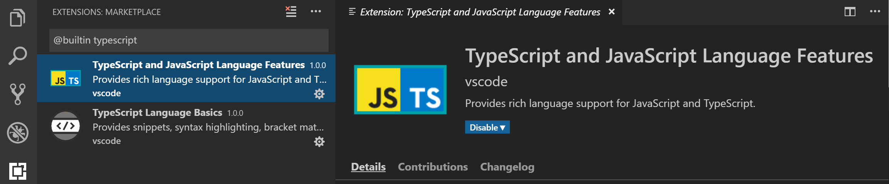

# Working with JavaScript

This topic describes some of the advanced JavaScript features supported by Visual Studio Code. Using the TypeScript language service, VS Code can provide smart completions (IntelliSense) as well as type checking for JavaScript.

## IntelliSense

Visual Studio Code's JavaScript [IntelliSense](/docs/editor/intellisense.md) provides intelligent code completion, parameter info,  references search, and many other advanced language features. Our JavaScript IntelliSense is powered by the [JavaScript language service](https://github.com/microsoft/TypeScript/wiki/JavaScript-Language-Service-in-Visual-Studio) developed by the TypeScript team. While IntelliSense should just work for most JavaScript projects without any configuration, you can make IntelliSense even more useful with [JSDoc](/docs/languages/javascript.md#jsdoc-support) or by configuring a `jsconfig.json` project.

For the details of how JavaScript IntelliSense works, including being based on type inference, JSDoc annotations, TypeScript declarations, and mixing JavaScript and TypeScript projects, see the [JavaScript language service documentation](https://github.com/microsoft/TypeScript/wiki/JavaScript-Language-Service-in-Visual-Studio).

When type inference does not provide the desired information, type information may be provided explicitly with JSDoc annotations. This document describes the [JSDoc annotations](https://www.typescriptlang.org/docs/handbook/type-checking-javascript-files.html#supported-jsdoc) currently supported.

In addition to objects, methods, and properties, the JavaScript IntelliSense window also provides basic word completion for the symbols in your file.

### Typings and Automatic Type Acquisition

IntelliSense for JavaScript libraries and frameworks is powered by TypeScript type declaration (typings) files. Type declaration files are written in TypeScript so they can express the data types of parameters and functions, allowing VS Code to provide a rich IntelliSense experience in a performant manner.

Many popular libraries ship with typings files so you get IntelliSense for them automatically. For libraries that do not include typings, VS Code's `Automatic Type Acquisition` will automatically install community maintained typings file for you.

Automatic type acquisition requires [npmjs](https://www.npmjs.com), the Node.js package manager, which is included with the [Node.js](https://nodejs.org) runtime. In this image you can see IntelliSense, including the method signature, parameter info, and the method's documentation for the popular [lodash](https://lodash.com/) library.



Type declaration files are automatically downloaded and managed by Visual Studio Code for packages listed in your project's `package.json` or that you import into a JavaScript file.

```json
{
    "dependencies": {
        "lodash": "^4.17.0"
    }
}
```

You can alternately explicitly list packages to acquire type declaration files for in a [jsconfig.json](#javascript-projects-jsconfigjson).

```json
{
    "typeAcquisition": {
        "include": [
            "jquery"
        ]
    }
}
```

Most common JavaScript libraries ship with declaration files or have type declaration files available. You can search for a library's type declaration file package using the [TypeSearch](https://microsoft.github.io/TypeSearch) site.

### Fixing npm not installed warning for Automatic Type Acquisition

[Automatic Type Acquisition](#typings-and-automatic-type-acquisition) uses [npm](https://www.npmjs.com), the Node.js package manager, to install and manage Type Declaration (typings) files. To ensure that Automatic Type Acquisition works properly, first ensure that you have npm installed on your machine.

Run `npm --version` from a terminal or command prompt to quickly check that npm is installed and available.

npm is installed with the Node.js runtime, which is available for download from [Nodejs.org](https://nodejs.org). Install the current LTS (Long Term Support) version and the npm executable will be added by default to your system path.

If you have npm installed but still see a warning message, you can explicitly tell VS Code where npm is installed with the `typescript.npm` [setting](/docs/getstarted/settings.md). This should be set to the full path of the npm executable on your machine, and this does not have to match the version of npm you are using to manage packages in your workspace. `typescript.npm` requires TypeScript 2.3.4+.

For example, on Windows, you would add a path like this to your `settings.json` file:

```json
{
  "typescript.npm": "C:\\Program Files\\nodejs\\npm.cmd"
}
```

## JavaScript projects (jsconfig.json)

The presence of a [jsconfig.json](/docs/languages/jsconfig.md) file in a directory indicates that the directory is the root of a JavaScript project. `jsconfig.json` specifies the root files and the options for the language features provided by the [JavaScript language service](https://github.com/microsoft/TypeScript/wiki/JavaScript-Language-Service-in-Visual-Studio). For common setups, a `jsconfig.json` file is not required, however, there are situations when you will want to add a `jsconfig.json`.

- Not all files should be in your JavaScript project (for example, you want to exclude some files from showing IntelliSense). This situation is common with front-end and back-end code.
- Your workspace contains more than one project context. In this situation, you should add a `jsconfig.json` file at the root folder for each project.
- You are using the TypeScript compiler to down-level compile JavaScript source code.

### Location of jsconfig.json

To define our code as a JavaScript project, create `jsconfig.json` at the root of your JavaScript code as shown below. A JavaScript project is the source files of the project and should not include the derived or packaged files (such as a `dist` directory).


In more complex projects, you may have more than one `jsconfig.json` file defined inside a workspace. You will want to do this so that the source code in one project does not appear in the IntelliSense of another project.

Illustrated below is a project with a `client` and `server` folder, showing two separate JavaScript projects:


### Writing jsconfig.json

Below is a simple template for `jsconfig.json` file, which defines the JavaScript `target` to be `ES6` and the `exclude` attribute excludes the `node_modules` folder. You can copy and paste this code into your `jsconfig.json` file.

```json
{
    "compilerOptions": {
        "module": "commonjs",
        "target": "es6"
    },
    "exclude": [
        "node_modules",
        "**/node_modules/*"
    ]
}
```

The `exclude` attribute tells the language service which files are not part of your source code. If IntelliSense is slow, add folders to your `exclude` list (VS Code will prompt you to do this if it detects slow completions). You will want to `exclude` files generated by a build process (such as a `dist` directory). These files will cause suggestions to show up twice and will slow down IntelliSense.

You can explicitly set the files in your project using the `include` attribute. If no `include` attribute is present, then this defaults to including all files in the containing directory and subdirectories. When a `include` attribute is specified, only those files are included.

Here is an example with an explicit `include` attribute:

```json
{
    "compilerOptions": {
        "module": "commonjs",
        "target": "es6"
    },
    "include": [
        "src/**/*"
    ]
}
```

The best practice, and least error prone route, is to use the `include` attribute with a single `src` folder. Note that file paths in `exclude` and `include` are relative to the location of `jsconfig.json`.

For more information, see the full [jsconfig.json documentation](/docs/languages/jsconfig.md).

### Migrating to TypeScript

It is possible to have mixed TypeScript and JavaScript projects. To start migrating to TypeScript, rename your `jsconfig.json` file to `tsconfig.json` and set the `allowJs` property to `true`. For more information, see [Migrating from JavaScript](https://www.typescriptlang.org/docs/handbook/migrating-from-javascript.html).

> **Note:** `jsconfig.json` is the same as a `tsconfig.json` file, only with `allowJs` set to true. See [the documentation for `tsconfig.json`](https://www.typescriptlang.org/docs/handbook/tsconfig-json.html) here to see other available options.

## Type checking JavaScript

VS Code allows you to leverage some of TypeScript's advanced type checking and error reporting functionality in regular JavaScript files. This is a great way to catch common programming mistakes. These type checks also enable some exciting [Quick Fixes]() for JavaScript, including **Add missing import** and **Add missing property**.



TypeScript can infer types in `.js` files same as in `.ts` files. When types cannot be inferred, they can be specified using JSDoc comments. You can read more about how TypeScript uses JSDoc for JavaScript type checking in [Type Checking JavaScript Files](https://www.typescriptlang.org/docs/handbook/type-checking-javascript-files.html).

Type checking of JavaScript is optional and opt-in. Existing JavaScript validation tools such as ESLint can be used alongside the new built-in type checking functionality.

You can get started with type checking a few different ways depending on your needs.

**Per file**

The easiest way to enable type checking in a JavaScript file is by adding `// @ts-check` to the top of a file.

```js
// @ts-check
let itsAsEasyAs = 'abc'
itsAsEasyAs = 123 // Error: Type '123' is not assignable to type 'string'
```

Using `// @ts-check` is a good approach if you just want to try type checking in a few files but not yet enable it for an entire codebase.

**Using a setting**

To enable type checking for all JavaScript files without changing any code, just add `"js/ts.implicitProjectConfig.checkJs": true` to your workspace or user settings. This enables type checking for any JavaScript file that is not part of a `jsconfig.json` or `tsconfig.json` project.

You can opt individual files out of type checking with a `// @ts-nocheck` comment at the top of the file:

```js
// @ts-nocheck
let easy = 'abc'
easy = 123 // no error
```

You can also disable individual errors in a JavaScript file using a `// @ts-ignore` comment on the line before the error:

```js
let easy = 'abc'
// @ts-ignore
easy = 123 // no error
```

**Using jsconfig or tsconfig**

To enable type checking for JavaScript files that are part of a `jsconfig.json` or `tsconfig.json`, add `"checkJs": true` to the project's compiler options:

`jsconfig.json`:

```json
{
    "compilerOptions": {
        "checkJs": true
    },
    "exclude": [
        "node_modules",
        "**/node_modules/*"
    ]
}
```

`tsconfig.json`:

```json
{
    "compilerOptions": {
        "allowJs": true,
        "checkJs": true
    },
    "exclude": [
        "node_modules",
        "**/node_modules/*"
    ]
}
```

This enables type checking for all JavaScript files in the project. You can use `// @ts-nocheck` to disable type checking per file.

JavaScript type checking requires TypeScript 2.3. If you are unsure what version of TypeScript is currently active in your workspace, run the **TypeScript: Select TypeScript Version** command to check. You must have a `.js/.ts` file open in the editor to run this command. If you open a TypeScript file, the version appears in the lower right corner.

### Global variables and type checking

Let's say that you are working in legacy JavaScript code that uses global variables or non-standard DOM APIs:

```ts
window.onload = function() {
    if (window.webkitNotifications.requestPermission() === CAN_NOTIFY) {
        window.webkitNotifications.createNotification(null, 'Woof!', '🐶').show()
    } else {
        alert('Could not notify')
    }
}
```

If you try to use `// @ts-check` with the above code, you'll see a number of errors about the use of global variables:

1. `Line 2` - `Property 'webkitNotifications' does not exist on type 'Window'.`
2. `Line 2` - `Cannot find name 'CAN_NOTIFY'.`
3. `Line 3` - `Property 'webkitNotifications' does not exist on type 'Window'.`

If you want to continue using `// @ts-check` but are confident that these are not actual issues with your application, you have to let TypeScript know about these global variables.

To start, [create a `jsconfig.json`](#javascript-project-jsconfigjson) at the root of your project:

```json
{
    "compilerOptions": { },
    "exclude": [
        "node_modules",
        "**/node_modules/*"
    ]
}
```

Then reload VS Code to make sure the change is applied. The presence of a `jsconfig.json` lets TypeScript know that your Javascript files are part of a larger project.

Now create a `globals.d.ts` file somewhere your workspace:

```ts
interface Window {
    webkitNotifications: any;
}

declare var CAN_NOTIFY: number;
```

`d.ts` files are type declarations. In this case, `globals.d.ts` lets TypeScript know that a global `CAN_NOTIFY` exists and that a `webkitNotifications` property exists on `window`. You can read more about writing `d.ts` in the [TypeScript documentation](https://www.typescriptlang.org/docs/handbook/declaration-files/introduction.html). `d.ts` files do not change how JavaScript is evaluated, they are used only for providing better JavaScript language support.

## Using tasks

### Using the TypeScript compiler

One of the key features of TypeScript is the ability to use the latest JavaScript language features, and emit code that can execute in JavaScript runtimes that don't yet understand those newer features. With JavaScript using the same language service, it too can now take advantage of this same feature.

The TypeScript compiler `tsc` can down-level compile JavaScript files from ES6 to another language level. Configure the `jsconfig.json` with the desired options and then use the –p argument to make `tsc` use your `jsconfig.json` file, for example `tsc -p jsconfig.json` to down-level compile.

Read more about the compiler options for down level compilation in the [jsconfig documentation](/docs/languages/jsconfig.md#down-level-compilation-with-typescript-compiler).

### Running Babel

The [Babel](https://babeljs.io) transpiler turns ES6 files into readable ES5 JavaScript with Source Maps. You can easily integrate **Babel** into your workflow by adding the configuration below to your `tasks.json` file (located under the workspace's `.vscode` folder). The `group` setting makes this task the default **Task: Run Build Task** gesture. `isBackground` tells VS Code to keep running this task in the background. To learn more, go to [Tasks](/docs/editor/tasks.md).

```json
{
    "version": "2.0.0",
    "tasks": [
        {
            "label": "watch",
            "command": "${workspaceFolder}/node_modules/.bin/babel",
            "args": ["src", "--out-dir", "lib", "-w", "--source-maps"],
            "type": "shell",
            "group": { "kind": "build", "isDefault": true },
            "isBackground": true
        }
    ]
}
```

Once you have added this, you can start **Babel** with the `kb(workbench.action.tasks.build)` (**Run Build Task**) command and it will compile all files from the `src` directory into the `lib` directory.

> **Tip:** For help with Babel CLI, see the instructions in [Using Babel](https://babeljs.io/docs/setup/#installation). The example above uses the CLI option.

## Disable JavaScript support

If you prefer to use JavaScript language features supported by other JavaScript language tools such as [Flow](https://flow.org/), you can disable VS Code's built-in JavaScript support. You do this by disabling the built-in TypeScript language extension **TypeScript and JavaScript Language Features** (vscode.typescript-language-features) which also provides the JavaScript language support.

To disable JavaScript/TypeScript support, go to the Extensions view (`kb(workbench.view.extensions)`) and filter on built-in extensions (**Show Built-in Extensions** in the **...** **More Actions** dropdown), then type 'typescript'. Select the **TypeScript and JavaScript Language Features** extension and press the **Disable** button. VS Code built-in extensions cannot be uninstalled, only disabled, and can be re-enabled at any time.


