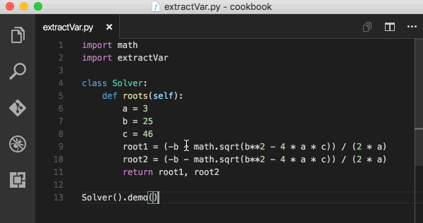

# Editing Python in Visual Studio Code

The Python extension provides many features for editing Python source code in Visual Studio Code:

- [Autocomplete and IntelliSense](#autocomplete-and-intellisense)
- [Quick Fixes](#quick-fixes)
- [Run Selection/Line in Terminal (REPL)](#run-selectionline-in-terminal-repl)
- [Formatting](#formatting)
- [Refactoring](#refactoring)

Also see [Linting](/docs/python/linting.md) and [Jupyter Support](/docs/python/jupyter-support.md).

## Autocomplete and IntelliSense

Autocomplete and IntelliSense are provided for all files within the current working folder and for Python packages that are installed in standard locations.

While editing, you can right-click different identifiers to take advantage of several convenient commands

- **Go to Definition** (`kb(editor.action.revealDefinition)`) jumps from your code into the code that defines an object. This command is helpful when you're working with libraries.

- **Peek Definition** (`kb(editor.action.peekDefinition)`), is similar, but displays the definition directly in the editor (making space in the editor window to avoid obscuring any code). Press `kbstyle(Escape)` to close the Peek window or use the **x** in the upper right corner.

- **Go to Declaration** jumps to the point at which the variable or other object is declared in your code.

- **Peek Declaration** is similar, but displays the declaration directly in the editor. Again, use `kbstyle(Escape)` or the **x** in the upper right corner to close the Peek window.

### Customize IntelliSense behavior

To customize the behavior of the analysis engine, see the [code analysis settings](/docs/python/settings-reference.md#code-analysis-settings) and [autocomplete settings](/docs/python/settings-reference.md#autocomplete-settings).

You can also customize the general behavior of autocomplete and IntelliSense, even to disable these features entirely. See [Customizing IntelliSense](/docs/editor/intellisense.md#customizing-intellisense).


> **Tip**: Check out the [IntelliCode extension for VS Code (preview)](https://go.microsoft.com/fwlink/?linkid=2006060). IntelliCode provides a set of AI-assisted capabilities for IntelliSense in Python, such as inferring the most relevant auto-completions based on the current code context. For more information, see the [IntelliCode for VS Code FAQ](https://docs.microsoft.com/visualstudio/intellicode/intellicode-visual-studio-code).

### Enable IntelliSense for custom package locations

To enable IntelliSense for packages that are installed in other, non-standard locations, add those locations to the `python.autoComplete.extraPaths` collection in the settings file (the default collection is empty). For example, you might have installed Google App Engine installed in custom locations, specified in `app.yaml` if you use Flask. In this case you'd specify those locations as follows:

**Windows:**

```json
"python.autoComplete.extraPaths": [
    "C:/Program Files (x86)/Google/google_appengine",
    "C:/Program Files (x86)/Google/google_appengine/lib/flask-0.12"]
```

**macOS/Linux:**

```json
"python.autoComplete.extraPaths": [
    "~/.local/lib/Google/google_appengine",
    "~/.local/lib/Google/google_appengine/lib/flask-0.12" ]
```

The `python.autocomplete.addBrackets` setting (default `false`) also determines whether VS Code automatically adds parentheses (`()`) when autocompleting a function name. For example, if you set `addBrackets` to `true`:

```json
  "python.autoComplete.addBrackets": true,
```

and then write `import os` followed by `os.getc`, you'll see autocomplete for `os.getcwd`. Selecting that auto-complete adds `os.getcwd()` to your source code and place the cursor inside the parentheses. When the setting is false, only `os.getcwd` is added to the file.

For more on IntelliSense generally, see [IntelliSense](/docs/editor/intellisense.md).

### Troubleshooting

If autocomplete and IntelliSense are not working for a custom module, check the following causes:

| Cause | Solution |
| --- | --- |
| The path to the python interpreter is incorrect | Check the `pythonPath` setting. Restart VS Code if you make a correction. |
| The custom module is located in a non-standard location (not installed using pip). | Add the location to the `python.autoComplete.extraPaths` setting and restart VS Code. |

## Quick Fixes

The add imports Quick Fix allows you to quickly complete import statements. Begin by typing a package name within the editor and you will notice a Code Action is available to automatically complete the line of source code (as long as you have the module installed within the environment). Hover over the text (marked with a squiggle) and then select the Code Action light bulb when it appears. You can then select from a list of potential imports.


The add imports Code Action also recognizes some of the popular abbreviations for the following common Python packages: `numpy` as np, `tensorflow` as tf, `pandas` as pd, `matplotlib.pyplot` as plt, `matplotlib`, as mpl, `math` as m, `scipi.io` as spio, and `scipy` as sp.


The import suggestions list is ordered with import statements for packages (or modules) at the top, followed by statements for additional modules and/or members (classes, objects, etc.) from specified packages.

> **Note**: This functionality requires use of the [Microsoft Python Language Server](https://devblogs.microsoft.com/python/introducing-the-python-language-server). To enable the language server,  set `python.jediEnabled` to **false** in your [settings.json file](/docs/python/settings-reference.md). Additionally, you'll need to make sure that linting is enabled by opening the Command Palette (**View > Command Palette...** or `kb(workbench.action.showCommands)`) and running the **Python: Enable Linting** command (Select **On** in the dropdown menu that appears).

## Run Selection/Line in Terminal (REPL)

The **Python: Run Selection/Line in Python Terminal** command (`kbstyle(Shift+Enter)`) is a simple way to take whatever code is selected, or the code on the current line if there is no selection, and run it in the Python Terminal. An identical **Run Selection/Line in Python Terminal** command is also available on the context menu for a selection in the editor.

VS Code automatically removes indents based on the first non-empty line of the selection, shifting all other lines left accordingly.

Source code that runs in the terminal/REPL is cumulative until the current instance of the terminal is closed.

The command opens the Python Terminal if necessary; you can also open the interactive REPL environment directly using the **Python: Start REPL** command. (Initial startup might take a few moments especially if the first statement you run is an `import`.)

On first use of the **Python: Run Selection/Line in Python Terminal** command, VS Code may send the text to the REPL before that environment is ready, in which case the selection or line is not run. If you encounter this behavior, try the command again when the REPL has finished loading.

## Formatting

Formatting makes code easier to read by human beings by applying specific rules and conventions for line spacing, indents, spacing around operators, and so on (see an example on the [autopep8](https://pypi.org/project/autopep8/) page). Formatting doesn't affect the functionality of the code itself. ([Linting](/docs/python/linting.md), on the other hand, analyzes code for common syntactical, stylistic, and functional errors as well as unconventional programming practices that can lead to errors. Although there is a little overlap between formatting and linting, the two capabilities are complementary.)

The Python extension supports source code formatting using either [autopep8](https://pypi.org/project/autopep8/) (the default), [black](https://github.com/python/black), or [yapf](https://github.com/google/yapf).

### General formatting settings

| Setting<br/>(python.formatting.) | Default value | Description |
| --- | --- | --- |
| provider | `"autopep8"` | Specifies the formatter to use, either "autopep8", "yapf", or "black". |

### Formatter-specific settings

The following settings apply to the individual formatters. The Python extension looks in the current `pythonPath` for the formatter. To use a formatter in another location, specify that location in the appropriate custom path setting. The `pip install` commands may require elevation.

| Formatter | Install steps | Arguments setting<br/>(python.formatting.) | Custom path setting<br/>(python.formatting.) |
| --- | --- | --- | --- |
| autopep8 | pip install pep8<br/>pip install --upgrade autopep8 | autopep8Args | autopep8Path |
| black (see note) | pip install black | blackArgs | blackPath |
| yapf | pip install yapf | yapfArgs | yapfPath |

> **Note**: By default, the Black formatter can't be installed when a Python 2 environment is active. Attempting to do so may display the message "Formatter black is not installed. Install?". If you try to install Black in response, another message appears saying "Could not find a version that satisfies the requirement black' No matching distribution found for black."
>
> To work around this issue and use the Black formatter with Python 2, first install Black in a Python 3 environment. Then set the `python.formatting.blackPath` setting to that install location.

When using custom arguments, each top-level element of an argument string that's separated by space on the command line must be a separate item in the args list. For example:

```json
"python.formatting.autopep8Args": ["--max-line-length", "120", "--experimental"],
"python.formatting.yapfArgs": ["--style", "{based_on_style: chromium, indent_width: 20}"],
"python.formatting.blackArgs": ["--line-length", "100"]
```

In the second example, the top-level element `{based_on_style: chromium, indent_width: 20}` is a single value contained in braces, so the spaces within that value don't delineate a separate element.

### Troubleshooting

If formatting fails, check the following possible causes:

| Cause | Solution |
| --- | --- |
| The path to the python interpreter is incorrect. | Check the `pythonPath` setting. |
| The formatter is not installed in the current environment. | Open a command prompt, navigate to the location specified in the `pythonPath` setting, and run `pip install` for the formatter.
| The path to the formatter is incorrect. | Check the value of the appropriate `python.formatting.<formatter>Path` setting. |
| Custom arguments for the formatter are incorrect. | Check that the appropriate `python.formatting.<formatter>Path` setting does not contain arguments, and that `python.formatting.<formatter>Args` contains a list of individual top-level argument elements such as `"python.formatting.yapfArgs": ["--style", "{based_on_style: chromium, indent_width: 20}"]`. |
| Pop up with warning message `Black does not support the "Format Select" command.` | `black` does not support formatting sections of code, it can be prevented with the following settings `"[python]": {"editor.formatOnPaste": false, "editor.formatOnSaveMode": "file"}`.|

## Refactoring

The Python extension adds the following refactoring commands: **Extract Variable**, **Extract Method**, and **Sort Imports**.

### Extract Variable

Extracts all similar occurrences of the selected text within the current scope, and replaces it with a variable. The new method is given the name `newvariableNNN` where NNN is a random number.

Invoked by:

- Context Menu: right-click a selection and select **Extract Variable**.
- Command Palette (`kb(workbench.action.showCommands)`), then **Python Refactor: Extract Variable**.
- Assign a keyboard shortcut to the `python.refactorExtractVariable` command.



### Extract Method

Extracts all similar occurrences of the selected expression or block of within the current scope, and replaces it with a method call. The new method is given the name `newmethodNNN` where NNN is a random number.

Invoked by:

- Context Menu: right-click a selection and select **Extract Method**.
- Command Palette (`kb(workbench.action.showCommands)`), then **Python Refactor: Extract Method**.
- Assign a keyboard shortcut to the `python.refactorExtractMethod` command.


### Sort Imports

Sort Imports uses the isort package to consolidate specific imports from the same module into a single `import` statement and  to organize `import` statements in alphabetical order.

Invoked by:

- Right-click in editor and select **Sort Imports** (no selection is required)
- Command Palette (`kb(workbench.action.showCommands)`), then **Python Refactor: Sort Imports**
- Assign a keyboard shortcut to the `python.sortImports` command


Custom arguments to isort are specified in the `python.sortImports.args` setting, where each top-level element, as separated by spaces on the command line, is a separate item in the array:

```json
"python.sortImports.args": ["-rc", "--atomic"],
```

To use a custom isort script, use the `python.sortImports.path` setting to specify the path.

Further configurations can be stored in an `.isort.cfg` file as documented on [isort Configuration](https://aka.ms/AA9j6k4).

> **Note**: For those migrating from isort4 to isort5, some CLI flags and config options have changed, refer to the project's [isort5 Upgrade Guide](https://aka.ms/AA9j5x4).

## Next steps

- [Linting](/docs/python/linting.md) - Enable, configure, and apply a variety of Python linters.
- [Debugging](/docs/python/debugging.md) - Learn to debug Python both locally and remotely.
- [Testing](/docs/python/testing.md) - Configure test environments and discover, run, and debug tests.
- [Basic Editing](/docs/editor/codebasics.md) - Learn about the powerful VS Code editor.
- [Code Navigation](/docs/editor/editingevolved.md) - Move quickly through your source code.
- [IntelliSense](/docs/editor/intellisense.md) - Learn about IntelliSense features.
