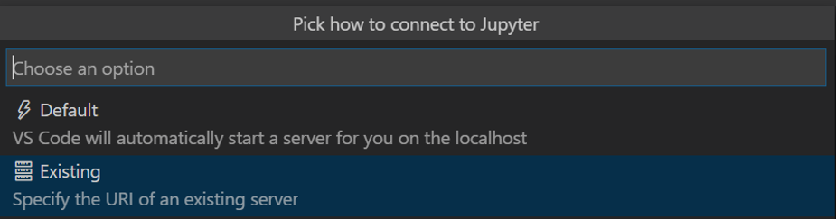
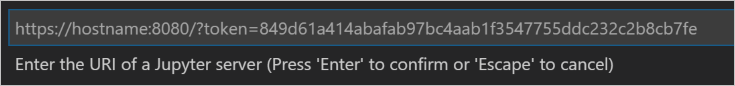

# Working with Jupyter Notebooks in Visual Studio Code

[Jupyter](https://jupyter-notebook.readthedocs.io/en/latest/) (formerly IPython Notebook) is an open-source project that lets you easily combine Markdown text and executable Python source code on one canvas called a **notebook**. Visual Studio Code supports working with Jupyter Notebooks natively, as well as through [Python code files](/docs/python/jupyter-support-py.md). This topic covers the native support available for Jupyter Notebooks and demonstrates how to:

- Create, open, and save Jupyter Notebooks
- Work with Jupyter code cells
- View, inspect, and filter variables using the Variable explorer and Data viewer
- Connect to a remote Jupyter server
- Debug a Jupyter notebook

## Setting up your environment

To work with Jupyter notebooks, you must activate an Anaconda environment in VS Code, or another Python environment in which you've installed the [Jupyter package](https://pypi.org/project/jupyter/). To select an environment, use the **Python: Select Interpreter** command from the Command Palette (`kb(workbench.action.showCommands)`).

Once the appropriate environment is activated, you can create and open a Jupyter Notebook, connect to a remote Jupyter server for running code cells, and export a Jupyter Notebook as a Python file.

> **Note:** By default, the Visual Studio Code Python extension will open a Jupyter Notebook (.ipynb) in the Notebook Editor. If you want to disable this behavior you can turn it off in settings. (Python > Data Science: Use Notebook Editor).

## Create or open a Jupyter Notebook

You can create a Jupyter Notebook by running the **Jupyter: Create Blank New Jupyter Notebook** command from the Command Palette (`kb(workbench.action.showCommands)`) or by creating a new .ipynb file in your workspace. When you select the file, the Notebook Editor is launched allowing you to edit and run code cells.


If you have an existing Jupyter Notebook, you can open it in the Notebook Editor by double-clicking on the file and opening with Visual Studio Code, through the Visual Studio Code, or using the Command Palette **Jupyter: Open in Notebook Editor** command.

Once you have a Notebook created, you can run a code cell using the green run icon above the cell and the output will appear directly below the code cell.


## Trusted Notebooks

It's possible for malicious source code to be contained in a Jupyter Notebook. With that in mind, to help protect you, any Notebook that's not created with VS Code on your local machine (or explicitly set to **Trusted** by you) is considered **Not Trusted**. When a Notebook is **Not Trusted**, VS Code will not render Markdown cells or display the output of code cells within the Notebook. Instead, just the source of Markdown and code cells will be shown. The Notebook is essentially in read-only mode, with toolbars disabled and no ability to edit the file, until you set it as **Trusted**.

> **Note**: Before setting a Notebook as **Trusted**, it is up to you to verify that the source code and Markdown are safe to run. VS Code does not perform any sanitizing of Markdown, it merely prevents it from being rendered until a Notebook is marked as **Trusted** to help protect you from malicious code.

When you first open a Notebook that's **Not Trusted**, the following notification prompt is displayed.


If you select **Trust**, the Notebook will be trusted going forward. If you opt not to trust the Notebook, then **Not Trusted** will be displayed in the toolbar and the Notebook will remain in a read-only state as described previously. If you select **Trust all notebooks**, you will be taken to settings, where you can specify that all Notebooks opened in VS Code be trusted. That means you will no longer be prompted to trust individual notebooks and harmful code could automatically run.


You can relaunch the trust notification prompt after reviewing the Notebook by clicking on the **Not Trusted** status.

## Save your Jupyter Notebook

You can save your Jupyter Notebook using the keyboard combo `kbstyle(Ctrl+S)` or through the save icon on the Notebook Editor toolbar.


> **Note:** At present, you must use the methods discussed above to save your Notebook. The **File**>**Save** menu does not save your Notebook, just the toolbar icon or keyboard command.

## Export your Jupyter Notebook

You can export a Jupyter Notebook as a Python file (.py), a PDF, or an HTML file. To export, just click the convert icon on the main toolbar. You'll then be presented with file options from the Command Palette.

 

> **Note:** For PDF export, you must have TeX installed. If you don't, you will be notified that you need to install it when you select the PDF option. Also, be aware that if you have SVG-only output in your Notebook, they will not be displayed in the PDF. To have SVG graphics in a PDF, either ensure that your output includes a non-SVG image format or else you can first export to HTML and then save as PDF using your browser.

## Work with code cells in the Notebook Editor

The Notebook Editor makes it easy to create, edit, and run code cells within your Jupyter Notebook.

### Create a code cell

By default, a blank Notebook will have an empty code cell for you to start with and an existing Notebook will place one at the bottom. Add your code to the empty code cell to get started.

```python
msg = "Hello world"
print(msg)
```


### Code cell modes

While working with code cells a cell can be in three states, unselected, command mode, and edit mode. The current state of a cell is indicated by a vertical bar to the left of a code cell. When no bar is visible, the cell is unselected.


An unselected cell isn't editable, but you can hover over it to reveal additional cell specific toolbar options. These additional toolbar options appear directly below and to the left of the cell. You'll also see when hovering over a cell that an empty vertical bar is present to the left.


When a cell is selected, it can be in two different modes. It can be in command mode or in edit mode. When the cell is in command mode, it can be operated on and accept keyboard commands. When the cell is in edit mode, the cell's contents (code or Markdown) can be modified.

When a cell is in command mode, the vertical bar to the left of the cell will be solid to indicate it's selected.


 When you're in edit mode, the vertical bar will have diagonal lines.


To move from edit mode to command mode, press the `kbstyle(ESC)` key. To move from command mode to edit mode, press the `kbstyle(Enter)` key. You can also use the mouse to **change the mode** by clicking the vertical bar to the left of the cell or out of the code/Markdown region in the code cell.

### Add additional code cells

Code cells can be added to a Notebook using the main toolbar, a code cell's vertical toolbar, the add code cell icon at the bottom of the Notebook, the add code cell icon at the top of the Notebook (visible with hover), and through keyboard commands.


 Using the plus icon in the main toolbar will add a new cell directly below the currently selected cell. Using the add cell icons at the top and bottom of the Jupyter Notebook, will add a code cell at the top and bottom respectively. And using the add icon in the code cell's toolbar, will add a new code cell directly below it.

When a code cell is in command mode, the `kbstyle(A)` key can be used to add a cell above and the `kbstyle(B)` can be used to add a cell below the selected cell.

### Select a code cell

The selected code cell can be changed using the mouse, the up/down arrow keys on the keyboard, and the `kbstyle(J)` (down) and `kbstyle(K)` (up) keys. To use the keyboard, the cell must be in command mode.

### Run a single code cell

Once your code is added, you can run a cell using the green run arrow and the output will be displayed below the code cell.


You can also use key combos to run a selected code cell. 

- `kbstyle(Ctrl+Enter)` runs the currently selected cell
- `kbstyle(Shift+Enter)` runs the currently selected cell and, if a cell is not already present, inserts a new cell immediately below (focus moves to the below cell in command mode)
- `kbstyle(Alt+Enter)` runs the currently selected cell and inserts a new cell immediately below (focus moves to new cell in edit mode). 

These keyboard combos can be used in both command and edit modes.


### Run multiple code cells

Running multiple code cells can be accomplished in a number of ways. You can use the double arrow in the toolbar of the Notebook Editor to run all cells within the Notebook or the run icons with directional arrows to run all cells above or below the current code cell.


### Run code by line

To help diagnose issues with your Notebook code, run-by-line lets you step through the code of a cell in a line-by-line fashion. While stepping through code you can view the state of variables at each step via the variable explorer or hover your mouse over variables to see data tips.

To start a session, just click the run-by-line icon to the right of the run cell icon on the cell's toolbar.


Once in a run-by-line session, you can run the currently highlighted line of code by pressing the icon again. To exit, just click the stop button next to the run-by-line icon in the cell.

### Move a code cell

Moving code cells up or down within a Notebook can be accomplished using the vertical arrows beside each code cell. Hover over the code cell and then click the up arrow to move the cell up and the down arrow to move the cell down.


### Delete a code cell

Deleting a code cell can be accomplished by hovering over a code cell and using the delete icon in the code cell toolbar or through the keyboard combo `kbstyle(dd)` when the selected code cell is in command mode.


### Undo your last change

You can use the `kbstyle(z)` key to undo your previous change, for example, if you've made an accidental edit you can undo it to the previous correct state, or if you've deleted a cell accidentally you can recover it.

### Switch between code and Markdown

The Notebook Editor allows you to easily change code cells between Markdown and code. By default a code cell is set for code, but just click the Markdown icon (or the code icon, if Markdown was previously set) in the code cell's toolbar to change it.


Once Markdown is set, you can enter Markdown formatted content to the code cell. Once you select another cell or toggle out of the content selection, the Markdown content is rendered in the Notebook Editor.


You can also use the keyboard to change the cell type. When a cell is selected and in command mode, the `kbstyle(M)` key switches the cell type to Markdown and the `kbstyle(Y)` key switches the cell type to code.

### Clear output or restart/interrupt the kernel

If you'd like to clear the code cell output or restart/interrupt the kernel, you can accomplish that using the main Notebook Editor toolbar.


### Enable/Disable line numbers

You can enable or disable line numbering within a code cell using the `kbstyle(L)` key.


## IntelliSense support in the Jupyter Notebook Editor

The Python Jupyter Notebook Editor window has full IntelliSense – code completions, member lists, quick info for methods, and parameter hints. You can be just as productive typing in the Notebook Editor window as you are in the code editor.


## Variable explorer and data viewer

Within the Python Notebook Editor, it's possible to view, inspect, and filter the variables within your current Jupyter session. By clicking the **Variables** icon in the top toolbar after running code and cells, you'll see a list of the current variables, which will automatically update as variables are used in code.


For additional information about your variables, you can also double-click on a row or use the **Show variable in data viewer** button next to the variable to see a more detailed view of a variable in the Data Viewer. Once open, you can filter the values by searching over the rows.


> **Note:** Variable explorer is enabled by default, but can be turned off in settings (Python > Data Science: Show Jupyter Variable Explorer).

## Plot viewer

The Plot Viewer gives you the ability to work more deeply with your plots. In the viewer you can pan, zoom, and navigate plots in the current session. You can also export plots to PDF, SVG, and PNG formats.

Within the Notebook Editor window, double-click any plot to open it in the viewer, or select the plot viewer button on the upper left corner of the plot (visible on hover).


> **Note:** There is support for rendering plots created with [matplotlib](https://matplotlib.org/) and [Altair](https://altair-viz.github.io/index.html).

## Debug a Jupyter Notebook

If you need additional debug support in order to diagnose an issue in your code cells, you can export it as a Python file. Once exported as a Python file, the Visual Studio Code debugger lets you step through your code, set breakpoints, examine state, and analyze problems. Using the debugger is a helpful way to find and correct issues in notebook code. To debug your Python file:

1. In VS Code, if you haven't already, activate a Python environment in which Jupyter is installed.
1. From your Jupyter Notebook (.ipynb) select the convert button in the main toolbar.

   

   Once exported, you'll have a .py file with your code that you can use for debugging.

1. After saving the .py file, to start the debugger, use one of the following options:

    - For the whole Notebook, open the Command Palette (`kb(workbench.action.showCommands)`) and run the **Jupyter: Debug Current File in Python Interactive Window** command.
    - For an individual cell, use the **Debug Cell** adornment that appears above the cell. The debugger specifically starts on the code in that cell. By default, **Debug Cell** just steps into user code. If you want to step into non-user code, you need to uncheck **Data Science: Debug Just My Code** in the Python extension settings (`kb(workbench.action.openSettings)`).

1. To familiarize yourself with the general debugging features of VS Code, such as inspecting variables, setting breakpoints, and other activities, review [VS Code debugging](/docs/editor/debugging.md).

1. As you find issues, stop the debugger, correct your code, save the file, and start the debugger again.

1. When you're satisfied that all your code is correct, use the Python Interactive window to export the Python file as a Jupyter Notebook (.ipynb).

## Connect to a remote Jupyter server

You can offload intensive computation in a Jupyter Notebook to other computers by connecting to a remote Jupyter server. Once connected, code cells run on the remote server rather than the local computer.

To connect to a remote Jupyter server:

1. Run the **Jupyter: Specify local or remote Jupyter server for connections** command from the Command Palette (`kb(workbench.action.showCommands)`).
2. When prompted to **Pick how to connect to Jupyter**, select **Existing: Specify the URI of an existing server**.

    

3. When prompted to **Enter the URI of a Jupyter server**, provide the server's URI (hostname) with the authentication token included with a `?token=` URL parameter. (If you start the server in the VS Code terminal with an authentication token enabled, the URL with the token typically appears in the terminal output from where you can copy it.) Alternatively, you can specify a username and password after providing the URI.

    

> **Note:** For added security, Microsoft recommends configuring your Jupyter server with security precautions such as SSL and token support. This helps ensure that requests sent to the Jupyter server are authenticated and connections to the remoter server are encrypted. For guidance about securing a notebook server, see the [Jupyter docs](https://jupyter-notebook.readthedocs.io/en/stable/public_server.html#securing-a-notebook-server).
