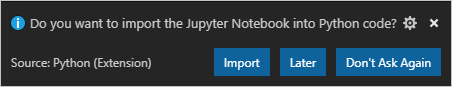

# Working with Jupyter Notebooks in Visual Studio Code

[Jupyter](http://jupyter-notebook.readthedocs.io/en/latest/) (formerly IPython) is an open-source project that lets you easily combine Markdown text and executable Python source code on one canvas called a *notebook*.

To work with Jupyter notebooks, you must activate an Anaconda environment in VS Code, or another Python environment in which you've installed the [Jupyter package](https://pypi.org/project/jupyter/). To select an environment, use the **Python: Select Interpreter** command from the Command Palette (`kb(workbench.action.showCommands)`).

Once the appropriate environment is activated, you can create and run Jupyter-like code cells, connect to a remote Jupyter server for running code cells, open a Jupyter notebook directly, and export Python files as Jupyter notebooks.

## Jupyter code cells

You define Jupyter-like code cells within Python code using a `#%%` comment:

```python
#%%
msg = "Hello World"
print(msg)

#%%
msg = "Hello again"
print(msg)
```

When the Python extension detects a code cell, it adds **Run Cell** and **Run Below** CodeLens adornments, as well as **Run Above** for all cells after the first:


**Run Cell** applies to only the one code cell. **Run Below** applies to that code cell and all that follow. **Run Above** applies to all the code cells up to, but not including, the cell with the adornment. You would use **Run Above**, for example, to initialize the state of the runtime environment before running that specific cell.

Selecting a command starts Jupyter (if necessary, which might take a minute), then runs the appropriate cell(s) in the Python interactive window:


You can also run code cells using the **Python: Run Selection/Line in Python Terminal** command (`kbstyle(Shift+Enter)`). After using this command, the Python extension automatically moves the cursor to the next cell. If you're in the last cell in the file, the extension automatically inserts another `#%%` delimiter for a new cell, mimicking the behavior of a Jupyter notebook.

### Python interactive window

The Python interactive window, mentioned in the previous section, can be used as a standalone console with arbitrary code (with or without code cells). The window also supports [Visual Studio Live Share](https://visualstudio.microsoft.com/services/live-share/).

To use the window as a console, open it with the **Python: Show Python Interactive window** command from the Command Palette. You can then type in code, using `kbstyle(Enter)` to go to a new line and `kbstyle(Shift+Enter)` to run the code.

To use the window with a file, use the **Run Current File in Python Interactive window** command from the Command Palette.

## Variable explorer and data viewer

Within the Python interactive window, it's possible to view, inspect, and filter the variables within your current Jupyter session. By expanding the **Variables** section after running code and cells, you'll see a list of the current variables, which will automatically update as variables are used in code. Clicking on each column header will allow you to sort the variables in the table.


For additional information about your variables, you can also double-click on a row or use the **Show variable in data viewer** button to see a more detailed view of a variable in the Data Viewer. Once open, you can filter the values by searching over the rows.


> **Note:** Variable explorer is enabled by default, but can be turned off in settings (Python > Data Science: Show Jupyter Variable Explorer).

## Connect to a remote Jupyter server

You can offload intensive computation in a Jupyter notebook to other computers by connecting to a remote Jupyter server. Once connected, code cells run on the remote server rather than the local computer.

To connect to a remote Jupyter server:

1. Run the **Python: Specify Jupyter server URI** command from the Command Palette (`kb(workbench.action.showCommands)`).
2. When prompted, provide the server's URI (hostname) with the authentication token included with a `?token=` URL parameter. (If you start the server in the VS Code terminal with an authentication token enabled, the URL with the token typically appears in the terminal output from where you can copy it.)

    

3. The Python interactive window indicates where code is run by displaying the URI (which is blurred out in the image below):

    

## Open Jupyter notebooks

When you've activated an environment with Jupyter installed, you can import a Jupyter notebook file (`.ipynb`) in VS Code as Python code. Once you've imported the file, you can run the code as you would with any other Python file and also use the VS Code debugger. Opening and debugging notebooks in VS Code is a convenient way to find and resolve code bugs, which is difficult to do directly in a Jupyter notebook.

When you open a notebook file, the Python extension prompts you to import the notebook as a Python code file:



Choose **Import**, wait a few seconds, and then VS Code opens the converted notebook in an untitled file. The notebook's cells are delimited in the Python file with `#%%` comments; Markdown cells are converted wholly to comments preceded with `#%% [markdown]`, and render as HTML in the interactive window alongside code and output such as graphs:


If you open the file without importing, it appears as plain text.

> **Note:** The first time you run code in a notebook file, the Python extension starts a Jupyter server. It may take some time for the server to start up and for the **Python Interactive** window to appear with the results of the code.

## Debug a Jupyter notebook

The Visual Studio Code debugger lets you step through your code, set breakpoints, examine state, and analyze problems. Using the debugger is a helpful way to find and correct issues in notebook code.

1. In VS Code, activate a Python environment in which Jupyter is installed, as described at the beginning of this article.

1. Import the notebook's `.ipynb` file into VS Code as described in the previous section. (Download the file first if you're using a cloud-based Jupyter environment such as [Azure Notebooks](https://docs.microsoft.com/azure/notebooks).)

1. Follow the instructions to configure and run the debugger as described on [Tutorial - Configure and run the debugger](/docs/python/python-tutorial.md#configure-and-run-the-debugger), using your imported `.ipynb` file, of course, and setting a breakpoint in an appropriate location in your notebook code.

1. To familiarize yourself with the general debugging features of VS Code, such as inspecting variables, setting breakpoints, and other activities, review [VS Code debugging](/docs/editor/debugging.md).

1. As you find issues, stop the debugger, correct your code, save the file, and run the debugger again.

1. When you're satisfied that all your code is correct. Save the file, then export the notebook as described in the following section. You can then upload the notebook to your normal Jupyter environment.

## Export a Jupyter notebook

In addition to opening a Jupyter notebook, you can also use one of the following commands from the Command Palette (`kb(workbench.action.showCommands)`) to export content from VS Code to a Jupyter notebook (with the `.ipynb` extension).

- **Python: Export Current Python File as Jupyter Notebook**: creates a Jupyter notebook from the contents of the current file, using the `#%%` and `#%% [markdown]` delimiters to specify their respective cell types.
- **Python: Export Current Python File and Output as Jupyter Notebook**: creates a Jupyter notebook from the contents of the current file and includes output from code cells.
- **Python: Export Python Interactive window as Jupyter Notebook**: creates a Jupyter notebook from the contents of the Python interactive window.

After exporting the contents, VS Code displays a prompt through which you can open the notebook in a browser.
