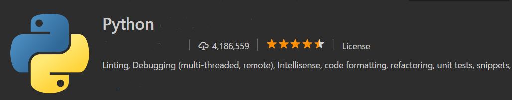

# Using Jupytr and Python in Visual Studio Code

## Next Steps

There is much more to explore with Python in Visual Studio Code:

* [Advanced Configurations](/docs/python/advanced-config.md) - Learn how to customize VS Code for how you like to work.

## Common Questions

**Q: How can I blah with Python?**

**A**: The answer.