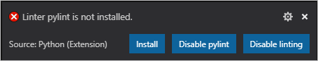
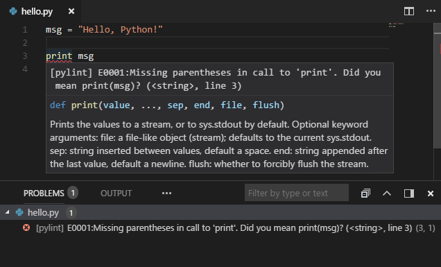

# Linting Python in Visual Studio Code

Linting highlights syntactical and stylistic problems in your Python source code, which oftentimes helps you identify and correct subtle programming errors or unconventional coding practices that can lead to errors. For example, linting detects use of an uninitialized or undefined variable, calls to undefined functions, missing parentheses, and even more subtle issues such as attempting to redefine built-in types or functions. Linting is thus distinct from [Formatting](/docs/python/editing.md#formatting) because linting analyzes how the code runs and detects errors whereas formatting only restructures how code *appears*.

By default, stylistic and syntactical code detection is enabled by the Language Server. If you require third-party linters for additional problem detection, however, you can enable them by using the **Python: Select Linter** command and selecting the appropriate linter. You can easily enable and disable all linting by using the **Python: Enable Linting** command.

## Enable linters

To enable linters other than the default PyLint, open the Command Palette (`kb(workbench.action.showCommands)`) and select the **Python: Select Linter** command. This command adds `"python.linting.<linter>Enabled": true` to your settings, where `<linter>` is the name of the chosen linter. See [Specific linters](#specific-linters) for details.

Enabling a linter prompts you to install the required packages in your selected environment for the chosen linter.



> **Note**: If you're using a global environment and VS Code is not running elevated, linter installation may fail. In that case, either run VS Code elevated, or manually run the Python package manager to install the linter at an elevated command prompt for the same environment: for example `sudo pip3 install pylint` (macOS/Linux) or `pip install pylint` (Windows, at an elevated prompt)

## Disable linting

You can disable all Python linting with the **Python: Enable Linting** command, which shows a dropdown with the current linting state and options to turn Python linting `on` or `off`.


## Run linting

To perform linting:

- Linting runs automatically when you save a file.
- Open the Command Palette (`kb(workbench.action.showCommands)`), then enter and select **Python: Run Linting**.

Issues are shown in the **Problems** panel and as underlines in the code editor. Hovering over an underlined issue displays the details:



## General linting settings

The remainder of this article describes settings for linting in general as well as specific linters. You can add any of the settings to your user `settings.json` file (opened with the **File** > **Preferences** > **Settings** command `kb(workbench.action.openSettings)`). Refer to [User and Workspace settings](/docs/getstarted/settings.md) to find out more about working with settings in VS Code generally.

To change the linting behavior across all enabled linters, modify the following settings:

| Feature | Setting<br/>(python.linting.) | Default value |
| --- | --- | --- |
| Linting in general | enabled | `true` |
| Linting on file save | lintOnSave | `true` |
| Maximum number of linting messages | maxNumberOfProblems | `100` |
| Exclude file and folder patterns | ignorePatterns | `[".vscode/*.py", "**/site-packages/**/*.py"]`  |

You can easily change `python.linting.enabled` by using the **Python: Enable Linting** command.

When enabling `lintOnSave`, you might also want to enable the generic `files.autoSave` option (see [Save / Auto Save](/docs/editor/codebasics.md#save-auto-save)). The combination provides frequent linting feedback in your code as you type.

## Specific linters

The following table provides a summary of available Python linters and their basic settings. Only Pylint is enabled by default. For descriptions of individual settings, see the [Linter settings reference](/docs/python/settings-reference.md#linting-settings).

| Linter | Package name for `pip install` command | Default state | True/false enable setting<br/>(python.linting.) | Arguments setting<br/>(python.linting.) | Custom path setting<br/>(python.linting.) |
| --- | --- | --- | --- | --- | --- |
| [Pylint](#pylint) (default) | [pylint](https://pypi.org/project/pylint/) | Enabled | pylintEnabled | pylintArgs | pylintPath |
| [Flake8](#flake8) | [flake8](https://pypi.org/project/flake8/) | Disabled | flake8Enabled | flake8Args | flake8Path |
| [mypy](#mypy) | [mypy](https://pypi.org/project/mypy/) | Disabled | mypyEnabled | mypyArgs | mypyPath |
| [pydocstyle](#pydocstyle) | [pydocstyle](https://pypi.org/project/pydocstyle/) | Disabled | pydocstyleEnabled | pydocstyleArgs | pydocstylePath |
| [pycodestyle (pep8)](#pycodestyle-pep8) | [pycodestyle](https://pypi.org/project/pycodestyle/) | Disabled | pycodestyleEnabled | pycodestyleArgs | pycodestylePath |
| [prospector](#prospector) | [prospector](https://pypi.org/project/prospector/) | Disabled | prospectorEnabled | prospectorArgs | prospectorPath |
| pylama | [pylama](https://pypi.org/project/pylama/) | Disabled | pylamaEnabled | pylamaArgs | pylamaPath |
| bandit | [bandit](https://pypi.org/project/bandit/) | Disabled | banditEnabled | banditArgs | banditPath |

To select a different linter, use the **Python: Select Linter** command. You can also edit your settings manually to enable multiple linters. Note, however, that using the **Select Linter** command overwrites those edits.

Custom arguments are specified in the appropriate arguments setting for each linter. Each top-level element of an argument string that's separated by a space on the command line must be a separate item in the args list. For example:

```json
"python.linting.pylintArgs": ["--reports", "12", "--disable", "I0011"],
"python.linting.flake8Args": ["--ignore=E24,W504", "--verbose"]
"python.linting.pydocstyleArgs": ["--ignore=D400", "--ignore=D4"]
```

Note that if a top-level element is a single value, as delineated by quotation marks or braces, it still appears as a single item in the list even if the value itself contains spaces.

A custom path is generally unnecessary as the Python extension resolves the path to the linter based on the Python interpreter being used (see [Environments](/docs/python/environments.md)). To use a different version of a linter, specify its path in the appropriate custom path setting. For example, if your selected interpreter is a virtual environment but you want to use a linter that's installed in a global environment, then set the appropriate path setting to point to the global environment's linter.

The sections that follow provide additional details for those individual linters linked in the table. In general, custom rules must be specified in a separate file as required by the linter you're using.

## Pylint

Pylint messages fall into the categories in the following table with the indicated mapping to VS Code categories. You can change the setting to change the mapping.

| Pylint category | Description | VS Code category mapping | Applicable setting<br/>(python.linting.) |
| --- | --- | --- | --- |
| Convention (C) | Programming standard violation | Information (green underline) | pylintCategorySeverity.convention |
| Refactor (R) | Bad code smell | Hint (light bulbs) | pylintCategorySeverity.refactor |
| Warning (W) | Python-specific problems | Warning | pylintCategorySeverity.warning |
| Error (E) | Likely code bugs | Error (red underline) | pylintCategorySeverity.error |
| Fatal (F) | An error prevented further Pylint processing | Error | pylintCategorySeverity.fatal |

### Default Pylint rules

Python in Visual Studio code is configured by default to use a set of linting rules that are friendly to the largest number of  Python developers:

- Enable all Error (E) and Fatal (F) messages.
- Disable all Convention (C) and Refactor (R) messages.
- Disable all Warning (W) messages except the following:
  - unreachable (W0101): Unreachable code
  - duplicate-key (W0109): Duplicate key %r in dictionary
  - unnecessary-semicolon (W0301): Unnecessary semicolon
  - global-variable-not-assigned (W0602): Using global for %r but no assignment is done
  - unused-variable (W0612): Unused variable %r
  - binary-op-exception (W0711): Exception to catch is the result of a binary "%s" operation
  - bad-format-string (W1302): Invalid format string
  - anomalous-backslash-in-string (W1401): Anomalous backslash in string
  - bad-open-mode (W1501): "%s" is not a valid mode for open

These rules are applied through the following default arguments passed to Pylint:

```
--disable=all --enable=F,E,unreachable,duplicate-key,unnecessary-semicolon,global-variable-not-assigned,unused-variable,binary-op-exception,bad-format-string,anomalous-backslash-in-string,bad-open-mode
```

These arguments are passed whenever the `python.linting.pylintUseMinimalCheckers` is set to `true` (the default). If you specify a value in `pylintArgs` or use a Pylint configuration file (see the next section), then `pylintUseMinimalCheckers` is implicitly set to `false`.

For the complete list of Pylint messages, see [readable-pylint-messages](https://github.com/janjur/readable-pylint-messages/blob/master/README.md) (GitHub).

### Command-line arguments and configuration files

See [Pylint command-line arguments](https://pylint.readthedocs.io/en/latest/user_guide/run.html#command-line-options) for general switches. Command-line arguments can be used to load Pylint plugins, such as the plugin for Django:

```json
"python.linting.pylintArgs": ["--load-plugins", "pylint_django"]
```

Options can also be specified in a `pylintrc` or `.pylintrc` options file in the workspace folder, as described on [Pylint command line arguments](https://pylint.readthedocs.io/en/latest/user_guide/run.html#command-line-options).

To control which Pylint messages are shown, add the following contents to an options file:

```ini
[MESSAGES CONTROL]

# Enable the message, report, category or checker with the given id(s). You can
# either give multiple identifier separated by comma (,) or put this option
# multiple time.
#enable=

# Disable the message, report, category or checker with the given id(s). You
# can either give multiple identifier separated by comma (,) or put this option
# multiple time (only on the command line, not in the configuration file where
# it should appear only once).
#disable=
```

You can easily generate an options file using Pylint itself:

```bash
# Using an *nix shell or cmd on Windows
pylint --generate-rcfile > .pylintrc
```

For PowerShell you have to explicitly specify a UTF-8 output encoding:

```ps
pylint --generate-rcfile | Out-File -Encoding utf8 .pylintrc
```

The generated file contains sections for all the Pylint options, along with documentation in the comments.

## pydocstyle

### Command-line arguments and configuration files

See [pydocstyle Command Line Interface](https://www.pydocstyle.org/en/2.1.1/usage.html#cli-usage) for general options. For example, to ignore error D400 (first line should end with a period), add the following line to your `settings.json` file:

```json
"python.linting.pydocstyleArgs": ["--ignore=D400"]
```

A code prefix also instructs pydocstyle to ignore specific categories of errors. For example, to ignore all Docstring Content issues (D4XXX errors), add the following line to `settings.json`:

```json
"python.linting.pydocstyleArgs": ["--ignore=D4"]
```

More details can be found in the [pydocstyle documentation](https://www.pydocstyle.org/en/2.1.1/usage.html#cli-usage).

Options can also be read from a `[pydocstyle]` section of any of the following configuration files:

- `setup.cfg`
- `tox.ini`
- `.pydocstyle`
- `.pydocstyle.ini`
- `.pydocstylerc`
- `.pydocstylerc.ini`

For more information, see [Configuration Files](https://www.pydocstyle.org/en/2.1.1/usage.html#configuration-files).

### Message category mapping

The Python extension maps all pydocstyle errors to the Convention (C) category.

## pycodestyle (pep8)

### Command-line arguments and configuration files

See [pycodestyle example usage and output](https://pycodestyle.pycqa.org/en/latest/intro.html#example-usage-and-output) for general switches. For example, to ignore error E303 (too many blank lines), add the following line to your `settings.json` file:

```json
"python.linting.pycodestyleArgs": ["--ignore=E303"]
```

pycodestyle options are read from the `[pycodestyle]` section of a `tox.ini` or `setup.cfg` file located in any parent folder of the path(s) being processed. For details, see [pycodestyle configuration](https://pycodestyle.pycqa.org/en/latest/intro.html#configuration).

### Message category mapping

The Python extension maps pycodestyle message categories to VS Code categories through the following settings. If desired, change the setting to change the mapping.

| pycodestyle category | Applicable setting<br/>(python.linting.) | VS Code category mapping |
| --- | --- | --- |
| W | pycodestyleCategorySeverity.W | Warning |
| E | pycodestyleCategorySeverity.E | Error |

## Prospector

### Command-line arguments and configuration files

See [Prospector Command Line Usage](https://prospector.readthedocs.io/en/master/usage.html) for general options. For example, to set a strictness level of "very high," add the following line to your `settings.json` file:

```json
"python.linting.prospectorArgs": ["-s", "veryhigh"]
```

It's common with Prospector to use [profiles](https://prospector.readthedocs.io/en/master/profiles.html) to configure how Prospector runs. By default, Prospector loads the profile from a `.prospector.yaml` file in the current folder.

Because Prospector calls other tools, such as Pylint, any configuration files for those tools override tool-specific settings in `.prospector.yaml`.  For example, suppose you specify the following in `.prospector.yaml`:

```yaml
pylint:
  disable:
    - too-many-arguments
```

If you also have a `.pylintrc` file that enables the `too-many-arguments` warning, you continue to see the warning from Pylint within VS Code.

### Message category mapping

The Python extension maps all Prospector errors and warnings to the Error (E) category.

## Flake8

### Command-line arguments and configuration files

See [Invoking Flake8](https://flake8.pycqa.org/en/latest/user/invocation.html) for general switches. For example, to ignore error E303 (too many blank lines), use the following setting:

```json
"python.linting.flake8Args": ["--ignore=E303"]
```

By default, Flake8 ignores E121, E123, E126, E226, E24, and E704.

Flake8 user options are read from the `C:\Users\<username>\.flake8` (Windows) or `~/.config/flake8` (macOS/Linux) file.

At the project level, options are read from the `[flake8]` section of a `tox.ini`, `setup.cfg`, or `.flake8` file.

For details, see [Flake8 configuration](https://flake8.pycqa.org/en/latest/user/configuration.html).

### Message category mapping

The Python extension maps flake8 message categories to VS Code categories through the following settings. If desired, change the setting to change the mapping.

| Flake8 category | Applicable setting<br/>(python.linting.) | VS Code category mapping |
| --- | --- | --- |
| F | flake8CategorySeverity.F | Error |
| E | flake8CategorySeverity.E | Error |
| W | flake8CategorySeverity.W | Warning |

## mypy

### Message category mapping

The Python extension maps mypy message categories to VS Code categories through the following settings. If desired, change the setting to change the mapping.

| mypy category | Applicable setting<br/>(python.linting.) | VS Code category mapping |
| --- | --- | --- |
| error | mypyCategorySeverity.error | Error |
| note | mypyCategorySeverity.note | Information |

## Troubleshooting linting

| Error message | Cause | Solution |
| --- | --- | --- |
| ... unable to import \<module_name\> | The Python extension is using the wrong version of Pylint. | Ensure that the `pythonPath` setting points to a valid Python installation where Pylint is installed. Alternately, set the `python.linting.pylintPath` to an appropriate version of Pylint for the Python interpreter being used. |
| Linting with \<linter\> failed ... | The path to the Python interpreter is incorrect. | Check the `pythonPath` setting (see [Environments](/docs/python/environments.md)). |
| | The linter has not been installed in the current Python environment. | Open a command window, navigate to the location of the Python interpreter in the `pythonPath` setting, and run `pip install` for the linter. |
| | The path to the linter is incorrect. | Ensure that the appropriate `python.linting.<linter>Path` setting for the linter is correct. |
| | Custom arguments are defined incorrectly. | Check the appropriate `python.linting.<linter>Args` settings, and that the value of the setting is a list of the argument elements that are separated by spaces. For example, `"python.linting.pylintPath": "pylint --load-plugins pylint_django"` is incorrect. The correct syntax is `"python.linting.pylintArgs": ["--load-plugins", "pylint_django"]`. |

## Next steps

- [Debugging](/docs/python/debugging.md) - Learn to debug Python both locally and remotely.
- [Testing](/docs/python/testing.md) - Configure test environments and discover, run, and debug tests.
- [Basic Editing](/docs/editor/codebasics.md) - Learn about the powerful VS Code editor.
- [Code Navigation](/docs/editor/editingevolved.md) - Move quickly through your source code.
