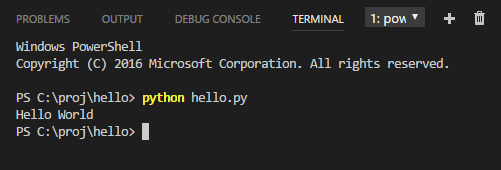
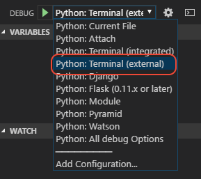

# Getting Started with Python

Let's get started by creating the simplest "Hello World" Python application.

## Prerequisites

To successfully complete this tutorial, you must do the following:

1. Install the [Python extension](https://marketplace.visualstudio.com/items?itemName=ms-python.python).

2. Install whichever version of Python you want to use. Options include:

  - The built-in Python installation on Linux.
  - An installation through [Homebrew](https://brew.sh/) on macOS using `brew install python3` (the system install of Python on macOS is not supported).
  - A download from [python.org](https://www.python.org/downloads/).
  - A download from [Anaconda](https://www.anaconda.com/download/) (for data science purposes).

3. From within VS Code, select a version of Python using the **Python: Select Interpreter** command on the **Command Palette** (`kb(workbench.action.showCommands)`), or by using the **Select Python Environment** option on the Status Bar if available:

    

    The command presents a list of available interpreters that VS Code can find automatically. If you don't see the desired interpreter, see [Configuring Python environments](/docs/python/environments.md).

## Create a folder and source code file

Create an empty folder called "hello", navigate into it, and open VS Code (`code`) in that folder (`.`):

```bash
mkdir hello
cd hello
code .
```

From the File Explorer toolbar, press the New File button:


Name the file `hello.py`, and it automatically opens in the editor:


By using the `.py` file extension, VS Code interprets this file as Python and evaluates the contents with the Python extension.

Next, start entering the following source code:

```python
msg = "Hello World"
print(msg)
```

When you start typing `print`, notice how [IntelliSense](/docs/editor/intellisense.md) presents auto-completion options.


IntelliSense and auto-completions work for standard Python modules as well as other packages you've installed into your Python environment. It also provides completions for methods available on object types. For example, because the `msg` variable contains a string, IntelliSense provides string methods then you type `msg.`:


Feel free to experiment with IntelliSense some more, but then revert changes so you have only the `msg` variable and the `print` call, and save the file (`kb(workbench.action.files.save)`).

For full details on editing, formatting, and refactoring, see [Editing code](/docs/python/editing.md). The Python extension also has full support for [Linting](/docs/python/linting.md).

## Running Hello World

It's simple to run `hello.py` with Python. From an external terminal, type `python3 hello.py` (macOS/Linux) or `python hello.py` (Windows, assuming Python is in your PATH). Either way you should see "Hello World" as output.

You can also use the VS Code [integrated terminal](/docs/editor/integrated-terminal.md), opened using **View > Integrated Terminal** (`kb(workbench.action.terminal.toggleTerminal)` with the backtick character), to stay within the context of VS Code. Then you can just run `python hello.py` directly:



## Debugging Hello World

Let's now try debugging our simple Hello World application.

First, set a breakpoint in `hello.py` by placing the cursor on the `print` call and pressing `kb(editor.debug.action.toggleBreakpoint)`. Alternately, just click in the editor left gutter next to the line numbers. A red circle  appears in the gutter.


Next, select the Debug View in the sidebar:


Now you need to configure `launch.json` for Python by clicking the settings icon on the debug toolbar:


This command automatically creates a `launch.json` with a number of Python configurations, which appear in the configurations drop-down:


These different configurations are fully explained in [Debugging](/docs/python/debugging.md); for now, just select "Python," which runs the current file using the current Python environment, and automatically stops the debugger when the program starts. (See the `stopOnEntry` setting in the configuration).

Run the debugger by clicking the green arrow in the Debug toolbar or pressing `kb(workbench.action.debug.start)`. Because `stopOnEntry` is set to true in the configuration, the debugger stops on the first line of the file. If you examine the **Local** variables window at this point, you see that only automatic dunder variables are defined:


Notice also that a debug toolbar appears with commands to run, step, restart, and stop the program, and that the Status Bar changes to an orange color to indicate debug mode. The **Debug Console** also appears automatically.

Click the green arrow to continue running the program (`kb(workbench.action.debug.start)`), and the debugger stops on the breakpoint. The now-defined `msg` variable appears in the **Local** pane and you can work with the variable in the debug console:


Click the green arrow again to run the program to completion. "Hello World" appears in the debug console and VS Code exits debugging mode once the program is complete.

> **Tip**: Although the debug console works well for output, it presently cannot take input from a Python program through the `input` or `raw_input` functions. In those cases it's necessary to run the debugger using an external terminal. This is easily done by selecting the **External Terminal** debug configuration:<br>
> 

For full details, see [Debugging](/docs/python/debugging.md).

## Installing packages

Let's now run an example that's a little more interesting, using matplotlib and NumPy.

Return to **Explorer**, create a new file called `standardplot.py`, and paste in the following source code:

```python
#%%
import matplotlib.pyplot as plt
import matplotlib as mpl
import numpy as np

x = np.linspace(0, 20, 100)
plt.plot(x, np.sin(x))
plt.show()
```

Try running the file in the debugger as described in the last section. If you run the program to completion, it may fail if matplotlib and numpy are not installed in the current environment.

This is easy to remedy. Go to the **Terminal** and enter `pip3 install matplotlib`, and VS Code installs that package into your project along with its dependencies (including NumPy). Note that if you don't want to install matplotlib and its dependencies globally then use a [virtual environment](https://docs.python.org/3/tutorial/venv.html).

Rerun the program now and a plot window appears with the output:


You can configure VS Code to use any Python environment you have installed, including virtual environments. You can also use a separate environment for debugging. For full details, see [Environments](/docs/python/environments.md).

## Next steps

There is much more to explore with Python in Visual Studio Code:

- [Python environments](/docs/python/environments.md) - Control which Python interpreter is used for editing and debugging.
- [Editing code](/docs/python/editing.md) - Learn about autocomplete, IntelliSense, formatting, and refactoring for Python.
- [Linting](/docs/python/linting.md) - Enable, configure, and apply a variety of Python linters.
- [Debugging](/docs/python/debugging.md) - Learn to debug Python both locally and remotely.
- [Unit testing](/docs/python/unit-testing.md) - Configure unit test environments and discover, run, and debug tests.
- [Settings reference](/docs/python/settings-reference.md) - Explore the full range of Python-related settings in VS Code.
