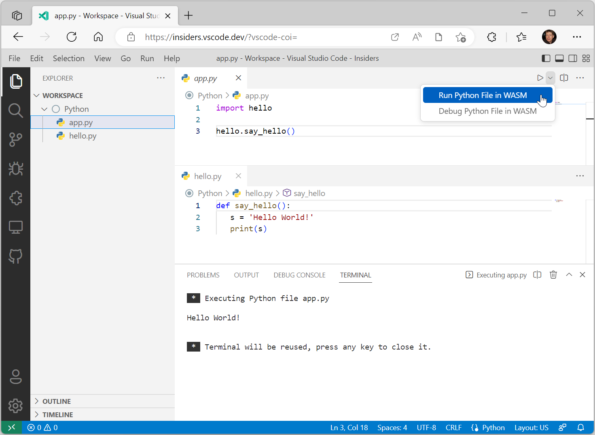
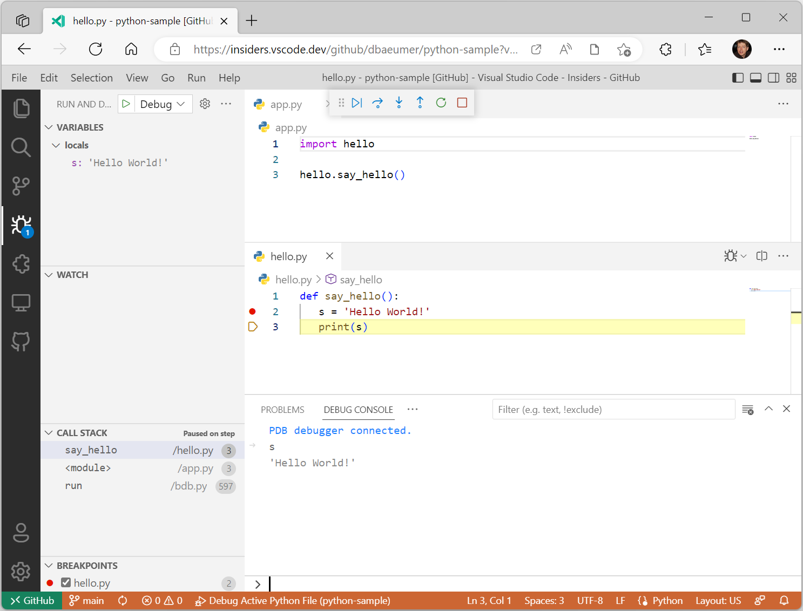

# Run and Debug Python in the Web

We are happy to announce **experimental** support for running Python code on the Web. To try it out, install the latest pre-release version of the [Experimental - Python for the Web](https://marketplace.visualstudio.com/items?itemName=ms-vscode.vscode-python-web-wasm) extension from the Marketplace. This work is based on WASM in Python, which is currently in development. To learn more about how it works and the ongoing progress, you can read [Compiling Python to WebAssembly (WASM)](https://pythondev.readthedocs.io/wasm.html).

## Prerequisites

The following prerequisites are needed to use the extension:

* You need to have the [GitHub Repositories](https://marketplace.visualstudio.com/items?itemName=GitHub.remotehub) extension installed.
* You need to authenticate with GitHub.
* You need to use a browser that supports [cross-origin isolation](https://developer.chrome.com/docs/extensions/mv3/cross-origin-isolation/). The extension has been tested with the Microsoft Edge and Google Chrome browsers.
* You need to use the insider version of [VS Code for the Web](/docs/editor/vscode-web.md) (for example `https://insiders.vscode.dev/`)
* Your source code must be hosted either on your local file system or a GitHub repository that is accessed through the [GitHub Repositories](https://marketplace.visualstudio.com/items?itemName=GitHub.remotehub) extension.
* When starting [VS Code for the Web](/docs/editor/vscode-web.md), you need to add the following query parameter to the end of the URL: `?vscode-coi=`.

## Run Hello World

The screenshot below shows the execution of a simple Python program in the browser. The program consists of two files `app.py` and `hello.py` stored on the local file system.



## Start a REPL

The extension comes with an integrated Python REPL. To activate it, run the command **Python WASM: Start REPL**.


## Debugging

There is support for debugging Python files on the Web and it uses the same UI as VS Code Desktop [debugging](/docs/python/debugging.md). The features currently supported are:

* Set breakpoints
* Step into and out of functions
* Debug across modules
* Evaluate variables in the Debug Console
* Debug the program in the Integrated Terminal

The screenshot below shows an active debug session. The files are hosted directly on GitHub on this [sample repository](https://github.com/dbaeumer/python-sample).



## Create your own Python environment

The extension uses a pre-configured Python environment based on the [CPython WebAssembly builds](https://github.com/tiran/cpython-wasm-test/releases). The build used is `Python-3.11.0-wasm32-wasi-16.zip`.

You can create your own Python environment, including source wheel Python packages, following these steps:

* Create a new GitHub repository.
* Download a wasm-wasi-16 build from [cpython-wasm-test/releases](https://github.com/tiran/cpython-wasm-test/releases) and expand it into the root of the repository.
* To add source wheel packages, do the following:
  * Create a `site-packages` folder in the root.
  * Install the package using the following command `pip install my_package --target ./site-packages`. Note that you need to have a Python installation in your OS including pip.
* Commit the changes.
* Change the `python.wasm.runtime` setting to point to your GitHub repository. For example:

  ```json
  {
    "python.wasm.runtime": "https://github.com/dbaeumer/python-3.11.0"
  }
  ```

## Limitations

The Python for the Web support doesn't provide all the features available when running source code on your local machine. The major limitations in the Python interpreter are:

* No socket support.
* No thread support. As a consequence, there is no async support.
* No pip support.
* No support for native Python modules.

## Acknowledgment

The work would have not been possible without the support of the Python community, who are building and maintaining the necessary WASM files of CPython.

## Feedback

If you run into issues while using the Python for the Web extension, you can enter issues in the [vscode-python-web-wasm](https://github.com/microsoft/vscode-python-web-wasm) repository.
