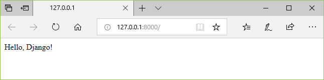
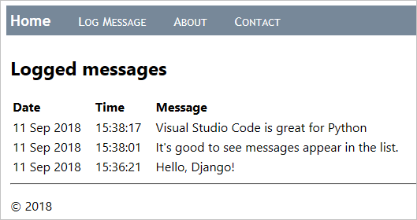
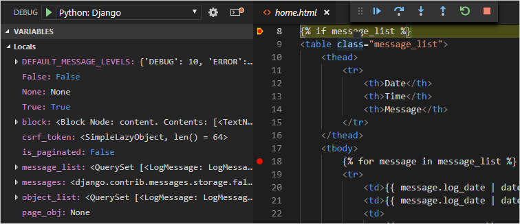

# Django Tutorial in Visual Studio Code

Django is a high-level Python framework designed for rapid, secure, and scalable web development. Django includes rich support for URL routing, page templates, and working with data.

In this Django tutorial, you create a simple Django app with three pages that use a common base template. You create this app in the context of Visual Studio Code in order to understand how to work with Django in the VS Code terminal, editor, and debugger. This tutorial does not explore various details about Django itself, such as working with data models and creating an administrative interface. For guidance on those aspects, refer to the Django documentation links at the end of this tutorial.

The completed code project from this Django tutorial can be found on GitHub: [python-sample-vscode-django-tutorial](https://github.com/microsoft/python-sample-vscode-django-tutorial).

If you have any problems, feel free to file an issue for this tutorial in the [VS Code documentation repository](https://github.com/microsoft/vscode-docs/issues).

## Prerequisites

To successfully complete this Django tutorial, you must do the following (which are the same steps as in the [general Python tutorial](/docs/python/python-tutorial.md)):

1. Install the [Python extension](https://marketplace.visualstudio.com/items?itemName=ms-python.python).

1. Install a version of Python 3 (for which this tutorial is written). Options include:
   - (All operating systems) A download from [python.org](https://www.python.org/downloads/); typically use the **Download Python 3.9.1** button that appears first on the page (or whatever is the latest version).
   - (Linux) The built-in Python 3 installation works well, but to install other Python packages you must run `sudo apt install python3-pip` in the terminal.
   - (macOS) An installation through [Homebrew](https://brew.sh/) on macOS using `brew install python3` (the system install of Python on macOS is not supported).
   - (All operating systems) A download from [Anaconda](https://www.anaconda.com/download/) (for data science purposes).

1. On Windows, make sure the location of your Python interpreter is included in your PATH environment variable. You can check the location by running `path` at the command prompt. If the Python interpreter's folder isn't included, open Windows Settings, search for "environment", select **Edit environment variables for your account**, then edit the **Path** variable to include that folder.

## Create a project environment for the Django tutorial

In this section, you create a virtual environment in which Django is installed. Using a virtual environment avoids installing Django into a global Python environment and gives you exact control over the libraries used in an application. A virtual environment also makes it easy to [Create a requirements.txt file for the environment](#create-a-requirementstxt-file-for-the-environment).

1. On your file system, create a project folder for this tutorial, such as `hello_django`.

1. In that folder, use the following command (as appropriate to your computer) to create a virtual environment named `env` based on your current interpreter:

    ```bash
    # Linux
    sudo apt-get install python3-venv    # If needed
    python3 -m venv env

    # macOS
    python3 -m venv env

    # Windows
    python -m venv env
    ```

    > **Note**: Use a stock Python installation when running the above commands. If you use `python.exe` from an Anaconda installation, you see an error because the ensurepip module isn't available, and the environment is left in an unfinished state.

1. Open the project folder in VS Code by running `code .`, or by running VS Code and using the **File** > **Open Folder** command.

1. In VS Code, open the Command Palette (**View** > **Command Palette** or (`kb(workbench.action.showCommands)`)). Then select the **Python: Select Interpreter** command:

    

1. The command presents a list of available interpreters that VS Code can locate automatically (your list will vary; if you don't see the desired interpreter, see [Configuring Python environments](/docs/python/environments.md)). From the list, select the virtual environment in your project folder that starts with `./env` or `.\env`:

    

1. Run [**Terminal: Create New Integrated Terminal**](/docs/editor/integrated-terminal.md)  (`kb(workbench.action.terminal.new)`) from the Command Palette, which creates a terminal and automatically activates the virtual environment by running its activation script.

    > **Note**: On Windows, if your default terminal type is PowerShell, you may see an error that it cannot run activate.ps1 because running scripts is disabled on the system. The error provides a link for information on how to allow scripts. Otherwise, use **Terminal: Select Default Shell** to set "Command Prompt" or "Git Bash" as your default instead.

1. The selected environment appears on the left side of the VS Code status bar, and notice the "(venv)" indicator that tells you that you're using a virtual environment:

    

1. Update pip in the virtual environment by running the following command in the VS Code Terminal:

   ```bash
   python -m pip install --upgrade pip
   ```

1. Install Django in the virtual environment by running the following command in the VS Code Terminal:

    ```bash
    python -m pip install django
    ```

You now have a self-contained environment ready for writing Django code. VS Code activates the environment automatically when you use [**Terminal: Create New Integrated Terminal**](/docs/editor/integrated-terminal.md)  (`kb(workbench.action.terminal.new)`). If you open a separate command prompt or terminal, activate the environment by running `source env/bin/activate` (Linux/macOS) or `env\Scripts\Activate.ps1` (Windows).  You know the environment is activated when the command prompt shows **(env)** at the beginning.

## Create and run a minimal Django app

In Django terminology, a "Django project" is composed of several site-level configuration files along with one or more "apps" that you deploy to a web host to create a full web application. A Django project can contain multiple apps, each of which typically has an independent function in the project, and the same app can be in multiple Django projects. An app, for its part, is just a Python package that follows certain conventions that Django expects.

To create a minimal Django app, then, it's necessary to first create the Django project to serve as the container for the app, then create the app itself. For both purposes, you use the Django administrative utility, `django-admin`, which is installed when you install the Django package.

### Create the Django project

1. In the VS Code Terminal where your virtual environment is activated, run the following command:

    ```bash
    django-admin startproject web_project .
    ```

    This `startproject` command assumes (by use of `.` at the end) that the current folder is your project folder, and creates the following within it:

    - `manage.py`: The Django command-line administrative utility for the project. You run administrative commands for the project using `python manage.py <command> [options]`.

    - A subfolder named `web_project`, which contains the following files:
        - `__init__.py`: an empty file that tells Python that this folder is a Python package.
        - `asgi.py`: an entry point for [ASGI-compatible](https://asgi.readthedocs.io/en/latest/) web servers to serve your project. You typically leave this file as-is as it provides the hooks for production web servers.
        - `settings.py`: contains settings for Django project, which you modify in the course of developing a web app.
        - `urls.py`: contains a table of contents for the Django project, which you also modify in the course of development.
        - `wsgi.py`: an entry point for WSGI-compatible web servers to serve your project. You typically leave this file as-is as it provides the hooks for production web servers.

1. Create an empty development database by running the following command:

    ```bash
    python manage.py migrate
    ```

    When you run the server the first time, it creates a default SQLite database in the file `db.sqlite3` that is intended for development purposes, but can be used in production for low-volume web apps. For additional information about databases, see the [Types of databases](#types-of-databases) section.

1. To verify the Django project, make sure your virtual environment is activated, then start Django's development server using the command `python manage.py runserver`. The server runs on the default port 8000, and you see output like the following output in the terminal window:

    ```
    Performing system checks...

    System check identified no issues (0 silenced).

    January 15, 2021 - 14:33:31
    Django version 3.1.5, using settings 'web_project.settings'
    Starting development server at http://127.0.0.1:8000/
    Quit the server with CTRL-BREAK.
    ```

    Django's built-in web server is intended *only* for local development purposes. When you deploy to a web host, however, Django uses the host's web server instead. The `wsgi.py` and `asgi.py` modules in the Django project take care of hooking into the production servers.

    If you want to use a different port than the default 8000, specify the port number on the command line, such as `python manage.py runserver 5000`.

1. `kbstyle(Ctrl+click)` the `http://127.0.0.1:8000/` URL in the terminal output window to open your default browser to that address. If Django is installed correctly and the project is valid, you see the default page shown below. The VS Code terminal output window also shows the server log.

    

1. When you're done, close the browser window and stop the server in VS Code using `kbstyle(Ctrl+C)` as indicated in the terminal output window.

### Create a Django app

1. In the VS Code Terminal with your virtual environment activated, run the administrative utility's `startapp` command in your project folder (where `manage.py` resides):

    ```bash
    python manage.py startapp hello
    ```

    The command creates a folder called `hello` that contains a number of code files and one subfolder. Of these, you frequently work with `views.py` (that contains the functions that define pages in your web app) and `models.py` (that contains classes defining your data objects). The `migrations` folder is used by Django's administrative utility to manage database versions as discussed later in this tutorial. There are also the files `apps.py` (app configuration), `admin.py` (for creating an [administrative interface](https://docs.djangoproject.com/en/3.1/ref/contrib/admin/)), and `tests.py` (for [creating tests](https://docs.djangoproject.com/en/3.1/topics/testing/)), which are not covered here.

1. Modify `hello/views.py` to match the following code, which creates a single view for the app's home page:

    ```python
    from django.http import HttpResponse

    def home(request):
        return HttpResponse("Hello, Django!")
    ```

1. Create a file, `hello/urls.py`, with the contents below. The `urls.py` file is where you specify patterns to route different URLs to their appropriate views. The code below contains one route to map root URL of the app (`""`) to the `views.home` function that you just added to `hello/views.py`:

    ```python
    from django.urls import path
    from hello import views

    urlpatterns = [
        path("", views.home, name="home"),
    ]
    ```

1. The `web_project` folder also contains a `urls.py` file, which is where URL routing is actually handled. Open `web_project/urls.py` and modify it to match the following code (you can retain the instructive comments if you like). This code pulls in the app's `hello/urls.py` using `django.urls.include`, which keeps the app's routes contained within the app. This separation is helpful when a project contains multiple apps.

    ```python
    from django.contrib import admin
    from django.urls import include, path

    urlpatterns = [
        path("", include("hello.urls")),
        path('admin/', admin.site.urls)
    ]
    ```

1. Save all modified files with `kb(workbench.action.files.saveAll)`.

1. In the VS Code Terminal, again with the virtual environment activated, run the development server with `python manage.py runserver` and open a browser to  `http://127.0.0.1:8000/` to see a page that renders "Hello, Django".

    

## Create a debugger launch profile

You're probably already wondering if there's an easier way to run the server and test the app without typing `python manage.py runserver` each time. Fortunately, there is! You can create a customized launch profile in VS Code, which is also used for the inevitable exercise of debugging.

1. Switch to **Run** view in VS Code (using the left-side activity bar or `kb(workbench.action.debug.start)`). You may see the message "To customize Run and Debug create a launch.json file". This means that you don't yet have a `launch.json` file containing debug configurations. VS Code can create that for you if you click on the **create a launch.json file** link:

    

1. Select the link and VS Code will prompt for a debug configuration. Select **Django** from the dropdown and VS Code will populate a new `launch.json` file with a Django run configuration. The `launch.json` file contains a number of debugging configurations, each of which is a separate JSON object within the `configuration` array.

1. Scroll down to and examine the configuration with the name "Python: Django":

    ```json
    {
        "name": "Python: Django",
        "type": "python",
        "request": "launch",
        "program": "${workspaceFolder}/manage.py",
        "args": [
            "runserver",
        ],
        "django": true
    },
    ```

    This configuration tells VS Code to run `"${workspaceFolder}/manage.py"` using the selected Python interpreter and the arguments in the `args` list. Launching the VS Code debugger with this configuration, then, is the same as running `python manage.py runserver` in the VS Code Terminal with your activated virtual environment. (You can add a port number like `"5000"` to `args` if desired.) The `"django": true` entry also tells VS Code to enable debugging of Django page templates, which you see later in this tutorial.

1. Test the configuration by selecting the **Run** > **Start Debugging** menu command, or selecting the green **Start Debugging** arrow next to the list (`kb(workbench.action.debug.continue)`):

    

1. `kbstyle(Ctrl+click)` the `http://127.0.0.1:8000/` URL in the terminal output window to open the browser and see that the app is running properly.

1. Close the browser and stop the debugger when you're finished. To stop the debugger, use the Stop toolbar button (the red square) or the **Run** > **Stop Debugging** command (`kb(workbench.action.debug.stop)`).

1. You can now use the **Run** > **Start Debugging** at any time to test the app, which also has the benefit of automatically saving all modified files.

## Explore the debugger

Debugging gives you the opportunity to pause a running program on a particular line of code. When a program is paused, you can examine variables, run code in the Debug Console panel, and otherwise take advantage of the features described on [Debugging](/docs/python/debugging.md). Running the debugger also automatically saves any modified files before the debugging session begins.

**Before you begin**: Make sure you've stopped the running app at the end of the last section by using `kbstyle(Ctrl+C)` in the terminal. If you leave the app running in one terminal, it continues to own the port. As a result, when you run the app in the debugger using the same port, the original running app handles all the requests and you won't see any activity in the app being debugged and the program won't stop at breakpoints. In other words, if the debugger doesn't seem to be working, make sure that no other instance of the app is still running.

1. In `hello/urls.py`, add a route to the `urlpatterns` list:

    ```python
    path("hello/<name>", views.hello_there, name="hello_there"),
    ```

    The first argument to `path` defines a route "hello/" that accepts a variable string called *name*. The string is passed to the `views.hello_there` function specified in the second argument to `path`.

    URL routes are case-sensitive. For example, the route `/hello/<name>` is distinct from `/Hello/<name>`. If you want the same view function to handle both, define paths for each variant.

1. Replace the contents of `views.py` with the following code to define the `hello_there` function that you can step through in the debugger:

    ```python
    import re
    from django.utils.timezone import datetime
    from django.http import HttpResponse

    def home(request):
        return HttpResponse("Hello, Django!")

    def hello_there(request, name):
        now = datetime.now()
        formatted_now = now.strftime("%A, %d %B, %Y at %X")

        # Filter the name argument to letters only using regular expressions. URL arguments
        # can contain arbitrary text, so we restrict to safe characters only.
        match_object = re.match("[a-zA-Z]+", name)

        if match_object:
            clean_name = match_object.group(0)
        else:
            clean_name = "Friend"

        content = "Hello there, " + clean_name + "! It's " + formatted_now
        return HttpResponse(content)
    ```

    The `name` variable defined in the URL route is given as an argument to the `hello_there` function. As described in the code comments, always filter arbitrary user-provided information to avoid various attacks on your app. In this case, the code filters the name argument to contain only letters, which avoids injection of control characters, HTML, and so forth. (When you use templates in the next section, Django does automatic filtering and you don't need this code.)

1. Set a breakpoint at the first line of code in the `hello_there` function (`now = datetime.now()`) by doing any one of the following:
    - With the cursor on that line, press `kb(editor.debug.action.toggleBreakpoint)`, or,
    - With the cursor on that line, select the **Run** > **Toggle Breakpoint** menu command, or,
    - Click directly in the margin to the left of the line number (a faded red dot appears when hovering there).

    The breakpoint appears as a red dot in the left margin:

    

1. Start the debugger by selecting the **Run** > **Start Debugging** menu command, or selecting the green **Start Debugging** arrow next to the list (`kb(workbench.action.debug.continue)`):

    

    Observe that the status bar changes color to indicate debugging:

    

    A debugging toolbar (shown below) also appears in VS Code containing commands in the following order: Pause (or Continue, `kb(workbench.action.debug.continue)`), Step Over (`kb(workbench.action.debug.stepOver)`), Step Into (`kb(workbench.action.debug.stepInto)`), Step Out (`kb(workbench.action.debug.stepOut)`), Restart (`kb(workbench.action.debug.restart)`), and Stop (`kb(workbench.action.debug.stop)`). See [VS Code debugging](/docs/editor/debugging.md) for a description of each command.

    

1. Output appears in a "Python Debug Console" terminal. Open a browser and navigate to `http://127.0.0.1:8000/hello/VSCode`. Before the page renders, VS Code pauses the program at the breakpoint you set. The small yellow arrow on the breakpoint indicates that it's the next line of code to run.

    

1. Use Step Over to run the `now = datetime.now()` statement.

1. On the left side of the VS Code window, you see a **Variables** pane that shows local variables, such as `now`, as well as arguments, such as `name`. Below that are panes for **Watch**, **Call Stack**, and **Breakpoints** (see [VS Code debugging](/docs/editor/debugging.md) for details). In the **Locals** section, try expanding different values. You can also double-click values (or use `kb(debug.setVariable)`) to modify them. Changing variables such as `now`, however, can break the program. Developers typically make changes only to correct values when the code didn't produce the right value to begin with.

    

1. When a program is paused, the **Debug Console** panel (which is different from the "Python Debug Console" in the Terminal panel) lets you experiment with expressions and try out bits of code using the current state of the program. For example, once you've stepped over the line `now = datetime.now()`, you might experiment with different date/time formats. In the editor, select the code that reads `now.strftime("%A, %d %B, %Y at %X")`, then right-click and select **Debug: Evaluate** to send that code to the debug console, where it runs:

    ```bash
    now.strftime("%A, %d %B, %Y at %X")
    'Friday, 07 September, 2018 at 07:46:32'
    ```

    > **Tip**: The **Debug Console** also shows exceptions from within the app that may not appear in the terminal. For example, if you see a "Paused on exception" message in the **Call Stack** area of Run view, switch to the **Debug Console** to see the exception message.

1. Copy that line into the > prompt at the bottom of the debug console, and try changing the formatting:

    ```bash
    now.strftime("%a, %d %B, %Y at %X")
    'Fri, 07 September, 2018 at 07:46:32'
    now.strftime("%a, %d %b, %Y at %X")
    'Fri, 07 Sep, 2018 at 07:46:32'
    now.strftime("%a, %d %b, %y at %X")
    'Fri, 07 Sep, 18 at 07:46:32'
    ```

    > **Note**: If you see a change you like, you can copy and paste it into the editor during a debugging session. However, those changes aren't applied until you restart the debugger.

1. Step through a few more lines of code, if you'd like, then select Continue (`kb(workbench.action.debug.continue)`) to let the program run. The browser window shows the result:

    

1. Close the browser and stop the debugger when you're finished. To stop the debugger, use the Stop toolbar button (the red square) or the **Run** > **Stop Debugging** command (`kb(workbench.action.debug.stop)`).

> **Tip**: To make it easier to repeatedly navigate to a specific URL like `http://127.0.0.1:8000/hello/VSCode`, output that URL using a `print` statement somewhere in a file like `views.py`. The URL appears in the VS Code Terminal where you can use `kbstyle(Ctrl+click)` to open it in a browser.

## Go to Definition and Peek Definition commands

During your work with Django or any other library, you may want to examine the code in those libraries themselves. VS Code provides two convenient commands that navigate directly to the definitions of classes and other objects in any code:

- **Go to Definition** jumps from your code into the code that defines an object. For example, in `views.py`, right-click on `HttpResponse` in the `home` function and select **Go to Definition** (or use `kb(editor.action.revealDefinition)`), which navigates to the class definition in the Django library.

- **Peek Definition** (`kb(editor.action.peekDefinition)`, also on the right-click context menu), is similar, but displays the class definition directly in the editor (making space in the editor window to avoid obscuring any code). Press `kbstyle(Escape)` to close the Peek window or use the **x** in the upper right corner.

    

## Use a template to render a page

The app you've created so far in this tutorial generates only plain text web pages from Python code. Although it's possible to generate HTML directly in code, developers avoid such a practice because it opens the app to [cross-site scripting (XSS) attacks](https://en.wikipedia.org/wiki/Cross-site_scripting). In the `hello_there` function of this tutorial, for example, one might think to format the output in code with something like `content = "<h1>Hello there, " + clean_name + "!</h1>`, where the result in `content` is given directly to a browser. This opening allows an attacker to place malicious HTML, including JavaScript code, in the URL that ends up in `clean_name` and thus ends up being run in the browser.

A much better practice is to keep HTML out of your code entirely by using **templates**, so that your code is concerned only with data values and not with rendering.

In Django, a template is an HTML file that contains placeholders for values that the code provides at run time. The Django templating engine then takes care of making the substitutions when rendering the page, and provides automatic escaping to prevent XSS attacks (that is, if you tried using HTML in a data value, you would see the HTML rendered only as plain text). The code, therefore, concerns itself only with data values and the template concerns itself only with markup. Django templates provide flexible options such as template inheritance, which allows you to define a base page with common markup and then build upon that base with page-specific additions.

In this section, you start by creating a single page using a template. In subsequent sections, you configure the app to serve static files and then create multiple pages to the app that each contains a nav bar from a base template. Django templates also support control flow and iteration, as you see later in this tutorial in the context of template debugging.

1. In the `web_project/settings.py` file, locate the `INSTALLED_APPS` list and add the following entry, which makes sure the project knows about the app so it can handle templating:

    ```python
    'hello',
    ```

1. Inside the `hello` folder, create a folder named `templates`, and then another subfolder named `hello` to match the app name (this two-tiered folder structure is typical Django convention).

1. In the `templates/hello` folder, create a file named `hello_there.html` with the contents below. This template contains two placeholders for data values named "name", and "date", which are delineated by pairs of curly braces, `\{{` and `}}`. All other invariant text is part of the template, along with formatting markup (such as `<strong>`). As you can see, template placeholders can also include formatting, the expressions after the pipe `|` symbols, in this case using Django's built-in [date filter](https://docs.djangoproject.com/en/3.1/ref/templates/builtins/#date) and [time filter](https://docs.djangoproject.com/en/3.1/ref/templates/builtins/#time).  The code, then needs only to pass the datetime *value* rather than a pre-formatted string:

    ```html
    <!DOCTYPE html>
    <html>
        <head>
            <meta charset="utf-8" />
            <title>Hello, Django</title>
        </head>
        <body>
            <strong>Hello there, \{{ name }}!</strong> It's \{{ date | date:"l, d F, Y" }} at \{{ date | time:"H:i:s" }}
        </body>
    </html>
    ```

1. At the top of `views.py`, add the following import statement:

    ```python
    from django.shortcuts import render
    ```

1. Also in `views.py`, modify the `hello_there` function to use `django.shortcuts.render` method to load a template and to provide the *template context*. The context is the set of variables for use within the template. The `render` function takes the request object, followed by the path to to the template *relative to the `templates` folder*, then the context object. (Developers typically name the templates the same as the functions that use them, but matching names are not required because you always refer to the exact filename in your code.)

    ```python
    def hello_there(request, name):
        return render(
            request,
            'hello/hello_there.html',
            {
                'name': name,
                'date': datetime.now()
            }
        )
    ```

    You can see that the code is now much simpler, and concerned only with data values, because the markup and formatting is all contained in the template.

1. Start the program (inside or outside of the debugger, using `kb(workbench.action.debug.run)`), navigate to a /hello/name URL, and observe the results.

1. Also try navigating to a /hello/name URL using a name like `<a%20value%20that%20could%20be%20HTML>` to see Django's automatic escaping at work. The "name" value shows up as plain text in the browser rather than as rendering an actual element.

## Serve static files

Static files are pieces of content that your web app returns as-is for certain requests, such as CSS files. Serving static files requires that the `INSTALLED_APPS` list in `settings.py` contains `django.contrib.staticfiles`, which is included by default.

Serving static files in Django is something of an art, especially when deploying to production. What's shown here is a simple approach that works with the Django development server and also a production server like Gunicorn. A full treatment of static files, however, is beyond the scope of this tutorial, so for more information, see [Managing static files](https://docs.djangoproject.com/en/3.1/howto/static-files/) in the Django documentation.

In production, you also need to set `DEBUG=False` in `settings.py`, which necessitates some additional work when using containers. For details, see [Issue 13](https://github.com/microsoft/python-sample-vscode-django-tutorial/issues/13).

### Ready the app for static files

1. In the project's `web_project/urls.py`, add the following `import` statement:

    ```python
    from django.contrib.staticfiles.urls import staticfiles_urlpatterns
    ```

1. In that same file, add the following line at the end, which includes standard static file URLs to the list that the project recognizes:

    ```python
    urlpatterns += staticfiles_urlpatterns()
    ```

### Refer to static files in a template

1. In the `hello` folder, create a folder named `static`.

1. Within the `static` folder, create a subfolder named `hello`, matching the app name.

    The reason for this extra subfolder is that when you deploy the Django project to a production server, you collect all the static files into a single folder that's then served by a dedicated static file server. The `static/hello` subfolder ensures that when the app's static files are collected, they're in an app-specific subfolder and won't collide with file from other apps in the same project.

1. In the `static/hello` folder, create a file named `site.css` with the following contents. After entering this code, also observe the syntax highlighting that VS Code provides for CSS files, including a color preview.

    ```css
    .message {
        font-weight: 600;
        color: blue;
    }
    ```

1. In `templates/hello/hello_there.html`, add the following lines after the `<title>` element. The `` tag is a custom Django template tag set, which allows you to use `` to refer to a file like the stylesheet.

    ```html
    
    <link rel="stylesheet" type="text/css" href="" />
    ```

1. Also in `templates/hello/hello_there.html`, replace the contents `<body>` element with the following markup that uses the `message` style instead of a `<strong>` tag:

    ```html
    <span class="message">Hello, there \{{ name }}!</span> It's \{{ date | date:'l, d F, Y' }} at \{{ date | time:'H:i:s' }}.
    ```

1. Run the app, navigate to a /hello/name URL, and observe that the message renders in blue. Stop the app when you're done.

### Use the collectstatic command

For production deployments, you typically collect all the static files from your apps into a single folder using the `python manage.py collectstatic` command. You can then use a dedicated static file server to serve those files, which typically results in better overall performance. The following steps show how this collection is made, although you don't use the collection when running with the Django development server.

1. In `web_project/settings.py`, add the following line that defines a location where static files are collected when you use the `collectstatic` command:

    ```python
    STATIC_ROOT = os.path.join(BASE_DIR, 'static_collected')
    ```

1. In the Terminal, run the command `python manage.py collectstatic` and observe that `hello/site.css` is copied into the top level `static_collected` folder alongside `manage.py`.

1. In practice, run `collectstatic` any time you change static files and before deploying into production.

## Create multiple templates that extend a base template

Because most web apps have more than one page, and because those pages typically share many common elements, developers separate those common elements into a base page template that other page templates then extend. (This is also called template inheritance, meaning the extended pages inherit elements from the base page.)

Also, because you'll likely create many pages that extend the same template, it's helpful to create a code snippet in VS Code with which you can quickly initialize new page templates. A snippet helps you avoid tedious and error-prone copy-paste operations.

The following sections walk through different parts of this process.

### Create a base page template and styles

A base page template in Django contains all the shared parts of a set of pages, including references to CSS files, script files, and so forth. Base templates also define one or more **block** tags with content that extended templates are expected to override. A block tag is delineated by `` and `` in both the base template and extended templates.

The following steps demonstrate creating a base template.

1. In the `templates/hello` folder, create a file named `layout.html` with the contents below, which contains blocks named "title" and "content". As you can see, the markup defines a simple nav bar structure with links to Home, About, and Contact pages, which you create in a later section. Notice the use of Django's `` tag to refer to other pages through the names of the corresponding URL patterns rather than by relative path.

    ```html
    <!DOCTYPE html>
    <html>
    <head>
        <meta charset="utf-8"/>
        <title></title>
        
        <link rel="stylesheet" type="text/css" href=""/>
    </head>

    <body>
    <div class="navbar">
        <a href="" class="navbar-brand">Home</a>
        <a href="" class="navbar-item">About</a>
        <a href="" class="navbar-item">Contact</a>
    </div>

    <div class="body-content">
        
        
        <hr/>
        <footer>
            <p>&copy; 2018</p>
        </footer>
    </div>
    </body>
    </html>
    ```

1. Add the following styles to `static/hello/site.css` below the existing "message" style, and save the file. (This walkthrough doesn't attempt to demonstrate responsive design; these styles simply generate a reasonably interesting result.)

    ```css
    .navbar {
        background-color: lightslategray;
        font-size: 1em;
        font-family: 'Trebuchet MS', 'Lucida Sans Unicode', 'Lucida Grande', 'Lucida Sans', Arial, sans-serif;
        color: white;
        padding: 8px 5px 8px 5px;
    }

    .navbar a {
        text-decoration: none;
        color: inherit;
    }

    .navbar-brand {
        font-size: 1.2em;
        font-weight: 600;
    }

    .navbar-item {
        font-variant: small-caps;
        margin-left: 30px;
    }

    .body-content {
        padding: 5px;
        font-family:'Segoe UI', Tahoma, Geneva, Verdana, sans-serif;
    }
    ```

You can run the app at this point, but because you haven't made use of the base template anywhere and haven't changed any code files, the result is the same as the previous step. Complete the remaining sections to see the final effect.

### Create a code snippet

Because the three pages you create in the next section extend `layout.html`, it saves time to create a **code snippet** to initialize a new template file with the appropriate reference to the base template. A code snippet provides a consistent piece of code from a single source, which avoids errors that can creep in when using copy-paste from existing code.

1. In VS Code, select the **File** (Windows/Linux) or **Code** (macOS), menu, then select **Preferences** > **User snippets**.

1. In the list that appears, select **html**. (The option may appear as "html.json" in the **Existing Snippets** section of the list if you've created snippets previously.)

1. After VS code opens `html.json`, add the code below within the existing curly braces. (The explanatory comments, not shown here, describe details such as how the `$0` line indicates where VS Code places the cursor after inserting a snippet):

    ```json
    "Django Tutorial: template extending layout.html": {
        "prefix": "djextlayout",
        "body": [
            "",
            "",
            "$0",
            "",
            "",
            ""
        ],

        "description": "Boilerplate template that extends layout.html"
    },
    ```

1. Save the `html.json` file (`kb(workbench.action.files.save)`).

1. Now, whenever you start typing the snippet's prefix, such as `djext`, VS Code provides the snippet as an autocomplete option, as shown in the next section. You can also use the **Insert Snippet** command to choose a snippet from a menu.

For more information on code snippets in general, refer to [Creating snippets](/docs/editor/userdefinedsnippets.md).

### Use the code snippet to add pages

With the code snippet in place, you can quickly create templates for the Home, About, and Contact pages.

1. In the `templates/hello` folder, create a new file named `home.html`, Then start typing `djext` to see the snippet appear as a completion:

    

    When you select the completion, the snippet's code appears with the cursor on the snippet's insertion point:

    

1. At the insertion point in the "title" block, write `Home`, and in the "content" block, write `<p>Home page for the Visual Studio Code Django tutorial.</p>`, then save the file. These lines are the only unique parts of the extended page template:

1. In the `templates/hello` folder, create `about.html`, use the snippet to insert the boilerplate markup, insert `About us` and `<p>About page for the Visual Studio Code Django tutorial.</p>` in the "title" and "content" blocks, respectively, then save the file.

1. Repeat the previous step to create `templates/hello/contact.html` using `Contact us` and `<p>Contact page for the Visual Studio Code Django tutorial.</p>`.

1. In the app's `urls.py`, add routes for the /about and /contact pages. Be mindful that the `name` argument to the `path` function defines the name with which you refer to the page in the `` tags in the templates.

    ```python
    path("about/", views.about, name="about"),
    path("contact/", views.contact, name="contact"),
    ```

1. In `views.py`, add functions for the /about and /contact routes that refer to their respective page templates. Also modify the `home` function to use the `home.html` template.

    ```python
    # Replace the existing home function with the one below
    def home(request):
        return render(request, "hello/home.html")

    def about(request):
        return render(request, "hello/about.html")

    def contact(request):
        return render(request, "hello/contact.html")
    ```

### Run the app

With all the page templates in place, save `views.py`, run the app, and open a browser to the home page to see the results. Navigate between the pages to verify that the page templates are properly extending the base template.


## Work with data, data models, and migrations

Many web apps work with information stored in a database, and Django makes it easy to represent the objects in that database using *models*. In Django, a model is a Python class, derived from `django.db.models.Model`, that represents a specific database object, typically a table. You place these classes in an app's `models.py` file.

With Django, your work with your database almost exclusively through the models you define in code. Django's "migrations" then handle all the details of the underlying database automatically as you evolve the models over time. The general workflow is as follows:

1. Make changes to the models in your `models.py` file.
1. Run `python manage.py makemigrations` to generate scripts in the `migrations` folder that migrate the database from its current state to the new state.
1. Run `python manage.py migrate` to apply the scripts to the actual database.

The migration scripts effectively record all the incremental changes you make to your data models over time. By applying the migrations, Django updates the database to match your models. Because each incremental change has its own script, Django can automatically migrate *any* previous version of a database (including a new database) to the current version. As a result, you need concern yourself only with your models in `models.py`, never with the underlying database schema or the migration scripts. You let Django do that part!

In code, too, you work exclusively with your model classes to store and retrieve data; Django handles the underlying details. The one exception is that you can write data into your database using the Django administrative utility [loaddata command](https://docs.djangoproject.com/en/3.1/ref/django-admin/#loaddata). This utility is often used to initialize a data set after the `migrate` command has initialized the schema.

When using the `db.sqlite3` file, you can also work directly with the database using a tool like the [SQLite browser](https://sqlitebrowser.org/). It's fine to add or delete records in tables using such a tool, but avoid making changes to the database schema because the database will then be out of sync with your app's models. Instead, change the models, run `makemigrations`, then run `migrate`.

### Types of databases

By default, Django includes a `db.sqlite3` file for an app's database that's suitable for development work. As described on [When to use SQLite](https://www.sqlite.org/whentouse.html) (sqlite.org), SQLite works fine for low to medium traffic sites with fewer than 100 K hits/day, but is not recommended for higher volumes. It's also limited to a single computer, so it cannot be used in any multi-server scenario such as load-balancing and geo-replication.

For these reasons, consider using a production-level data store such as [PostgreSQL](https://www.postgresql.org/), [MySQL](https://www.mysql.com/), and [SQL Server](https://www.microsoft.com/en-ca/sql-server/). For information on Django's support for other databases, see [Database setup](https://docs.djangoproject.com/en/3.1/intro/tutorial02/#database-setup). You can also use the [Azure SDK for Python](https://docs.microsoft.com/azure/python/python-sdk-azure-get-started) to work with Azure storage services like tables and blobs.

### Define models

A Django model is again a Python class derived from `django.db.model.Models`, which you place in the app's `models.py` file. In the database, each model is automatically given a unique ID field named `id`. All other fields are defined as properties of the class using types from `django.db.models` such as `CharField` (limited text), `TextField` (unlimited text), `EmailField`, `URLField`, `IntegerField`, `DecimalField`, `BooleanField`. `DateTimeField`, `ForeignKey`, and `ManyToMany`, among others. (See the [Model field reference](https://docs.djangoproject.com/en/3.1/ref/models/fields/) in the Django documentation for details.)

Each field takes some attributes, like `max_length`. The `blank=True` attribute means the field is optional; `null=true` means that a value is optional. There is also a `choices` attribute that limits values to values in an array of data value/display value tuples.

For example, add the following class in `models.py` to define a data model that represents dated entries in a simple message log:

```python
from django.db import models
from django.utils import timezone

class LogMessage(models.Model):
    message = models.CharField(max_length=300)
    log_date = models.DateTimeField("date logged")

    def __str__(self):
        """Returns a string representation of a message."""
        date = timezone.localtime(self.log_date)
        return f"'{self.message}' logged on {date.strftime('%A, %d %B, %Y at %X')}"
```

A model class can include methods that return values computed from other class properties. Models typically include a `__str__` method that returns a string representation of the instance.

### Migrate the database

Because you changed your data models by editing `models.py`, you need to update the database itself. In VS Code, open a Terminal with your virtual environment activated (use the **Terminal: Create New Integrated Terminal** command, `kb(workbench.action.terminal.new)`)), navigate to the project folder, and run the following commands:

```bash
python manage.py makemigrations
python manage.py migrate
```

Take a look in the `migrations` folder to see the scripts that `makemigrations` generates. You can also look at the database itself to see that the schema is updated.

If you see errors when running the commands, make sure you're not using a debugging terminal that's left over from previous steps, as they may not have the virtual environment activated.

### Use the database through the models

With your models in place and the database migrated, you can store and retrieve data using only your models. In this section, you add a form page to the app through which you can log a message. You then modify the home page to display those messages. Because you modify many code files here, be mindful of the details.

1. In the `hello` folder (where you have `views.py`), create a new file named `forms.py` with the following code, which defines a Django form that contains field drawn from the data model, `LogMessage`:

    ```python
    from django import forms
    from hello.models import LogMessage

    class LogMessageForm(forms.ModelForm):
        class Meta:
            model = LogMessage
            fields = ("message",)   # NOTE: the trailing comma is required
    ```

1. In the `templates/hello` folder, create a new template named `log_message.html` with the following contents, which assumes that the template is given a variable named `form` to define the body of the form. It then adds a submit button with the label "Log".

    ```html
    
    
        Log a message
    
    
        <form method="POST" class="log-form">
            
            \{{ form.as_p }}
            <button type="submit" class="save btn btn-default">Log</button>
        </form>
    
    ```

    > **Note**: Django's `` tag provides protection from cross-site request forgeries. See [Cross Site Request Forgery protection](https://docs.djangoproject.com/en/3.1/ref/csrf/) in the Django documentation for details.

1. In the app's `static/hello/site.css` file, add a rule to make the input form wider:

    ```css
    input[name=message] {
        width: 80%;
    }
    ```

1. In the app's `urls.py` file, add a route for the new page:

    ```python
    path("log/", views.log_message, name="log"),
    ```

1. In `views.py`, define the view named `log_message` (as referred to by the URL route). This view handles both HTTP GET and POST cases. In the GET case (the `else:` section), it just displays the form that you defined in the previous steps. In the POST case, it retrieves the data from the form into a data object (`message`), sets the timestamp, then saves that object at which point it's written to the database:

    ```python
    # Add these to existing imports at the top of the file:
    from django.shortcuts import redirect
    from hello.forms import LogMessageForm
    from hello.models import LogMessage

    # Add this code elsewhere in the file:
    def log_message(request):
        form = LogMessageForm(request.POST or None)

        if request.method == "POST":
            if form.is_valid():
                message = form.save(commit=False)
                message.log_date = datetime.now()
                message.save()
                return redirect("home")
        else:
            return render(request, "hello/log_message.html", {"form": form})
    ```

1. One more step before you're ready to try everything out! In `templates/hello/layout.html`, add a link in the "navbar" div for the message logging page:

    ```html
    <!-- Insert below the link to Home -->
    <a href="" class="navbar-item">Log Message</a>
    ```

1. Run the app and open a browser to the home page. Select the **Log Message** link on the nav bar, which should display the message logging page:

    

1. Enter a message, select **Log**, and you should be taken back to the home page. The home page doesn't yet show any of the logged messages yet (which you remedy in a moment). Feel free to log a few more messages as well. If you want, peek in the database using a tool like SQLite Browser to see that records have been created. Open the database as read-only, or otherwise remember to close the database before using the app, otherwise the app will fail because the database is locked.

1. Stop the app when you're done.

1. Now modify the home page to display the logged messages. Start by replacing the contents of app's `templates/hello/home.html` file with the markup below. This template expects a context variable named `message_list`. If it receives one (checked with the `` tag), it then iterates over that list (the `` tag) to generate table rows for each message. Otherwise the page indicates that no messages have yet been logged.

    ```html
    
    
        Home
    
    
        <h2>Logged messages</h2>

        
            <table class="message_list">
                <thead>
                <tr>
                    <th>Date</th>
                    <th>Time</th>
                    <th>Message</th>
                </tr>
                </thead>
                <tbody>
                
                    <tr>
                        <td>\{{ message.log_date | date:'d M Y' }}</td>
                        <td>\{{ message.log_date | time:'H:i:s' }}</td>
                        <td>
                            \{{ message.message }}
                        </td>
                    </tr>
                
                </tbody>
            </table>
        
            <p>No messages have been logged. Use the <a href="">Log Message form</a>.</p>
        
    
    ```

1. In `static/hello/site.css`, add a rule to format the table a little:

    ```css
    .message_list th,td {
        text-align: left;
        padding-right: 15px;
    }
    ```

1. In `views.py`, import Django's generic `ListView` class, which we'll use to implement the home page:

    ```python
    from django.views.generic import ListView
    ```

1. Also in `views.py`, replace the `home` function with a *class* named `HomeListView`, derived from `ListView`, which ties itself to the `LogMessage` model and implements a function `get_context_data` to generate the context for the template.

    ```python
    # Remove the old home function if you want; it's no longer used

    class HomeListView(ListView):
        """Renders the home page, with a list of all messages."""
        model = LogMessage

        def get_context_data(self, **kwargs):
            context = super(HomeListView, self).get_context_data(**kwargs)
            return context
    ```

1. In the app's `urls.py`, import the data model:

    ```python
    from hello.models import LogMessage
    ```

1. Also in `urls.py`, make a variable for the new view, which retrieves the five most recent `LogMessage` objects in descending order (meaning that it queries the database), and then provides a name for the data in the template context (`message_list`), and identifies the template to use:

    ```python
    home_list_view = views.HomeListView.as_view(
        queryset=LogMessage.objects.order_by("-log_date")[:5],  # :5 limits the results to the five most recent
        context_object_name="message_list",
        template_name="hello/home.html",
    )
    ```

1. In `urls.py`, modify the path to the home page to use the `home_list_view` variable:

    ```python
        # Replace the existing path for ""
        path("", home_list_view, name="home"),
    ```

1. Start the app and open a browser to the home page, which should now display messages:

    

1. Stop the app when you're done.

## Use the debugger with page templates

As shown in the previous section, page templates can contain procedural directives like `` and ``, rather than only passive, declarative elements like `` and ``. As a result, you can have programming errors inside templates as with any other procedural code.

Fortunately, the Python Extension for VS Code provides template debugging when you have `"django": true` in the debugging configuration (as you do already). The following steps demonstrate this capability:

1. In `templates/hello/home.html`, set breakpoints on both the `` and `` lines, as indicated by the yellow arrows in the image below:

    

1. Run the app in the debugger and open a browser to the home page. (If you're already running the debugger, you don't have to restart the app after setting breakpoints; just refresh the page.) Observe that VS Code breaks into the debugger in the template on the `` statement and shows all the context variables in the **Variables** pane:

    

1. Use the Step Over (`kb(workbench.action.debug.stepOver)`) command to step through the template code. Observe that the debugger steps over all declarative statements and pauses at any procedural code. For example, stepping through the `` loops lets you examine each value in `message` and lets you step to lines like `<td>\{{ message.log_date | date:'d M Y' }}</td>`.

1. You can also work with variables in the **Debug Console** panel. (Django filters like `date`, however, are not presently available in the console.)

1. When you're ready, select Continue (`kb(workbench.action.debug.continue)`) to finish running the app and view the rendered page in the browser. Stop the debugger when you're done.

## Optional activities

The following sections describe additional steps that you might find helpful in your work with Python and Visual Studio Code.

### Create a requirements.txt file for the environment

When you share your app code through source control or some other means, it doesn't make sense to copy all the files in a virtual environment because recipients can always recreate that environment themselves.

Accordingly, developers typically omit the virtual environment folder from source control and instead describe the app's dependencies using a `requirements.txt` file.

Although you can create the file by hand, you can also use the `pip freeze` command to generate the file based on the exact libraries installed in the activated environment:

1. With your chosen environment selected using the **Python: Select Interpreter** command, run the **Terminal: Create New Integrated Terminal** command (`kb(workbench.action.terminal.new)`)) to open a terminal with that environment activated.

1. In the terminal, run `pip freeze > requirements.txt` to create the `requirements.txt` file in your project folder.

Anyone (or any build server) that receives a copy of the project needs only to run the `pip install -r requirements.txt` command to reinstall the packages on which the app depends within the active environment.

> **Note**: `pip freeze` lists all the Python packages you have installed in the current environment, including packages you aren't currently using. The command also lists packages with exact version numbers, which you might want to convert to ranges for more flexibility in the future. For more information, see [Requirements Files](https://pip.pypa.io/en/stable/user_guide/#requirements-files) in the pip command documentation.

### Create a superuser and enable the administrative interface

By default, Django provides an administrative interface for a web app that's protected by authentication. The interface is implemented through the built-in `django.contrib.admin` app, which is included by default in the project's `INSTALLED_APPS` list (`settings.py`), and authentication is handled with the built-in `django.contrib.auth` app, which is also in `INSTALLED_APPS` by default.

Perform the following steps to enable the administrative interface:

1. Create a superuser account in the app by opening a Terminal in VS Code for your virtual environment, then running the command `python manage.py createsuperuser --username=<username> --email=<email>`, replacing `<username>` and `<email>`, of course, with your personal information. When you run the command, Django prompts you to enter and confirm your password.

    Be sure to remember your username and password combination. These are the credentials you use to authenticate with the app.

1. Add the following URL route in the project-level `urls.py` (`web_project/urls.py` in this tutorial) to point to the built-in administrative interface:

    ```python
    # This path is included by default when creating the app
     path("admin/", admin.site.urls),
    ```

1. Run the server, then open a browser to the app's /admin page (such as `http://127.0.0.1:8000/admin` when using the development server).

1. A login page appears, courtesy of `django.contrib.auth`. Enter your superuser credentials.

    

1. Once you're authenticated, you see the default administration page, through which you can manage users and groups:

    

You can customize the administrative interface as much as you like. For example, you could provide capabilities to edit and remove entries in the database. For more information on making customizations, refer to the [Django admin site documentation](https://docs.djangoproject.com/en/3.1/ref/contrib/admin/).

### Create a container for a Django app using the Docker extension

The [Docker extension](https://marketplace.visualstudio.com/items?itemName=ms-azuretools.vscode-docker) makes it easy to build, manage, and deploy containerized applications from Visual Studio Code. If you're interested in learning how to create a Python container for the Django app developed in this tutorial, check out the [Python in a container](/docs/containers/quickstart-python.md) tutorial, which will walk you through how to:

- Create a `Dockerfile` file describing a simple Python container.
- Build, run, and verify the functionality of a [Django](https://www.djangoproject.com/) app.
- Debug the app running in a container.

## Next steps

Congratulations on completing this walkthrough of working with Django in Visual Studio Code!

The completed code project from this tutorial can be found on GitHub: [python-sample-vscode-django-tutorial](https://github.com/microsoft/python-sample-vscode-django-tutorial).

In this tutorial, we've only scratched the surface of everything Django can do. Be sure to visit the [Django documentation](https://docs.djangoproject.com/en/3.1/) and the [official Django tutorial](https://docs.djangoproject.com/en/3.1/intro/tutorial01/) for many more details on views, templates, data models, URL routing, the administrative interface, using other kinds of databases, deployment to production, and more.

To try your app on a production website, check out the tutorial [Deploy Python apps to Azure App Service using Docker Containers](https://docs.microsoft.com/azure/python/tutorial-deploy-containers-01). Azure also offers a standard container, [App Service on Linux](https://docs.microsoft.com/azure/python/tutorial-deploy-app-service-on-linux-01), to which you deploy web apps from within VS Code.

You may also want to review the following articles in the VS Code docs that are relevant to Python:

- [Editing Python code](/docs/python/editing.md)
- [Linting](/docs/python/linting.md)
- [Managing Python environments](/docs/python/environments.md)
- [Debugging Python](/docs/python/debugging.md)
- [Testing](/docs/python/testing.md)

If you encountered any problems in the course of this tutorial, feel free to file an issue in the [VS Code documentation repository](https://github.com/microsoft/vscode-docs/issues).
