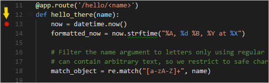
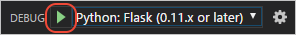

# Flask Tutorial in Visual Studio Code

Flask is a lightweight Python framework for web applications that provides the basics for URL routing and page rendering.

Flask is called a "micro" framework because it doesn't directly provide features like form validation, database abstraction, authentication, and so on. Such features are instead provided by special Python packages called Flask extensions. The extensions integrate seamlessly with Flask so that they appear as if they were part of Flask itself. For example, Flask doesn't provide a page template engine, but installing Flask includes the Jinja templating engine by default. For convenience, we typically speak of these defaults as part of Flask.

In this Flask tutorial, you create a simple Flask app with three pages that use a common base template. Along the way, you experience a number of features of Visual Studio Code including using the terminal, the editor, the debugger, code snippets, and more.

The completed code project for this Flask tutorial can be found on GitHub: [python-sample-vscode-flask-tutorial](https://github.com/microsoft/python-sample-vscode-flask-tutorial).

If you have any problems, feel free to file an issue for this tutorial in the [VS Code documentation repository](https://github.com/microsoft/vscode-docs/issues).

## Prerequisites

To successfully complete this Flask tutorial, you must do the following (which are the same steps as in the [general Python tutorial](/docs/python/python-tutorial.md)):

1. Install the [Python extension](https://marketplace.visualstudio.com/items?itemName=ms-python.python).

1. Install a version of Python 3 (for which this tutorial is written). Options include:
   - (All operating systems) A download from [python.org](https://www.python.org/downloads/); typically use the **Download Python 3.9.1** button that appears first on the page (or whatever is the latest version).
   - (Linux) The built-in Python 3 installation works well, but to install other Python packages you must run `sudo apt install python3-pip` in the terminal.
   - (macOS) An installation through [Homebrew](https://brew.sh/) on macOS using `brew install python3` (the system install of Python on macOS is not supported).
   - (All operating systems) A download from [Anaconda](https://www.anaconda.com/download/) (for data science purposes).

1. On Windows, make sure the location of your Python interpreter is included in your PATH environment variable. You can check the location by running `path` at the command prompt. If the Python interpreter's folder isn't included, open Windows Settings, search for "environment", select **Edit environment variables for your account**, then edit the **Path** variable to include that folder.

## Create a project environment for the Flask tutorial

In this section, you create a virtual environment in which Flask is installed. Using a virtual environment avoids installing Flask into a global Python environment and gives you exact control over the libraries used in an application. A virtual environment also makes it easy to [Create a requirements.txt file for the environment](#create-a-requirementstxt-file-for-the-environment).

1. On your file system, create a project folder for this tutorial, such as `hello_flask`.

1. In that folder, use the following command (as appropriate to your computer) to create a virtual environment named `env` based on your current interpreter:

    ```bash
    # Linux
    sudo apt-get install python3-venv    # If needed
    python3 -m venv env

    # macOS
    python3 -m venv env

    # Windows
    python -m venv env
    ```

    > **Note**: Use a stock Python installation when running the above commands. If you use `python.exe` from an Anaconda installation, you see an error because the ensurepip module isn't available, and the environment is left in an unfinished state.

1. Open the project folder in VS Code by running `code .`, or by running VS Code and using the **File** > **Open Folder** command.

1. In VS Code, open the Command Palette (**View** > **Command Palette** or (`kb(workbench.action.showCommands)`)). Then select the **Python: Select Interpreter** command:

    

1. The command presents a list of available interpreters that VS Code can locate automatically (your list will vary; if you don't see the desired interpreter, see [Configuring Python environments](/docs/python/environments.md)). From the list, select the virtual environment in your project folder that starts with `./env` or `.\env`:

    

1. Run [**Terminal: Create New Integrated Terminal**](/docs/editor/integrated-terminal.md) (`kb(workbench.action.terminal.new)`)) from the Command Palette, which creates a terminal and automatically activates the virtual environment by running its activation script.

    > **Note**: On Windows, if your default terminal type is PowerShell, you may see an error that it cannot run activate.ps1 because running scripts is disabled on the system. The error provides a link for information on how to allow scripts. Otherwise, use **Terminal: Select Default Shell** to set "Command Prompt" or "Git Bash" as your default instead.

1. The selected environment appears on the left side of the VS Code status bar, and notice the "(venv)" indicator that tells you that you're using a virtual environment:

    

1. Update pip in the virtual environment by running the following command in the VS Code Terminal:

     ```bash
    python -m pip install --upgrade pip
    ```

1. Install Flask in the virtual environment by running the following command in the VS Code Terminal:

    ```bash
    python -m pip install flask
    ```

You now have a self-contained environment ready for writing Flask code. VS Code activates the environment automatically when you use **Terminal: Create New Integrated Terminal**. If you open a separate command prompt or terminal, activate the environment by running `source env/bin/activate` (Linux/macOS) or `env\Scripts\Activate.ps1` (Windows).  You know the environment is activated when the command prompt shows **(env)** at the beginning.

## Create and run a minimal Flask app

1. In VS Code, create a new file in your project folder named `app.py` using either **File** > **New** from the menu, pressing `kbstyle(Ctrl+N)`, or using the new file icon in the Explorer View (shown below).

    

1. In `app.py`, add code to import Flask and create an instance of the Flask object. If you type the code below (instead of using copy-paste), you can observe VS Code's [IntelliSense and auto-completions](/docs/python/editing.md#autocomplete-and-intellisense):

    ```python
    from flask import Flask
    app = Flask(__name__)
    ```

1. Also in `app.py`, add a function that returns content, in this case a simple string, and use Flask's `app.route` decorator to map the URL route `/` to that function:

    ```python
    @app.route("/")
    def home():
        return "Hello, Flask!"
    ```

    > **Tip**: You can use multiple decorators on the same function, one per line, depending on how many different routes you want to map to the same function.

1. Save the `app.py` file (`kb(workbench.action.files.save)`).

1. In the Integrated Terminal, run the app by entering `python -m flask run`, which runs the Flask development server. The development server looks for `app.py` by default. When you run Flask, you should see output similar to the following:

    ```bash
    (env) D:\py\\hello_flask>python -m flask run
     * Environment: production
       WARNING: Do not use the development server in a production environment.
       Use a production WSGI server instead.
     * Debug mode: off
     * Running on http://127.0.0.1:5000/ (Press CTRL+C to quit)
    ```

    If you see an error that the Flask module cannot be found, make sure you've run `python -m pip install flask` in your virtual environment as described at the end of the previous section.

    Also, if you want to run the development server on a different IP address or port, use the host and port command-line arguments, as with `--host=0.0.0.0 --port=80`.

1. To open your default browser to the rendered page, `kbstyle(Ctrl+click)` the `http://127.0.0.1:5000/` URL in the terminal.

    

1. Observe that when you visit a URL like /, a message appears in the debug terminal showing the HTTP request:

    ```bash
    127.0.0.1 - - [11/Jul/2018 08:40:15] "GET / HTTP/1.1" 200 -
    ```

1. Stop the app by using `kbstyle(Ctrl+C)` in the terminal.

> **Tip**: If you want to use a different filename than `app.py`, such as `program.py`, define an environment variable named FLASK_APP and set its value to your chosen file. Flask's development server then uses the value of FLASK_APP instead of the default file `app.py`. For more information, see [Flask command line interface](https://flask.palletsprojects.com/en/1.1.x/cli/).

## Run the app in the debugger

Debugging gives you the opportunity to pause a running program on a particular line of code. When a program is paused, you can examine variables, run code in the Debug Console panel, and otherwise take advantage of the features described on [Debugging](/docs/python/debugging.md). Running the debugger also automatically saves any modified files before the debugging session begins.

**Before you begin**: Make sure you've stopped the running app at the end of the last section by using `kbstyle(Ctrl+C)` in the terminal. If you leave the app running in one terminal, it continues to own the port. As a result, when you run the app in the debugger using the same port, the original running app handles all the requests and you won't see any activity in the app being debugged and the program won't stop at breakpoints. In other words, if the debugger doesn't seem to be working, make sure that no other instance of the app is still running.

1. Replace the contents of `app.py` with the following code, which adds a second route and function that you can step through in the debugger:

    ```python
    from flask import Flask
    from datetime import datetime
    import re

    app = Flask(__name__)

    @app.route("/")
    def home():
        return "Hello, Flask!"

    @app.route("/hello/<name>")
    def hello_there(name):
        now = datetime.now()
        formatted_now = now.strftime("%A, %d %B, %Y at %X")

        # Filter the name argument to letters only using regular expressions. URL arguments
        # can contain arbitrary text, so we restrict to safe characters only.
        match_object = re.match("[a-zA-Z]+", name)

        if match_object:
            clean_name = match_object.group(0)
        else:
            clean_name = "Friend"

        content = "Hello there, " + clean_name + "! It's " + formatted_now
        return content
    ```

    The decorator used for the new URL route, `/hello/<name>`, defines an endpoint /hello/ that can accept any additional value. The identifier inside `<` and `>` in the route defines a variable that is passed to the function and can be used in your code.

    URL routes are case-sensitive. For example, the route `/hello/<name>` is distinct from `/Hello/<name>`. If you want the same function to handle both, use decorators for each variant.

    As described in the code comments, always filter arbitrary user-provided information to avoid various attacks on your app. In this case, the code filters the name argument to contain only letters, which avoids injection of control characters, HTML, and so forth. (When you use templates in the next section, Flask does automatic filtering and you won't need this code.)

1. Set a breakpoint at the first line of code in the `hello_there` function (`now = datetime.now()`) by doing any one of the following:
    - With the cursor on that line, press `kb(editor.debug.action.toggleBreakpoint)`, or,
    - With the cursor on that line, select the **Run** > **Toggle Breakpoint** menu command, or,
    - Click directly in the margin to the left of the line number (a faded red dot appears when hovering there).

    The breakpoint appears as a red dot in the left margin:

    

1. Switch to **Run** view in VS Code (using the left-side activity bar or `kb(workbench.action.debug.start)`). You may see the message "To customize Run and Debug create a launch.json file". This means that you don't yet have a `launch.json` file containing debug configurations. VS Code can create that for you if you click on the **create a launch.json file** link:

    

1. 1. Select the link and VS Code will prompt for a debug configuration. Select **Flask** from the dropdown and VS Code will populate a new `launch.json` file with a Flask run configuration. The `launch.json` file contains a number of debugging configurations, each of which is a separate JSON object within the `configuration` array.

1. Scroll down to and examine the configuration, which is named "Python: Flask". This configuration contains `"module": "flask",`, which tells VS Code to run Python with `-m flask` when it starts the debugger. It also defines the FLASK_APP environment variable in the `env` property to identify the startup file, which is `app.py` by default, but allows you to easily specify a different file. If you want to change the host and/or port, you can use the `args` array.

    ```json
    {
        "name": "Python: Flask",
        "type": "python",
        "request": "launch",
        "module": "flask",
        "env": {
            "FLASK_APP": "app.py",
            "FLASK_ENV": "development",
            "FLASK_DEBUG": "0"
        },
        "args": [
            "run",
            "--no-debugger",
            "--no-reload"
        ],
        "jinja": true
    },
    ```

    > **Note**: If the `env` entry in your configuration contains `"FLASK_APP": "${workspaceFolder}/app.py"`, change it to `"FLASK_APP": "app.py"` as shown above. Otherwise you may encounter error messages like "Cannot import module C" where C is the drive letter where your project folder resides.

    > **Note**: Once `launch.json` is created, an **Add Configuration** button appears in the editor. That button displays a list of additional configurations to add to the beginning of the configuration list. (The **Run** > **Add Configuration** menu command does the same action.).

1. Save `launch.json` (`kb(workbench.action.files.save)`). In the debug configuration dropdown list select the **Python: Flask** configuration.

    

1. Start the debugger by selecting the **Run** > **Start Debugging** menu command, or selecting the green **Start Debugging** arrow next to the list (`kb(workbench.action.debug.continue)`):

    

    Observe that the status bar changes color to indicate debugging:

    

    A debugging toolbar (shown below) also appears in VS Code containing commands in the following order: Pause (or Continue, `kb(workbench.action.debug.continue)`), Step Over (`kb(workbench.action.debug.stepOver)`), Step Into (`kb(workbench.action.debug.stepInto)`), Step Out (`kb(workbench.action.debug.stepOut)`), Restart (`kb(workbench.action.debug.restart)`), and Stop (`kb(workbench.action.debug.stop)`). See [VS Code debugging](/docs/editor/debugging.md) for a description of each command.

    

1. Output appears in a "Python Debug Console" terminal. `kbstyle(Ctrl+click)` the `http://127.0.0.1:5000/` link in that terminal to open a browser to that URL. In the browser's address bar, navigate to `http://127.0.0.1:5000/hello/VSCode`. Before the page renders, VS Code pauses the program at the breakpoint you set. The small yellow arrow on the breakpoint indicates that it's the next line of code to run.

    

1. Use Step Over to run the `now = datetime.now()` statement.

1. On the left side of the VS Code window, you see a **Variables** pane that shows local variables, such as `now`, as well as arguments, such as `name`. Below that are panes for **Watch**, **Call Stack**, and **Breakpoints** (see [VS Code debugging](/docs/editor/debugging.md) for details). In the **Locals** section, try expanding different values. You can also double-click values (or use `kb(debug.setVariable)`) to modify them. Changing variables such as `now`, however, can break the program. Developers typically make changes only to correct values when the code didn't produce the right value to begin with.

    

1. When a program is paused, the **Debug Console** panel (which is different from the "Python Debug Console" in the Terminal panel) lets you experiment with expressions and try out bits of code using the current state of the program. For example, once you've stepped over the line `now = datetime.now()`, you might experiment with different date/time formats. In the editor, select the code that reads `now.strftime("%A, %d %B, %Y at %X")`, then right-click and select **Debug: Evaluate** to send that code to the debug console, where it runs:

    ```bash
    now.strftime("%A, %d %B, %Y at %X")
    'Wednesday, 31 October, 2018 at 18:13:39'
    ```

    > **Tip**: The **Debug Console** also shows exceptions from within the app that may not appear in the terminal. For example, if you see a "Paused on exception" message in the **Call Stack** area of Run view, switch to the **Debug Console** to see the exception message.

1. Copy that line into the > prompt at the bottom of the debug console, and try changing the formatting:

    ```bash
    now.strftime("%a, %d %B, %Y at %X")
    'Wed, 31 October, 2018 at 18:13:39'
    now.strftime("%a, %d %b, %Y at %X")
    'Wed, 31 Oct, 2018 at 18:13:39'
    now.strftime("%a, %d %b, %y at %X")
    'Wed, 31 Oct, 18 at 18:13:39'
    ```

    > **Note**: If you see a change you like, you can copy and paste it into the editor during a debugging session. However, those changes aren't applied until you restart the debugger.

1. Step through a few more lines of code, if you'd like, then select Continue (`kb(workbench.action.debug.continue)`) to let the program run. The browser window shows the result:

    

1. Close the browser and stop the debugger when you're finished. To stop the debugger, use the Stop toolbar button (the red square) or the **Run** > **Stop Debugging** command (`kb(workbench.action.debug.stop)`).

> **Tip**: To make it easier to repeatedly navigate to a specific URL like `http://127.0.0.1:5000/hello/VSCode`, output that URL using a `print` statement. The URL appears in the terminal where you can use `kbstyle(Ctrl+click)` to open it in a browser.

## Go to Definition and Peek Definition commands

During your work with Flask or any other library, you may want to examine the code in those libraries themselves. VS Code provides two convenient commands that navigate directly to the definitions of classes and other objects in any code:

- **Go to Definition** jumps from your code into the code that defines an object. For example, in `app.py`, right-click on the `Flask` class (in the line `app = Flask(__name__)`) and select **Go to Definition** (or use `kb(editor.action.revealDefinition)`), which navigates to the class definition in the Flask library.

- **Peek Definition** (`kb(editor.action.peekDefinition)`, also on the right-click context menu), is similar, but displays the class definition directly in the editor (making space in the editor window to avoid obscuring any code). Press `kbstyle(Escape)` to close the Peek window or use the **x** in the upper right corner.

    

## Use a template to render a page

The app you've created so far in this tutorial generates only plain text web pages from Python code. Although it's possible to generate HTML directly in code, developers avoid such a practice because it opens the app to [cross-site scripting (XSS) attacks](https://flask.palletsprojects.com/security/#cross-site-scripting-xss). In the `hello_there` function of this tutorial, for example, one might think to format the output in code with something like `content = "<h1>Hello there, " + clean_name + "!</h1>`, where the result in `content` is given directly to a browser. This opening allows an attacker to place malicious HTML, including JavaScript code, in the URL that ends up in `clean_name` and thus ends up being run in the browser.

A much better practice is to keep HTML out of your code entirely by using **templates**, so that your code is concerned only with data values and not with rendering.

- A template is an HTML file that contains placeholders for values that the code provides at run time. The templating engine takes care of making the substitutions when rendering the page. The code, therefore, concerns itself only with data values and the template concerns itself only with markup.
- The default templating engine for Flask is [Jinja](https://jinja.palletsprojects.com), which is installed automatically when you install Flask. This engine provides flexible options including automatic escaping (to prevent XSS attacks) and template inheritance. With inheritance, you can define a base page with common markup and then build upon that base with page-specific additions.

In this section, you create a single page using a template. In the sections that follow, you configure the app to serve static files, and then create multiple pages to the app that each contains a nav bar from a base template.

1. Inside the `hello_flask` folder, create a folder named `templates`, which is where Flask looks for templates by default.

1. In the `templates` folder, create a file named `hello_there.html` with the contents below. This template contains two placeholders named "name" and "date", which are delineated by pairs of curly braces, `\{{` and `}}`. As you can see, you can also include formatting code in the template directly:

    ```html
    <!DOCTYPE html>
    <html>
        <head>
            <meta charset="utf-8" />
            <title>Hello, Flask</title>
        </head>
        <body>
            
                <strong>Hello there, \{{ name }}!</strong> It's \{{ date.strftime("%A, %d %B, %Y at %X") }}.
            
                What's your name? Provide it after /hello/ in the URL.
            
        </body>
    </html>
    ```

    > **Tip**: Flask developers often use the [flask-babel](https://pythonhosted.org/Flask-Babel/) extension for date formatting, rather than `strftime`, as flask-babel takes locales and timezones into consideration.

1. In `app.py`, import Flask's `render_template` function near the top of the file:

    ```python
    from flask import render_template
    ```

1. Also in `app.py`, modify the `hello_there` function to use `render_template` to load a template and apply the named values (and add a route to recognize the case without a name). `render_template` assumes that the first argument is relative to the `templates` folder. Typically, developers name the templates the same as the functions that use them, but matching names are not required because you always refer to the exact filename in your code.

    ```python
    @app.route("/hello/")
    @app.route("/hello/<name>")
    def hello_there(name = None):
        return render_template(
            "hello_there.html",
            name=name,
            date=datetime.now()
        )
    ```

    You can see that the code is now much simpler, and concerned only with data values, because the markup and formatting is all contained in the template.

1. Start the program (inside or outside of the debugger, using `kb(workbench.action.debug.run)`), navigate to a /hello/name URL, and observe the results.

1. Also try navigating to a /hello/name URL using a name like `<a%20value%20that%20could%20be%20HTML>` to see Flask's automatic escaping at work. The "name" value shows up as plain text in the browser rather than as rendering an actual element.

## Serve static files

Static files are of two types. First are those files like stylesheets to which a page template can just refer directly. Such files can live in any folder in the app, but are commonly placed within a `static` folder.

The second type are those that you want to address in code, such as when you want to implement an API endpoint that returns a static file. For this purpose, the Flask object contains a built-in method, `send_static_file`, which generates a response with a static file contained within the app's `static` folder.

The following sections demonstrate both types of static files.

### Refer to static files in a template

1. In the `hello_flask` folder, create a folder named `static`.

1. Within the `static` folder, create a file named `site.css` with the following contents. After entering this code, also observe the syntax highlighting that VS Code provides for CSS files, including a color preview:

    ```css
    .message {
        font-weight: 600;
        color: blue;
    }
    ```

1. In `templates/hello_there.html`, add the following line before the `</head>` tag, which creates a reference to the stylesheet.

    ```html
    <link rel="stylesheet" type="text/css" href="\{{ url_for('static', filename='site.css')}}" />
    ```

    Flask's [url_for](https://flask.palletsprojects.com/api/#flask.url_for) tag that is used here, creates the appropriate path to the file. Because it can accept variables as arguments, `url_for` allows you to programmatically control the generated path, if desired.

1. Also in `templates/hello_there.html`, replace the contents `<body>` element with the following markup that uses the `message` style instead of a `<strong>` tag (and also displays a message if you just use a hello/ URL without a name):

    ```html
    
        <span class="message">Hello there, \{{ name }}!</span> It's \{{ date.strftime("%A, %d %B, %Y at %X") }}.
    
        <span class="message">What's your name? Provide it after /hello/ in the URL.</span>
    
    ```

1. Run the app, navigate to a /hello/name URL, and observe that the message renders in blue. Stop the app when you're done.

### Serve a static file from code

1. In the `static` folder, create a JSON data file named `data.json` with the following contents (which are meaningless sample data):

    ```json
    {
        "01": {
            "note" : "This data is very simple because we're demonstrating only the mechanism."
        }
    }
    ```

1. In `app.py`, add a function with the route /api/data that returns the static data file using the `send_static_file` method:

    ```python
    @app.route("/api/data")
    def get_data():
        return app.send_static_file("data.json")
    ```

1. Run the app and navigate to the /api/data endpoint to see that the static file is returned. Stop the app when you're done.

## Create multiple templates that extend a base template

Because most web apps have more than one page, and because those pages typically share many common elements, developers separate those common elements into a base page template that other page templates can then extend. (This is also called template inheritance.)

Also, because you'll likely create many pages that extend the same template, it's helpful to create a code snippet in VS Code with which you can quickly initialize new page templates. A snippet helps you avoid tedious and error-prone copy-paste operations.

The following sections walk through different parts of this process.

### Create a base page template and styles

A base page template in Flask contains all the shared parts of a set of pages, including references to CSS files, script files, and so forth. Base templates also define one or more **block** tags that other templates that extend the base are expected to override. A block tag is delineated by `` and `` in both the base template and extended templates.

The following steps demonstrate creating a base template.

1. In the `templates` folder, create a file named `layout.html` with the contents below, which contains blocks named "title" and "content". As you can see, the markup defines a simple nav bar structure with links to Home, About, and Contact pages, which you create in a later section. Each link again uses Flask's `url_for` tag to generate a link at runtime for the matching route.

    ```html
    <!DOCTYPE html>
    <html>
        <head>
            <meta charset="utf-8" />
            <title></title>
            <link rel="stylesheet" type="text/css" href="\{{ url_for('static', filename='site.css')}}" />
        </head>

        <body>
            <div class="navbar">
                <a href="\{{ url_for('home') }}" class="navbar-brand">Home</a>
                <a href="\{{ url_for('about') }}" class="navbar-item">About</a>
                <a href="\{{ url_for('contact') }}" class="navbar-item">Contact</a>
            </div>

            <div class="body-content">
                
                
                <hr/>
                <footer>
                    <p>&copy; 2018</p>
                </footer>
            </div>
        </body>
    </html>
    ```

1. Add the following styles to `static/site.css` below the existing "message" style, and save the file. (This walkthrough doesn't attempt to demonstrate responsive design; these styles simply generate a reasonably interesting result.)

    ```css
    .navbar {
        background-color: lightslategray;
        font-size: 1em;
        font-family: 'Trebuchet MS', 'Lucida Sans Unicode', 'Lucida Grande', 'Lucida Sans', Arial, sans-serif;
        color: white;
        padding: 8px 5px 8px 5px;
    }

    .navbar a {
        text-decoration: none;
        color: inherit;
    }

    .navbar-brand {
        font-size: 1.2em;
        font-weight: 600;
    }

    .navbar-item {
        font-variant: small-caps;
        margin-left: 30px;
    }

    .body-content {
        padding: 5px;
        font-family:'Segoe UI', Tahoma, Geneva, Verdana, sans-serif;
    }
    ```

You can run the app at this point, but because you haven't made use of the base template anywhere and haven't changed any code files, the result is the same as the previous step. Complete the remaining sections to see the final effect.

### Create a code snippet

Because the three pages you create in the next section extend `layout.html`, it saves time to create a **code snippet** to initialize a new template file with the appropriate reference to the base template. A code snippet provides a consistent piece of code from a single source, which avoids errors that can creep in when using copy-paste from existing code.

1. In VS Code, select the **File** (Windows/Linux) or **Code** (macOS), menu, then select **Preferences** > **User snippets**.

1. In the list that appears, select **html**. (The option may appear as "html.json" in the **Existing Snippets** section of the list if you've created snippets previously.)

1. After VS code opens `html.json`, add the following entry within the existing curly braces (the explanatory comments, not shown here, describe details such as how the `$0` line indicates where VS Code places the cursor after inserting a snippet):

    ```json
    "Flask Tutorial: template extending layout.html": {
        "prefix": "flextlayout",
        "body": [
            "",
            "",
            "$0",
            "",
            "",
            ""
        ],

        "description": "Boilerplate template that extends layout.html"
    },
    ```

1. Save the `html.json` file (`kb(workbench.action.files.save)`).

1. Now, whenever you start typing the snippet's prefix, such as `flext`, VS Code provides the snippet as an autocomplete option, as shown in the next section. You can also use the **Insert Snippet** command to choose a snippet from a menu.

For more information on code snippets in general, refer to [Creating snippets](/docs/editor/userdefinedsnippets.md).

### Use the code snippet to add pages

With the code snippet in place, you can quickly create templates for the Home, About, and Contact pages.

1. In the `templates` folder, create a new file named `home.html`, Then start typing `flext` to see the snippet appear as a completion:

    

    When you select the completion, the snippet's code appears with the cursor on the snippet's insertion point:

    

1. At the insertion point in the "title" block, write `Home`, and in the "content" block, write `<p>Home page for the Visual Studio Code Flask tutorial.</p>`, then save the file. These lines are the only unique parts of the extended page template:

1. In the `templates` folder, create `about.html`, use the snippet to insert the boilerplate markup, insert `About us` and `<p>About page for the Visual Studio Code Flask tutorial.</p>` in the "title" and "content" blocks, respectively, then save the file.

1. Repeat the previous step to create `templates/contact.html` using `Contact us` and `<p>Contact page for the Visual Studio Code Flask tutorial.</p>` in the two content blocks.

1. In `app.py`, add functions for the /about/ and /contact/ routes that refer to their respective page templates. Also modify the `home` function to use the `home.html` template.

    ```python
    # Replace the existing home function with the one below
    @app.route("/")
    def home():
        return render_template("home.html")

    # New functions
    @app.route("/about/")
    def about():
        return render_template("about.html")

    @app.route("/contact/")
    def contact():
        return render_template("contact.html")
    ```

### Run the app

With all the page templates in place, save `app.py`, run the app, and open a browser to see the results. Navigate between the pages to verify that the page templates are properly extending the base template.


## Optional activities

The following sections describe additional steps that you might find helpful in your work with Python and Visual Studio Code.

### Create a requirements.txt file for the environment

When you share your app code through source control or some other means, it doesn't make sense to copy all the files in a virtual environment because recipients can always recreate the environment themselves.

Accordingly, developers typically omit the virtual environment folder from source control and instead describe the app's dependencies using a `requirements.txt` file.

Although you can create the file by hand, you can also use the `pip freeze` command to generate the file based on the exact libraries installed in the activated environment:

1. With your chosen environment selected using the **Python: Select Interpreter** command, run the **Terminal: Create New Integrated Terminal** command (`kb(workbench.action.terminal.new)`)) to open a terminal with that environment activated.

1. In the terminal, run `pip freeze > requirements.txt` to create the `requirements.txt` file in your project folder.

Anyone (or any build server) that receives a copy of the project needs only to run the `pip install -r requirements.txt` command to reinstall the packages in the original the environment. (The recipient still needs to create their own virtual environment, however.)

> **Note**: `pip freeze` lists all the Python packages you have installed in the current environment, including packages you aren't currently using. The command also lists packages with exact version numbers, which you might want to convert to ranges for more flexibility in the future. For more information, see [Requirements Files](https://pip.pypa.io/en/stable/user_guide/#requirements-files) in the pip command documentation.

### Refactor the project to support further development

Throughout this Flask tutorial, all the app code is contained in a single `app.py` file. To allow for further development and to separate concerns, it's helpful to refactor the pieces of `app.py` into separate files.

1. In your project folder, create a folder for the app, such as `hello_app`, to separate its files from other project-level files like `requirements.txt` and the `.vscode` folder where VS Code stores settings and debug configuration files.

1. Move the `static` and `templates` folders into `hello_app`, because these folders certainly contain app code.

1. In the `hello_app` folder, create a file named `views.py` that contains the routings and the view functions:

    ```python
    from flask import Flask
    from flask import render_template
    from datetime import datetime
    from . import app

    @app.route("/")
    def home():
        return render_template("home.html")

    @app.route("/about/")
    def about():
        return render_template("about.html")

    @app.route("/contact/")
    def contact():
        return render_template("contact.html")

    @app.route("/hello/")
    @app.route("/hello/<name>")
    def hello_there(name = None):
        return render_template(
            "hello_there.html",
            name=name,
            date=datetime.now()
        )

    @app.route("/api/data")
    def get_data():
        return app.send_static_file("data.json")
    ```

1. Optional: Right-click in the editor and select the **Sort Imports** command, which consolidates imports from identical modules, removes unused imports, and sorts your import statements. Using the command on the code above in `views.py` changes the imports as follows (you can remove the extra lines, of course):

    ```python
    from datetime import datetime

    from flask import Flask, render_template

    from . import app
    ```

1. In the `hello_app` folder, create a file `__init__.py` with the following contents:

    ```python
    import flask
    app = flask.Flask(__name__)
    ```

1. In the `hello_app` folder, create a file `webapp.py` with the following contents:

    ```python
    # Entry point for the application.
    from . import app    # For application discovery by the 'flask' command.
    from . import views  # For import side-effects of setting up routes.
    ```

1. Open the debug configuration file `launch.json` and update the `env` property as follows to point to the startup object:

    ```json
    "env": {
        "FLASK_APP": "hello_app.webapp"
    },
    ```

1. Delete the original `app.py` file in the project root, as its contents have been moved into other app files.

1. Your project's structure should now be similar to the following:

    

1. Run the app in the debugger again to make sure everything works. To run the app outside of the VS Code debugger, use the following steps from a terminal:
    1. Set an environment variable for `FLASK_APP`. On Linux and macOS, use `export set FLASK_APP=webapp`; on Windows use `set FLASK_APP=webapp`.
    1. Navigate into the `hello_app` folder, then launch the program using `python -m flask run`.

### Create a container for a Flask app using the Docker extension

The [Docker extension](https://marketplace.visualstudio.com/items?itemName=ms-azuretools.vscode-docker) makes it easy to build, manage, and deploy containerized applications from Visual Studio Code. If you're interested in learning how to create a Python container for the Flask app developed in this tutorial, check out the [Python in a container](/docs/containers/quickstart-python.md) tutorial, which will walk you through how to:

- Create a `Dockerfile` file describing a simple Python container.
- Build, run, and verify the functionality of a [Flask](https://flask.palletsprojects.com) app.
- Debug the app running in a container.

If you have any problems, feel free to file an issue for this tutorial in the [VS Code documentation repository](https://github.com/microsoft/vscode-docs/issues).

## Next steps

Congratulations on completing this walkthrough of working with Flask in Visual Studio Code!

The completed code project from this tutorial can be found on GitHub: [python-sample-vscode-flask-tutorial](https://github.com/microsoft/python-sample-vscode-flask-tutorial).

Because this tutorial has only scratched the surface of page templates, refer to the [Jinja2 documentation](https://jinja.palletsprojects.com) for more information about templates. The [Template Designer Documentation](https://jinja.palletsprojects.com/templates/#synopsis) contains all the details on the template language. You might also want to review the [official Flask tutorial](https://flask.palletsprojects.com/tutorial) as well as the documentation for Flask [extensions](https://flask.palletsprojects.com/extensions/).

To try your app on a production website, check out the tutorial [Deploy Python apps to Azure App Service using Docker Containers](https://docs.microsoft.com/azure/python/tutorial-deploy-containers-01). Azure also offers a standard container, [App Service on Linux](https://docs.microsoft.com/azure/python/tutorial-deploy-app-service-on-linux-01), to which you deploy web apps from within VS Code.

You may also want to review the following articles in the VS Code docs that are relevant to Python:

- [Editing Python code](/docs/python/editing.md)
- [Linting](/docs/python/linting.md)
- [Managing Python environments](/docs/python/environments.md)
- [Debugging Python](/docs/python/debugging.md)
- [Testing](/docs/python/testing.md)

If you encountered any problems in the course of this tutorial, feel free to file an issue in the [VS Code documentation repository](https://github.com/microsoft/vscode-docs/issues).
