# Using Flask in Visual Studio Code

[Flask](http://flask.pocoo.org/) is a lightweight Python framework for web applications that provides the basics for URL routing and page rendering.

Flask is called a "micro" framework because it doesn't directly provide features like form validation, database abstraction, authentication, and so on. Such features are instead provided by special Python packages called Flask *extensions*. The extensions integrate seamlessly with Flask so that they appear as if they were part of Flask itself. For example, Flask doesn't provide a page template engine, but installing Flask includes the Jinja templating engine by default.

## Create a project environment for Flask

1. On your file system, create a folder for this tutorial, then open that folder in VS Code.
1. Open the **Integrated Terminal** in VS Code by selecting the **View** > **Integrated Terminal** command (`kb(workbench.action.terminal.toggleTerminal)`)
1. In the Terminal, run the following command (as appropriate to your computer) to create a virtual environment in a folder named `env`:

    ```bash
    # Mac/Linux
    python3 -m venv env

    # Windows
    python -m venv env
    ```

    > **Note**: use a stock Python installation when running the above commands. If you use `python.exe` from an Anaconda installation, you see an error because the ensurepip module isn't available, and the environment is left in an unfinished state.

1. Activate the environment by opening the Command Palette (**View** > **Command Palette** or (`kb(workbench.action.showCommands)`)):

    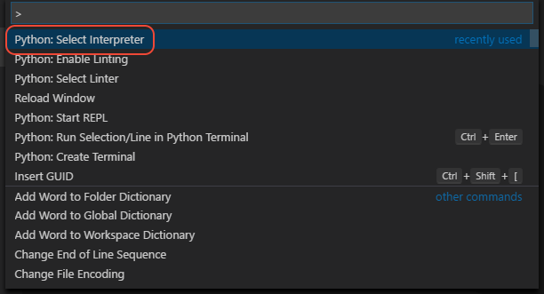

1. Select the **Python: Select Interpreter** command, and select the virtual environment (the exact details of your environment will differ depending on which interpreters you have installed):

    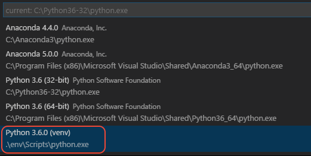

1. The selected environment appears on the left side of the VS Code status bar, and notice the "(venv)" indicator that tells you that you're using a virtual environment:

    

1. Open the Command Palette again and select **Python: Create Terminal**, which creates a terminal and automatically activates the virtual environment by running its activate script. You should see output similar to the following:

    ```output
    D:\py\Flask>d:/py/Flask/env/Scripts/activate.bat
    (env) D:\py\Flask>
    ```

1. Install Flask in the virtual environment by running `pip install flask`. You now have an environment ready for writing Flask code.

### Create a requirements.txt file for the environment

When you share your app code with others through source control or some other means, it doesn't make sense to copy all the files in a virtual environment because recipients can always install packages themselves.

Accordingly, developers typically omit the virtual environment folder from source control, and instead describe the app's dependencies using a `requirements.txt` file.

In the case of Flask, as used in this tutorial, create a `requirements.txt` file in the root of your project folder with a single line that says the app requires Flask 0.x:

```text
Flask<1
```

Anyone (or any build server) that receives a copy of the project needs only to run the `pip install -r requirements.txt` command to recreate the environment.

## Create and run a minimal Flask app

1. In VS Code, create a new file in your project folder named `views.py`. Pages in a Flask app are commonly referred to as *views*, and the conventional filename for view code is `views.py`.

1. Import Flask and create an instance of the Flask object, which is the app. If you type the code below (instead of using copy-paste), you can observe VS Code's [IntelliSense and auto-completions](editing.md#autocomplete-and-intellisense):

    ```python
    from flask import Flask
    app = Flask(__name__)
    ```

1. Create a function that returns content, in this case a simple string, and use Flask's `app.route` decorator to map URL routes `/` and `/hello` to that function:

    ```python
    @app.route('/')
    @app.route('/hello')
    def hello_flask():
        # Return a simple text string with a little inline HTML
        return '<html><body>Hello, <strong>Flask</strong>!</body></html>'
    ```

    > **Note**: you can use one or more decorators on the same function, depending on how many different routes you want to map to the same function.

1. Add startup code that automatically runs the app using a host and port as defined by environment variables. Using environment variables allows you change the host and port on different computers, such as development and production servers, without changing the code.

    ```python
    if __name__ == '__main__':
    from os import environ
    HOST = os.environ.get('SERVER_HOST', 'localhost')

    try:
        PORT = int(os.environ.get('SERVER_PORT', '5555'))
    except ValueError:
        PORT = 5555

    app.run(HOST, PORT)
    ```

1. Save the `views.py` file.

1. Run the code by selecting **Debug** > **Start Without Debugging** (`kb(workbench.action.debug.run)`), select **Python** as the environment, and observe that a debug terminal appears showing the running development server:

    ```output
    D:\py\Flask>cd d:\py\Flask && cmd /C "set "PYTHONIOENCODING=UTF-8" && set "PYTHONUNBUFFERED=1" && d:\py\Flask\env\Scripts\python.exe C:\Users\user\.vscode\extensions\ms-python.python-2018.4.0\pythonFiles\PythonTools\visualstudio_py_launcher_nodebug.py d:\py\Flask 63253 34806ad9-833a-4524-8cd6-18ca4aa74f14 RedirectOutput,RedirectOutput d:\py\Flask\views.py "
     * Serving Flask app "hello" (lazy loading)
     * Environment: production
       WARNING: Do not use the development server in a production environment.
       Use a production WSGI server instead.
     * Debug mode: off
     * Running on http://localhost:5555/ (Press CTRL+C to quit)
    ```

    > **Note**: You're welcome to try the **Python Experimental** debugging environment as well. For more information, see [Issue 538](https://github.com/Microsoft/vscode-python/issues/538) (GitHub).

1. To open your default browser to the rendered page, Ctrl+click the `localhost:5555` URL in the terminal. (You can also try the /hello relative URL to test that routing as well.)

    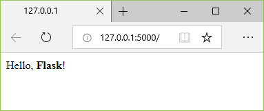

1. Observe that when you visit a URL, a message appears in the debug terminal showing the HTTP request:

    ```output
    127.0.0.1 - - [07/May/2018 14:40:15] "GET / HTTP/1.1" 200 -
    127.0.0.1 - - [07/May/2018 14:40:19] "GET /hello HTTP/1.1" 200 -
    ```

1. To stop the app, use Ctrl+C in the debug terminal, or the **Debug** > **Stop debugging** command.

## Run the app in the debugger

Debugging gives you the opportunity to pause a running program on a particular line of code. When a program is paused, you can examine variables, run code in the Debug Console panel, and otherwise take advantage of the features described on [Debugging](debugging.md).

1. First, modify the `hello_flask` function so it contains more code you can step through in the debugger:

    ```python
    @app.route('/')
    @app.route('/hello')
    def hello_flask():
        from datetime import datetime
        now = datetime.now()
        formatted_now = now.strftime("%A, %d %B, %Y at %X")

        html_content = "<html><head><title>Hello, Flask</title></head><body>"
        html_content += "<strong>Hello, Flask!</strong> on " + formatted_now
        html_content += "</body></html>"

        return html_content
    ```

1. Set a breakpoint at the first line of code in the function by doing one of the following:
    - With the cursor on that line, press F9.
    - With the cursor on that line, select the **Debug** > **Toggle Breakpoint** menu command.
    - Click directly in the margin to the left of the line number (a faded red dot appears when hovering there).

    The breakpoint appears as a red dot in the left margin:

    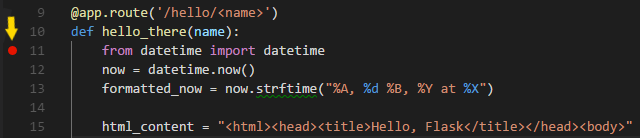

1. Switch to **Debug** view in VS Code (using the left-side activity bar). Along the top of the Debug view, you may see "No Configurations" and a warning dot on the gear icon. Both indicators mean that you don't yet have a `launch.json` file containing debug configurations:

    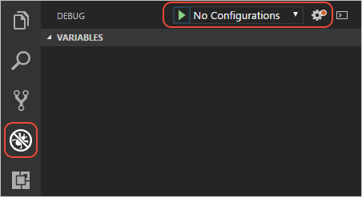

1. Select the gear icon and select **Python** from the list that appears. VS Code creates a `launch.json` file for you and selects the default **Python: Current File** configuration.

1. Switch back to `views.py` and select the green **Start Debugging** arrow (`kb('workbench.action.debug.continue')`, or select the **Debug** > **Start Debugging** menu command). Observe that the status bar changes color to indicate debugging:

    

    A debugging toolbar also appears in VS Code containing commands to Pause (or Continue, F5), Step Over (`kb(workbench.action.debug.stepOver)`), Step Into (`kb(workbench.action.debug.stepInto)`), Step Out (`kb(workbench.action.debug.stepOut)`), Restart (`kb(workbench.action.debug.restart)`), and Stop (`kb(workbench.action.debug.stop)`). See [VS Code debugging](/docs/editor/debugging.md) for a description of each command.

    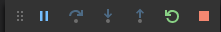

1. Ctrl+click the `localhost:5555` link in the debug terminal output to open a browser to that URL. Before the page renders, VS Code pauses the program at the breakpoint. The small yellow arrow on the breakpoint indicates that it's the next line of code to run.

    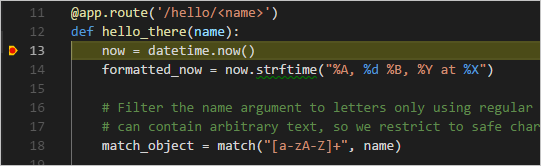

1. Use Step Over to run the `from...import` statement and the `now = datetime.now()` statement.

1. On the left side of the VS Code window you see a **Variables** pane that shows local variables, such as `now`. Below that are panes for **Watch**, **Call Stack**, and **Breakpoints** (see [VS Code debugging](/docs/editor/debugging.md) for details). In the **Locals** section, try expanding different values. You can also double-click values (or use `kb('debug.setVariable')`) to modify them.

    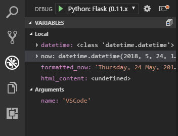

1. When a program is paused, the **Debug Console** panel lets you experiment with expressions and try out bits of code using the current state of the program. For example, you might want to try different date/time formats. In the editor, select the code that reads `now.strftime("%A, %d %B, %Y at %X")`, then right-click and select **Debug: Evaluate** to send that code to the debug console, where it runs:

    ```output
    now.strftime("%A, %d %B, %Y at %X")
    'Monday, 07 May, 2018 at 15:05:00'
    ```

1. Copy that line into the > prompt at the bottom of the debug console, and try changing the formatting:

    ```output
    now.strftime("%a, %d %B, %Y at %X")
    'Mon, 07 May, 2018 at 15:05:00'
    now.strftime("%a, %d %b, %Y at %X")
    'Mon, 07 May, 2018 at 15:05:00'
    now.strftime("%a, %d %b, %y at %X")
    'Mon, 07 May, 18 at 15:05:00'
    ```

    > **Note**: if you see a change you like, you can copy and paste it into the editor during a debugging session. However, those changes aren't applied until you restart the debugger.

1. Step through a few more lines of code, if you'd like, then select Continue (`kb('workbench.action.debug.continue')`) to let the program run. The browser window shows the result:

    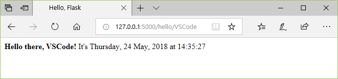

1. Close the browser and stop the debugger when you're finished.

### Running the Flask development server in debug mode

You typically have plenty of debugging features in VS Code directly. If you want to use Flask's debug mode as well, do the following steps:

1. Open the Debug panel, select the **Python: Flask** debugging environment, then select the gear icon to open `launch.json` to that configuration.
1. In the `args` section of the configuration, remove `--no-debugger` and `--no-reload`.
1. Modify the `FLASK_APP` entry in the `env` section to point to your startup file only, such as `views.py`, without any other prefix.
1. Save `launch.json` and launch the debugger.
1. You can also modify the `env` section to include `"FLASK_ENV": "development"`, which turns on Flask's debugger, activates Flask's automatic reloader, and enables debug mode on the app.

## Go to Definition and Peek Definition commands

During your work with Flask or any other library, you may want to examine the code in those libraries themselves. VS Code provides two convenient commands that navigate directly to the definitions of classes and other objects in any code:

- **Go to Definition** jumps from your code into the code that defines an object. For example, in `views.py`, right-click on the `Flask` class (in the line `app = Flask(__name__)`) and select **Go to Definition** (or use `kb(editor.action.goToDeclaration)`), which navigates to the class definition in the Flask library.

- **Peek Definition** (`kb(editor.action.previewDeclaration)`, also on the right-click context menu), is similar, but displays the class definition directly in the editor. Press `kbstyle(Escape)` to close the Peek window.

    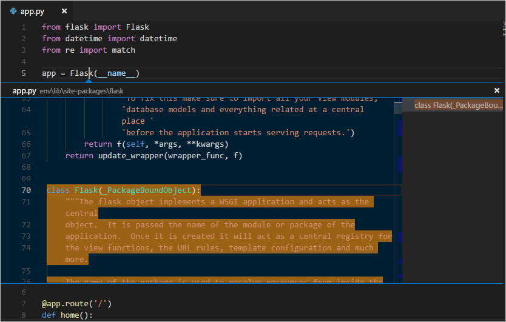

## Refactor the project to support further development

So far in this tutorial you've created a single `views.py` file that contains both the app code and the startup code that runs the app. To allow for further development, it's best to separate these concerns and also to create subfolders for templates and static files.

1. In your project folder, create an app folder called `HelloFlask`.
1. Move the `env` folder into `HelloFlask` (making the virtual environment a part of the app).
1. In the `HelloFlask` folder, create a file named `__init.py__` with the following contents:

    ```python
    from flask import Flask
    app = Flask(__name__)

    import HelloFlask.views
    ```

1. Create two subfolders in `HelloFlask` named `static` and `templates`, which remain empty for now.
1. Move `views.py` into the `HelloFlask` folder.
1. In the project's root folder, create a file named `runserver.py`, with the following contents:

    ```python
    import os
    from HelloFlask import app    # Imports the code from HelloFlask/__init__.py

    if __name__ == '__main__':
        HOST = os.environ.get('SERVER_HOST', 'localhost')

        try:
            PORT = int(os.environ.get('SERVER_PORT', '5555'))
        except ValueError:
            PORT = 5555

        app.run(HOST, PORT)
    ```

    > **Note**: If you're referring to a specific file in a debug configuration, modify that configuration to point now to `runserver.py`.

1. Your project's folder structure should look like the following:

    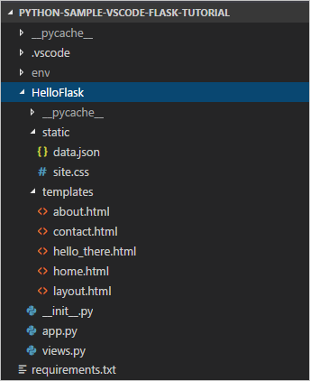

1. Edit `views.py` to contain only the following code (removing the startup code and changing the `hello_flask` function to `home`, with appropriate routing):

    ```python
    from datetime import datetime
    from flask import render_template
    from HelloFlask import app

    @app.route('/')
    @app.route('/home')
    def home():
        now = datetime.now()
        formatted_now = now.strftime("%A, %d %B, %Y at %X")

        html_content = "<html><head><title>Hello, Flask</title></head><body>"
        html_content += "<strong>Hello, Flask!</strong> on " + formatted_now
        html_content += "</body></html>"

        return html_content
    ```

1. Because you typically start the app by running `runserver.py`, it's convenient to create a new debugger configuration that launches that file directly. In the Debug view, select the gear icon to open `launch.json`, select **Add Configuration**, then select **Python: Current File** from the list to use that configuration as a base. Change the `"name"` value to `"Python: runserver.py"` and `"program"` to `"${workspaceFolder}/runserver.py"`.

1. Save `launch.json`, select **Python: runserver.py** as the debug target, and start debugging (`kb(workbench.action.debug.start)`) to see that the refactored app is working properly. Stop the app when you're done.

## Use a templates to render a page

The app you've created so far in this tutorial contains embedded HTML directly within Python code. Developers typically separate HTML markup from the code-generated data that gets inserted into that markup. *Templates* are a common approach to achieve this separation.

A template is an HTML file that contains placeholders for values that the code provides at run time. The templating engine takes care of making the substitutions when rendering the page. The code, therefore, concerns itself only with data values and the template concerns itself only with markup.

The default templating engine for Flask is Ninja, which is installed automatically when you install Flask. This engine provides flexible options including template inheritance. With inheritance, you can define a base page with common markup and then build upon that base with page-specific additions.

In this section you create a single page using a template. In the sections that follow, you configure the app to serve static files, and then create multiple pages to the app that each contain a nav bar from a base template.

1. In the app's `templates` folder, create a file named `home.html` with the contents below. This template contains two placeholders named "title" and "content", which are delineated by pairs or curly braces, `{{` and `}}`.

    ```html
    <!DOCTYPE html>
    <html>
    <head>
        <meta charset="utf-8" />
        <title>{{ title }}</title>
    </head>
    <body>
        {{ content }}
    </body>
    </html>
    ```

1. In `views.py`, modify the `home` function to use Flask's `render_template` method to load a template and apply the named values (the decorated aren't shown here for brevity). Note that `render_template` assumes that the first argument is relative to the `templates`folder.

    ```python
    def home():
        now = datetime.now()
        content = "<strong>Hello, Flask!</strong> on " + now.strftime("%A, %d %B, %Y at %X")

        return render_template(
            "home.html",
            title ='Hello, Flask',
            content = content
        )
    ```

1. Run the program again and observe the results, noticing especially that the inline HTML does *not* get rendered as HTML because the templating engine automatically escapes values used in placeholders.

    Automatic escaping prevent accidental vulnerabilities to injection attacks: developers often gather input from one page and use it as a value in another through a template placeholder. Escaping also serves as a reminder that it's again best to keep HTML out of the code.

    For this reason, modify the template and view function as follows to make each piece of content more specific:

    In `templates/home.html`:

        ```html
    <!DOCTYPE html>
    <html>
    <head>
        <meta charset="utf-8" />
        <title>{{ title }}</title>
    </head>
    <body>
        <strong>{{ message }}</strong> on {{ date }}
    </body>
    </html>
    ```

    In `views.py`:

    ```python
    def home():
        now = datetime.now()

        return render_template(
            "home.html",
            title ='Hello, Flask',
            message = "Hello, Flask!",
            date = now.strftime("%A, %d %B, %Y at %X")
        )
    ```

1. Run the app again to observe the expected result, and stop the app when you're done.

## Serve static files

Static files are of two types. First are those files like stylesheets to which a page template can just refer to directly. Such files can live in any folder in the app, but are commonly placed within a `static` folder.

The second type are those that you want to address in code, such as when you want to implement an API endpoint that returns a static file. For this purpose, the Flask object contains a built-in method, `send_static_file`, which generates a response with a static file contained within the app's `static` folder.

The following sections demonstrate both types of static files.

### Refer to static files in a template

1. In the `HelloFlask` folder, create a folder named `static` if you don't have one already.

1. Within the `static` folder, create a file named `site.css` with the following contents. After entering this code, also observe the syntax highlighting that VS Code provide for CSS files, including a color preview:

    ```css
    .message {
        font-weight: 600;
        color: blue;
    }
    ```

1. In `templates/home.html`, add the following line before the `</head>` tag:

    ```html
    <link rel="stylesheet" type="text/css" href="/static/site.css" />
    ```

    And replace the contents `<body>` element with the following markup that uses the `message` style instead of a `<strong>` tag:

    ```html
    <span class="message">{{ message }}</span> on {{ date }}
    ```

1. Run the app to observe that the "Hello Flask!" message renders in blue. Stop the app when you're done.

### Refer to static file in code

1. In the `HelloFlask/static` folder, create a static JSON data file named `data.json` with the following contents (which are just meaningless sample data):

    ```json
    {
        "01": {
            "note" : "Data is very simple because we're demonstrating only the mechanism."
        }
    }
    ```

1. In `views.py`, add a function with the route /api/data that returns the static data file using the `send_static_file` method:

    ```python
    @app.route('/api/data')
    def get_data():
      return app.send_static_file('data.json')
    ```

1. Run the app and navigate to the /api/data endpoint to see that the static file is returned. Stop the app when you're done.

## Create multiple templates that extend a base template

Because most web apps have more than one page, and because those pages typically share many common elements, developers separate those common elements into a base page template that other page templates can then extend. (This is also called template inheritance.)

Also, because you'll likely create many pages that extend the same template, it's helpful to create a code snippet in VS Code with which you can quickly initialize new page templates.

The following sections walk through different parts of this process.

### Create a base page template and styles

A base page template in Flask contains all the shared parts of a set of pages, including references to CSS files, script files, and so forth. Base templates also define one or more *block* tags that other templates that extend the base are expected to override. A block tag is delineated by `` and `` in both the base template and extended templates.

The following steps demonstrate creating a base template.

1. In the `templates` folder, create a file named `layout.html` with the contents below, which contains a block named "content". As you can see, the markup defines a simple nav bar structure with links to the Home, About, and Contact pages, which you create in a later section. Each link uses Flask's `url_for` tag to generate a link at runtime for the matching route.

    ```html
    <!DOCTYPE html>
    <html>
        <head>
            <meta charset="utf-8" />
            <title>{{ title }}</title>
            <link rel="stylesheet" type="text/css" href="/static/site.css" />
        </head>

        <body>
            <div class="navbar">
                <a href="{{ url_for('home') }}">Home</a>
                <a href="{{ url_for('about') }}">About</a>
                <a href="{{ url_for('contact') }}">Contact</a>
            </div>

            <div class="body-content">
                
                
                <hr/>
                <footer>
                    <p>&copy; 2018</p>
                </footer>
            </div>
        </body>
    </html>
    ```

1. Add the following styles to `static/site.css` and save the file. (This walkthrough doesn't attempt to demonstrate responsive design; these styles simply generate a reasonably interesting result.)

    ```css
    .navbar {
        background-color: lightslategray;
        font-size: 1em;
        font-family: 'Trebuchet MS', 'Lucida Sans Unicode', 'Lucida Grande', 'Lucida Sans', Arial, sans-serif;
        color: white;
        padding: 8px 5px 8px 5px;
    }

    .navbar a {
        text-decoration: none;
        color: inherit;
    }

    .navbar-brand {
        font-size: 1.2em;
        font-weight: 600;
    }

    .navbar-item {
        font-variant: small-caps;
        margin-left: 30px;
    }

    .body-content {
        padding: 5px;
        font-family:'Segoe UI', Tahoma, Geneva, Verdana, sans-serif;
    }
    ```

You can run the app at this point, but because you haven't made use of the base template anywhere, the result is the same as the previous step. Complete the remaining sections to see the final effect.

### Create a code snippet

Because the three pages you create in the next section extend `layout.html`, it saves time to create a *code snippet* to initialize a new template file with the appropriate reference to the base template.

1. In VS Code, select the **File** > **Preferences** > **User snippets** menu command.
1. In the list that appears, select **html.json**, which is where HTML snippets are stored. This option may appear in the **Existing Snippets** section of the list if you've created snippets previously. Otherwise, look for it in the **New Snippets** section.
1. After VS code opens `html.json`, add the following code to the array of snippets:

    ```json
    "Flask App: template extending layout.html": {
        "prefix": "flextlayout",
        "body": [
            "",

            "",
            "$0",
            ""
        ],

        "description": "Boilerplate template that extends layout.html"
    }
    ```

    Note that there are comments in the default `html.json` file that explains different aspects of the snippet. The `$0` line, for example, indicates where VS Code should place the cursor in the editor after inserting the snippet.

1. Save the `html.json` file.

1. Now, whenever you start typing the snippet's prefix, such as `flext`, VS Code provides the snippet as an autocomplete option, as shown in the next section. You can also use the **Insert Snippet** command from the command palette to choose a snippet from a menu.

For more information on code snippets in general, refer to [Create custom snippets](../getstarted/tips-and-tricks.md#create-custom-snippets).

### Use the code snippet to add pages

With the code snippet in place, you can quickly create templates for the Home, About, and Contact pages.

1. Open `templates/home.html`, delete the contents, then start typing `flext` to see the snippet appear as a completion:

    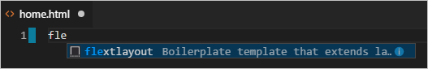

1. Select the completion to insert the snippet, the insert the following line within the "content" block and save the file. This one line is the only unique part of the extended page template:

    ```html
    <p><span class="message">{{ message }}</span> on {{ date }}</p>
    ```

1. In the `templates` folder, create `about.html`, use the snippet to insert the boilerplate markup, insert the line below in the "content" block, and save the file:

    ```html
    <p>About page for the Flask tutorial.</p>
    ```

1. Repeat the previous step to create `templates/contact.html` with the following line in the "content" block:

    ```html
    <p>Contact page for the Flask tutorial.</p>
    ```

1. In `views.py`, add functions for the /about and /contact routes that refer to their respective page templates and provide a unique value for the `title` placeholder that the page templates inherit from the base template:

    ```python
    @app.route('/about')
    def about():
            return render_template("about.html", title = "About us")

    @app.route('/contact')
    def contact():
            return render_template("contact.html", title = "Contact us")
    ```

### Run the app

With all the page templates in place, run the app to see the results. Navigate between the pages to verify that the page template are properly extending the base template.

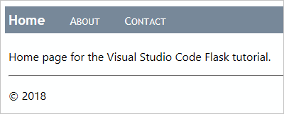

## Next steps

Congratulations on completing this walkthrough of working with Flask in Visual Studio code! From here you may want to review the following articles in the VS Code docs:

- [Editing Python code](editing.md)
- [Linting](linting.md)
- [Managing Python environments](environments.md)
- [Debugging Python](debugging.md)
- [Unit testing](unit-testing.md)