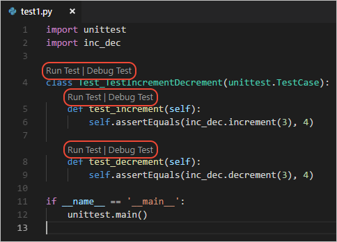
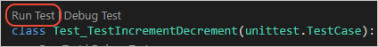
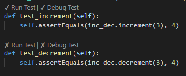
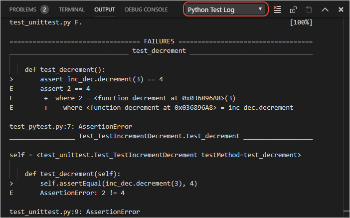
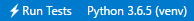

# Unit tests with Python in VS Code

The Python extension supports unit testing with Python's built-in [unittest](https://docs.python.org/3/library/unittest.html) framework as well as [pytest](https://docs.pytest.org/en/latest/) and [Nose](https://nose.readthedocs.io/en/latest/). To use either pytest and Nose, they must be installed into the current Python environment (the one identified in the `pythonPath` setting, see [Environments](/docs/python/environments.md)).

After [enabling a test framework](#enable-a-test-framework), use the **Python: Discover Unit Tests** command to scan the project for tests according to the discovery patterns of the currently selected test framework (see [Test discovery](#test-discovery). Once discovered, Visual Studio Code provides a variety of means to run tests (see [Run tests](#run-tests)) and debug tests (see [Debug tests](#debug-tests)). VS Code displays unit test output in the **Python Test Log** panel, including errors caused when a test framework is not installed.

> **Tip**: a useful repository containing a variety of unit tests, applied to different sorting algorithms, is [https://github.com/gwtw/py-sorting](https://github.com/gwtw/py-sorting).

For a general background on unit testing, see [Unit Testing](https://wikipedia.org/wiki/Unit_testing) on Wikipedia.

## An example test and walkthrough

Python tests are Python classes that are saved in separate files from the code being tested. How you write tests and how you save test files depends on the conventions of the framework you're using. Once you've written tests and have enabled a test framework, VS Code locates those tests and provides you with various commands to run and debug them.

The following steps give you a quick walkthrough of working with tests in VS Code. The sections that follow then go into more detail about test discovery, running tests, and debugging tests.

1. Enable the unittest framework by adding the following entries to your user (or workspace) settings. We recommend explicitly enabling one framework and disabling the others as shown here:

    ```json
    "python.unitTest.unittestEnabled": true,
    "python.unitTest.pyTestEnabled": false,
    "python.unitTest.nosetestsEnabled": false,
    ```

1. Create a file named `inc_dec.py` with the following code to be tested:

    ```python
    def increment(x):
        return x + 1

    def decrement(x):
        return x - 1
    ```

1. Create a file named `test1.py` that contains a test class with two test methods, one of which is intentionally set to fail for the purposes of demonstration:

    ```python
    import unittest
    import inc_dec

    class Test_TestIncrementDecrement(unittest.TestCase):
        def test_increment(self):
            self.assertEquals(inc_dec.increment(3), 4)

        def test_decrement(self):
            self.assertEquals(inc_dec.decrement(3), 4)

    if __name__ == '__main__':
        unittest.main()
    ```

1. When using unittest, VS Code by default looks for tests whenever you save a recognized test file. The unittest framework specifically looks for files with "test" anywhere in the filename, as in `test1.py`. Once VS Code recognizes tests, it provides several ways to run those tests as shown later in [Running tests](#running-tests). The most obvious means are adornments that appear directly in the editor and allow you to easily run a single test method or a test class:

    

1. For this walkthrough, select **Run Test** above the **class** to run all the tests in the class.

    

1. VS Code displays tests results directly in the editor, where you can see that one test passed and one failed:

    

    VS Code also shows test results in the **Python Test Log** output panel:

    

1. To more closely analyze a test, set a breakpoint on the line under the `test_decrement` function, then select the **Debug Test** adornment above that function. VS Code starts the debugger and pauses at the breakpoint. In this case, you can easily see that the expected result of 4 is incorrect and should be 2. Stop the debugger and correct that line of code:

    ```python
    self.assertEquals(inc_dec.decrement(3), 2)
    ```

1. Save the file and run the test again to see that it passes.

> **Note**: running or debugging a unit test does not automatically save the test file. Always be sure to save changes to a test before running it, otherwise you'll likely be confused by the results because they still reflect the previous version of the file!

## Enable a test framework

Unit testing in Python is disabled by default. To enable unit testing, set one and only one of the following settings to true: `python.unitTest.unittestEnabled`, `python.unitTest.pyTestEnabled`, and `python.unitTest.nosetestsEnabled`. Each framework also has specific configuration settings as described under [Test framework configurations](#test-framework-configurations).

It's important that you enable only a single test framework at a time. For this reason, when you enable one framework also be sure to disable the others.

To enable unittest, for example, use the following settings:

```json
"python.unitTest.unittestEnabled": true,
"python.unitTest.pyTestEnabled": false,
"python.unitTest.nosetestsEnabled": false,
```

To enable pyTest:

```json
"python.unitTest.unittestEnabled": false,
"python.unitTest.pyTestEnabled": true,
"python.unitTest.nosetestsEnabled": false,
```

To enable Nose:

```json
"python.unitTest.unittestEnabled": false,
"python.unitTest.pyTestEnabled": false,
"python.unitTest.nosetestsEnabled": true,
```

## Test discovery

VS Code uses the currently enabled unit testing framework to discover tests. You can trigger test discovery at any time using the **Python: Discover Unit Tests** command.

With unittest, the `"python.unitTest.autoTestDiscoverOnSaveEnabled" : true` setting (true is the default), automatically performs test discovery whenever you save a test file. To disable this feature, set the value to false.

Test discovery applies the discovery patterns specified in the arguments setting for the current test framework:  `python.unitTest.unittestArgs`, `python.unitTest.pyTestArgs`, or `python.unitTest.nosetestArgs` as described under [Test framework configurations](#test-framework-configurations).

For example, the default arguments for unittest include `-s . -p *test*.py`, which instruct unittest to look recursively, starting with the project folder (`-s .`), for all files with names matching the `*test*.py` pattern (`-p *test*.py`). You can specify a different starting folder after `-s`, and/or a different pattern after `-p`.

PyTest, for its part, has an algorithm for determining its root folder and patterns, as described on [pytest Configuration](https://docs.pytest.org/en/latest/customize.html) (docs.pytest.org).

For Nose, use the `-w=<folder>` and `-m=<regex>` switches to specify a starting folder and a regular expression for pattern matching (see [Nose options](https://nose.readthedocs.io/en/latest/usage.html#options) (nose.readthedocs.io)).

> **Tip**: Sometimes unit tests placed in subfolders aren't discovered because such test files cannot be imported. To make them importable, create an empty file named `__init__.py` in that folder.

## Run tests

You run tests using any of the following actions:

- Select `Run Tests` on the Status Bar (which can change appearance based on results),

    

    then select one of the commands like `Run All Tests` or `Run Failed Unit Tests`:

    

- Right-click a file in Explorer and select `Run Unit Tests`, which runs the tests in that one file.

- Open a test file and select the `Run Test` adornment that appears above a test class or a method. This command runs only those tests in the class or runs that one test method, respectively.

    

- From the **Command Palette**, select any of the run unit test commands:

    

    | Command | Description |
    | --- | --- |
    | Debug All Unit Tests | See [Debug tests](#debug-tests). |
    | Debug Unit Test Method | See [Debug tests](#debug-tests). |
    | Run All Unit Tests | Searches for and runs all unit tests in the workspace and its subfolders. |
    | Run Current Unit Test File | Runs the test in the file that's currently viewed in the editor. |
    | Run Failed Unit Tests | Re-runs any tests that failed in a previous test run. Runs all test if no tests have been run yet. |
    | Run Unit Test File | Prompts for a specific test filename, then runs the test in that file. |
    | Run Unit Test Method | Prompts for the name of a test to run, providing auto-completion for test names. |
    | Show Unit Test Output | Opens the Python Test Log panel with information about passing and failing tests, as well as errors and skipped tests. |

## Debug tests

Because unit tests themselves are source code, they are prone to code defects just like the production code they test. For this reason, you may occasionally need to step through unit tests in the debugger.

The **Python: Debug All Tests** and **Python: Debug Unit Test Method** commands (on both the Command Palette and Status Bar menu) launch the debugger for all tests and a single test method, respectively.

The debugger works the same for unit tests as for other Python code, including breakpoints, variable inspection, and so on. For more information, see [Python debugging configurations](/docs/python/debugging.md) and the general VS Code [Debugging](/docs/editor/debugging.md) article.

## Test framework configurations

The behavior of each test framework is driven by its applicable settings as described in the following sections.

### Unittest configuration settings

| Setting<br/>(python.unitTest.) | Default | Description |
| --- | --- | --- |
| unittestEnabled | `false` | Specifies whether UnitTest is enabled as the test framework. All other frameworks should be disabled. |
| unittestArgs | `["-v", "-s", ".", "-p", "*test*.py"]` | Arguments to pass to unittest, where each element that's separated by a space is a separate item in the list. See below for a description of the defaults. |
| cwd | null | Specifies an optional working directory for unit tests. |
| outputWindow | `"Python Test Log"` | The window to use for unit test output. |
| promptToConfigure | `true` | Specifies whether VS Code prompts to configure a test framework if potential tests are discovered. |
| debugPort | `3000` | Port number used for debugging of UnitTest tests. |
  autoTestDiscoverOnSaveEnabled | `true` | Specifies whether to enable or disable auto run test discovery when saving a unit test file. |

The default arguments for UnitTest are as follows:

- `-v` sets default verbosity. Remove this argument for simpler output.
- `-s .` specifies the starting directory for discovering tests. If you have tests in a "test" folder, you can change this to `-s test` (meaning `"-s", "test"` in the arguments array).
- `-p *test*.py` is the discovery pattern used to look for tests. In this case, it's any `.py` file that includes the word "test". If you name test files differently, such as appending "\_test" to every filename, then use a pattern like `*_test.py` in the appropriate argument of the array.

To stop a test run on the first failure, add the fail fast option `"-f"` to the arguments array.

See [unittest command-line interface](https://docs.python.org/3/library/unittest.html#command-line-interface) for the full set of available options.

### Pytest configuration settings

| Setting<br/>(python.unitTest.) | Default | Description |
| --- | --- | --- |
| pyTestEnabled | `false` | Specifies whether PyTest is enabled as the test framework. All other frameworks should be disabled. |
| pyTestPath | `"py.test"` | Path to PyTest. Use a full path if PyTest is located outside the current environment. |
| pyTestArgs | `[]` | Arguments to pass to PyTest, where each element that's separated by a space is a separate item in the list. See [PyTest command line options](https://docs.pytest.org/en/latest/customize.html#command-line-options-and-configuration-file-settings). |

You can also configure pytest using a `pytest.ini` file as described on [PyTest Configuration](https://docs.pytest.org/en/latest/customize.html).

> **Note**
> If you have the pytest-cov coverage module installed, VS Code doesn't stop at breakpoints while debugging because pytest-cov is using the same technique to access the source code being run. To prevent this behavior, include `--no-cov` in `pyTestArgs` when debugging tests. (For more information, see [Debuggers and PyCharm](https://pytest-cov.readthedocs.io/en/latest/debuggers.html) in the pytest-cov documentation.)

### Nose configuration settings

| Setting<br/>(python.unitTest.) | Default | Description |
| --- | --- | --- |
| nosetestsEnabled | `false` | Specifies whether Nose  is enabled as the test framework. All other frameworks should be disabled. |
| nosetestPath | `"nosetests"` | Path to Nose. Use a full path if Nose is located outside the current environment. |
| nosetestArgs | `[]` | Arguments to pass to Nose, where each element that's separated by a space is a separate item in the list. See [Nose usage options](https://nose.readthedocs.io/en/latest/usage.html#options). |

You can also configure nose with a `.noserc` or `nose.cfg` file as described on [Nose configuration](https://nose.readthedocs.io/en/latest/usage.html#configuration).

## See also

- [Python environments](/docs/python/environments.md) - Control which Python interpreter is used for editing and debugging.
- [Settings reference](/docs/python/settings-reference.md) - Explore the full range of Python-related settings in VS Code.
