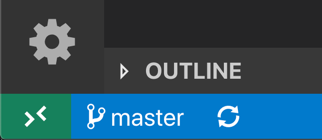

# Developing inside a Container

The **Visual Studio Code Remote - Containers** extension lets you use a [Docker container](https://docker.com) as a full-featured development environment. It allows you to open any folder inside (or mounted into) a container and take advantage of Visual Studio Code's full feature set. A [devcontainer.json file](#create-a-devcontainerjson-file) in your project tells VS Code how to access (or create) a **development container** with a well-defined tool and runtime stack. This container can be used to run an application or to sandbox tools, libraries, or runtimes needed for working with a codebase.

Workspace files are mounted from the local file system or copied or cloned into the container. Extensions are installed and run inside the container, where they have full access to the tools, platform, and file system. This means that you can seamlessly switch your entire development environment just by connecting to a different container.


This lets VS Code provide a **local-quality development experience** — including full IntelliSense (completions), code navigation, and debugging — **regardless of where your tools (or code) are located**.

## Getting started

**Note**: After reviewing this topic, you can get started with the introductory [Containers tutorial](/docs/remote/containers-tutorial.md).

### System requirements

**Local:**

* **Windows:** [Docker Desktop](https://www.docker.com/products/docker-desktop) 2.0+ on Windows 10 Pro/Enterprise. Windows 10 Home (2004+) requires Docker Desktop 2.3+ and the [WSL 2 back-end](https://aka.ms/vscode-remote/containers/docker-wsl2). (Docker Toolbox is not supported. Windows container images are not supported.)
* **macOS**:  [Docker Desktop](https://www.docker.com/products/docker-desktop) 2.0+.
* **Linux**: [Docker CE/EE](https://docs.docker.com/install/#supported-platforms) 18.06+ and [Docker Compose](https://docs.docker.com/compose/install) 1.21+. (The Ubuntu snap package is not supported.)

**Containers**:

* x86_64 / ARMv7l (AArch32) / ARMv8l (AArch64) Debian 9+, Ubuntu 16.04+, CentOS / RHEL 7+
* x86_64 Alpine Linux 3.9+

Other `glibc` based Linux containers may work if they have [needed Linux prerequisites](/docs/remote/linux.md).

### Installation

To get started, follow these steps:

1. Install and configure [Docker](https://www.docker.com/get-started) for your operating system.

    **Windows / macOS**:

    1. Install [Docker Desktop for Windows/Mac](https://www.docker.com/products/docker-desktop).

    2. If you are using WSL 2 on Windows, to enable the [Windows WSL 2 back-end](https:/*/aka.ms/vscode-remote/containers/docker-wsl2): Right-click on the Docker taskbar item and select **Settings**. Check **Use the WSL 2 based engine** and verify your distribution is enabled under **Resources > WSL Integration**.

    3. Right-click on the Docker task bar item, select **Settings** and update **Resources > File Sharing** with any locations your source code is kept. See [tips and tricks](/docs/remote/troubleshooting.md#container-tips) for troubleshooting. This option is not available if you have enabled the WSL 2 back-end in the step above.

    **Linux**:

    1. Follow the [official install instructions for Docker CE/EE for your distribution](https://docs.docker.com/install/#supported-platforms). If you are using Docker Compose, follow the [Docker Compose directions](https://docs.docker.com/compose/install/) as well.

    2. Add your user to the `docker` group by using a terminal to run: `sudo usermod -aG docker $USER`

    3. Sign out and back in again so your changes take effect.

2. Install [Visual Studio Code](https://code.visualstudio.com/) or [Visual Studio Code Insiders](https://code.visualstudio.com/insiders/).

3. Install the [Remote Development extension pack](https://aka.ms/vscode-remote/download/extension).

### Working with Git?

Here are two tips to consider:

* If you are working with the same repository both locally in Windows and inside a container, be sure to set up consistent line endings. See [tips and tricks](/docs/remote/troubleshooting.md#resolving-git-line-ending-issues-in-containers-resulting-in-many-modified-files) for details.
* If you clone using a Git credential manager, your container should already have access to your credentials! If you use SSH keys, you can also opt in to sharing them. See [Sharing Git credentials with your container](#sharing-git-credentials-with-your-container) for details.

### Working with Containers

The Remote - Containers extension supports two primary operating models:

* You can use a container as your [full-time development environment](/docs/remote/create-dev-container.md#create-a-devcontainerjson-file).
* You can [attach to a running container](/docs/remote/attach-container.md) to inspect it.

## Quick start: Try a development container

The easiest way to get started is to try one of the sample development containers. The [Containers tutorial](/docs/remote/containers-tutorial.md) will walk you through setting up Docker and the Remote - Containers extension and let you select a sample:


## Quick start: Open an existing folder in a container

This quick start covers how to set up a dev container for an existing project to use as your full-time development environment using existing source code on your filesystem. Follow these steps:

1. Start VS Code, run the **Remote-Containers: Open Folder in Container...** command from the Command Palette (`kbstyle(F1)`) or quick actions Status bar item, and select the project folder you would like to set up the container for.

    > **Tip:** If you want to edit the container's contents or settings before opening the folder, you can run **Remote-Containers: Add Development Container Configuration Files...** instead.

    

2. Now pick a starting point for your dev container. You can either select a base **dev container definition** from a filterable list, or use an existing [Dockerfile](https://docs.docker.com/engine/reference/builder/) or [Docker Compose file](https://docs.docker.com/compose/compose-file/#compose-file-structure-and-examples) if one exists in the folder you selected.

    > **Note:** When using Alpine Linux containers, some extensions may not work due to `glibc` dependencies in native code inside the extension.

    

    The list will be automatically sorted based on the contents of the folder you open. Note the dev container definitions displayed come from the [vscode-dev-containers repository](https://aka.ms/vscode-dev-containers). You can browse the `containers` folder of that repository to see the contents of each definition.

3. After picking the starting point for your container, VS Code will add the dev container configuration files to your project (`.devcontainer/devcontainer.json`).

4. The VS Code window will reload and start building the dev container. A progress notification provides status updates. You only have to build a dev container the first time you open it; opening the folder after the first successful build will be much quicker.

    

5. After the build completes, VS Code will automatically connect to the container.

You can now interact with your project in VS Code just as you could when opening the project locally. From now on, when you open the project folder, VS Code will automatically pick up and reuse your dev container configuration.

> **Tip:** Want to use a remote Docker host? See the [Advanced Containers article](/docs/remote/containers-advanced.md#developing-inside-a-container-on-a-remote-docker-host) for details on setup.

While using this approach to [bind mount](https://docs.docker.com/storage/bind-mounts/) the local filesystem into a container is convenient, it does have some performance overhead on Windows and macOS. There are [some techniques](/docs/remote/containers-advanced.md#improving-container-disk-performance) that you can apply to improve disk performance, or you can [open a repository in a container using a isolated container volume](#quick-start-open-a-git-repository-or-github-pr-in-an-isolated-container-volume) instead.

### Open a WSL 2 folder in a container on Windows

If you are using [Windows Subsystem for Linux v2 (WSL 2)](https://docs.microsoft.com/en-us/windows/wsl/wsl2-about) and have enabled [Docker Desktop's WSL 2 back-end](https://aka.ms/vscode-remote/containers/docker-wsl2), you can work with source code stored inside WSL!

Once the WSL 2 engine is enabled, you can either:

* Use the **Remote-Containers: Reopen Folder in Container** command from a folder already opened using the [Remote - WSL](https://aka.ms/vscode-remote/download/wsl) extension.
* Select **Remote-Containers: Open Folder in Container...** from the Command Palette (`kbstyle(F1)`) and choose a WSL folder using the local `\\wsl$` share (from the Windows side).

The rest of the quick start applies as-is! You can learn more about the [Remote - WSL extension in its documentation](/docs/remote/wsl.md).

### Open an existing workspace in a container

You can also follow a similar process to open a [VS Code multi-root workspace](/docs/editor/multi-root-workspaces) in a **single container** if the workspace only **references relative paths to sub-folders of the folder the `.code-workspace` file is in (or the folder itself).**

You can either:

* Use the **Remote-Containers: Open Workspace in Container...** command.
* Use **File > Open Workspace...** once you have opened a folder that contains a `.code-workspace` file in a container.

Once connected, you may want to **add the `.devcontainer` folder** to the workspace so you can easily edit its contents if it is not already visible.

Also note that, while you cannot use multiple containers for the same workspace in the same VS Code window, you can use [multiple Docker Compose managed containers at once](/docs/remote/containers-advanced.md#connecting-to-multiple-containers-at-once) from separate windows.

## Quick start: Open a Git repository or GitHub PR in an isolated container volume

While you can [open a locally cloned repository in a container](#quick-start-open-an-existing-folder-in-a-container), you may want to work with an isolated copy of a repository for a PR review or to investigate another branch without impacting your work.

Repository Containers use isolated, local Docker volumes instead binding to the local filesystem. In addition to not polluting your file tree, local volumes have the added benefit of improved performance on Windows and macOS. (See [Advanced Configuration](/docs/remote/containers-advanced.md#improving-container-disk-performance) for information on how to use these types of volumes in other scenarios.)

For example, follow these steps to open one of the "try" repositories in a Repository Container:

1. Start VS Code and run **Remote-Containers: Clone Repository in Container Volume...** from the Command Palette (`kbstyle(F1)`).

2. Enter `microsoft/vscode-remote-try-node` (or one of the other "try" repositories), a Git URI, a GitHub branch URL, or a GitHub PR URL in the input box that appears and press `kbstyle(Enter)`.

    

    > **Tip:** If you choose a private repository, you may want to setup a credential manager or add your SSH keys to your SSH agent. See [Sharing Git credentials with your container](#sharing-git-credentials-with-your-container).

3. If your repository does not have a `.devcontainer/devcontainer.json` file in it, you'll be asked to pick a starting point from a filterable list or an existing [Dockerfile](https://docs.docker.com/engine/reference/builder/) or [Docker Compose file](https://docs.docker.com/compose/compose-file/#compose-file-structure-and-examples) (if one exists).

    > **Note:** When using Alpine Linux containers, some extensions may not work due to `glibc` dependencies in native code inside the extension.

    

    The list will be automatically sorted based on the contents of the folder you open. Note the dev container definitions displayed come from the [vscode-dev-containers repository](https://aka.ms/vscode-dev-containers). You can browse the `containers` folder of that repository to see the contents of each definition.

4. The VS Code window (instance) will reload, clone the source code, and start building the dev container. A progress notification provides status updates.

    

    If you pasted in a GitHub pull request URL in step 2, the PR will be automatically checked out and the [GitHub Pull Requests](https://marketplace.visualstudio.com/items?itemName=GitHub.vscode-pull-request-github) extension will be installed in the container. The extension provides additional PR related features like a PR explorer, interacting with PR comments inline, and status bar visibility.

    

5. After the build completes, VS Code will automatically connect to the container. You can now work with the repository source code in this independent environment as you would if you had cloned the code locally.

Note that if the container fails to come up due to something like a Docker build error, you can select **Reopen in Recovery Container** in the dialog that appears to go into a "recovery container" that allows you to edit your Dockerfile or other content. This opens the docker volume with the cloned repository in a minimal container and shows you the creation log. Once you are done fixing, use **Reopen in Container** to retry.

> **Tip:** Want to use a remote Docker host? See the [Advanced Containers article](/docs/remote/containers-advanced.md#developing-inside-a-container-on-a-remote-docker-host) for details on setup.

## Create a devcontainer.json file

VS Code's container configuration is stored in a [devcontainer.json](/docs/remote/devcontainerjson-reference.md) file. This file is similar to the `launch.json` file for debugging configurations, but is used for launching (or attaching to) your development container instead. You can also specify any extensions to install once the container is running or post-create commands to prepare the environment. The dev container configuration is either located under `.devcontainer/devcontainer.json` or stored as a `.devcontainer.json` file (note the dot-prefix) in the root of your project.

You can use any image, Dockerfile, or set of Docker Compose files as a starting point. Here is a simple example that uses one of the pre-built [VS Code Development Container images](https://hub.docker.com/_/microsoft-vscode-devcontainers):

```json
{
    "image": "mcr.microsoft.com/vscode/devcontainers/typescript-node:0-12",
    "forwardPorts": [ 3000 ],
    "extensions": [
        "dbaeumer.vscode-eslint"
    ]
}
```

Selecting the **Remote-Containers: Add Development Container Configuration Files...** command from the Command Palette (`kbstyle(F1)`) will add the needed files to your project as a starting point, which you can further customize for your needs. The command lets you pick a pre-defined container configuration from a list based on your folder's contents, reuse an existing Dockerfile, or reuse an existing Docker Compose file.

To learn more about creating `devcontainer.json` files, see [Create a Development Container](/docs/remote/create-dev-container.md).

## Inspecting volumes

Occasionally you may run into a situation where you are using a Docker named volume that you want to inspect or make changes in. You can use VS Code to work with these contents without creating or modifying `devcontainer.json` file by selecting the **Remote-Containers: Inspect Volume in Container...** from the Command Palette (`kbstyle(F1)`).

If you have the [Docker extension](https://marketplace.visualstudio.com/items?itemName=ms-azuretools.vscode-docker) installed, you can also right-click on a volume in the **Volumes** section of the **Docker Explorer** and select **Inspect in Visual Studio Code**.


## Managing extensions

VS Code runs extensions in one of two places: locally on the UI / client side, or in the container. While extensions that affect the VS Code UI, like themes and snippets, are installed locally, most extensions will reside inside a particular container. This allows you to install only the extensions you need for a given task in a container and seamlessly switch your entire tool-chain just by connecting to a new container.

If you install an extension from the Extensions view, it will automatically be installed in the correct location. You can tell where an extension is installed based on the category grouping. There will be a **Local - Installed** category and also one for your container.


> **Note:** If you are an extension author and your extension is not working properly or installs in the wrong place, see [Supporting Remote Development](/api/advanced-topics/remote-extensions.md) for details.

Local extensions that actually need to run remotely will appear **Disabled** in the **Local - Installed** category. Select **Install** to install an extension on your remote host.


You can also install all locally installed extensions inside the Dev Container by going to the Extensions view and selecting **Install Local Extensions in Dev Container: [Name]** using the cloud button at the right of the **Local - Installed** title bar. This will display a dropdown where you can select which locally installed extensions to install in your container.


However, some extensions may require you to [install additional software](/docs/remote/create-dev-container.md#install-additional-software) in the container. Consult extension documentation for details if you encounter issues.

### Adding an extension to devcontainer.json

While you can edit your [devcontainer.json](/docs/remote/create-dev-container.md#create-a-devcontainerjson-file) file by hand to add a list of extension IDs, you can also right-click on any extension in the Extensions view and select **Add to devcontainer.json**.


### "Always installed" extensions

If there are extensions that you would like always installed in any container, you can update the `remote.containers.defaultExtensions` User [setting](/docs/getstarted/settings.md). For example, if you wanted to install the [GitLens](https://marketplace.visualstudio.com/items?itemName=eamodio.gitlens) and [Resource Monitor](https://marketplace.visualstudio.com/items?itemName=mutantdino.resourcemonitor) extensions, you would specify their extension IDs as follows:

```json
"remote.containers.defaultExtensions": [
    "eamodio.gitlens",
    "mutantdino.resourcemonitor"
]
```

### Advanced: Forcing an extension to run locally or remotely

Extensions are typically designed and tested to either run locally or remotely, not both. However, if an extension supports it, you can force it to run in a particular location in your `settings.json` file.

For example, the setting below will force the Docker extension to run locally and Debugger for Chrome extension to run remotely instead of their defaults:

```json
"remote.extensionKind": {
    "ms-azuretools.vscode-docker": [ "ui" ],
    "msjsdiag.debugger-for-chrome": [ "workspace" ]
}
```

A value of `"ui"` instead of `"workspace"` will force the extension to run on the local UI/client side instead. Typically, this should only be used for testing unless otherwise noted in the extension's documentation since it **can break extensions**. See the article on [Supporting Remote Development](/api/advanced-topics/remote-extensions.md) for details.

## Forwarding or publishing a port

Containers are separate environments, so if you want to access a server, service, or other resource inside your container, you will need to either "forward" or "[publish](https://stackoverflow.com/a/22150099)" the port to your host. You can either configure your container to always expose these ports or just forward them temporarily.

### Always forwarding a port

You can specify a list of ports you **always** want to forward when attaching or opening a folder in container by using the `forwardPorts` property in `devcontainer.json`.

```json
"forwardPorts": [3000, 3001]
```

Simply reload / reopen the window and the setting will be applied when VS Code connects to the container.

### Temporarily forwarding a port

If you need to access a port that you didn't add to `devcontainer.json` or publish in your Docker Compose file, you can **temporarily forward** a new port for the duration of the session by running the **Forward a Port** command from the Command Palette (`kbstyle(F1)`).


After selecting a port, a notification will tell you the localhost port you should use to access the port in the container. For example, if you forwarded an HTTP server listening on port 3000, the notification may tell you that it was mapped to port 4123 on localhost. You can then connect to this remote HTTP server using `http://localhost:4123`.

This same information is available in the **Forwarded Ports** section of the Remote Explorer if you need to access it later.

If you would like VS Code to remember any ports you have forwarded, check **Remote: Restore Forwarded Ports** in the Settings editor (`kb(workbench.action.openSettings)`) or set `"remote.restoreForwardedPorts": true` in `settings.json`.


### Publishing a port

Docker has the concept of "publishing" ports when the container is created. Published ports behave very much like ports you make available to your local network. If your application only accepts calls from `localhost`, it will reject connections from published ports just as your local machine would for network calls. Forwarded ports, on the other hand, actually look like `localhost` to the application. Each can be useful in different situations.

To publish a port, you can:

1. **Use the appPort property:** If you reference an image or Dockerfile in `devcontainer.json`, you can use the `appPort` property to publish ports to the host.

    ```json
    "appPort": [ 3000, "8921:5000" ]
    ```

2. **Use the Docker Compose ports mapping:** The [ports mapping](https://docs.docker.com/compose/compose-file#ports) can easily be added your `docker-compose.yml` file to publish additional ports.

    ```yaml
    ports:
    - "3000"
    - "8921:5000"
    ```

In each case, you'll need to rebuild your container for the setting to take effect. You can do this by running the **Remote-Containers: Rebuild Container** command in the Command Palette (`kbstyle(F1)`) when you are connected to the container.

## Opening a terminal

Opening a terminal in a container from VS Code is simple. Once you've opened a folder in a container, **any terminal window** you open in VS Code (**Terminal > New Terminal**) will automatically run in the container rather than locally.

You can also use the `code` command line from this same terminal window to perform a number of operations such as opening a new file or folder in the container. Type `code --help` to learn what options are available from the command line.


## Debugging in a container

Once you've opened a folder in a container, you can use VS Code's debugger in the same way you would when running the application locally. For example, if you select a launch configuration in `launch.json` and start debugging (`kb(workbench.action.debug.start)`), the application will start on the remote host and attach the debugger to it.

See the [debugging](/docs/editor/debugging.md) documentation for details on configuring VS Code's debugging features in `.vscode/launch.json`.

## Container specific settings

VS Code's local user settings are also reused when you are connected to a dev container. While this keeps your user experience consistent, you may want to vary some of these settings between your local machine and each container. Fortunately, once you have connected to a container, you can also set container-specific settings by running the **Preferences: Open Remote Settings** command from the Command Palette (`kbstyle(F1)`) or by selecting the **Remote** tab in the Settings editor. These will override any local settings you have in place whenever you connect to the container.


### Default container specific settings

You can include defaults for container specific settings in `devcontainer.json` using the `settings` property. These values will be automatically placed in the container specific settings file inside the container once it is created.

For example, adding this to `.devcontainer/devcontainer.json` will set the Java home path:

```json
"settings": {
    "java.home": "/docker-java-home"
}
```

Since this just establishes the default, you are still able to change the settings as needed once the container is created.

## Sharing Git credentials with your container

The Remote - Containers extension provides out of box support for using local Git credentials from inside a container. In this section, we'll walk through the two supported options.

If you do not have your user name or email address set up locally, you may be prompted to do so. You can do this on your **local** machine by running the following commands:

```bash
git config --global user.name "Your Name"
git config --global user.email "your.email@address"
```

The extension will automatically copy your local `.gitconfig` file into the container on startup so you should not need to do this in the container itself.

### Using a credential helper

If you use HTTPS to clone your repositories and **have a [credential helper configured](https://help.github.com/articles/caching-your-github-password-in-git) in your local OS, no further setup is required.** Credentials you've entered locally will be reused in the container and vice versa.

### Using SSH keys

There are some cases when you may be cloning your repository using SSH keys instead of a credential helper. To enable this scenario, the extension will automatically forward your **local [SSH agent](https://www.ssh.com/ssh/agent) if one is running**.

You can add your local SSH keys to the agent if it is running by using the `ssh-add` command. For example, run this from a terminal or PowerShell:

```bash
ssh-add $HOME/.ssh/github_rsa
```

On Windows and Linux, you may get an error because the agent is not running (macOS typically has it running by default). Follow these steps to resolve the problem:

**Windows**:

Start a **local Administrator PowerShell** and run the following commands:

```powershell
# Make sure you're running as an Administrator
Set-Service ssh-agent -StartupType Automatic
Start-Service ssh-agent
Get-Service ssh-agent
```

**Linux:**

First, start the SSH Agent in the background by running the following in a terminal:

```bash
eval "$(ssh-agent -s)"
```

Then add these lines to your `~/.bash_profile` or `~/.zprofile` (for Zsh) so it starts on login:

```bash
if [ -z "$SSH_AUTH_SOCK" ]; then
   # Check for a currently running instance of the agent
   RUNNING_AGENT="`ps -ax | grep 'ssh-agent -s' | grep -v grep | wc -l | tr -d '[:space:]'`"
   if [ "$RUNNING_AGENT" = "0" ]; then
        # Launch a new instance of the agent
        ssh-agent -s &> $HOME/.ssh/ssh-agent
   fi
   eval `cat $HOME/.ssh/ssh-agent`
fi
```

### Sharing GPG Keys

If want to [GPG](https://www.gnupg.org/) sign your commits, you can share your local keys with your container as well. You can find out about signing using a GPG key in [GitHub's documentation](https://help.github.com/github/authenticating-to-github/managing-commit-signature-verification).

If you do not have GPG set up, on **Windows**, you can install [Gpg4win](https://www.gpg4win.org/) or on **macOS** you can install [GPG Tools](https://gpgtools.org/). On **Linux**, **locally** install the `gnupg2` package using your system's package manger.

Next, install `gnupg2` in your container by updating your Dockerfile. For example:

```bash
RUN apt-get update && apt-get install gnupg2 -y
```

Or if running as a [non-root user](/docs/remote/containers-advanced.md#adding-a-nonroot-user-to-your-dev-container):

```bash
RUN sudo apt-get update && sudo apt-get install gnupg2 -y
```

The next time the container starts, your GPG keys should be accessible inside the container as well.

> **Note:** If you used `gpg` previously in the container, you may need to run **Remote-Containers: Rebuild Container** for the update to take effect.

## Managing containers

By default, the Remote - Containers extension automatically starts the containers mentioned in the `devcontainer.json` when you open the folder. When you close VS Code, the extension automatically shuts down the containers you've connected to. You can change this behavior by adding `"shutdownAction": "none"` to `devcontainer.json`.

While you can use the command line to manage your containers, you can also use the  **Remote Explorer**. To stop a container, select Containers from the dropdown (if present), right-click on a running container, and select **Stop Container**. You can also start exited containers, remove containers, and remove recent folders. From the Details view, you can forward ports and open already forwarded ports in the browser.


If you want to clean out images or mass-delete containers, see [Cleaning out unused containers and images](/docs/remote/troubleshooting.md#cleaning-out-unused-containers-and-images) for different options.

## Personalizing with dotfile repositories

Dotfiles are files whose filename begins with a dot (`.`) and typically contain configuration information for various applications. Since development containers can cover a wide range of application types, it can be useful to store these files somewhere so that you can easily copy them into a container once it is up and running.

A common way to do this is to store these dotfiles in a GitHub repository and then use a utility to clone and apply them. The Remote - Containers extension has built-in support for using these with your own containers. If you are new to the idea, take a look at the different [dotfiles bootstrap repositories](https://dotfiles.github.io/) that exist.

To use it, add your dotfiles GitHub repository to VS Code's User Settings (`kb(workbench.action.openSettings)`) as follows:


Or in `settings.json`:

```json
{
    "dotfiles.repository": "your-github-id/your-dotfiles-repo",
    "dotfiles.targetPath": "~/dotfiles",
    "dotfiles.installCommand": "~/dotfiles/install.sh"
}
```

From this point forward, the dotfiles repository will be used whenever a container is created.

## Advanced container configuration

See the [Advanced Container Configuration](/docs/remote/containers-advanced.md) article for information on the following topics:

* [Adding environment variables](/docs/remote/containers-advanced.md#adding-environment-variables)
* [Adding another local file mount](/docs/remote/containers-advanced.md#adding-another-local-file-mount)
* [Changing or removing the default source code mount](/docs/remote/containers-advanced.md#changing-the-default-source-code-mount)
* [Improving container disk performance](/docs/remote/containers-advanced.md#improving-container-disk-performance)
* [Adding a non-root user to your dev container](/docs/remote/containers-advanced.md#adding-a-nonroot-user-to-your-dev-container)
* [Avoiding extension reinstalls on container rebuild](/docs/remote/containers-advanced.md#avoiding-extension-reinstalls-on-container-rebuild)
* [Setting the project name for Docker Compose](/docs/remote/containers-advanced.md#setting-the-project-name-for-docker-compose)
* [Using Docker or Kubernetes from inside a container](/docs/remote/containers-advanced.md#using-docker-or-kubernetes-from-a-container)
* [Connecting to multiple containers at once](/docs/remote/containers-advanced.md#connecting-to-multiple-containers-at-once)
* [Developing inside a container on a remote Docker Machine or SSH host](/docs/remote/containers-advanced.md#developing-inside-a-container-on-a-remote-docker-host)
* [Reducing Dockerfile build warnings](/docs/remote/containers-advanced.md#reducing-dockerfile-build-warnings)

## devcontainer.json reference

There is a full [devcontainer.json reference](/docs/remote/devcontainerjson-reference.md), where you can review
the file schema to help you customize your development containers and control how you attach to running containers.

## Known limitations

### Remote - Containers limitations

* Windows container images are **not** yet supported.
* Using a remote Docker Host is possible, but requires [additional setup steps](/docs/remote/containers-advanced.md#developing-inside-a-container-on-a-remote-docker-host).
* All roots/folders in a multi-root workspace will be opened in the same container, regardless of whether there are configuration files at lower levels.
* The unofficial Ubuntu Docker **snap** package for Linux is **not** supported. Follow the [official Docker install instructions for your distribution](https://docs.docker.com/install/#supported-platforms).
* Docker Toolbox on Windows is not supported.
* If you clone a Git repository using SSH and your SSH key has a passphrase, VS Code's pull and sync features may hang when running remotely. Either use an SSH key without a passphrase, clone using HTTPS, or run `git push` from the command line to work around the issue.
* Local proxy settings are not reused inside the container, which can prevent extensions from working unless the appropriate proxy information is configured (for example global `HTTP_PROXY` or `HTTPS_PROXY` environment variables with the appropriate proxy information).

See [here for a list of active issues](https://aka.ms/vscode-remote/containers/issues) related to Containers.

### Docker limitations

* First-time installs of Docker Desktop for Windows when not using the WSL 2 engine will require an additional "sharing" step to give your container access to local source code. However, this step may not work with certain AAD (email-based) identities. See [Docker Desktop for Windows tips](/docs/remote/troubleshooting.md#docker-desktop-for-windows-tips) and [Enabling file sharing in Docker Desktop](/docs/remote/troubleshooting.md#enabling-file-sharing-in-docker-desktop) for details and workarounds.
* You may see errors if you sign in to Docker with your email address instead of your Docker ID. This is a known issue and can be resolved by signing in with your Docker ID instead. See Docker [issue #935](https://github.com/docker/hub-feedback/issues/935#issuecomment-300361781) for details.
* If you see high CPU spikes for `com.docker.hyperkit` on macOS, this may be due to a [known issue with Docker for Mac](https://github.com/docker/for-mac/issues/1759). See the Docker issue for details.

See the Docker troubleshooting guide for [Windows](https://docs.docker.com/docker-for-windows/troubleshoot) or [Mac](https://docs.docker.com/docker-for-mac/troubleshoot), consult [Docker Support Resources](https://success.docker.com/article/best-support-resources) for more information.

### Docker Extension limitations

While the Docker extension can run both remotely and locally, if it is already installed locally, you will be unable to install in a container without first uninstalling it locally. We will address this problem in a future VS Code release.

### Extension limitations

Many extensions will work inside dev containers without modification. However, in some cases, certain features may require changes. If you run into an extension issue, see [here for a summary of common problems and solutions](/docs/remote/troubleshooting.md#extension-tips) that you can mention to the extension author when reporting the issue.

In addition, while Alpine support is available, some extensions installed in the container may not work due to `glibc` dependencies in native code inside the extension. See the [Remote Development with Linux](/docs/remote/linux.md) article for details.

## Common questions

### I am seeing errors when trying to mount the local filesystem into a container

Right-click on the Docker task bar item. On Windows, select the **Settings** menu item then **Resources > File Sharing** and check the drive(s) where your source code is located. On macOS, select the **Preferences** menu item then **Resources > File Sharing** and make sure the folder containing your source code is under a file path specified in the list.

See [Docker Desktop for Windows tips](/docs/remote/troubleshooting.md#docker-desktop-for-windows-tips) for information on workarounds to common Docker for Windows issues.

### Can I use Podman instead of Docker?

Podman 1.9+ is mostly compatible with Docker's CLI commands and therefore generally does work if you update the setting **Remote > Containers: Docker Path** to `podman` on Linux.


However, certain tricks like [Docker-from-Docker do not work](https://github.com/containers/libpod/issues/4056#issuecomment-535511841) due to limitations in Podman. This affects the **Remote-Containers: Try a Sample...** and **[Remote- Containers: Clone Repository in Container Volume...](#quick-start-open-a-git-repository-or-github-pr-in-an-isolated-container-volume)** commands.

Docker Compose is also not supported by Podman.

### I'm seeing an error about a missing library or dependency

Some extensions rely on libraries not found in specific Docker images. For example, [Visual Studio Live Share](https://visualstudio.microsoft.com/services/live-share/) requires the installation of system-level dependencies, which are [listed in their documentation](https://docs.microsoft.com/visualstudio/liveshare/reference/linux#install-prerequisites-manually). The need for these dependencies may depend on the operating system (for example, specific Linux distribution) used by your Docker image. You may need to install these dependencies during the Docker build process, by adding required commands to your Dockerfile. Search the specific extension's documentation to check for dependencies and see [Installing additional software](/docs/remote/create-dev-container.md#install-additional-software) for help with resolving the problem.

### Can I connect to multiple containers at once?

A VS Code window can only connect to one window currently, but you can open a new window and [attach](/docs/remote/attach-container.md) to an already running container or [use a common Docker Compose file with multiple `devcontainer.json` files](/docs/remote/containers-advanced.md#connecting-to-multiple-containers-at-once) to automate the process a bit more.

### Can I work with containers on a remote host?

Yes, you can either attach to a container running on a remote host or create a specialized `devcontainer.json` to tell VS Code how to work with your remote environment. To access the host, you can either connect to a publicly exposed Docker daemon TCP port or use SSH to tunnel into a remote VM running Docker. See [Developing inside a container on a remote Docker host](/docs/remote/containers-advanced.md#developing-inside-a-container-on-a-remote-docker-host) for details.

### How can I build or deploy container images into my local Docker / Kubernetes install when working inside a container?

You can build images and deploy containers by forwarding the Docker socket and installing the Docker CLI (and kubectl for Kubernetes) in the container. See the [Docker-from-Docker](https://aka.ms/vscode-remote/samples/docker-from-docker), [Docker-from-Docker Compose](https://aka.ms/vscode-remote/samples/docker-from-docker-compose), and [Kubernetes-Helm](https://aka.ms/vscode-remote/samples/kubernetes-helm) dev container definitions for details.

### What are the connectivity requirements for the VS Code Server when it is running in a container?

Installation of VS Code Server requires that your local machine have outbound HTTPS (port 443) connectivity to:

* `update.code.visualstudio.com`
* `vscode.blob.core.windows.net`
* `*.vo.msecnd.net` (Azure CDN)

The Remote - Containers extensions will download VS Code Server locally and copy it to the container once connected.

You can install extensions manually without an internet connection using the **Extensions: Install from VSIX...** command, but if you use the extension panel or `devcontainer.json` to install extensions, your local machine and VS Code Server will need outbound HTTPS (port 443) access  to:

* `marketplace.visualstudio.com`
* `*.vo.msecnd.net` (Azure CDN)
* `*.gallerycdn.vsassets.io` (Azure CDN)

Finally, some extensions (like C#) download secondary dependencies from `download.microsoft.com` or `download.visualstudio.microsoft.com`. Others (like [Visual Studio Live Share](https://docs.microsoft.com/visualstudio/liveshare/reference/connectivity#requirements-for-connection-modes)) may have additional connectivity requirements. Consult the extension's documentation for details if you run into trouble.

VS Code Server runs on a random port inside the container and VS Code itself uses `docker exec` to communicate with it over Docker's configured communication channel.

### As an extension author, what do I need to do to make sure my extension works?

The VS Code extension API hides most of the implementation details of running remotely so many extensions will just work inside dev containers without any modification. However, we recommend that you test your extension in a dev container to be sure that all of its functionality works as expected. See the article on [Supporting Remote Development](/api/advanced-topics/remote-extensions.md) for details.

### What other resources are there that may be able to answer my question?

The following articles may help answer your question:

* [Advanced Container Configuration](/docs/remote/containers-advanced.md) or [Tips and Tricks](/docs/remote/troubleshooting.md#containers-tips)
* [Dockerfile reference](https://docs.docker.com/engine/reference/builder/)
* [Docker Compose file reference](https://docs.docker.com/compose/compose-file/)
* [Docker Desktop for Windows troubleshooting guide](https://docs.docker.com/docker-for-windows/troubleshoot) and [FAQ](https://docs.docker.com/docker-for-windows/faqs/)
* [Docker Desktop for Mac troubleshooting guide](https://docs.docker.com/docker-for-mac/troubleshoot) and [FAQ](https://docs.docker.com/docker-for-mac/faqs/)
* [Docker Support Resources](https://success.docker.com/article/best-support-resources)

## Questions or feedback

* See [Tips and Tricks](/docs/remote/troubleshooting.md#containers-tips) or the [FAQ](/docs/remote/faq.md).
* Search on [Stack Overflow](https://stackoverflow.com/questions/tagged/vscode-remote).
* Add a [feature request](https://aka.ms/vscode-remote/feature-requests) or [report a problem](https://aka.ms/vscode-remote/issues/new).
* Create a [development container definition](https://aka.ms/vscode-dev-containers) for others to use.
* Contribute to [our documentation](https://github.com/microsoft/vscode-docs) or [VS Code itself](https://github.com/microsoft/vscode).
* See our [CONTRIBUTING](https://aka.ms/vscode-remote/contributing) guide for details.

## Next steps

* [Attach to a Running Container](/docs/remote/attach-container.md) - Attach to an already running Docker container.
* [Create a Development Container](/docs/remote/create-dev-container.md) - Create a custom container for your work environment.
* [Advanced Containers](/docs/remote/containers-advanced.md) - Find solutions to advanced container scenarios.
* [devcontainer.json reference](/docs/remote/devcontainerjson-reference.md) - Review the `devcontainer.json` schema.
