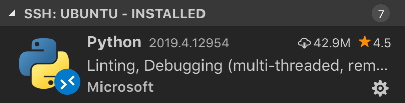

# Remote Development using SSH

The **Visual Studio Code Remote - SSH** extension allows you to open a remote folder on any remote machine, virtual machine, or container with a running SSH server and take full advantage of VS Code's feature set. Once connected to a server, you can interact with files and folders anywhere on the remote filesystem.

No source code needs to be on your local machine to gain these benefits since the extension runs commands and other extensions directly on the remote machine.


This lets VS Code provide a **local-quality development experience** - including full IntelliSense (completions), code navigation, and debugging - **regardless of where your code is hosted**.

## Getting started

**Note**: After reviewing this topic, you can get started with the introductory [SSH tutorial](/docs/remote/ssh-tutorial.md).

### System requirements

**Local:**  A supported [OpenSSH compatible SSH client](/docs/remote/troubleshooting.md#installing-a-supported-ssh-client) must also be installed.

**Remote SSH host**: A running [SSH server](/docs/remote/troubleshooting.md#installing-a-supported-ssh-server) on:

- x86_64 Debian 8+, Ubuntu 16.04+, CentOS / RHEL 7+.
- ARMv7l (AArch32) Raspberry Pi OS (previously called Raspbian) Stretch/9+ (32-bit).
- ARMv8l (AArch64) Ubuntu 18.04+ (64-bit).
- Windows 10 / Server 2016/2019 (1803+) using the [official OpenSSH Server](https://learn.microsoft.com/windows-server/administration/openssh/openssh_install_firstuse).
- macOS 10.14+ (Mojave) SSH hosts with [Remote Login enabled](https://support.apple.com/guide/mac-help/allow-a-remote-computer-to-access-your-mac-mchlp1066/mac).
- 1 GB RAM is required for remote hosts, but at least 2 GB RAM and a 2-core CPU is recommended.

Other `glibc` based Linux distributions for x86_64, ARMv7l (AArch32), and ARMv8l (AArch64) should work if they have the needed prerequisites. See the [Remote Development with Linux](/docs/remote/linux.md) article for information prerequisites and tips for getting community supported distributions up and running.

While ARMv7l (AArch32) and ARMv8l (AArch64) support is available, some extensions installed on these devices may not work due to the use of x86 native code in the extension.

### Installation

To get started, you need to:

1. Install an [OpenSSH compatible SSH client](/docs/remote/troubleshooting.md#installing-a-supported-ssh-client) if one is not already present.

2. Install [Visual Studio Code](https://code.visualstudio.com/) or [Visual Studio Code Insiders](https://code.visualstudio.com/insiders/).

3. Install the [Remote-SSH extension](https://marketplace.visualstudio.com/items?itemName=ms-vscode-remote.remote-ssh). If you plan to work with other remote extensions in VS Code, you may choose to install the [Remote Development extension pack](https://aka.ms/vscode-remote/download/extension).

### SSH host setup

1. If you do not have an SSH host set up, follow the directions for [Linux](/docs/remote/troubleshooting.md#installing-a-supported-ssh-server), [Windows 10 / Server (1803+)](https://learn.microsoft.com/windows-server/administration/openssh/openssh_install_firstuse), or [macOS](https://support.apple.com/guide/mac-help/allow-a-remote-computer-to-access-your-mac-mchlp1066/mac) SSH host or create a [VM on Azure](https://learn.microsoft.com/azure/virtual-machines/linux/quick-create-portal).

2. **Optional:** If your Linux or macOS SSH host will be accessed by multiple users at the same time, consider enabling **Remote.SSH: Remote Server Listen On Socket** in VS Code [User settings](/docs/getstarted/settings.md) for improved security.

    In the Settings editor:

    

    See the [Tips and Tricks](/docs/remote/troubleshooting.md#improving-security-on-multi-user-servers) article for details.

3. **Optional:** While password-based authentication is supported, we recommend setting up **key based authentication** for your host. See the [Tips and Tricks](/docs/remote/troubleshooting.md#configuring-key-based-authentication) article for details.

### Connect to a remote host

To connect to a remote host for the first time, follow these steps:

1. Verify you can connect to the SSH host by running the following command from a terminal / PowerShell window replacing `user@hostname` as appropriate.

    ```bash
    ssh user@hostname
    # Or for Windows when using a domain / AAD account
    ssh user@domain@hostname
    ```

2. In VS Code, select **Remote-SSH: Connect to Host...** from the Command Palette (`kbstyle(F1)`, `kb(workbench.action.showCommands)`) and use the same `user@hostname` as in step 1.

    

3. If VS Code cannot automatically detect the type of server you are connecting to, you will be asked to select the type manually.

    

    Once you select a platform, it will be stored in [VS Code settings](/docs/getstarted/settings.md) under the `remote.SSH.remotePlatform` property so you can change it at any time.

4. After a moment, VS Code will connect to the SSH server and set itself up. VS Code will keep you up-to-date using a progress notification and you can see a detailed log in the `Remote - SSH` output channel.

    > **Tip:** Connection hanging or failing? See [troubleshooting tips](/docs/remote/troubleshooting.md#troubleshooting-hanging-or-failing-connections) for information on resolving common problems.
    >
    > If you see errors about SSH file permissions, see the section on [Fixing SSH file permission errors](/docs/remote/troubleshooting.md#fixing-ssh-file-permission-errors).

5. After you are connected, you'll be in an empty window. You can always refer to the Status bar to see which host you are connected to.

    

    Clicking on the Status bar item will provide a list of remote commands while you are connected.

6. You can then open any folder or workspace on the remote machine using **File > Open...** or **File > Open Workspace...** just as you would locally!

    

From here, [install any extensions](#managing-extensions) you want to use when connected to the host and start editing!

> **Note:** On ARMv7l / ARMv8l `glibc` SSH hosts, some extensions may not work due to x86 compiled native code inside the extension.

### Open a folder on a remote SSH host in a container

If you are using a Linux or macOS SSH host, you can use the Remote - SSH and [Dev Containers](/docs/devcontainers/containers.md) extensions together to open a folder on your remote host inside of a container. You do not even need to have a Docker client installed locally.

To do so:

1. Follow the [installation](/docs/devcontainers/containers.md#installation) steps for the Dev Containers extension on your remote host.
1. **Optional:** Set up SSH [key based authentication](/docs/remote/troubleshooting.md#configuring-key-based-authentication) to the server so you do not need to enter your password multiple times.
1. Follow the [quick start](#connect-to-a-remote-host) for the Remote - SSH extension to connect to a host and open a folder there.
1. Use the **Dev Containers: Reopen in Container** command from the Command Palette (`kbstyle(F1)`, `kb(workbench.action.showCommands)`).

The rest of the [Dev Containers quick start](/docs/devcontainers/containers.md#quick-start-open-an-existing-folder-in-a-container) applies as-is. You can learn more about the [Dev Containers extension in its documentation](/docs/devcontainers/containers.md). You can also see the [Develop on a remote Docker host](/remote/advancedcontainers/develop-remote-host.md) article for other options if this model does not meet your needs.

### Disconnect from a remote host

To close the connection when you finish editing files on the remote host, choose **File > Close Remote Connection** to disconnect from the host. The default configuration does not include a keyboard shortcut for this command. You can also simply exit VS Code to close the remote connection.

### Remember hosts and advanced settings

If you have a set of hosts you use frequently or you need to connect to a host using some additional options, you can add them to a local file that follows the [SSH config file format](https://man7.org/linux/man-pages/man5/ssh_config.5.html).

To make setup easy, the extension can guide you through adding a host without having to hand edit this file.

Start by selecting **Remote-SSH: Add New SSH Host...** from the Command Palette (`kbstyle(F1)`, `kb(workbench.action.showCommands)`) or clicking on the **Add New** icon in the SSH **Remote Explorer** in the Activity Bar.


You'll then be asked to enter the SSH connection information. You can either enter a host name:


Or the full `ssh` command you would use to connect to the host from the command line:


Finally, you'll be asked to pick a config file to use. You can also set the `"remote.SSH.configFile"` property in your User `settings.json` file if you want to use a different config file than those listed. The extension takes care of the rest!

For example, entering `ssh -i ~/.ssh/id_rsa-remote-ssh yourname@remotehost.yourcompany.com` in the input box would generate this entry:

```ssh-config
Host remotehost.yourcompany.com
    User yourname
    HostName another-host-fqdn-or-ip-goes-here
    IdentityFile ~/.ssh/id_rsa-remote-ssh
```

See [Tips and Tricks](/docs/remote/troubleshooting.md#improving-your-security-with-a-dedicated-key) for details on generating the key shown here. You can manually edit this file with anything the [SSH config file format](https://man7.org/linux/man-pages/man5/ssh_config.5.html) supports, so this is just one example.

From this point forward, the host will appear in the list of hosts when you select **Remote-SSH: Connect to Host...** from the Command Palette (`kbstyle(F1)`, `kb(workbench.action.showCommands)`) or in the **SSH Targets** section of the **Remote Explorer**.


The **Remote Explorer** allows you to both open a new empty window on the remote host or directly open a folder you previously opened. Expand the host and click on the **Open Folder** icon next to the folder you want to open on the host.


## Managing extensions

VS Code runs extensions in one of two places: locally on the UI / client side, or remotely on the SSH host. While extensions that affect the VS Code UI, like themes and snippets, are installed locally, most extensions will reside on the SSH host. This ensures you have smooth experience and allows you to install any needed extensions for a given workspace on an SSH host from your local machine. This way, you can pick up exactly where you left off, from a different machine complete with your extensions.

If you install an extension from the Extensions view, it will automatically be installed in the correct location. Once installed, you can tell where an extension is installed based on the category grouping.

There will be a category for your remote SSH host:



And also a **Local - Installed** category:


> **Note:** If you are an extension author and find that your extension is not working properly or installs in the wrong place, see [Supporting Remote Development](/api/advanced-topics/remote-extensions.md) for details.

Local extensions that actually need to run remotely will appear dimmed and disabled in the **Local - Installed** category. Select **Install** to install an extension on your remote host.


You can also install all locally installed extensions on the SSH host by going to the Extensions view and selecting **Install Local Extensions in SSH: {Hostname}** using the cloud button at the right of the **Local - Installed** title bar. This will display a dropdown where you can select which locally installed extensions to install on your SSH host.

### "Always installed" extensions

If there are extensions that you would like to always have installed on any SSH host, you can specify which ones using the `remote.SSH.defaultExtensions` property in `settings.json`. For example, if you wanted to install the [GitLens](https://marketplace.visualstudio.com/items?itemName=eamodio.gitlens) and [Resource Monitor](https://marketplace.visualstudio.com/items?itemName=mutantdino.resourcemonitor) extensions, specify their extension IDs as follows:

```json
"remote.SSH.defaultExtensions": [
    "eamodio.gitlens",
    "mutantdino.resourcemonitor"
]
```

### Advanced: Forcing an extension to run locally / remotely

Extensions are typically designed and tested to either run locally or remotely, not both. However, if an extension supports it, you can force it to run in a particular location in your `settings.json` file.

For example, the setting below will force the [Docker](https://marketplace.visualstudio.com/items?itemName=ms-azuretools.vscode-docker) extension to run locally and [Remote - SSH: Editing Configuration Files](https://marketplace.visualstudio.com/items?itemName=ms-vscode-remote.remote-ssh-edit) extension to run remotely instead of their defaults:

```json
"remote.extensionKind": {
    "ms-azuretools.vscode-docker": [ "ui" ],
    "ms-vscode-remote.remote-ssh-edit": [ "workspace" ]
}
```

A value of `"ui"` instead of `"workspace"` will force the extension to run on the local UI/client side instead. Typically, this should only be used for testing unless otherwise noted in the extension's documentation since it **can break extensions**. See the article on [Supporting Remote Development](/api/advanced-topics/remote-extensions.md) for details.

## Forwarding a port / creating SSH tunnel

Sometimes when developing, you may need to access a port on a remote machine that is not publicly exposed. There are two ways to do this using an [SSH tunnel](https://www.ssh.com/ssh/tunneling/example) that "forwards" the desired remote port to your local machine.

### Temporarily forwarding a port

Once you are connected to a host, if you want to **temporarily forward** a new port for the duration of the session, select **Forward a Port** from the Command Palette (`kbstyle(F1)`, `kb(workbench.action.showCommands)`) or select the **Add Port** button in the **Ports view**. You can see the Ports view in the bottom panel, or by running the command **Ports: Focus on Ports View**.


You'll be asked to enter the port you would like to forward and you can give it a name.


A notification will tell you the localhost port you should use to access the remote port. For example, if you forwarded an HTTP server listening on port 3000, the notification may tell you that it was mapped to port 4123 on localhost since 3000 was already in use. You can then connect to this remote HTTP server using `http://localhost:4123`.

This same information is available in the **Forwarded Ports** section of the Remote Explorer if you need to access it later.

If you would like VS Code to remember any ports you have forwarded, check **Remote: Restore Forwarded Ports** in the Settings editor (`kb(workbench.action.openSettings)`) or set `"remote.restoreForwardedPorts": true` in `settings.json`.


#### Change local port on tunnel

If you would like the local port of the tunnel to be different than the remote server's, you can change this via the **Forwarded Ports** panel.

Right-click the tunnel you want to modify, and select **Change Local Address Port** in the context menu.


### Always forwarding a port

If you have ports that you **always want to forward**, you can use the `LocalForward` directive in the same SSH config file you use to [remember hosts and advanced settings](#remember-hosts-and-advanced-settings).

For example, if you wanted to forward ports 3000 and 27017, you could update the file as follows:

```ssh-config
Host remote-linux-machine
    User myuser
    HostName remote-linux-machine.mydomain
    LocalForward 127.0.0.1:3000 127.0.0.1:3000
    LocalForward 127.0.0.1:27017 127.0.0.1:27017
```

## Opening a terminal on a remote host

Opening a terminal on the remote host from VS Code is simple. Once connected, **any terminal window** you open in VS Code (**Terminal > New Terminal**) will automatically run on the remote host rather than locally.

You can also use the `code` command line from this same terminal window to perform a number of operations such as opening a new file or folder on the remote host. Type `code --help` to see all the options available from the command line.


## Debugging on the SSH host

Once you are connected to a remote host, you can use VS Code's debugger in the same way you would when running the application locally. For example, if you select a launch configuration in `launch.json` and start debugging (`kb(workbench.action.debug.start)`), the application will start on remote host and attach the debugger to it.

See the [debugging](/docs/editor/debugging.md) documentation for details on configuring VS Code's debugging features in `.vscode/launch.json`.

## SSH host-specific settings

VS Code's local User settings are also reused when you are connected to an SSH host. While this keeps your user experience consistent, you may want to vary some of these settings between your local machine and each host. Fortunately, once you have connected to a host, you can also set host-specific settings by running the **Preferences: Open Remote Settings** command from the Command Palette (`kbstyle(F1)`, `kb(workbench.action.showCommands)`) or by selecting on the **Remote** tab in the Settings editor. These will override any User settings you have in place whenever you connect to the host. And Workspace settings will override Remote and User settings.


## Working with local tools

The Remote - SSH extension does not provide direct support for sync'ing source code or using local tools with content on a remote host. However, there are two ways to do this using common tools that will work with most Linux hosts. Specifically, you can:

1. [Mount the remote filesystem using SSHFS](/docs/remote/troubleshooting.md#using-sshfs-to-access-files-on-your-remote-host).
2. [Sync files to/from the remote host to your local machine using `rsync`](/docs/remote/troubleshooting.md#using-rsync-to-maintain-a-local-copy-of-your-source-code).

SSHFS is the most convenient option and does not require any file sync'ing. However, performance will be significantly slower than working through VS Code, so it is best used for single file edits and uploading/downloading content. If you need to use an application that bulk reads/write to many files at once (like a local source control tool), rsync is a better choice.

## Known limitations

### Remote - SSH limitations

- Using key based authentication is recommended. Passwords and other tokens entered for [alternate authentication methods](/docs/remote/troubleshooting.md#enabling-alternate-ssh-authentication-methods) are not saved.
- Alpine Linux and non-glibc based Linux SSH hosts are not supported.
- Older (community supported) Linux distributions require workarounds to install the [needed prerequisites](/docs/remote/linux.md).
- PuTTY is not supported on Windows.
- If you clone a Git repository using SSH and your SSH key has a passphrase, VS Code's pull and sync features may hang when running remotely. Either use an SSH key without a passphrase, clone using HTTPS, or run `git push` from the command line to work around the issue.
- Local proxy settings are not reused on the remote host, which can prevent extensions from working unless the appropriate proxy information is configured on the remote host (for example global `HTTP_PROXY` or `HTTPS_PROXY` environment variables with the appropriate proxy information).
- You cannot use Dev Containers from a Remote - SSH connection to a Windows machine.
- See [here for a list of active issues](https://aka.ms/vscode-remote/ssh/issues) related to SSH.

### Docker Extension limitations

If you are using the Docker or Kubernetes extension in a Remote - SSH window, you will not be able to use the right-click **Attach VS Code to Container** option. This will only work if you are using it from your local machine.

### Extension limitations

Many extensions will work on remote SSH hosts without modification. However, in some cases, certain features may require changes. If you run into an extension issue, there is [a summary of common problems and solutions](/docs/remote/troubleshooting.md#extension-tips) that you can mention to the extension author when reporting the issue.

In addition, some extensions installed on ARMv7l (AArch32) / ARMv8l (AArch64) devices may not work due to native modules or runtimes in the extension that only support x86_64. In these cases, the extensions would need to opt-in to supporting these platforms by compiling / including binaries for ARMv7l / ARMv8l.

## Common questions

### How do I set up an SSH client on ...?

See [Installing a supported SSH client](/docs/remote/troubleshooting.md#installing-a-supported-ssh-client) for details.

### How do I set up an SSH server on ...?

See [Installing a supported SSH server](/docs/remote/troubleshooting.md#installing-a-supported-ssh-server) for details on setting up an SSH server for your host.

### Can I sign in to my SSH server with another/additional authentication mechanism like a password?

Yes, you should be prompted to enter your token or password automatically. However, passwords are not saved, so using [key based authentication](/docs/remote/troubleshooting.md#configuring-key-based-authentication) is typically more convenient.

### How do I fix SSH errors about "bad permissions"?

See [Fixing SSH file permission errors](/docs/remote/troubleshooting.md#fixing-ssh-file-permission-errors) for details on resolving these types of errors.

### What Linux packages / libraries need to be installed on remote SSH hosts?

Most Linux distributions will not require additional dependency installation steps. For SSH, Linux hosts need to have Bash (`/bin/bash`), `tar`, and either `curl` or `wget` installed and those utilities could be missing from certain stripped down distributions. Remote Development also requires kernel >= 3.10, glibc >=2.17, libstdc++ >= 3.4.18. Only glibc-based distributions are supported currently, so by extension [Alpine Linux](https://alpinelinux.org) is not supported.

See [Linux Prerequisites](/docs/remote/linux.md) for details.

### What are the connectivity requirements for the VS Code Server when it is running on a remote machine / VM?

Installation of VS Code Server requires that your local machine has outbound HTTPS (port 443) connectivity to:

- `update.code.visualstudio.com`
- `vscode.blob.core.windows.net`
- `*.vo.msecnd.net` (Azure CDN)

By default, the Remote - SSH will attempt to download on the remote host, but if you enable `remote.SSH.allowLocalServerDownload`, the extension will fall back to downloading VS Code Server locally and transferring it remotely once a connection is established.

You can install extensions manually without an internet connection using the **Extensions: Install from VSIX...** command, but if you use the extension panel to install extensions, your local machine and VS Code Server server will need outbound HTTPS (port 443) access to:

- `marketplace.visualstudio.com`
- `*.vo.msecnd.net` (Azure CDN)
- `*.gallerycdn.vsassets.io` (Azure CDN)

Finally, some extensions (like C#) download secondary dependencies from `download.microsoft.com` or `download.visualstudio.microsoft.com`. Others (like [Visual Studio Live Share](https://learn.microsoft.com/visualstudio/liveshare/reference/connectivity#requirements-for-connection-modes)) may have additional connectivity requirements. Consult the extension's documentation for details if you run into trouble.

All other communication between the server and the VS Code client is accomplished through the authenticated, secure SSH tunnel.

### Can I use local tools on source code sitting on the remote SSH host?

Yes. Typically this is done [using SSHFS](/docs/remote/troubleshooting.md#using-sshfs-to-access-files-on-your-remote-host) or by [using `rsync`](/docs/remote/troubleshooting.md#using-rsync-to-maintain-a-local-copy-of-your-source-code) to get a copy of the files on your local machine. SSHFS mounts the remote filesystem is ideal for scenarios where you need to edit individual files or browse the source tree and requires no sync step to use. However, it is not ideal for using something like a source control tool that bulk manages files. In this case, the `rsync` approach is better since you get a complete copy of the remote source code on your local machine. See [Tips and Tricks](/docs/remote/troubleshooting.md#using-sshfs-to-access-files-on-your-remote-host) for details.

### Can I use VS Code when I only have SFTP/FTP filesystem access to my remote host (no shell access)?

Some cloud platforms only provide remote filesystem access for developers rather than direct shell access. VS Code Remote Development was not designed with this use case in mind since it negates the performance and user experience benefits.

However, this use case can typically be handled by combining extensions like [SFTP](https://marketplace.visualstudio.com/items?itemName=liximomo.sftp) with remote debugging features for [Node.js](/docs/nodejs/nodejs-debugging.md#remote-debugging), [Python](/docs/python/debugging.md#remote-script-debugging-with-ssh), [C#](https://marketplace.visualstudio.com/items?itemName=ms-dotnettools.csharp), or others.

### As an extension author, what do I need to do?

The VS Code extension API abstracts away local/remote details so most extensions will work without modification. However, given extensions can use any node module or runtime they want, there are situations where adjustments may need to be made. We recommend you test your extension to be sure that no updates are required. See [Supporting Remote Development](/api/advanced-topics/remote-extensions.md) for details.

### Questions or feedback

- See [Tips and Tricks](/docs/remote/troubleshooting.md#ssh-tips) or the [FAQ](/docs/remote/faq.md).
- Search on [Stack Overflow](https://stackoverflow.com/questions/tagged/vscode-remote).
- Add a [feature request](https://aka.ms/vscode-remote/feature-requests) or [report a problem](https://aka.ms/vscode-remote/issues/new).
- Contribute to [our documentation](https://github.com/microsoft/vscode-docs) or [VS Code itself](https://github.com/microsoft/vscode).
- See our [CONTRIBUTING](https://aka.ms/vscode-remote/contributing) guide for details.
