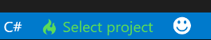
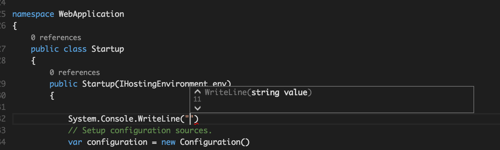
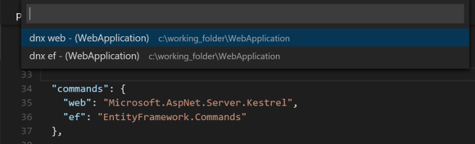

# ASP.NET 5 Applications with VS Code

>**Note:** ASP.NET 5 and DNX (the .NET Execution Environment) on OS X and Linux are in an early Beta/Preview state. This guide will help you get started but we recommend following the [aspnet Home project](https://github.com/aspnet/Home) on GitHub for the latest information.

## ASP.NET 5 and DNX
[ASP.NET 5/DNX](http://www.asp.net/vnext/overview/aspnet-vnext/aspnet-5-overview) is a lean .NET stack for building modern cloud and web apps that run on OS X, Linux, and Windows. It has been built from the ground up to provide an optimized development framework for apps that are either deployed to the cloud or run on-premises. It consists of modular components with minimal overhead, so you retain flexibility while constructing your solutions.

## Installing ASP.NET 5 and DNX
Installation for each platform is slightly different, please refer to the following setup instructions based on your operating system.
- [OS X](https://github.com/aspnet/home#os-x)
- [Linux](https://github.com/aspnet/home#linux)
- [Windows](https://github.com/aspnet/home#upgrading-dnvm-or-running-without-visual-studio)

> **Tip:** Add the following to your `.bash_profile` and restart the Terminal. The first line will ensure that you can always run the `dnvm` and `dnu` commands. The second line works around a known bug in Mono where you may see the IOException `FileSystemWatcher has reached the maximum number of files to watch` when running your application.
```
source dnvm.sh
export MONO_MANAGED_WATCHER=disabled
```
After you edit `.bash_profile`, make sure that you then run the following command:
```
dnvm upgrade
```

## Getting Started
If you don't have an existing ASP.NET DNX application, we recommend using [yeoman](http://yeoman.io/) to scaffold a new one. Presuming you have Node.js installed, simply `npm install` yeoman and a few supporting tools such as the asp.net generator, grunt, and bower. This can be done in one command:
```
npm install -g yo grunt-cli generator-aspnet bower
```
## Scaffolding your first Application
From the terminal, run `yo aspnet` to start the generator. Follow the prompts and pick the `Web Application`


Follow the instructions provided by the generator, go to the `WebApplication` folder and run `dnu restore` to install of the necessary NuGet packages to run the application.

```
cd WebApplication
dnu restore
```

The [ASP.NET 5 docs](http://docs.asp.net/en/latest/) do a great job describing how to build next generation Cloud and Web applications so we won't do that here. Instead, we will focus on what Visual Studio Code can do.


## Projects and Project Selection

VS Code is file and folder based as compared to Visual Studio, which is project or solution based. You don't open a solution in VS Code, you simply open a folder and if a supported project exists we will load it.

Open the `WebApplication` folder. If you set up a shortcut as described in [setup](/docs/editor/setup), you can simply run `code .` from the terminal.

The ASP.NET 5/DNX project system is also file and folder based, so when VS Code sees the `project.json` it will load it. If you have multiple project.json files you can pick which one you want to use, looks down in the status bar.



Notice the project indication on the lower left corner. When the icon is flashing, OmniSharp (the brain behind VS Code’s C# support) is starting, loading your project.  If you see a red icon, it means something went wrong, you can find out by looking at the OmniSharp Output Log (`kb(omnisharp.show.generalLog)`).

When the status bar shows the project information it’s a good time to get going. You can now leverage the full power of VS Code, author code and run your app.

`Startup.cs` is the startup file for your newly scaffolded application. Find the Startup method and let's start writing code. As soon as you access the framework (or any class in your application) you will get a rich IntelliSense experience, including parameter tool tips and the ability to cycle through overloads.



## Commands with Ease

The `project.json` file allows you to define commands for your projects. Those commands are understood by Visual Studio Code and they will show up in the Command Palette.

In our application there are 4 commands defined:


To execute these commands you could run them from the terminal, but a faster way is to open the Command Palette (`kb(workbench.action.showCommands)`) in VS Code, start typing the name of the command you want to run, and hit Enter.



In this walkthrough we want to run the website, so the command we want to run is `dnx: kestrel`. VS Code understands the configured DNX runtime and will open a console window, and execute the command in there.

Open you favorite browser and browse to `http://localhost:5000` to browse the site we created.

Note: command execution from the Command Palette doesn’t work yet on Linux. To run commands manually on Linux, start a console and type: ```dnx <command_name>```.

## Debugging
Visual Studio Code and ASP.NET 5 are in preview and at this time debugging ASP.NET 5 is not supported in Visual Studio Code (on any platform). Rest assured, we are working hard to bring these experiences to you in the near future.

## Next Steps
We hope this gets you started building ASP.NET 5 applications.  Try these things next:
* [Editing Evolved](/docs/editor/editingevolved) - Lint, IntelliSense, Lightbulbs, Peek and Goto Definition and more
app
* [Tasks](/docs/editor/tasks) - Running tasks with Gulp, Grunt and Jake.  Showing Errors and Warnings
