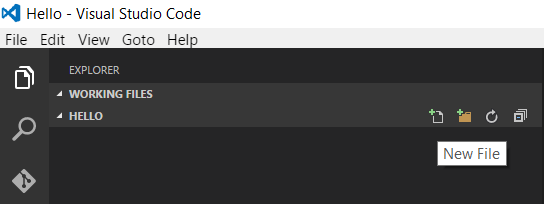
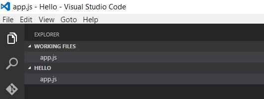
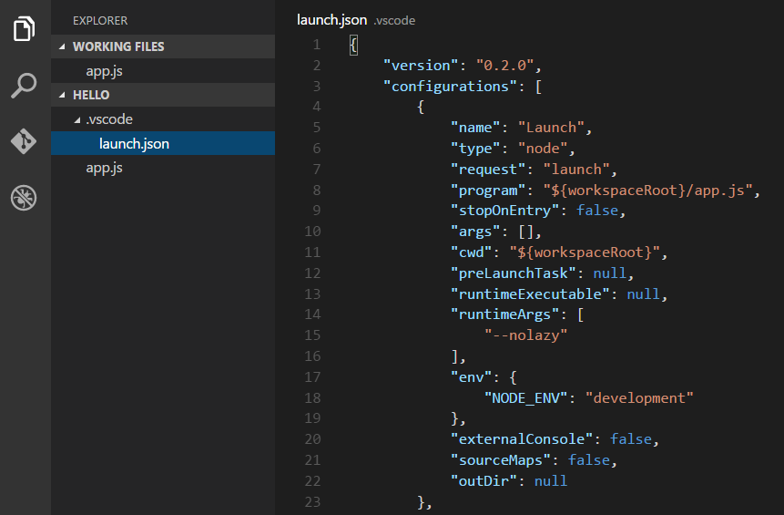
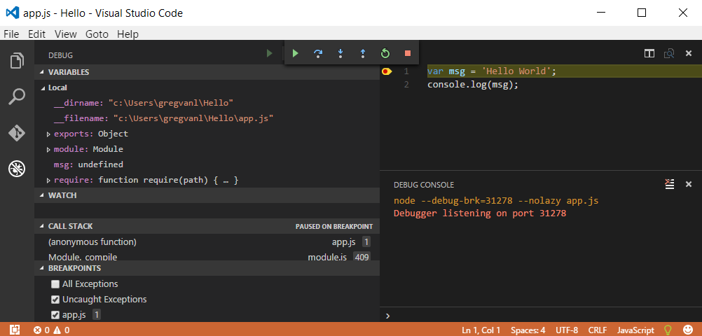
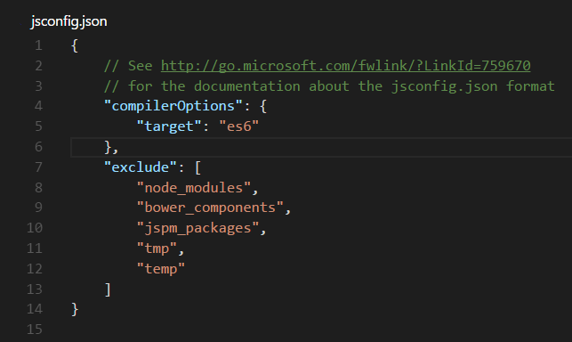

# Node.js Applications with VS Code

[Node.js](https://nodejs.org/) is a platform for building fast and scalable server applications using JavaScript. Node.js is the runtime and [NPM](https://www.npmjs.com/) is the Package Manager for Node.js modules.

VS Code has support for the JavaScript and TypeScript languages out-of-the-box as well as Node.js debugging. However, to run a Node.js application, you will need to install the Node.js runtime on your machine.

To get started in this walkthrough, [install Node.js for your platform](https://nodejs.org/en/download/). The Node Package Manager is included in the Node.js distribution. You'll need to open a new terminal (command prompt) for the `node` and `npm` command line tools to be on your PATH.

>**Linux**: There are specific Node.js packages available for the various flavors of Linux. See [Installing Node.js via package manager](https://nodejs.org/en/download/package-manager) to find the Node.js package and installation instructions tailored to your version of Linux.

>**Tip:** To test that you've got Node.js correctly installed on your computer, type `node --help` from a terminal and you should see the usage documentation.

## Hello World

Let's get started by creating the simplest Node.js application, "Hello World".

Create an empty folder called "Hello", navigate into and open VS Code:

```bash
mkdir Hello
cd Hello
code .
```

>**Tip:** You can open files or folders directly from the command line.  The period '.' refers to the current folder, therefore VS Code will start and open the `Hello` folder.

From the File Explorer tool bar, press the New File button:



and name the file `app.js`:



By using the `.js` file extension, VS Code interprets this file as JavaScript and will evaluate the contents with the JavaScript language service.

Create a simple string variable in `app.js` and send the contents of the string to the console:

```javascript
var msg = 'hello world';
console.log(msg);
```

Note that when you typed `console.` IntelliSense on the `console` object was automatically presented to you. When editing JavaScript files, VS Code will automatically provide you with IntelliSense for the DOM.


Also notice that VS Code knows that `msg` is a string based on the initialization to `'hello world'`.  If you type `msg.` you'll see IntelliSense showing all of the string functions available on `msg`.


After experimenting with IntelliSense, revert any extra changes from the source code example above and save the file (`kb(workbench.action.files.save)`).

### Running Hello World

It's simple to run `app.js` with Node.js. From a terminal, just type:

```bash
node app.js
```

You should see "Hello World" output to the terminal and then Node.js returns.

### Debugging Hello World

As mentioned in the introduction, VS Code comes with a Node.js debugger installed. Let's try debugging our simple application.

To set a breakpoint in `app.js`, put the editor cursor on the first line and press `kb(editor.debug.action.toggleBreakpoint)` or simply click in the editor left gutter next to the line numbers.  A red circle will appear in the gutter.


We now need to configure the debugger for this simple workspace.  Select the Debug View in the Side Bar:


Click on the Configure gear icon at the top of the Debug view to create a default `launch.json` configuration file and select **Node.js** as the Debug Environment. This configuration file lets you specify how to start the application, what arguments to pass in, the working directory, and more.  The new `launch.json` file is created in a VS Code specific `.vscode` folder in root of your workspace.



With the default Node.js **Launch** configuration created, you can now click Debug tool bar green arrow or press `kb(workbench.action.debug.start)` to launch and debug "Hello World". Your breakpoint will be hit and you can view and step through the simple application.  Notice that VS Code displays an orange Status Bar to indicate it is in Debug mode and the DEBUG CONSOLE is displayed.



Now that you've seen VS Code in action with "Hello World", the next section shows using VS Code with a full-stack Node.js web app.

## Express

[Express](http://expressjs.com/) is a very popular application framework for building and running Node.js applications. You can scaffold (create) a new Express application using the Express Generator tool. The Express Generator is shipped as an NPM module and installed by using the NPM command line tool `npm`.

>**Tip:** To test that you've got `npm` correctly installed on your computer, type `npm --help` from a terminal and you should see the usage documentation.

Install the Express Generator by running the following from a terminal:

```bash
npm install -g express-generator
```

The `-g` switch installs the Express Generator globally on your machine so you can run it from anywhere.

We can now scaffold a new Express application called `myExpressApp` by running:

```bash
express myExpressApp
```

This creates a new folder called `myExpressApp` with the contents of your application.  To install all of the application's dependencies (again shipped as NPM modules), go to the new folder and execute `npm install`:

```bash
cd myExpressApp
npm install
```

At this point, we should test that our application runs. The generated Express application has a `package.json` file which includes a `start` script to run `node ./bin/www`.  This will start the Node.js application running.

From a terminal in the Express application folder, run:

```bash
npm start
```

The Node.js web server will start and you can browse to `http://localhost:3000` to see the running application.


## Great Code Editing Experiences

Close the browser and from a terminal in the `myExpressApp` folder, stop the Node.js server by pressing `kbstyle(CTRL+C)`.

Now launch VS Code:

```bash
code .
```

The [Node.js](https://nodejs.org/api/) and [Express](http://expressjs.com/api.html) documentation does a great job explaining how to build rich applications using the platform and framework. Visual Studio Code will make you more productive developing these types of applications by providing great code editing and navigation experiences.

Earlier we saw the IntelliSense that the JavaScript language service can infer about your source code.  Next we will see that with a little more setup and configuration, Visual Studio Code can provide even richer information and build support.

## Adding a jsconfig.json Configuration File

When VS Code detects that you are working on a JavaScript file, it looks to see if you have a JavaScript configuration file `jsconfig.json` in your workspace. If it doesn't find one, you will see a green lightbulb on the Status Bar prompting you to create one.


Click the green lightbulb and accept the prompt to create a `jsconfig.json` file:



If you do not have [Auto Save](/docs/editor/codebasics.md#saveauto-save) on, save the file by pressing `kb(workbench.action.files.save)`.

The presence of this file lets VS Code know that it should treat all the files under this root as part of the same project.  We'll see in the next section that this is important for extending IntelliSense by adding typings (Type Definition files) to your workspace. This configuration file also lets you specify settings such as `compilerOptions` and which folders you'd like the JavaScript language service to `exclude` (ignore). The default `jsconfig.json` file we just created tells the JavaScript language service that you are writing ES6 compliant code and you want to ignore dependency and temporary content folders.

## IntelliSense and Typings

VS Code can use TypeScript definition files (for example [`node.d.ts`](https://github.com/DefinitelyTyped/DefinitelyTyped/blob/master/node/node.d.ts)) to provide metadata to VS Code about the JavaScript based frameworks you are consuming in your application. Because TypeScript definition files are written in TypeScript, they can express the data types of parameters and functions, allowing VS Code to provide a rich IntelliSense experience.

[Typings](https://github.com/typings/typings), the type definition manager for TypeScript, makes it easy to search for and install TypeScript definition files into your workspace. This tool can download the requested definitions from a variety of sources, including the [DefinitelyTyped repository](https://github.com/DefinitelyTyped/DefinitelyTyped). As we did with the Express Generator, we will install the Typings command line tool globally using NPM so that you can use the tool in any application you create.

```bash
npm install -g typings
```

>**Tip:** Typings has a number of options for configuring where and how definition files are downloaded. From the terminal, run `typings --help` for more information.

Go back to the file `app.js` and notice that if you hover over the Node.js global object `__dirname`, VS Code does not know the type and displays `any`.

Now, using the Typings command line, pull down the Node.js and Express type definition files:

```bash
typings install dt~node --global
typings install dt~express dt~serve-static dt~express-serve-static-core --global
```

The `dt~` prefix tells the Typings tool to search the DefinitelyTyped repository for the specified type definition files.

>**Tip:** You can download multiple definition files by combining them on the command line, as you can see from the Express typings above.  We need to install the typings for Express and also it's references.

>**Note:** Don't worry if you see `typings INFO reference` messages during installation. The Typings tool is cleaning out unnecessary `///` references in the downloaded typings files.

Notice how VS Code now understands what `__dirname` is, based on the metadata from the `node.d.ts` file. Even more exciting, you can get full IntelliSense against the Node.js framework. For example, you can require `http` and get full IntelliSense against the `http` class as you type in Visual Studio Code.


>**Note:** Make sure you have a `jsconfig.json` file in your workspace root as described in the [previous section](/docs/runtimes/nodejs.md#adding-a-jsconfigjson-configuration-file) so VS Code will pick up the installed typings files.

You can also write code that references modules in other files. For example, in `app.js` we require the `./routes/index` module, which exports an `Express.Router` class. If you bring up IntelliSense on `routes`, you can see the shape of the `Router` class.


## Debugging your Express Application

Just as we did earlier for "Hello World", you will need to create a debugger configuration file `launch.json` for your Express application. Click on the Debug icon in the View Bar and then the Configure gear icon at the top of the Debug view to create a default `launch.json` file.  Again select the **Node.js** environment.  When the file is first created, VS Code will look in `package.json` for a `start` script and will use that value as the `program` (which in this case is `${workspaceRoot}/bin/www`) for the **Launch** configuration. A second **Attach** configuration is also created to show you how to attach to a running Node.js application.


Save the new file and make sure **Launch** is selected in the configuration dropdown at the top of the Debug view. Open `app.js` and set a breakpoint near the top of the file where the Express app object is created by clicking in the gutter to the left of the line number. Press `kb(workbench.action.debug.start)` to start debugging the application. VS Code will start the server in a new terminal and hit the breakpoint we set. From there you can inspect variables, create watches, and step through your code.


## Node.js Extensions

The community is continually developing more and more valuable extensions for Node.js. Here are some of the extensions we have found most useful. 

* [JavaScript (ES6) code snippets](https://marketplace.visualstudio.com/items?itemName=xabikos.JavaScriptSnippets) - Snippets for JavaScript in ES6 syntax.
* [ESLint](https://marketplace.visualstudio.com/items?itemName=dbaeumer.vscode-eslint) - Integrates ESLint into VS Code.
* [JSHint](https://marketplace.visualstudio.com/items?itemName=dbaeumer.jshint) - Integrates JSHint into VS Code.
* [Add JSDoc comments](https://marketplace.visualstudio.com/items?itemName=stevencl.addDocComments) - Adds **JSDoc** @param and @return tags for selected function signatures in JS and TS.
* [Beautify](https://marketplace.visualstudio.com/items?itemName=HookyQR.beautify) - This extension enables running [js-beautify](http://jsbeautifier.org/) in VS Code.

Here are some popular extensions from the [Marketplace](https://marketplace.visualstudio.com/vscode).

<div class="marketplace-extensions-node"></div>

> Tip: The extensions shown above are dynamically queried. Click on an extension tile above to read the description and reviews to decide which extension is best for you. See more in the [Marketplace](https://marketplace.visualstudio.com/vscode).

## Next Steps

There is much more to explore with Visual Studio Code, please try the following topics:

* [Settings](/docs/customization/userandworkspace.md) - Learn how to customize VS Code for how you like to work.
* [Debugging](/docs/editor/debugging.md) - This is where VS Code really shines
* [Editing Evolved](/docs/editor/editingevolved.md) - Lint, IntelliSense, Lightbulbs, Peek and Go to Definition and more
* [Tasks](/docs/editor/tasks.md) - Running tasks with Gulp, Grunt and Jake.  Showing Errors and Warnings

## Common Questions

**Q: IntelliSense isn't working for Node.js and Express after I install their typings?**

**A:** Be sure you have a `jsconfig.json` file in the workspace root folder so that VS Code treats all files and folders as belonging to the same project context. Without a `jsconfig.json`, VS Code considers JavaScript and TypeScript files in isolation and won't associate your source code types with the typings type definitions files.