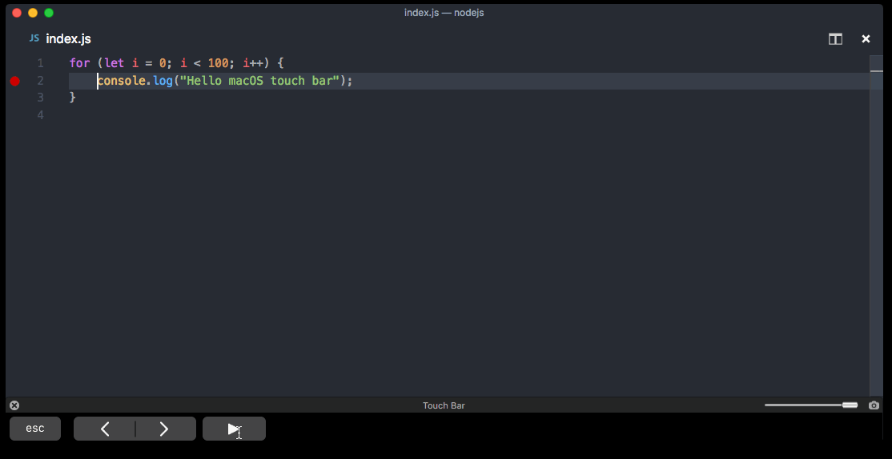

# Visual Studio Code on macOS

## Installation

1. [Download Visual Studio Code](https://go.microsoft.com/fwlink/?LinkID=534106) for macOS.
2. Open the browser's download list and locate the downloaded app or archive.
3. If archive, extract the archive contents. Use double-click for some browsers or select the 'magnifying glass' icon with Safari.
4. Drag `Visual Studio Code.app` to the **Applications** folder, making it available in the macOS Launchpad.
5. Open VS Code from the **Applications** folder, by double clicking the icon.
6. Add VS Code to your Dock by right-clicking on the icon, located in the Dock, to bring up the context menu and choosing **Options**, **Keep in Dock**.

## Launching from the command line

You can also run VS Code from the terminal by typing 'code' after adding it to the path:

* Launch VS Code.
* Open the **Command Palette** (`kbstyle(Cmd+Shift+P)`) and type 'shell command' to find the **Shell Command: Install 'code' command in PATH** command.


* Restart the terminal for the new `$PATH` value to take effect. You'll be able to type 'code .' in any folder to start editing files in that folder.

>**Note:** If you still have the old `code` alias in your `.bash_profile` (or equivalent) from an early VS Code version, remove it and replace it by executing the **Shell Command: Install 'code' command in PATH** command.

### Alternative manual instructions

Instead of running the command above, you can manually add VS Code to your path,
to do so run the following commands:

```bash
cat << EOF >> ~/.bash_profile
# Add Visual Studio Code (code)
export PATH="\$PATH:/Applications/Visual Studio Code.app/Contents/Resources/app/bin"
EOF
```

Start a new terminal to pick up your `.bash_profile` changes.

**Note**: The leading slash `\` is required to prevent `$PATH` from expanding during the concatenation. Remove the leading slash if you want to run the export command directly in a terminal.

**Note**: Since `zsh` became the default shell in macOS Catalina, run the following commands to add VS Code to your path:

```zsh
cat << EOF >> ~/.zprofile
# Add Visual Studio Code (code)
export PATH="\$PATH:/Applications/Visual Studio Code.app/Contents/Resources/app/bin"
EOF
```

## Touch Bar support

Out of the box VS Code adds actions to navigate in editor history as well as the full Debug tool bar to control the debugger on your Touch Bar:



## Mojave privacy protections

After upgrading to macOS Mojave version, you may see dialogs saying "Visual Studio Code would like to access your {calendar/contacts/photos}." This is due to the new privacy protections in Mojave and is not specific to VS Code. The same dialogs may be displayed when running other applications as well. The dialog is shown once for each type of personal data and it is fine to choose **Don't Allow** since VS Code does not need access to those folders.

## Updates

VS Code ships monthly [releases](/updates) and supports auto-update when a new release is available. If you're prompted by VS Code, accept the newest update and it will get installed (you won't need to do anything else to get the latest bits).

>Note: You can [disable auto-update](/docs/supporting/faq.md#how-do-i-opt-out-of-vs-code-autoupdates) if you prefer to update VS Code on your own schedule.

## Preferences menu

You can configure VS Code through [settings](/docs/getstarted/settings.md), [color themes](/docs/getstarted/themes.md), and [custom keybindings](/docs/getstarted/keybindings.md) available through the **File** > **Preferences** menu group.

## Next steps

Once you have installed VS Code, these topics will help you learn more about VS Code:

* [Additional Components](/docs/setup/additional-components.md) - Learn how to install Git, Node.js, TypeScript, and tools like Yeoman.
* [User Interface](/docs/getstarted/userinterface.md) - A quick orientation around VS Code.
* [User/Workspace Settings](/docs/getstarted/settings.md) - Learn how to configure VS Code to your preferences settings.

## Common questions

### Why do I see "Visual Studio Code would like access to your calendar."

If you are running macOS Mojave version, you may see dialogs saying "Visual Studio Code would like to access your {calendar/contacts/photos}." This is due to the new privacy protections in Mojave [discussed above](#mojave-privacy-protections). It is fine to choose **Don't Allow** since VS Code does not need access to those folders.

### VS Code fails to update

If VS Code doesn't update once it restarts, it might be set under quarantine by macOS. Follow the steps in this [issue](https://github.com/microsoft/vscode/issues/7426#issuecomment-425093469) for resolution.

### Does VS Code run on Apple silicon machines?

Yes, VS Code supports macOS Arm64 builds that can run on Macs with the Apple silicon chipsets. You can install the Universal build, which includes both Intel and Apple silicon builds, or one of the platform specific builds.
