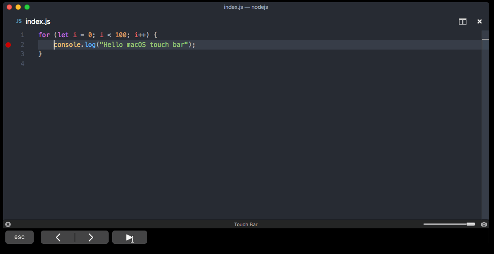

# Installing Visual Studio Code on macOS

Visual Studio Code is available for macOS through a downloadable disk image. VS Code supports Intel-based Macs and Macs with Apple silicon.

## Install VS Code on macOS

1. [Download Visual Studio Code](https://go.microsoft.com/fwlink/?LinkID=534106) for macOS.

1. Open the downloaded `.dmg` file.

1. Drag `Visual Studio Code.app` to the **Applications** folder.

1. Open VS Code from the **Applications** folder by double-clicking the icon.

1. To keep VS Code in the Dock, Control-click the icon in the Dock, then select **Options** > **Keep in Dock**.

> [!NOTE]
> The [Download Visual Studio Code](/download) page also lists Universal, Intel chip, and Apple silicon builds.

## Launch VS Code from the command line

To run VS Code from the terminal by typing `code`, add VS Code to the `$PATH` environment variable.

### Configure PATH with VS Code

1. Launch VS Code.

1. Open the **Command Palette** (`kbstyle(Cmd+Shift+P)`), type `shell command`, and run the **Shell Command: Install 'code' command in PATH** command.

    

1. Restart the terminal for the new `$PATH` value to take effect.

    Run `code .` in any folder to start editing files in that folder.

> [!NOTE]
> If an old `code` alias remains in `.bash_profile` or an equivalent shell profile from an earlier VS Code version, remove it and run the **Shell Command: Install 'code' command in PATH** command again.

### Manually configure PATH

To manually add VS Code to your path, run the command for your shell.

**Zsh**:

```zsh
cat << EOF >> ~/.zprofile
# Add Visual Studio Code (code)
export PATH="\$PATH:/Applications/Visual Studio Code.app/Contents/Resources/app/bin"
EOF
```

**Bash**:

```bash
cat << EOF >> ~/.bash_profile
# Add Visual Studio Code (code)
export PATH="\$PATH:/Applications/Visual Studio Code.app/Contents/Resources/app/bin"
EOF
```

> [!NOTE]
> The leading backslash in `\$PATH` prevents `$PATH` from expanding during concatenation. Remove the backslash when running the export command directly in a terminal.

Start a new terminal to pick up your changes. Run `code .` in any folder to start editing files in that folder.

## Updates

VS Code ships weekly [releases](/updates) and supports auto-update when a new release is available. When VS Code prompts you for an update, accept the prompt to install the new version.

> [!NOTE]
> [Disable auto-update](/docs/supporting/faq.md#how-do-i-opt-out-of-vs-code-auto-updates) if you prefer to update VS Code on your own schedule.

## Touch Bar support

VS Code adds these Touch Bar actions on supported Macs:

* Editor history navigation.
* The Debug toolbar for controlling the debugger.



## After installation

After you install VS Code, finish setup for your development workflow:

* [Install additional components](/docs/setup/additional-components.md), including Git, Node.js, TypeScript, language runtimes, and command-line tools.
* [Install extensions from the Visual Studio Marketplace](https://marketplace.visualstudio.com/VSCode) to add themes, formatters, debuggers, and language support.
* [Set up GitHub Copilot](/docs/setup/copilot.md) to use AI features in VS Code.
* [Start the VS Code tutorial](/docs/editing/getting-started.md) for a hands-on tour of the user interface and key features.

## Common questions

<details>
<summary>Why does Visual Studio Code ask for access to my calendar?</summary>

On macOS Mojave, dialogs might say "Visual Studio Code would like to access your calendar, contacts, or photos." These dialogs come from macOS privacy protections and are not specific to VS Code. Select **Don't Allow** because VS Code does not need access to those folders.

</details>

<details>
<summary>VS Code fails to update</summary>

If VS Code doesn't update after restart, macOS might have set it under quarantine. Follow the steps in [issue #7426](https://github.com/microsoft/vscode/issues/7426#issuecomment-425093469) to resolve the issue.

</details>

<details>
<summary>Does VS Code run on Apple silicon machines?</summary>

Yes. VS Code supports macOS Arm64 builds that run on Macs with Apple silicon. Install the Universal build, which includes both Intel and Apple silicon builds, or install one of the platform-specific builds.

</details>
