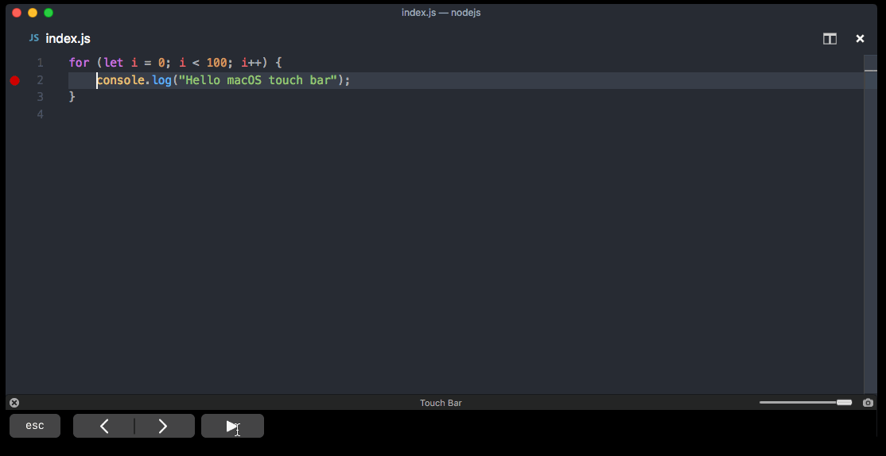

# Installing  on macOS

 is available for macOS through a downloadable disk image.  supports Intel-based Macs and Macs with Apple silicon.

## Install  on macOS

1. [Download ](https://go.microsoft.com/fwlink/?LinkID=534106) for macOS.

1. Open the downloaded `.dmg` file.

1. Drag `.app` to the **Applications** folder.

1. Open  from the **Applications** folder by double-clicking the icon.

1. To keep  in the Dock, Control-click the icon in the Dock, then select **Options** > **Keep in Dock**.

> [!NOTE]
> The [Download ](/download) page also lists Universal, Intel chip, and Apple silicon builds.

## Launch  from the command line

To run  from the terminal by typing `code`, add  to the `$PATH` environment variable.

### Configure PATH with 

1. Launch .

1. Open the **Command Palette** (`kbstyle(Cmd+Shift+P)`), type `shell command`, and run the **Shell Command: Install 'code' command in PATH** command.

    

1. Restart the terminal for the new `$PATH` value to take effect.

    Run `code .` in any folder to start editing files in that folder.

> [!NOTE]
> If an old `code` alias remains in `.bash_profile` or an equivalent shell profile from an earlier  version, remove it and run the **Shell Command: Install 'code' command in PATH** command again.

### Manually configure PATH

To manually add  to your path, run the command for your shell.

**Zsh**:

```zsh
cat << EOF >> ~/.zprofile
# Add  (code)
export PATH="\$PATH:/Applications/.app/Contents/Resources/app/bin"
EOF
```

**Bash**:

```bash
cat << EOF >> ~/.bash_profile
# Add  (code)
export PATH="\$PATH:/Applications/.app/Contents/Resources/app/bin"
EOF
```

> [!NOTE]
> The leading backslash in `\$PATH` prevents `$PATH` from expanding during concatenation. Remove the backslash when running the export command directly in a terminal.

Start a new terminal to pick up your changes. Run `code .` in any folder to start editing files in that folder.

## Updates

 ships weekly [releases](/updates) and supports auto-update when a new release is available. When  prompts you for an update, accept the prompt to install the new version.

> [!NOTE]
> [Disable auto-update](/docs/supporting/faq.md#how-do-i-opt-out-of-vs-code-auto-updates) if you prefer to update  on your own schedule.

## Touch Bar support

 adds these Touch Bar actions on supported Macs:

* Editor history navigation.
* The Debug toolbar for controlling the debugger.



## After installation

After you install , finish setup for your development workflow:

* [Install additional components](/docs/setup/additional-components.md), including Git, Node.js, TypeScript, language runtimes, and command-line tools.
* [Install extensions from the Visual Studio Marketplace](https://marketplace.visualstudio.com/VSCode) to add themes, formatters, debuggers, and language support.
* [Set up GitHub Copilot](/docs/setup/copilot.md) to use AI features in .
* [Start the  tutorial](/docs/editing/getting-started/editor-tutorial.md) for a hands-on tour of the user interface and key features.

## Common questions

<details>
<summary>Why does  ask for access to my calendar?</summary>

On macOS Mojave, dialogs might say " would like to access your calendar, contacts, or photos." These dialogs come from macOS privacy protections and are not specific to . Select **Don't Allow** because  does not need access to those folders.

</details>

<details>
<summary> fails to update</summary>

If  doesn't update after restart, macOS might have set it under quarantine. Follow the steps in [issue #7426](https://github.com/microsoft/vscode/issues/7426#issuecomment-425093469) to resolve the issue.

</details>

<details>
<summary>Does  run on Apple silicon machines?</summary>

Yes.  supports macOS Arm64 builds that run on Macs with Apple silicon. Install the Universal build, which includes both Intel and Apple silicon builds, or install one of the platform-specific builds.

</details>
