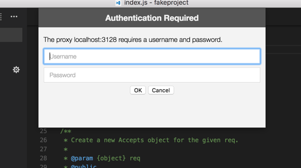

# Networking in Visual Studio Code

Since it is built on top of [Electron](https://electron.atom.io/), VS Code benefits from all the networking stack capabilities of Chromium. This means that VS Code supports much of the networking support that [Google Chrome](https://www.google.com/chrome/index.html) provides its users.

## Common Hostnames

A handful of features within Visual Studio Code require network communication to work, such as the auto-update mechanism, querying and installing extensions, telemetry, etc; this means that these features won't work properly if you are in a proxy environment and the product is somehow misconfigured.

If you are behind a firewall which needs to whitelist domains used often within VS Code, here's a list of hostnames you should allow communication to go through:

```
vscode-update.azurewebsites.net
vscode.blob.core.windows.net
marketplace.visualstudio.com
rink.hockeyapp.net
```

## Proxy Support

VS Code has exactly the same proxy support as Google Chromium. Here's a snippet from [Chromium's documentation](https://www.chromium.org/developers/design-documents/network-settings):

> The Chromium network stack uses the system network settings so that users and administrators can control the network settings of all applications easily. The network settings include:
>
> - proxy settings
> - SSL/TLS settings
> - certificate revocation check settings
> - certificate and private key stores

This means that your proxy settings should be picked up automatically.

Otherwise, you can use the following command line arguments to control your proxy settings:

```
# Disable proxy
--no-proxy-server

# Manual proxy address
--proxy-server=<scheme>=<uri>[:<port>][;...] | <uri>[:<port>] | "direct://"

# Manual PAC address
--proxy-pac-url=<pac-file-url>

# Disable proxy per host
--proxy-bypass-list=(<trailing_domain>|<ip-address>)[:<port>][;...]
```

[Click here](https://www.chromium.org/developers/design-documents/network-settings) to know more about these command line arguments.

### Authenticated Proxies

Authenticated proxies should work seamlessly within VS Code, since [PR #22369](https://github.com/Microsoft/vscode/pull/22369). The authentication methods supported are: Basic, Digest, NTLM and Negotiate. When using VS Code behind an authenticated HTTP proxy, the following authentication popup should appear:



Note that SOCKS5 proxy authentication support isn't implemented yet; you can follow the [issue in Chromium's issue tracker](https://bugs.chromium.org/p/chromium/issues/detail?id=256785).

[Click here](https://www.chromium.org/developers/design-documents/http-authentication) to read more about HTTP proxy authentication within VS Code.

### SSL Certificates

Often, HTTPS proxies rewrite SSL certificates of the incoming requests. Chromium was designed to reject responses which are signed by certificates which it doesn't trust. If you hit any SSL trust issues, there are a few options available for you:

- Since Chromium simply uses the OS's certificate trust infrastructure, the prefered option is to add your proxy's certificate to your OS's trust chain. [Click here](https://www.chromium.org/Home/chromium-security/root-ca-policy) to read more about the Root Certificate Policy in Chromium.
- If your proxy runs in `localhost`, you can always try the [`--allow-insecure-localhost`](https://peter.sh/experiments/chromium-command-line-switches/#allow-insecure-localhost) command line flag.
- If all else fails, you can tell VS Code to ignore all certificate errors using the [`--ignore-certificate-errors`](https://peter.sh/experiments/chromium-command-line-switches/#ignore-certificate-errors) command line flag. **_Warning:_** this is **dangerous** and **not recommended**, since it opens the door to security issues.

## Legacy Proxy Support

Extensions don't benefit yet from the same proxy support as VS Code supports in its core. You can follow this issue's development in [GitHub](https://github.com/Microsoft/vscode/issues/12588).

Similarly to extensions, a few other VS Code features don't yet fully support proxy networking, namely the CLI interface. The CLI interface is what you get when running `code --install-extension vscodevim.vim` from a terminal. You can follow this issue's development in [GitHub](https://github.com/Microsoft/vscode/issues/29910).

Because of both these use cases, the `http.proxy`, `http.proxyStrictSSL` and `http.proxyAuthorization` variables are still part of VS Code's settings, yet they are only respected in these two scenarios.

## Troubleshooting

Here are some helpful links that might help you troubleshoot networking issues in VS Code:

- [Network Settings](https://www.chromium.org/developers/design-documents/network-settings)
- [Debugging problems with the network proxy](https://www.chromium.org/developers/design-documents/network-stack/debugging-net-proxy)
- [Configuring a SOCKS proxy server in Chrome](https://www.chromium.org/developers/design-documents/network-stack/socks-proxy)
- [Proxy settings and fallback (Windows)](https://www.chromium.org/developers/design-documents/network-stack/proxy-settings-fallback)