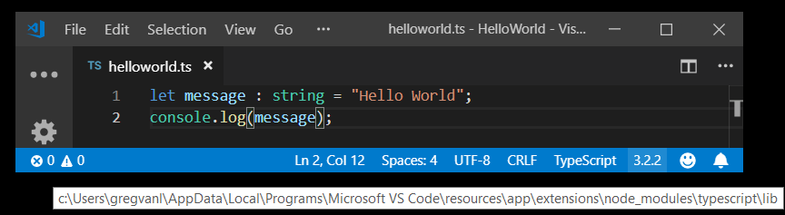

# Compiling TypeScript

[TypeScript](https://www.typescriptlang.org) is a typed superset of JavaScript that compiles to plain JavaScript. It offers classes, modules, and interfaces to help you build robust components. The [TypeScript language specification](https://github.com/Microsoft/TypeScript/tree/master/doc) has full details about the language.

## Install the TypeScript compiler

Visual Studio Code includes TypeScript language support but does not include the TypeScript compiler, `tsc`. You will need to install the TypeScript compiler either globally or in your workspace to transpile TypeScript source code to JavaScript (`tsc HelloWorld.ts`).

The easiest way to install TypeScript is through npm, the [Node.js Package Manager](https://www.npmjs.com/). If you have npm installed, you can install TypeScript globally (`-g`) on your computer by:

```bash
npm install -g typescript
```

You can test your install by checking the version or help.

```bash
tsc --version
tsc --help
```

Another option is to install the TypeScript compiler locally in your project (`npm install --save-dev typescript`) and has the benefit of avoiding possible interactions with other TypeScript projects you may have.

### Compiler versus language service

It is important to keep in mind that VS Code's TypeScript language service is separate from your installed TypeScript compiler. You can see the VS Code's TypeScript version in the Status Bar when you open a TypeScript file.


Later in the article, we'll discuss how you can [change](#using-newer-typescript-versions) the version of TypeScript language service that VS Code uses.

## tsconfig.json

Typically the first step in any new TypeScript project is to add in a `tsconfig.json` file. This defines the TypeScript [project settings](https://www.typescriptlang.org/docs/handbook/tsconfig-json.html) such as the compiler options and the files that should be included. To do this, open up the folder where you want to store your source and add in a new file named `tsconfig.json`. Once in this file, IntelliSense (`kb(editor.action.triggerSuggest)`) will help you along the way.


A simple `tsconfig.json` looks like this for ES5, **CommonJS** [modules](http://www.commonjs.org/specs/modules/1.0) and source maps:

```json
{
    "compilerOptions": {
        "target": "es5",
        "module": "commonjs",
        "sourceMap": true
    }
}
```

Now when you create a `.ts` file as part of the project we will offer up rich editing experiences and syntax validation.

## Transpile TypeScript into JavaScript

VS Code integrates with `tsc` through our integrated [task runner](/docs/editor/tasks.md). We can use this to transpile `.ts` files into `.js` files. Another benefit of using VS Code tasks is that you get integrated error and warning detection displayed in the [Problems](/docs/editor/editingevolved.md#errors-warnings) panel. Let's walk through transpiling a simple TypeScript Hello World program.

### Step 1: Create a simple TS file

Open VS Code on an empty folder and create a `helloworld.ts` file, place the following code in that file...

```typescript
let message : string = "Hello World";
console.log(message);
```

To test that you have the TypeScript compiler `tsc` installed correctly and a working Hello World program, open a terminal and type `tsc helloworld.ts`. You can use the Integrated Terminal (`kb(workbench.action.terminal.toggleTerminal)`) directly in VS Code.

You should now see the transpiled `helloworld.js` JavaScript file which you can run if you have [Node.js](https://nodejs.org) installed, by typing `node helloworld.js`.


### Step 2: Run the TypeScript build

Execute **Run Build Task** (`kb(workbench.action.tasks.build)`) from the global **Terminal** menu. If you created a `tsconfig.json` file in the earlier section, this should present the following picker:


Select the **tsc: build** entry. This will produce a `HelloWorld.js` and `HelloWorld.js.map` file in the workspace.

If you selected **tsc: watch**, the TypeScript compiler watches for changes to your TypeScript files and runs the transpiler on each change.

Under the covers, we run the TypeScript compiler as a task. The command we use is: `tsc -p .`

### Step 3: Make the TypeScript Build the default

You can also define the TypeScript build task as the default build task so that it is executed directly when triggering **Run Build Task** (`kb(workbench.action.tasks.build)`). To do so, select **Configure Default Build Task** from the global **Terminal** menu. This shows you a picker with the available build tasks. Select TypeScript **tsc: build** which generates the following `tasks.json` file in a `.vscode` folder:

```ts
{
    // See https://go.microsoft.com/fwlink/?LinkId=733558
    // for the documentation about the tasks.json format
    "version": "2.0.0",
    "tasks": [
        {
            "type": "typescript",
            "tsconfig": "tsconfig.json",
            "problemMatcher": [
                "$tsc"
            ],
            "group": {
                "kind": "build",
                "isDefault": true
            }
        }
    ]
}
```

Notice that the task has a `group` JSON object which sets the task `kind` to `build` and makes it the default. Now when you select the **Run Build Task** command or press (`kb(workbench.action.tasks.build)`), you are not prompted to select a task and your compile starts.

> **Tip:** You can also run the program using VS Code's Run/Debug feature. Details about running and debugging Node.js applications in VS Code can be found in the [Node.js tutorial](/docs/nodejs/nodejs-tutorial.md#debugging-your-node-application)

### Step 4: Reviewing build issues

The VS Code task system can also detect build issues through a [problem matcher](/docs/editor/tasks.md#defining-a-problem-matcher). A problem matcher parse build output based on the specific build tool and provides integrated issue display and navigation. VS Code ships with many problem matchers and `$tsc` seen above in `tasks.json` is the problem matcher for TypeScript compiler output.

As an example, if there was a simple error (extra 'g' in `console.log`) in our TypeScript file, we may get the following output from `tsc`:

    HelloWorld.ts(3,17): error TS2339: Property 'logg' does not exist on type 'Console'.

This would show up in the terminal panel (`kb(workbench.action.terminal.toggleTerminal)`) and selecting the terminal **Tasks - build tsconfig.json** in the terminal view drop-down.

You can see the error and warning counts in the Status Bar. Click on the error and warnings icon to get a list of the problems and navigate to them.


You can also use the keyboard to open the list `kb(workbench.actions.view.problems)`.

>**Tip:** Tasks offer rich support for many actions. Check the [Tasks](/docs/editor/tasks.md) topic for more information on how to configure them.

## JavaScript source map support

TypeScript debugging supports JavaScript source maps. To generate source maps for your TypeScript files, compile with the `--sourcemap` option or set the `sourceMap` property in the `tsconfig.json` file to `true`.

In-lined source maps (a source map where the content is stored as a data URL instead of a separate file) are also supported, although in-lined source is not yet supported.

## Output location for generated files

Having the generated JavaScript file in the same folder at the TypeScript source will quickly get cluttered on larger projects. You can specify the output directory for the compiler with the `outDir` attribute.

```json
{
    "compilerOptions": {
        "target": "es5",
        "module": "commonjs",
        "outDir": "out"
    }
}
```

## Hiding derived JavaScript files

When you are working with TypeScript, you often don’t want to see generated JavaScript files in the File Explorer or in Search results. VS Code offers filtering capabilities with a `files.exclude` [workspace setting](/docs/getstarted/settings.md) (**File** > **Preferences** > **Settings**) and you can easily create an expression to hide those derived files:

`**/*.js: { "when": "$(basename).ts" }`

This pattern will match on any JavaScript file (`**/*.js`) but only if a sibling TypeScript file with the same name is present. The File Explorer will no longer show derived resources for JavaScript if they are compiled to the same location.

 

To exclude JavaScript files generated from both `.ts` and `.tsx` source files, use this expression:

```json
"**/*.js": { "when": "$(basename).ts" },
"**/**.js": { "when": "$(basename).tsx" }
```

This is a bit of a trick. The search glob pattern is used as a key. The settings above use two different glob patterns to provide two unique keys but the search will still match the same files.

## Using newer TypeScript versions

VS Code ships with a recent stable version of the TypeScript language service and the active version and install location of the TypeScript language service is displayed in the Status Bar when viewing a TypeScript or JavaScript file:



>**Tip:** To get a specific TypeScript version, specify `@version` during npm install. For example, for TypeScript 3.2.0, you would use `npm install --save-dev typescript@3.2.0`. To preview the next version of TypeScript, run `npm install --save-dev typescript@next`.

To use a different TypeScript version by default, configure `typescript.tsdk` in your user [settings](/docs/getstarted/settings.md) to point to a directory containing the TypeScript `tsserver.js` file. You can find the TypeScript installation location using `npm list -g typescript`. The `tsserver.js` file is usually in the `lib` folder.

For example:

```json
{
   "typescript.tsdk": "/usr/local/lib/node_modules/typescript/lib"
}
```

You can also configure a specific version of TypeScript in a particular workspace by adding a `typescript.tsdk` workspace setting pointing to the directory of the `tsserver.js` file:

```json
{
   "typescript.tsdk": "./node_modules/typescript/lib"
}
```

Note that while `typescript.tsdk` points to the `lib` directory inside of `typescript` in these examples, the `typescript` directory must be a full TypeScript install that contains the TypeScript `package.json` file.

### Using the workspace version of TypeScript

If your workspace has a specific TypeScript version, you can switch between the workspace version of TypeScript and the version that VS Code uses by default by opening a TypeScript or JavaScript file in the workspace and clicking on the TypeScript version number in the Status Bar. A message box will appear asking you which version of TypeScript VS Code should use:


You can switch back to the version of TypeScript that comes with VS Code by clicking on the TypeScript version in the Status Bar again.

## Mixed TypeScript and JavaScript projects

It is possible to have mixed TypeScript and JavaScript projects. To enable JavaScript inside a TypeScript project, you can set the `allowJs` property to `true` in the `tsconfig.json`.

>**Tip:** The `tsc` compiler does not detect the presence of a `jsconfig.json` file automatically. Use the `–p` argument to make `tsc` use your `jsconfig.json` file, e.g. `tsc -p jsconfig.json`.

## Next steps

Read on to find out about:

* [Debugging TypeScript](/docs/typescript/typescript-debugging.md) - Configure the debugger for your TypeScript project.

## Common questions

### How do I resolve a TypeScript "Cannot compile external module" error?

If you get that error, resolve it by creating a `tsconfig.json` file in the root folder of your project. The tsconfig.json file lets you control how Visual Studio Code compiles your TypeScript code. For more information, see the [tsconfig.json overview](https://www.typescriptlang.org/docs/handbook/tsconfig-json.html).

### Why do I get different errors and warnings with VS Code than when I compile my TypeScript project?

VS Code ships with a recent stable version of the TypeScript language service and it may not match the version of TypeScript installed globally on your computer or locally in your workspace. For that reason, you may see differences between your compiler output and errors detected by the active TypeScript language service. See [Using newer TypeScript versions](/docs/languages/typescript.md#using-newer-typescript-versions) for details on installing a matching TypeScript version.

### Can I use the version of TypeScript that ships with VS 2015?

No, the TypeScript language service which ships with Visual Studio 2015 and 2017 isn't compatible with VS Code. You will need to install a separate version of TypeScript from [npm](https://www.npmjs.com/package/typescript).

### Why are some errors reported as warnings?

By default, VS Code TypeScript displays code style issues as warnings instead of errors. This applies to:

* Variable is declared but never used
* Property is declared but its value is never read
* Unreachable code detected
* Unused label
* Fall through case in switch
* Not all code paths return a value

Treating these as warnings is consistent with other tools, such as TSLint. These will still be displayed as errors when you run `tsc` from the command line.

You can disable this behavior by setting `"typescript.reportStyleChecksAsWarnings": false` in your User [settings](/docs/getstarted/settings.md).
