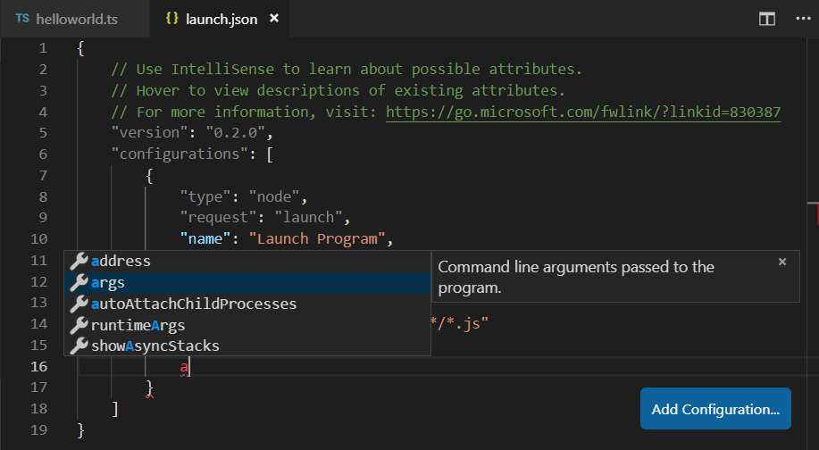
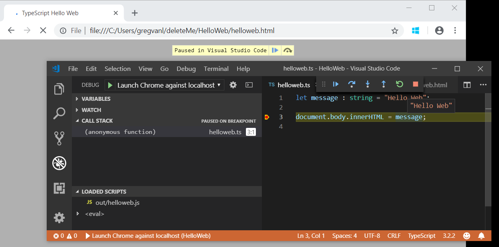

# Debugging TypeScript

Visual Studio Code supports TypeScript debugging through its built-in [Node.js debugger](/docs/nodejs/nodejs-debugging.md) and [Edge and Chrome debugger](/docs/nodejs/browser-debugging.md).

## JavaScript source map support

TypeScript debugging supports JavaScript source maps. To generate source maps for your TypeScript files, compile with the `--sourcemap` option or set the `sourceMap` property in the `tsconfig.json` file to `true`.

In-lined source maps (a source map where the content is stored as a data URL instead of a separate file) are also supported, although in-lined source is not yet supported.

For a simple example of source maps in action, see the [TypeScript tutorial](/docs/typescript/typescript-tutorial.md), which shows debugging a simple "Hello World" Node.js application using the following `tsconfig.json` and VS Code default Node.js debugging configuration.

```json
{
    "compilerOptions": {
        "target": "ES5",
        "module": "CommonJS",
        "outDir": "out",
        "sourceMap": true
    }
}
```

For more advanced debugging scenarios, you can create your own debug configuration `launch.json` file. To see the default configuration, go to the **Run and Debug** view (`kb(workbench.view.debug)`) and select the **create a launch.json file** link.

This will create a `launch.json` file in a `.vscode` folder with default values detected in your project.

```json
{
    // Use IntelliSense to learn about possible attributes.
    // Hover to view descriptions of existing attributes.
    // For more information, visit: https://go.microsoft.com/fwlink/?linkid=830387
    "version": "0.2.0",
    "configurations": [
        {
            "type": "node",
            "request": "launch",
            "name": "Launch Program",
            "program": "${workspaceFolder}/helloworld.ts",
            "preLaunchTask": "tsc: build - tsconfig.json",
            "outFiles": [
                "${workspaceFolder}/out/**/*.js"
            ]
        }
    ]
}
```

VS Code has determined the program to launch, `helloworld.ts`, included the build as a `preLaunchTask`, and told the debugger where to find the generated JavaScript files.

There is full IntelliSense with suggestions and information for `launch.json` to help you learn about other debug configuration options. You can also add new debug configurations to `launch.json` with the **Add Configuration** button in the lower right.



Also see [Node.js Debugging](/docs/nodejs/nodejs-debugging.md) for examples and further explanations.

## Mapping the output location

If generated (transpiled) JavaScript files do not live next to their source, you can help the VS Code debugger locate them by setting the `outFiles` attribute in the launch configuration. Whenever you set a breakpoint in the original source, VS Code tries to find the generated source by searching the files specified by glob patterns in `outFiles`.

## Client-side debugging

TypeScript is great for writing client-side code as well as Node.js applications and you can debug client-side source code with the [built-in Edge and Chrome debugger](/docs/nodejs/browser-debugging.md).

We'll create a tiny web application to show client-side debugging in action.

Create a new folder `HelloWeb` and add three files: `helloweb.ts`, `helloweb.html`, and `tsconfig.json` with the following content"

helloweb.ts

```typescript
let message : string = "Hello Web";
document.body.innerHTML = message;
```

helloweb.html

```html
<!DOCTYPE html>
<html>
    <head><title>TypeScript Hello Web</title></head>
    <body>
        <script src="out/helloweb.js"></script>
    </body>
</html>
```

tsconfig.json

```json
{
    "compilerOptions": {
        "target": "ES5",
        "module": "CommonJS",
        "outDir": "out",
        "sourceMap": true
    }
}
```

Run `tsc` to build the app and then test by opening `helloweb.html` in your browser (you can right-click `helloweb.html` in the File Explorer and select **Copy Path** to paste into your browser).

In the Run and Debug view (`kb(workbench.view.debug)`), select **create a launch.json file** to create a `launch.json` file selecting **Web App (Edge)** as the debugger, or **Web App (Chrome)** if you prefer.

Update the `launch.json` to specify the local file URL to `helloweb.html`:

```json
{
    "version": "0.2.0",
    "configurations": [
        {
            "type": "msedge",
            "request": "launch",
            "name": "Launch Edge against localhost",
            "url": "file:///C:/Users/username/HelloWeb/helloweb.html",
            "webRoot": "${workspaceFolder}"
        }
    ]
}
```

The **Run and Debug** view configuration dropdown will now show the new configuration **Launch Edge against localhost**. If you run that configuration, your browser will launch with your web page. Open `helloweb.ts` in the editor and click the left gutter to add a breakpoint (it will be displayed as a red circle). Press `kb(workbench.action.debug.start)` to start the debug session, which launches the browser and hits your breakpoint in `helloweb.ts`.



## Common questions

### Cannot launch program because corresponding JavaScript cannot be found

You've likely not set `"sourceMap": true` in your `tsconfig.json` or `outFiles` in your `launch.json` and the VS Code Node.js debugger can't map your TypeScript source code to the running JavaScript. Turn on source maps and rebuild your project.
