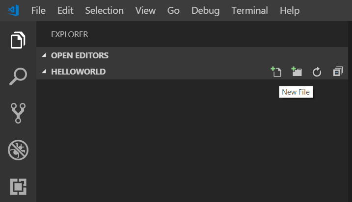
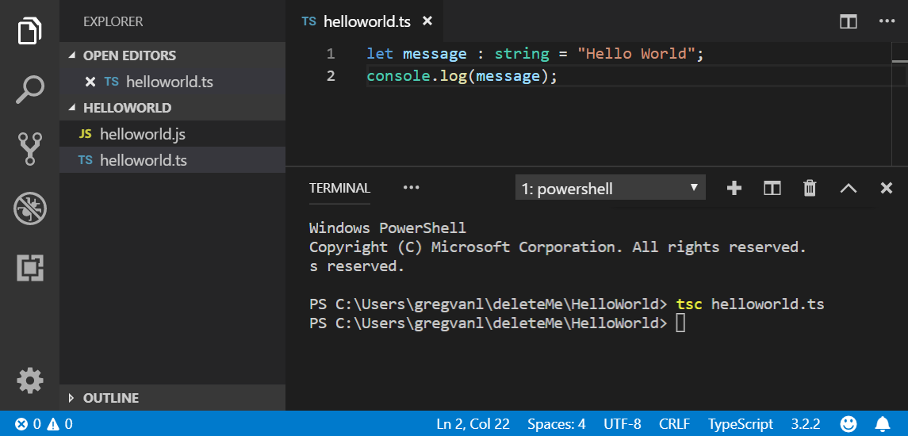
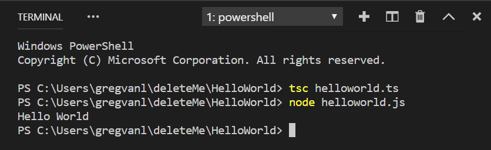
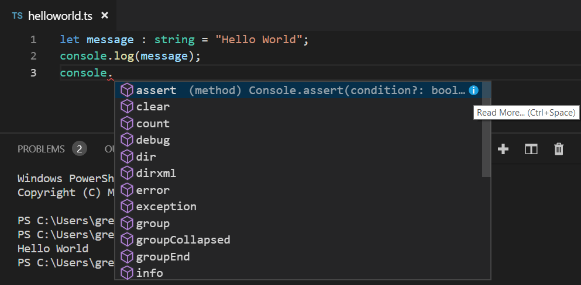
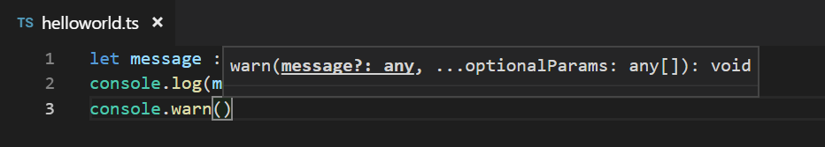
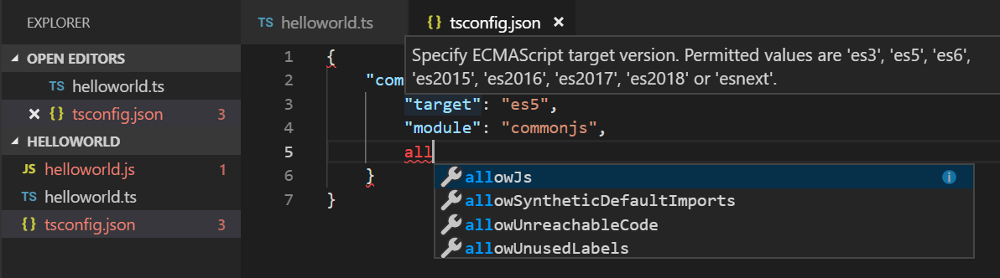
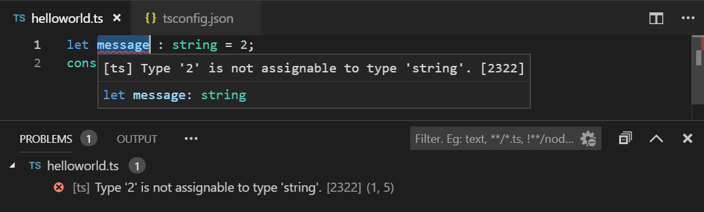
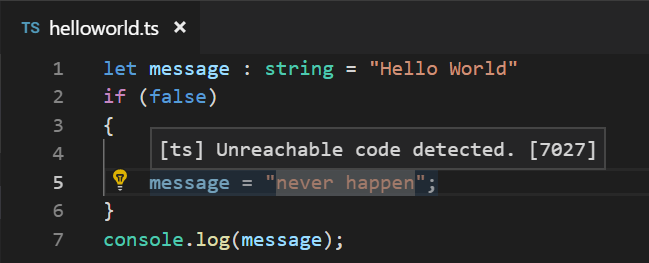
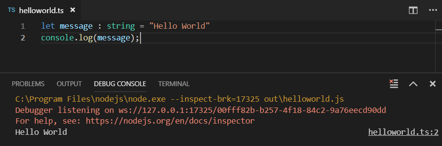
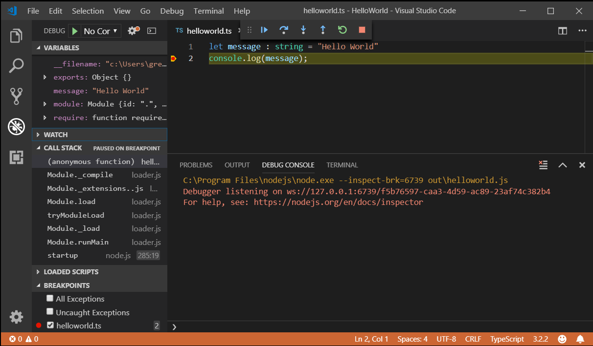

# TypeScript tutorial in Visual Studio Code

[TypeScript](https://www.typescriptlang.org) is a typed superset of JavaScript that compiles to plain JavaScript. It offers classes, modules, and interfaces to help you build robust components. The [TypeScript language specification](https://github.com/microsoft/TypeScript/tree/master/doc) has full details about the language.

## Install the TypeScript compiler

Visual Studio Code includes TypeScript language support but does not include the TypeScript compiler, `tsc`. You will need to install the TypeScript compiler either globally or in your workspace to transpile TypeScript source code to JavaScript (`tsc HelloWorld.ts`).

The easiest way to install TypeScript is through npm, the [Node.js Package Manager](https://www.npmjs.com/). If you have npm installed, you can install TypeScript globally (`-g`) on your computer by:

```bash
npm install -g typescript
```

You can test your install by checking the version.

```bash
tsc --version
```

## Hello World

Let's start with a simple Hello World Node.js example. Create a new folder `HelloWorld` and launch VS Code.

```
mkdir HelloWorld
cd HelloWorld
code .
```

From the File Explorer, create a new file called `helloworld.ts`.



Now add the following TypeScript code. You'll notice the TypeScript keyword `let` and the `string` type declaration.

```typescript
let message : string = "Hello World";
console.log(message);
```

To compile your TypeScript code, you can open the [Integrated Terminal](/docs/editor/integrated-terminal.md) (`kb(workbench.action.terminal.toggleTerminal)`) and type `tsc helloworld.ts`. This will compile and create a new `helloworld.js` JavaScript file.



If you have Node.js installed, you can run `node helloworld.js`.



If you open `helloworld.js`, you'll see that it doesn't look very different from `helloworld.ts`. The type information has been removed and `let` is now `var`.

```javascript
var message = "Hello World";
console.log(message);
```

## IntelliSense

In VS Code, you can see that you get language features such as syntax highlighting and bracket matching. When you were typing in the editor, you may have noticed IntelliSense, the smart code completions and suggestions provided by VS Code and the TypeScript language server. Below you can see the methods of `console`



When you select a method, you then get parameter help and can always get hover information.



## tsconfig.json

So far in this tutorial, you have been relying on the TypeScript compiler's default behavior to compile your TypeScript source code. You can modify the TypeScript compiler options by adding a `tsconfig.json` file that defines the TypeScript [project settings](https://www.typescriptlang.org/docs/handbook/tsconfig-json.html) such as the [compiler options](https://www.typescriptlang.org/docs/handbook/compiler-options.html) and the files that should be included.

Add a simple `tsconfig.json` which set the options to compile to ES5 and use **CommonJS** [modules](http://www.commonjs.org/specs/modules/1.0).

```json
{
    "compilerOptions": {
        "target": "es5",
        "module": "commonjs"
    }
}
```

When editing `tsconfig.json`, IntelliSense (`kb(editor.action.triggerSuggest)`) will help you along the way.



By default, TypeScript includes all the `.ts` files in the current folder and subfolders if the `files` attribute isn't included, so we don't need to list `helloworld.ts` explicitly.

Now to build from the terminal, you can just type `tsc` and the TypeScript compiler knows to look at your `tsconfig.json` for project settings and compiler options.

### Change the build output

Having the generated JavaScript file in the same folder as the TypeScript source will quickly get cluttered on larger projects, so you can specify the output directory for the compiler with the `outDir` attribute.

```json
{
    "compilerOptions": {
        "target": "es5",
        "module": "commonjs",
        "outDir": "out"
    }
}
```

Delete `helloworld.js` and run the command `tsc` with no options. You will see that `helloworld.js` is now placed in the `out` directory.

See [Compiling TypeScript](/docs/typescript/typescript-compiling.md) to learn about other features of the TypeScript language service and how to use tasks to run your builds directly from VS Code.

## Error checking

TypeScript helps you avoid common programming mistakes through strong type checking. For example, if you assign a number to `message`, the TypeScript compiler will complain with **'error TS2322: Type '2' is not assignable to type 'string'**.  You can see type checking errors in VS Code both in the editor (red squiggles with hover information) and the Problems panel (`kb(workbench.actions.view.problems)`). The `[ts]` prefix lets you know this error is coming from the TypeScript language service.



## Quick Fixes

The TypeScript language service has a powerful set of diagnostics to find common coding issues. For example, it can analyze your source code and detect unreachable code which is displayed as dimmed in the editor. If you hover over the line of source code, you'll see a hover explaining and if you place your cursor on the line, you'll get a Quick Fix lightbulb.



Clicking on the lightbulb or pressing `kb(editor.action.quickFix)` brings up the Quick Fix menu where you can select the **Remove unreachable code** fix.

## Debugging

VS Code has built-in support for TypeScript debugging. To support debugging TypeScript in combination with the executing JavaScript code, VS Code relies on [source maps](https://developer.mozilla.org/docs/Tools/Debugger/How_to/Use_a_source_map) for the debugger to map between the original TypeScript source code and the running JavaScript. You can create source maps during the build by setting `"sourceMap": true` in your `tsconfig.json`.

```json
{
    "compilerOptions": {
        "target": "es5",
        "module": "commonjs",
        "outDir": "out",
        "sourceMap": true
    }
}
```

Rebuild by running `tsc` and you should now have a `helloworld.js.map` in the `out` directory next to `helloworld.js`.

With `helloworld.ts` open in the editor, press `kb(workbench.action.debug.start)`. If you have other debugger extensions installed (such as the Chrome Debug extension), you need to select **Node.js** from the dropdown.

The debugger will start a session, run your code, and display the "Hello World" message in the Debug console panel.



In `helloworld.ts`, set a breakpoint by clicking on the left gutter of the editor. You will see a red circle if the breakpoint is set. Press `kb(workbench.action.debug.start)` again. Execution will stop when the breakpoint is hit and you'll be able to see debugging information such as variable values and the call stack in the Run view (`kb(workbench.view.debug)`).



See [Debugging TypeScript](/docs/typescript/typescript-debugging.md) to learn more about VS Code's built-in debugging support for TypeScript and how you can configure the debugger for your project scenarios.

## Next steps

This tutorial was a quick introduction to using VS Code for TypeScript development. Read on to learn more about using VS Code's compiling and debugging support for TypeScript:

* [Compiling TypeScript](/docs/typescript/typescript-compiling.md) - Use VS Code's powerful task system for compiling TypeScript.
* [Debugging TypeScript](/docs/typescript/typescript-debugging.md) - Configure the debugger for your TypeScript project.

## Common questions

### Cannot launch program because corresponding JavaScript cannot be found

You've likely not set `"sourceMap": true` in your `tsconfig.json` and the VS Code Node.js debugger can't map your TypeScript source code to the running JavaScript. Turn on source maps and rebuild your project.
