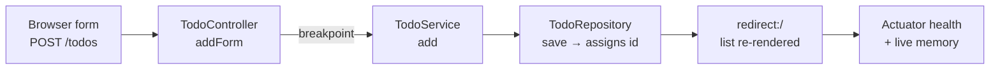

# Debug and inspect a Spring Boot request in Visual Studio Code

A web app that works is not the same as a web app you understand. The page says the item
was added. It does not say which method received the title, where the id came from, or
whether the process is healthy while it does all that.

Print statements can answer some of that. They also change the code, get committed by
accident, and tell you nothing about memory.

In this chapter, we'll do it properly: pause the running application on the exact line
where the web layer hands off to the service, walk the call in and back out, and watch a
value appear that no log line would have shown.

Then, with the debugger still attached, we'll ask the process how it is doing.

## What You Will Learn

Debugging is easy to demonstrate and easy to get wrong, so this chapter sticks to one
request and follows it all the way through.

In this chapter, you will learn to:

- **Set a meaningful breakpoint:** Stop on the hand-off between the controller and the service, not somewhere arbitrary.
- **Launch under the debugger:** Start the app in Debug mode from the Spring Boot Dashboard and confirm the debugger attached.
- **Step through a real request:** Use **Step Into**, **Step Over**, and **Step Out** to follow one add operation across two classes.
- **Read the Variables panel:** Find the incoming title, see an unsaved `Todo` with a null id, and resolve the id the repository assigned.
- **Inspect a live process:** Use **Endpoint Mappings** and **Memory** to check health and heap while the app runs.
- **Shut down cleanly:** End the process so port 8080 is genuinely free for the next run.

Here is the path the request takes, and where we interrupt it.

Fig 1: Chapter 2 journey — one add request, paused at the hand-off, then inspected.

## Problem Framing: Runtime Truth Beats Reading Code

Reading source tells you what should happen. A debugger tells you what did. Those two
diverge more often than anyone likes to admit — a trimmed string, a null that was
supposed to be filled in later, an id assigned somewhere you did not expect.

The useful habit is not "debug when something breaks". It is "step through a working path
once, so you know what normal looks like".

### Try this

Pick any request in your own project and stop on the line where your web layer calls your
business layer. Step in, step out, and read the return value. If anything surprises you,
that surprise is a bug waiting for a bad day.

## Prerequisites

This chapter runs the finished sample, so it needs a working Java and Spring Boot setup
and nothing left running from a previous session.

- **A cloned copy of the sample:** Clone [microsoft/github-copilot-java-mcp-demo](https://github.com/microsoft/github-copilot-java-mcp-demo) and open it in Visual Studio Code.
- **JDK 25 and both extension packs:** The **Extension Pack for Java** and the **Spring Boot Extension Pack**, installed and working.
- **A clean starting state:** The app stopped, port 8080 free, no breakpoints set, and the Dashboard's **Endpoint Mappings** section on **Show Defined Endpoints**.

> **Shutdown note:** On Debugger for Java 0.59.0, neither the Dashboard's **Stop** action
> nor the debug toolbar's stop button ends a **Debug**-launched process. This is an open
> regression — [vscode-java-debug#1585](https://github.com/microsoft/vscode-java-debug/issues/1585).
> Shut the app down from its terminal instead, as the final exercise step does. A process
> left behind holds port 8080 *and* the JMX port the Dashboard uses for **Properties** and
> **Memory**, so the next launch fails with a `Port already in use` agent error that names
> the JMX port rather than 8080.

## What Spring Boot Tools Adds to the Editor

Before the debugger enters the picture, the **Spring Boot Tools** extension makes a
running application visible inside the source file. Whenever the app is up, it renders a
gray inline hint above every mapped method carrying that mapping's live URL, plus request
counts and timings once traffic has flowed through it.

Those hints are not decoration. They are a clickable link to the exact endpoint the
method serves, which is how we will trigger the breakpoint without hunting for a browser
tab.

Fig 2: Spring Boot Tools renders live URL hints above `@GetMapping` and `@PostMapping`. Requests that have already run add a count and timing to the hint.

The **Spring Boot Dashboard** contributes the other half. Alongside **Apps** it lists
**Beans**, **Endpoint Mappings**, **Properties**, and **Memory** — and the last two only
appear while a live process is attached, which is a useful signal in itself.

## Exercise - pause a real request

Let's stop the application in the middle of an add.

1. Open `TodoController.java`, find the `addForm` method, and select the gutter to set a breakpoint on its `service.add(title)` line.
2. Select the **Spring Boot Dashboard** icon in the Activity Bar, select the app's **Debug** action, and wait for the debugger to connect.
3. Confirm the running debug state in the Dashboard, and find the **Endpoint Mappings** and **Memory** sections listed below **Apps**.
4. Return to the controller and select the root URL hint. In the page that opens, enter **`Trace this request`** and select **Add**.
5. Wait for Visual Studio Code to stop at the breakpoint.

The request is now frozen immediately before the controller calls the service, which
means the Variables panel holds exactly what the web layer received and nothing it has
produced yet.

Fig 3: The paused request. **Local** holds the `title` the form sent, the debug toolbar offers the stepping actions, and the editor annotates the stopped line with its live values.

## Walking the Call

The Variables panel scope is labelled **Local**. Expand it if it is not already open, and
the incoming `title` reads `Trace this request` — the value that travelled from the form
field, through Spring's parameter binding, into the method.

From there, three toolbar actions do all the work.

### Step Into

**Step Into** moves from the controller into `TodoService.add`, the shared method behind
this operation. This is the boundary worth crossing manually, because it is where the web
layer stops and the application logic starts.

### Step Over

**Step Over** executes the line that creates the `Todo`. Expand the new `todo` entry and
its `id` is `null`. Nothing has assigned one yet — the repository does that during
`save`, which is exactly the kind of detail that is invisible from the outside.

### Step Out

**Step Out** finishes the service method and returns to `addForm`. **Local** now includes
a step-result entry, `→add()`, carrying the same title. Its `id` reads `Long@` and a
number until you select the **Click to expand** control beside it, which resolves the
boxed value — `1` on a fresh start, because the in-memory repository resets with the
process.

That id is not trivia. It is the value the re-rendered page uses in the toggle and delete
URLs for this row, so the number you just resolved is the number the next click will use.

Select **Continue** to let the rest of the request run. The controller redirects,
Thymeleaf — the app's server-side template engine — renders the refreshed list, and
**Trace this request** appears in the browser. Leave the debug session attached; the next
two checks need a live process.

## Inspecting the Live Process

A completed request tells you the code path works. It does not tell you whether the
application is healthy, or what it is doing to memory. Two Dashboard sections answer
that.

### Endpoint Mappings

**Endpoint Mappings** starts out listing only the endpoints this project defines.
Selecting **Show All Endpoints** in that section's toolbar brings in everything else the
running app serves. That includes the endpoints contributed by Spring Boot Actuator — the
dependency that exposes health and monitoring endpoints — and the protocol-level routes
Chapter 3 relies on. Endpoints the project itself declares are marked `(defined)`.

Fig 4: With **Show All Endpoints** selected, the section lists every route the live process serves, under a node carrying the app's process id.

Find `/actuator/health` — not the `/actuator/health/**` entry beside it — and select its
**Open** action. The response's `status` field reads `UP`, and may also include a
`groups` field. That is a point-in-time answer: healthy, right now.

Fig 5: `/actuator/health` from the running sample. A single snapshot, served by the Actuator starter.

### Memory

For something that keeps answering, open **Memory**. It renders the application's live
heap — size, used, and maximum — and keeps updating while the app runs under the
debugger.

Fig 6: The Memory section tracks heap usage continuously, which is why it only appears when a live process is attached.

## Exercise - shut down cleanly

Because of the debugger regression noted in the prerequisites, ending the process takes
one deliberate step rather than a **Stop** click.

1. Open the **Terminal** panel and select the app's terminal.
2. Select its **Kill Terminal** trash icon. The Java process goes down with the shell and gives up port 8080.
3. Confirm the Dashboard no longer reports the app as running, and that port 8080 is free.

Leaving that check out is the single most common way to lose ten minutes at the start of
the next session, because the failure it causes names the wrong port.

## Quick Question

The Dashboard's **Properties** and **Memory** sections appear only while a live process is
attached. Why can they not simply read the app the way **Endpoint Mappings** appears to?

## Answer

Because they are reading a live JMX connection into the running JVM, not static project
metadata. When Visual Studio Code launches a Spring Boot project, Spring Boot Tools
injects JMX and Spring admin options into the launch, and the Dashboard connects to that
port to stream properties and heap statistics. An application started from a plain
terminal has no such connection, so those sections stay hidden. It also explains the
shutdown trap: a process left alive after a failed stop keeps that JMX port bound, which
is why the next launch complains about a port you never configured.

## What's Next

You can now stop a Spring Boot request mid-flight, follow it across a class boundary,
read the values it produces, and check the health and memory of the process that produced
them.

In [Chapter 3, Expose Your Java Operations to Copilot with MCP](3-expose-tools-with-mcp.md),
the same `TodoService` gets a second caller. Instead of a browser form, GitHub Copilot
calls it — the app publishes its operations as Model Context Protocol tools, and a todo
created from a chat prompt shows up on the very page you have been debugging.

## Learn more

- [Java debugging in Visual Studio Code](https://code.visualstudio.com/docs/java/java-debugging) — launch configurations, stepping, and the Variables panel.
- [Spring Boot Actuator](https://docs.spring.io/spring-boot/reference/actuator/index.html) — what the health endpoint reports and how to configure it.
- [Spring Boot Tools extension](https://marketplace.visualstudio.com/items?itemName=vmware.vscode-spring-boot) — the source of the inline URL hints and live data.
- [vscode-java-debug#1585](https://github.com/microsoft/vscode-java-debug/issues/1585) — the open shutdown regression referenced above.
- [Demo source on GitHub](https://github.com/microsoft/github-copilot-java-mcp-demo) — the sample used in every chapter.

---

Chapter 2 of 4 · Previous: [Build and Run Your First Spring Boot App](1-build-and-run.md) · Next: [Expose Your Java Operations to Copilot with MCP](3-expose-tools-with-mcp.md)
